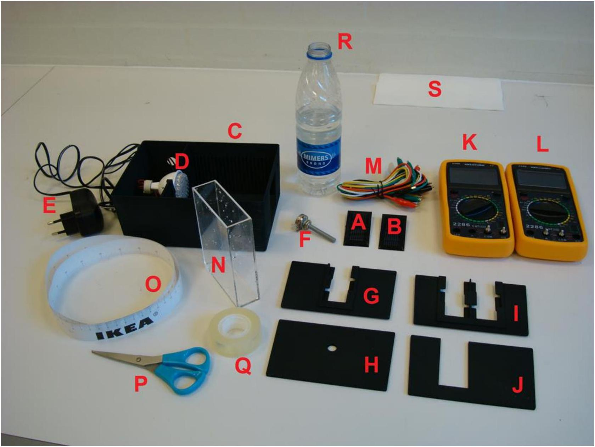
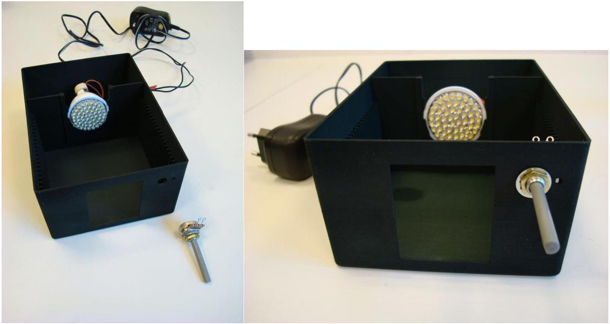
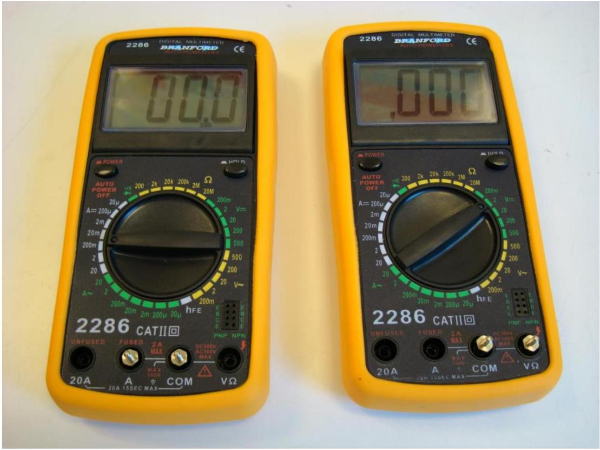
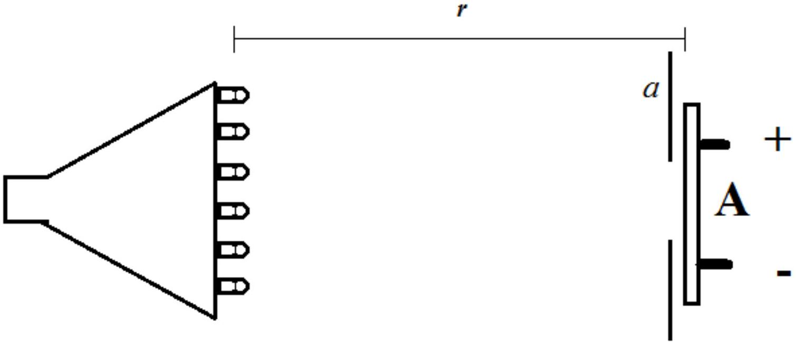
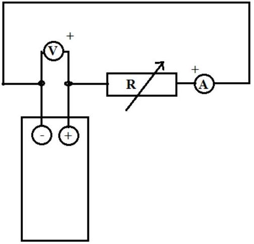
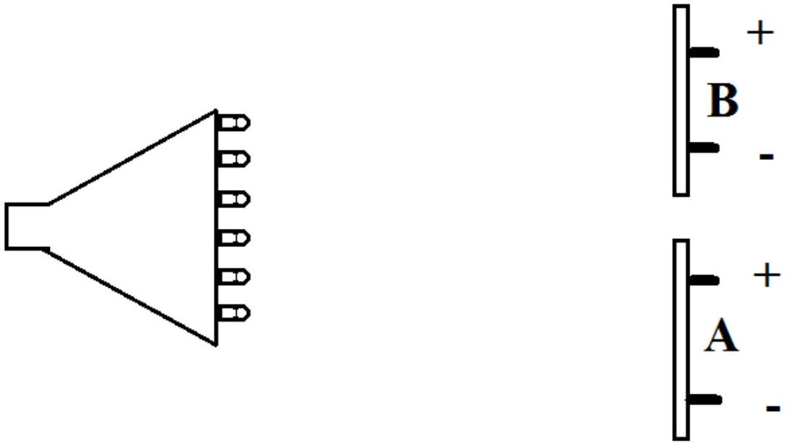
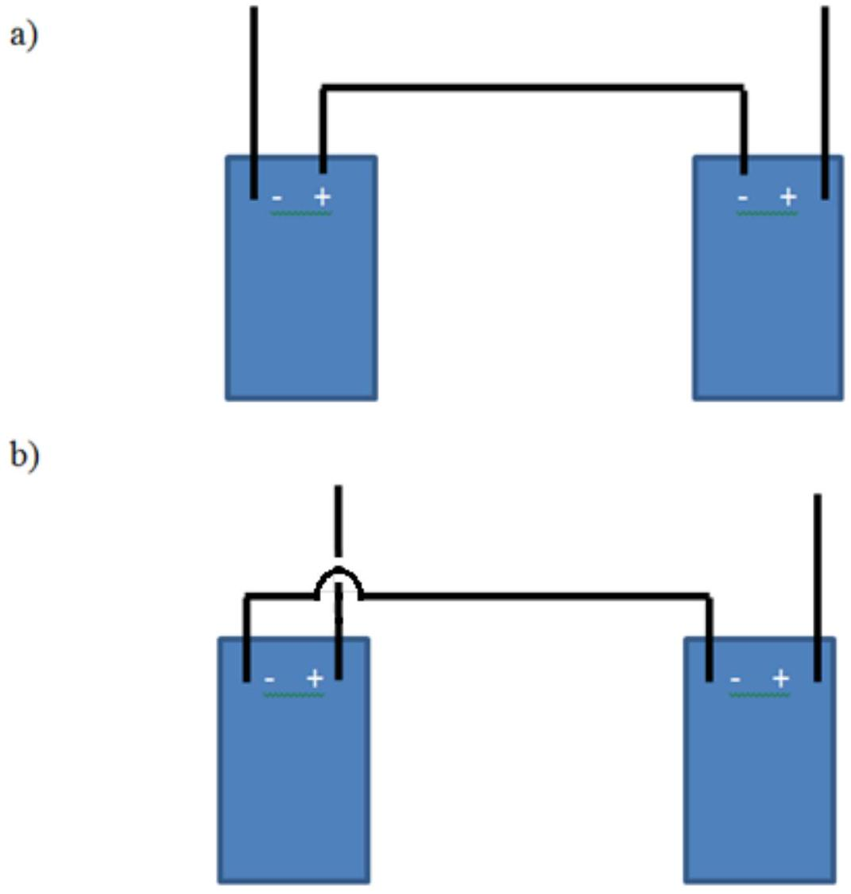
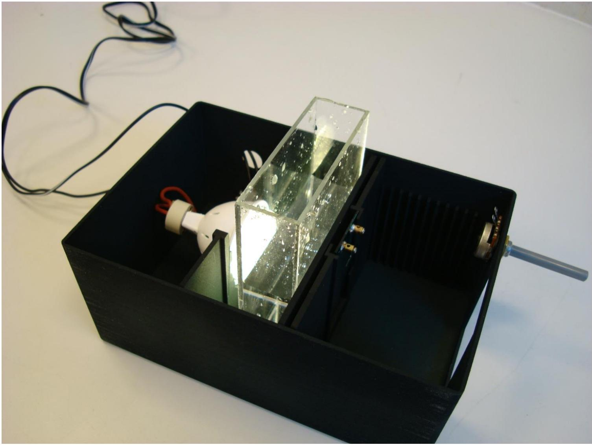

### 2.0 Introduction

Equipment used for this experiment is displayed in Fig. 2.1.

Figure 2.1 Equipment used for experiment E2.

List of equipment (see Fig. 2.1):

A: Solar cell
B: Solar cell
C: Box with slots for the mounting of light source, solar cells, etc.
D: LED-light source in holder
E: Power supply for light source D
F: Variable resistor
G: Holder for mounting single solar cell in the box C
H: Circular aperture for use in the box C
I: Holder for mounting two solar cells in the box C

J: Shielding plate for use in the box C
K: Digital multimeter
L: Digital multimeter
M: Wires with mini crocodile clips
N: Optical vessel (large cuvette)
O: Measuring tape
P: Scissors
Q: Tape
R: Water for filling the optical vessel N
S: Paper napkin for drying off excess water
T: Plastic cup for water from the optical vessel N (not shown in Fig. 2.1)
U: Plastic pipette (not shown in Fig. 2.1)
V: Lid for the box C (not shown in Fig. 2.1)

## Data sheet: table of fundamental constants

| Speed of light in vacuum | $c=2.998 \times 10^{8} \mathrm{~m} \mathrm{~s}^{-1}$ |
| :--- | :--- |
| Elementary charge | $e=1.602 \times 10^{-19} \mathrm{C}$ |
| Boltzmann's constant | $k_{\mathrm{B}}=1.381 \times 10^{-23} \mathrm{JK}^{-1}$ |

A solar cell transforms part of the electromagnetic energy in the incident light to electric energy by separating charges inside the solar cell. In this way an electric current can be generated. Experiment E2 intents to examine solar cells with the use of the supplied equipment. This equipment consists of a box with holders for light source and solar cells along with various plates and a lid. The variable resistor should be mounted in the box, see Fig. 2.2. One of the three terminals on the resistor has been removed, since only the two remaining terminals are to be used. Also supplied are wires with mini crocodile clips and two solar cells (labeled with a serial number and the letter A or B) with terminals on the back. The two solar cells are similar but can be slightly different. The two multimeters have been equipped with terminals for designated use as ammeter and voltmeter, respectively, see Fig. 2.3. Finally, the experiment will make use of an optical vessel together with some drinking water from the bottle.

Figure 2.2 (a) Box with light source and resistor for mounting. (b) The resistor mounted in the box. Notice that the small pin on the resistor fits in the hole to the right of the shaft.

Figure 2.3 Multimeters equipped with terminals for use as ammeter (left) and voltmeter (right), respectively. The instrument is turned on by pressing "POWER" in the top left corner. The instrument turns off automatically after a certain idle time. It can measure direct current and voltage (=) as well as alternating current and voltage ( $\sim$ ). The internal resistance in the voltmeter is $10 \mathrm{M} \Omega$ regardless of the measuring range. The potential difference over the ammeter is 200 mV at full reading, regardless of the measuring range. In case of overflow the display will show "l", and you need to select a higher measuring range. The "HOLD" button (top right corner) should not be pushed, except if you want to freeze a measurement.

WARNING: Do not use the multimeter as an ohmmeter on the solar cells since the measuring current can damage them. When changing the measuring range on the multimeters, please turn the dial with caution. It can be unstable and may break. Check whether there is a number under the decimal point when measuring - if the dial is not fully in place, the multimeter will not measure, even if there are digits in the display.

Notice: Do not change the voltage on the power supply. It must be 12 V throughout the experiment. (The power supply for the light source should be connected to the outlet (230 V ~) at your table.)
Notice: Uncertainty considerations are only expected when explicitly mentioned.
Notice: All measured and calculated values must be given in SI units.
Notice: For all measurements of currents and voltages in this experiment, the LED-light source is supposed to be on.

### 2.1 The dependence of the solar cell current on the distance to the light source

For this question you will measure the current, $I$, generated by the solar cell when in a circuit with the ammeter, and determine how it depends on the distance, $r$, to the light source. The light is produced inside the individual light diodes and $r$ is therefore to be measured as shown in Fig. 2.4.

Figure 2.4 Top view of setup for question 2.1. Note the aperture $a$ immediately in front of the solar cell A. The distance is measured from inside the light diode to the surface of the solar cell.

Do not change the measuring range on the ammeter in this experiment: the internal resistance of the ammeter depends on the measuring range and affects the current that can be drawn from the solar cell. State the serial numbers of the light source and of solar cell A on your answer sheet. Mount the light source in the U-shaped holder (the light source has a tight fit in the holder, so be patient when mounting it. Mount solar cell A in the single holder and place it together with the circular aperture immediately in front of the solar cell. The current $I$ as a function of the distance $r$ to the light source can, when $r$ is not too small, be approximated by

$$
I(r)=\frac{I_{a}}{1+\frac{r^{2}}{a^{2}}}
$$

where $I_{a}$ and $a$ are constants.

| 2.1a | Measure $I$ as a function of $r$, and set up a table of your measurements. | 1.0 |
| :--- | :--- | :--- |
| 2.1b | Determine the values of $I_{a}$ and $a$ by the use of a suitable graphical method. | 1.0 |

### 2.2 Characteristic of the solar cell

Remove the circular aperture. Mount the variable resistor in the box as shown on Fig. 2.2. Place the light source in slot number 0, furthest away from the resistor. Mount solar cell A in the single holder without the circular aperture in slot number 10. Build a circuit as shown in Fig. 2.5, so that you can measure the characteristic of the solar cell, i.e. the terminal voltage $U$ of the solar cell as a function of the current $I$ in the circuit consisting of solar cell, resistor and ammeter.

Figure 2.5 Electrical diagram for measuring the characteristic in question 2.2.

| 2.2a | Make a table of corresponding measurements of $U$ and $I$. | 0.6 |
| :--- | :--- | :--- |
| 2.2b | Graph voltage as function of current | 0.8 |

### 2.3 Theoretical characteristic for the solar cell

For the solar cells in this experiment, the current as function of the voltage is given by the equation

$$
I=I_{\max }-I_{0}\left(\exp \left(\frac{e U}{\eta k_{\mathrm{B}} T}\right)-1\right)
$$

where the parameters $I_{\text {max }}, I_{0}$ and $\eta$ are constant at a given illumination. We take the temperature to be $T=300 \mathrm{~K}$. The fundamental constants $e$ and $k_{\mathrm{B}}$ are the elementary charge and Boltzmann's constant, respectively.

| 2.3a | Use the graph from question 2.2b to determine $I_{\text {max }}$. | 0.4 |
| :--- | :--- | :--- |

The parameter $\eta$ can be assumed to lie in the interval from 1 to 4 . For some values of the potential difference $U$, the formula can be approximated by

$$
I \approx I_{\max }-I_{0} \exp \left(\frac{e U}{\eta k_{\mathrm{B}} T}\right)
$$

| 2.3b | Estimate the range of values of $U$ for which the mentioned approximation is good. Determine graphically the values of $I_{0}$ and $\eta$ for your solar cell. | 1.2 |
| :--- | :--- | :--- |

### 2.4 Maximum power for a solar cell

| 2.4a | The maximum power that the solar cell can deliver to the external circuit is denoted $P_{\text {max }}$. Determine $P_{\text {max }}$ for your solar cell through a few, suitable measurements. (You may use some of your previous measurements from question 2.2). | 0.5 |
| :--- | :--- | :--- |
| 2.4b | Estimate the optimal load resistance $R_{\text {opt }}$, i.e. the total external resistance when the solar cell delivers its maximum power to $R_{\text {opt }}$. State your result with uncertainty and illustrate your method with suitable calculations. | 0.5 |

### 2.5 Comparing the solar cells

Mount both solar cells (A and B) in the double holder in slot number 15, see Fig. 2.6.

Figure 2.6 Top view of light source and solar cells in question 2.5.

| 2.5a | Measure, for the given illumination: - The maximum potential difference $U_{\mathrm{A}}$ that can be measured over solar cell A. - The maximum current $I_{\mathrm{A}}$ that can be measured through solar cell A. Do the same for solar cell B. | 0.5 |
| :--- | :--- | :--- |
| 2.5b | Draw electrical diagrams for your circuits showing the wiring of the solar cells and the meters. | 0.3 |

### 2.6 Couplings of the solar cells

The two solar cells can be connected in series in two different ways as shown in Fig. 2.7. There are also two different ways to connect them in parallel (not shown in the figure).

Figure 2.7 Two ways to connect the solar cells in series for question 2.6. The two ways to connect them in parallel are not shown.

| 2.6 | Determine which of the four arrangements of the two solar cells yields the highest possible power in the external circuit when one of the solar cells is shielded with the shielding plate (J in Fig. 2.1). Hint: You can estimate the maximum power quite well by calculating it from the maximum voltage and maximum current measured from each configuration. Draw the corresponding electrical diagram. | 1.0 |
| :--- | :--- | :--- |

### 2.7 The effect of the optical vessel (large cuvette) on the solar cell current

Mount the light source in the box and place solar cell A in the single holder with the circular aperture immediately in front, so that there is approximately 50 mm between the solar cell and the light source. Place the empty optical vessel immediately in front of the circular aperture as shown in Fig. 2.8.

Figure 2.8 Experimental set-up for question 2.7.

| 2.7a | Measure the current $I$, now as a function of the height, $h$, of water in the vessel, see Fig. 2.8. Make a table of the measurements and draw a graph. | 1.0 |
| :--- | :--- | :--- |
| 2.7b | Explain with only sketches and symbols why the graph looks the way it does. | 1.0 |

Mount the light source in the box and place solar cell A in the single holder so that the distance between the solar cell and the light source is maximal. Place the circular aperture immediately in front of the solar cell.

| 2.7c | For this set-up do the following: - Measure the distance $r_{1}$ between the light source and the solar cell and the current $I_{1}$. - Place the empty vessel immediately in front of the circular aperture and measure the current $I_{2}$. - Fill up the vessel with water, almost to the top, and measure the current $I_{3}$.  | 0.6 |
| :--- | :--- | :--- |
| 2.7d | Use your measurements from 2.7c to find a value for the refractive index $n_{\mathrm{w}}$ for water. Illustrate your method with suitable sketches and equations. You may include additional measurements. | 1.6 |
