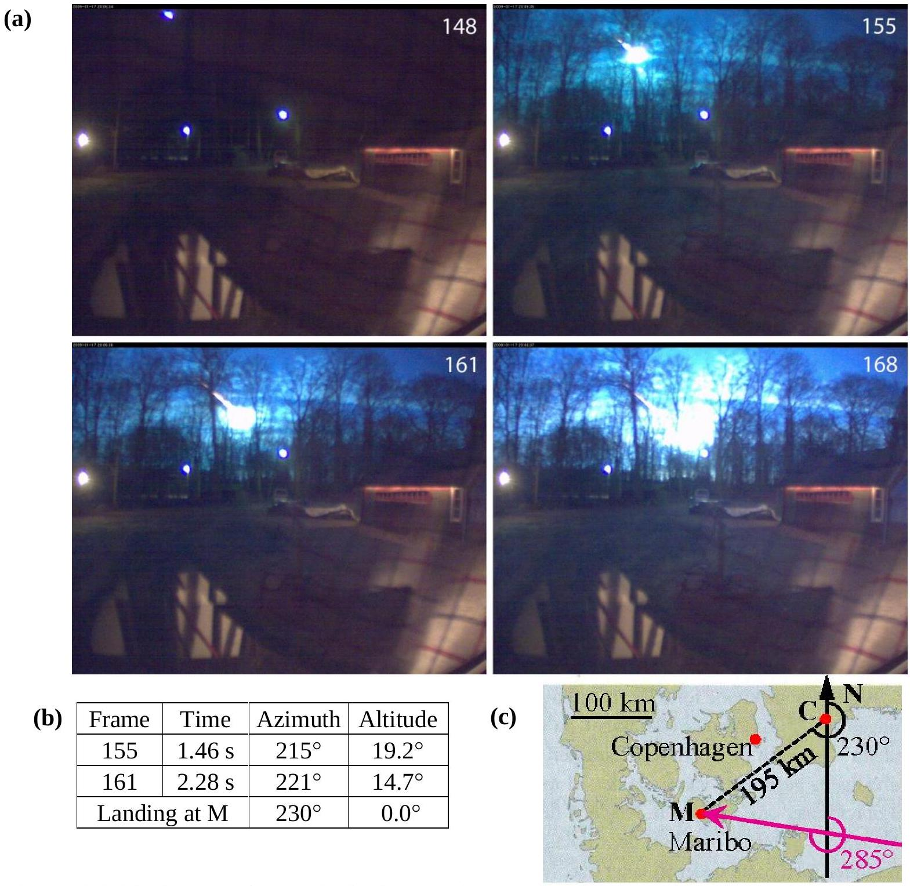
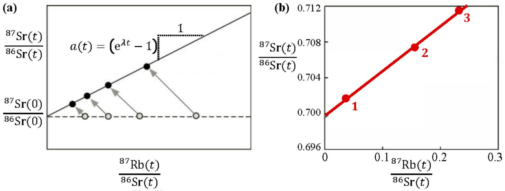

## Introduction

A meteoroid is a small particle (typically smaller than 1 m ) from a comet or an asteroid. A meteoroid that impacts the ground is called a meteorite.

On the night of 17 January 2009 many people near the Baltic Sea saw the glowing trail or fireball of a meteoroid falling through the atmosphere of the Earth. In Sweden a surveillance camera recorded a video of the event, see Fig. 1.1(a). From these pictures and eyewitness accounts it was possible to narrow down the impact area, and six weeks later a meteorite with the mass 0.025 kg was found in the vicinity of the town Maribo in southern Denmark. Measurements on the meteorite, now named Maribo, and its orbit in the sky showed interesting results. Its speed when entering the atmosphere had been exceptionally high. Its age, $4.567 \times 10^{9}$ year, shows that it had been formed shortly after the birth of the solar system. The Maribo meteorite is possibly a part of Comet Encke.

## The speed of Maribo

The fireball was moving in westerly direction, heading 285° relative to north, toward the location where the meteorite was subsequently found, as sketched in Fig. 1.1. The meteorite was found at a distance 195 km from the surveillance camera in the direction 230° relative to north.

| 1.1 | Use this and the data in Fig. 1.1 to calculate the average speed of Maribo in the time interval between frames 155 and 161. The curvature of the Earth and the gravitational force on the meteoroid can both be neglected. | 1.3 |
| :--- | :--- | :--- |

## Through the atmosphere and melting?

The friction from the air on a meteoroid moving in the higher atmosphere depends in a complicated way on the shape and velocity of the meteoroid, and on the temperature and density of the atmosphere. As a reasonable approximation the friction force $F$ in the upper atmosphere is given by the expression $F=k \rho_{\text {atm }} A v^{2}$, where $k$ is a constant, $\rho_{\text {atm }}$ the density of the atmosphere, $A$ the projected cross-section area of the meteorite, and $v$ its speed.

The following simplifying assumptions are made to analyze the meteoroid: The object entering the atmosphere was a sphere of mass $m_{\mathrm{M}}=30 \mathrm{~kg}$, radius $R_{\mathrm{M}}=0.13 \mathrm{~m}$, temperature $T_{0}=200 \mathrm{~K}$, and speed $v_{\mathrm{M}}=2.91 \times 10^{4} \mathrm{~m} / \mathrm{s}$. The density of the atmosphere is constant (its value 40 km above the surface of the Earth), $\rho_{\text {atm }}=4.1 \times 10^{-3} \mathrm{~kg} / \mathrm{m}^{3}$, and the friction coefficient is $k=0.60$.

| 1.2a | Estimate how long time after entering the atmosphere it takes the meteoroid to have its speed reduced by $10 \%$ from $v_{\mathrm{M}}$ to $0.90 v_{\mathrm{M}}$. You can neglect the gravitational force on the meteoroid and assume, that it maintains its mass and shape. | 0.7 |
| :--- | :--- | :--- |
| 1.2b | Calculate how many times larger the kinetic energy $E_{\text {kin }}$ of the meteoroid entering the atmosphere is than the energy $E_{\text {melt }}$ necessary for melting it completely (see data sheet). | 0.3 |

Figure 1.1 (a) Azimuth is the clockwise angular position from north in the horizontal plane, and altitude is the angular position above the horizon. A series of frames recorded by the surveillance camera in Sweden, showing the motion of Maribo as a fireball on its way down through the atmosphere. (b) The data from two frames indicating the time, the direction (azimuth) in degrees, as seen by the camera (C), and the height above the horizon (altitude) in degrees. (c) Sketch of the directions of the path (magenta arrow) of Maribo relative to north (N) and of the landing site (M) in Denmark as seen by the camera (C).

## Heating of Maribo during its fall in the atmosphere

When the stony meteoroid Maribo entered the atmosphere at supersonic speed it appeared as a fireball because the surrounding air was glowing. Nevertheless, only the outermost layer of Maribo was heated. Assume that Maribo is a homogenous sphere with density $\rho_{\mathrm{sm}}$, specific heat capacity $c_{\mathrm{sm}}$, and thermal conductivity $k_{\mathrm{sm}}$ (for values see the data sheet). Furthermore, when entering the atmosphere, it had the temperature $T_{0}=200 \mathrm{~K}$. While falling through the atmosphere its surface temperature was constant $T_{\mathrm{s}}=1000 \mathrm{~K}$ due to the air friction, thus gradually heating up the interior.

After falling a time $t$ in the atmosphere, an outer shell of Maribo of thickness $x$ will have been heated to a temperature significantly larger than $T_{0}$. This thickness can be estimated by dimensional analysis as the simple product of powers of the thermodynamic parameters: $x \approx t^{\alpha} \rho_{\mathrm{sm}}^{\beta} c_{\mathrm{sm}}^{\gamma} k_{\mathrm{sm}}^{\delta}$.

| 1.3a | Determine by dimensional (unit) analysis the value of the four powers $\alpha, \beta, \gamma$, and $\delta$. | 0.6 |
| :--- | :--- | :--- |
| 1.3b | Calculate the thickness $x$ after a fall time $t=5 \mathrm{~s}$, and determine the ratio $x / R_{\mathrm{M}}$. | 0.4 |

## The age of a meteorite

The chemical properties of radioactive elements may be different, so during the crystallization of the minerals in a given meteorite, some minerals will have a high content of a specific radioactive element and others a low content. This difference can be used to determine the age of a meteorite by radiometric dating of its radioactive minerals.

As a specific example, we study the isotope ${ }^{87} \mathrm{Rb}$ (element no. 37), which decays into the stable isotope ${ }^{87} \mathrm{Sr}$ (element no. 38) with a half-life of $T_{1 / 2}=4.9 \times 10^{10}$ year, relative to the stable isotope ${ }^{86} \mathrm{Sr}$. At the time of crystallization the ratio ${ }^{87} \mathrm{Sr} /{ }^{86} \mathrm{Sr}$ was identical for all minerals, while the ratio ${ }^{87} \mathrm{Rb} /{ }^{86} \mathrm{Sr}$ was different. As time passes on, the amount of ${ }^{87} \mathrm{Rb}$ decreases by decay, while consequently the amount of ${ }^{87} \mathrm{Sr}$ increases. As a result, the ratio ${ }^{87} \mathrm{Sr} /{ }^{86} \mathrm{Sr}$ will be different today. In Fig. 1.2(a), the points on the horizontal line refer to the ratio ${ }^{87} \mathrm{Rb} /{ }^{86} \mathrm{Sr}$ in different minerals at the time, when they are crystallized.

Figure 1.2 (a) The ratio ${ }^{87} \mathrm{Sr} /{ }^{86} \mathrm{Sr}$ in different minerals at the time $t=0$ of crystallization (open circles) and at present time (filled circles). (b) The isochron-line for three different mineral samples taken from a meteorite at present time.

| 1.4a | Write down the decay scheme for the transformation of ${ }_{37}^{87} \mathrm{Rb}$ to ${ }_{38}^{87} \mathrm{Sr}$. | 0.3 |
| :--- | :--- | :--- |
| 1.4b | Show that the present-time ratio ${ }^{87} \mathrm{Sr} /{ }^{86} \mathrm{Sr}$ plotted versus the present-time ratio ${ }^{87} \mathrm{Rb} /{ }^{86} \mathrm{Sr}$ in different mineral samples from the same meteorite forms a straight line, the so-called isochron-line, with slope $a(t)=\left(\mathrm{e}^{\lambda t}-1\right)$. Here $t$ is the time since the formation of the minerals, while $\lambda$ is the decay constant inversely proportional to half-life $T_{1 / 2}$. | 0.7 |
| 1.4c | Determine the age $\tau_{\mathrm{M}}$ of the meteorite using the isochron-line of Fig. 1.2(b). | 0.4 |

Comet Encke, from which Maribo may originate
In its orbit around the Sun, the minimum and maximum distances between comet Encke and the Sun are $a_{\text {min }}=4.95 \times 10^{10} \mathrm{~m}$ and $a_{\text {max }}=6.16 \times 10^{11} \mathrm{~m}$, respectively.

| 1.5 | Calculate the orbital period $t_{\text {Encke }}$ of comet Encke. | 0.6 |
| :--- | :--- | :--- |

Consequences of an asteroid impact on Earth
65 million years ago Earth was hit by a huge asteroid with density $\rho_{\text {ast }}=3.0 \times 10^{3} \mathrm{~kg} \mathrm{~m}^{-3}$, radius $R_{\text {ast }}=5.0 \mathrm{~km}$, and final speed of $v_{\text {ast }}=2.5 \times 10^{4} \mathrm{~m} / \mathrm{s}$. This impact resulted in the extermination of most of the life on Earth and the formation of the enormous Chicxulub Crater. Assume that an identical asteroid would hit Earth today in a completely inelastic collision, and use the fact that the moment of inertia of Earth is 0.83 times that for a homogeneous sphere of the same mass and radius. The moment of inertia of a homogeneous sphere with mass $M$ and radius $R$ is $\frac{2}{5} M R^{2}$. Neglect any changes in the orbit of the Earth.

| 1.6a | Let the asteroid hit the North Pole. Find the maximum change in angular orientation of the axis of Earth after the impact. | 0.7 |
| :--- | :--- | :--- |
| 1.6b | Let the asteroid hit the Equator in a radial impact. Find the change $\Delta \tau_{\mathrm{vrt}}$ in the duration of one revolution of Earth after the impact. | 0.7 |
| 1.6c | Let the asteroid hit the Equator in a tangential impact in the equatorial plane. Find the change $\Delta \tau_{\tan }$ in the duration of one revolution of Earth after the impact. | 0.7 |

Maximum impact speed
Consider a celestial body, gravitationally bound in the solar system, which impacts the surface of Earth with a speed $v_{\text {imp }}$. Initially the effect of the gravitational field of the Earth on the body can be neglected. Disregard the friction in the atmosphere, the effect of other celestial bodies, and the rotation of the Earth.

| 1.7 | Calculate $v_{\text {imp }}^{\text {max }}$, the largest possible value of $v_{\text {imp }}$. | 1.6 |
| :--- | :--- | :--- |
