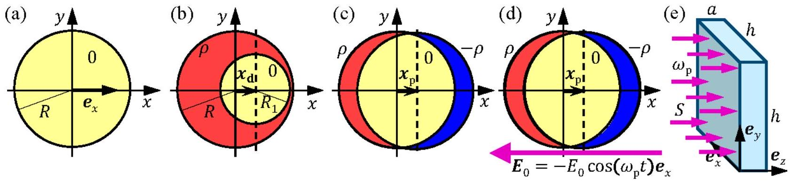

## Introduction

In this problem we study an efficient process of steam production that has been demonstrated to work experimentally. An aqueous solution of spherical nanometer-sized silver spheres (nanoparticles) with only about $10^{13}$ particles per liter is illuminated by a focused light beam. A fraction of the light is absorbed by the nanoparticles, which are heated up and generate steam locally around them without heating up the entire water solution. The steam is released from the system in the form of escaping steam bubbles. Not all details of the process are well understood at present, but the core process is known to be absorption of light through the so-called collective electron oscillations of the metallic nanoparticles. The device is known as a plasmonic steam generator.

Figure 2.1 (a) A spherical charge-neutral nanoparticle of radius $R$ placed at the center of the coordinate system. (b) A sphere with a positive homogeneous charge density $\rho$ (red), and containing a smaller spherical charge-neutral region (0, yellow) of radius $R_{1}$, with its center displaced by $\boldsymbol{x}_{\mathrm{d}}=x_{\mathrm{d}} \boldsymbol{e}_{x}$. (c) The sphere with positive charge density $\rho$ of the nanoparticle silver ions is fixed in the center of the coordinate system. The center of the spherical region with negative spherical charge density - $\rho$ (blue) of the electron cloud is displaced by $\boldsymbol{x}_{\mathrm{p}}$, where $x_{\mathrm{p}} \ll R$. (d) An external homogeneous electric field $\boldsymbol{E}_{0}=-E_{0} \boldsymbol{e}_{x}$. For timedependent $\boldsymbol{E}_{0}$, the electron cloud moves with velocity $\boldsymbol{v}=\mathrm{d} \boldsymbol{x}_{\mathrm{p}} / \mathrm{d} t$. (e) The rectangular vessel ( $h \times h \times a$ ) containing the aqueous solution of nanoparticles illuminated by monochromatic light propagating along the $z$-axis with angular frequency $\omega_{\mathrm{p}}$ and intensity $S$.

## A single spherical silver nanoparticle

Throughout this problem we consider a spherical silver nanoparticle of radius $R=10,0 \mathrm{~nm}$ and with its center fixed at the origin of the coordinate system, see Fig. 2.1(a). All motions, forces and driving fields are parallel to the horizontal $x$-axis (with unit vector $\boldsymbol{e}_{x}$ ). The nanoparticle contains free (conduction) electrons moving within the whole nanoparticle volume without being bound to any silver atom. Each silver atom is a positive ion that has donated one such free electron.

| 2.1 | Find the following quantities: The volume $V$ and mass $M$ of the nanoparticle, the number $N$ and charge density $\rho$ of silver ions in the particle, and for the free electrons their concentration $n$, their total charge $Q$, and their total mass $m_{0}$. | 0.7 |
| :--- | :--- | :--- |

The electric field in a charge-neutral region inside a charged sphere
For the rest of the problem assume that the relative dielectric permittivity of all materials is $\varepsilon=1$. Inside a charged sphere of homogeneous charge density $\rho$ and radius $R$ is created a small spherical charge-neutral region of radius $R_{1}$ by adding the opposite charge density $-\rho$, with its center displaced by $\boldsymbol{x}_{\mathrm{d}}=x_{\mathrm{d}} \boldsymbol{e}_{x}$ from the center of the $R$-sphere, see Fig. 2.1(b).

| 2.2 | Show that the electric field inside the charge-neutral region is homogenous of the form $\boldsymbol{E}=A\left(\rho / \varepsilon_{0}\right) \boldsymbol{x}_{\mathrm{d}}$, and determine the pre-factor $A$. | 1.2 |
| :--- | :--- | :--- |

The restoring force on the displaced electron cloud
In the following, we study the collective motion of the free electrons, and therefore model them as a single negatively charged sphere of homogeneous charge density $-\rho$ with a center position $\boldsymbol{x}_{\mathrm{p}}$, which can move along the $x$-axis relative to the center of the positively charged sphere (silver ions) fixed at the origin of the coordinate system, see Fig. 2.1(c). Assume that an external force $\boldsymbol{F}_{\text {ext }}$ displaces the electron cloud to a new equilibrium position $\boldsymbol{x}_{\mathrm{p}}=x_{\mathrm{p}} \boldsymbol{e}_{x}$ with $\left|x_{\mathrm{p}}\right| \ll R$. Except for tiny net charges at opposite ends of the nanoparticle, most of its interior remains charge-neutral.

| 2.3 | Express in terms of $\boldsymbol{x}_{\mathrm{p}}$ and $n$ the following two quantities: The restoring force $\boldsymbol{F}$ exerted on the electron cloud and the work $W_{\text {el }}$ done on the electron cloud during displacement. | 1.0 |
| :--- | :--- | :--- |

The spherical silver nanoparticle in an external constant electric field
A nanoparticle is placed in vacuum and influenced by an external force $\boldsymbol{F}_{\text {ext }}$ due to an applied static homogeneous electric field $\boldsymbol{E}_{0}=-E_{0} \boldsymbol{e}_{x}$, which displaces the electron cloud the small distance $\left|x_{\mathrm{p}}\right|$, where $\left|x_{\mathrm{p}}\right| \ll R$.

| 2.4 | Find the displacement $x_{\mathrm{p}}$ of the electron cloud in terms of $E_{0}$ and $n$, and determine the amount $-\Delta Q$ of electron charge displaced through the $y z$-plane at the center of the nanoparticle in terms of $n, R$ and $\mathrm{x}_{\mathrm{p}}$. | 0.6 |
| :--- | :--- | :--- |

The equivalent capacitance and inductance of the silver nanoparticle
For both a constant and a time-dependent field $\boldsymbol{E}_{0}$, the nanoparticle can be modeled as an equivalent electric circuit. The equivalent capacitance can be found by relating the work $W_{\text {el }}$, done on the separation of charges $\Delta Q$, to the energy of a capacitor, carrying charge $\pm \Delta Q$. The charge separation will cause a certain equivalent voltage $V_{0}$ across the equivalent capacitor.

| 2.5a | Express the systems equivalent capacitance $C$ in terms of $\varepsilon_{0}$ and $R$, and find its value. | 0.7 |
| :--- | :--- | :--- |
| 2.5b | For this capacitance, determine in terms of $E_{0}$ and $R$ the equivalent voltage $V_{0}$ that should be connected to the equivalent capacitor in order to accumulate the charge $\Delta Q$. | 0.4 |

For a time-dependent field $\boldsymbol{E}_{0}$, the electron cloud moves with velocity $\boldsymbol{v}=v \boldsymbol{e}_{x}$, Fig. 2.1(d). It has the kinetic energy $W_{\text {kin }}$ and forms an electric current $I$ flowing through the fixed $y z$-plane. The kinetic energy of the electron cloud can be attributed to the energy of an equivalent inductor of inductance $L$ carrying the current $I$.

| 2.6a | Express both $W_{\text {kin }}$ and $I$ in terms of the velocity $v$. | 0.7 |
| :--- | :--- | :--- |
| 2.6b | Express the equivalent inductance $L$ in terms of particle radius $R$, the electron charge $e$ and mass $m_{e}$, the electron concentration $n$, and calculate its value. | 0.5 |

## The plasmon resonance of the silver nanoparticle

From the above analysis it follows that the motion, arising from displacing the electron cloud from its equilibrium position and then releasing it, can be modeled by an ideal $L C$-circuit oscillating at resonance. This dynamical mode of the electron cloud is known as the plasmon resonance, which oscillates at the so-called angular plasmon frequency $\omega_{\mathrm{p}}$.

| 2.7a | Find an expression for the angular plasmon frequency $\omega_{\mathrm{p}}$ of the electron cloud in terms of the electron charge $e$ and mass $m_{e}$, the electron density $n$, and the permittivity $\varepsilon_{0}$. | 0.5 |
| :--- | :--- | :--- |
| 2.7b | Calculate $\omega_{\mathrm{p}}$ in rad/s and the wavelength $\lambda_{\mathrm{p}}$ in nm of light in vacuum having angular frequency $\omega=\omega_{\mathrm{p}}$. | 0.4 |

## The silver nanoparticle illuminated with light at the plasmon frequency

In the rest of the problem, the nanoparticle is illuminated by monochromatic light at the angular plasmon frequency $\omega_{\mathrm{p}}$ with the incident intensity $S=\frac{1}{2} c \varepsilon_{0} E_{0}^{2}=1.00 \mathrm{MW} \mathrm{m}^{-2}$. As the wavelength is large, $\lambda_{\mathrm{p}} \gg R$, the nanoparticle can be considered as being placed in a homogeneous harmonically oscillating field $\boldsymbol{E}_{0}=-E_{0} \cos \left(\omega_{\mathrm{p}} t\right) \boldsymbol{e}_{x}$. Driven by $\boldsymbol{E}_{0}$, the center $\boldsymbol{x}_{\mathrm{p}}(t)$ of the electron cloud oscillates at the same frequency with velocity $\boldsymbol{v}=\mathrm{d} \boldsymbol{x}_{\mathrm{p}} / \mathrm{d} t$ and constant amplitude $x_{0}$. This oscillating electron motion leads to absorption of light. The energy captured by the particle is either converted into Joule heating inside the particle or re-emitted by the particle as scattered light.

Joule heating is caused by random inelastic collisions, where any given free electron once in a while hits a silver ion and loses its total kinetic energy, which is converted into vibrations of the silver ions (heat). The average time between the collisions is $\tau \gg 1 / \omega_{\mathrm{p}}$, where for silver nanoparticle we use $\tau=5.24 \times 10^{-15} \mathrm{~s}$.

| 2.8a | Find an expression for the time-averaged Joule heating power $P_{\text {heat }}$ in the nanoparticle as well as the time-averaged current squared $\left\langle I^{2}\right\rangle$, which includes explicitly the timeaveraged velocity squared $\left\langle v^{2}\right\rangle$ of the electron cloud. | 1.0 |
| :--- | :--- | :--- |
| 2.8b | Find an expression for the equivalent ohmic resistance $R_{\text {heat }}$ in an equivalent resistormodel of the nanoparticle having the Joule heating power $P_{\text {heat }}$ due to the electron cloud current $I$. Calculate the numerical value of $R_{\text {heat }}$. | 1.0 |

The incident light beam loses some time-averaged power $P_{\text {scat }}$ by scattering on the oscillating electron cloud (re-emission). $P_{\text {scat }}$ depends on the scattering source amplitude $x_{0}$, charge $Q$, angular frequency $\omega_{\mathrm{p}}$ and properties of the light (the speed of light $c$ and permittivity $\varepsilon_{0}$ in vacuum). In terms of these four variables, $P_{\text {scat }}$ is given by $P_{\text {scat }}=\frac{Q^{2} x_{0}^{2} \omega_{\mathrm{p}}{ }^{4}}{12 \pi \varepsilon_{0} c^{3}}$.

| 2.9 | By use of $P_{\text {scat }}$, find an expression of the equivalent scattering resistance $R_{\text {scat }}$ (in analogy with $R_{\text {heat }}$ ) in an equivalent resistor-model, and calculate its value. | 1.0 |
| :--- | :--- | :--- |

The above equivalent circuit elements are combined into an LCR series circuit model of the silver nanoparticle, which is driven by a harmonically oscillating equivalent voltage $V=V_{0} \cos \left(\omega_{\mathrm{p}} t\right)$ determined by the electric field $E_{0}$ of the incident light.

| 2.10a | Derive expressions for the time-averaged power losses $P_{\text {heat }}$ and $P_{\text {scat }}$ involving the amplitude $E_{0}$ of the electric field in the incident light at the plasmon resonance $\omega=\omega_{p}$. | 1.2 |
| :--- | :--- | :--- |
| 2.10b | Calculate the numerical value of $E_{0}, P_{\text {heat }}$, and $P_{\text {scat }}$. | 0.3 |

## Steam generation by light

An aqueous solution of silver nanoparticles is prepared with a concentration $n_{\text {np }}=7.3 \times 10^{15} \mathrm{~m}^{-3}$. It is placed inside a rectangular transparent vessel of size $h \times h \times a=10 \times 10 \times 1.0 \mathrm{~cm}^{3}$ and illuminated by light at the plasmon frequency with the same intensity $S=1.00 \mathrm{MW} \mathrm{m}^{-2}$ at normal incidence as above, see Fig. 2.1(e). The temperature of the water is $T_{\text {wa }}=20^{\circ} \mathrm{C}$ and we assume, in fair agreement with observations, that in steady state all Joule heating of the nanoparticle goes to the production of steam of temperature $T_{\mathrm{st}}=110^{\circ} \mathrm{C}$, without raising the temperature of the water.

The thermodynamic efficiency $\eta$ of the plasmonic steam generator is defined by the power ratio $\eta=P_{\mathrm{st}} / P_{\mathrm{tot}}$, where $P_{\mathrm{st}}$ is the power going into the production of steam in the entire vessel, while $P_{\text {tot }}$ is the total power of the incoming light that enters the vessel.

Most of the time any given nanoparticle is surrounded by steam instead of water, and it can thus be described as being in vacuum.

| 2.11a | Calculate the total mass per second $\mu_{\mathrm{st}}$ of steam produced by the plasmonic steam generator during illumination by light at the plasmon frequency and intensity $S$. | 0.6 |
| :--- | :--- | :--- |
| 2.11 b | Calculate the numerical value of the thermodynamic efficiency $\eta$ of the plasmonic steam generator. | 0.2 |
