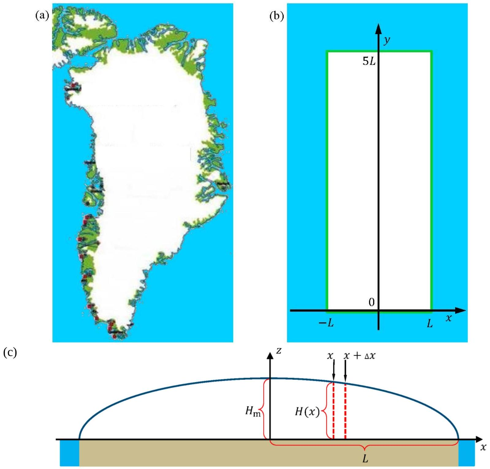
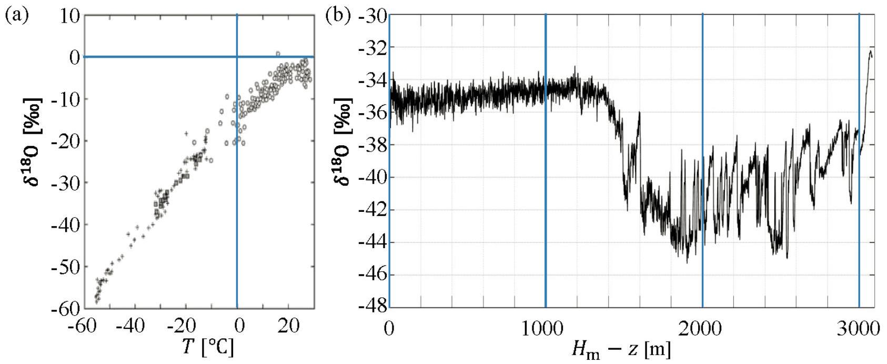

## Introduction

This problem deals with the physics of the Greenlandic ice sheet, the second largest glacier in the world, Fig. 3.1(a). As an idealization, Greenland is modeled as a rectangular island of width $2 L$ and length $5 L$ with the ground at sea level and completely covered by incompressible ice (constant density $\rho_{\text {ice }}$ ), see Fig. 3.1(b). The height profile $H(x)$ of the ice sheet does not depend on the $y$ coordinate and it increases from zero at the coasts $x= \pm L$ to a maximum height $H_{\mathrm{m}}$ along the middle north-south axis (the $y$-axis), known as the ice divide, see Fig. 3.1(c).

Figure 3.1 (a) A map of Greenland showing the extent of the ice sheet (white), the ice-free, coastal regions (green), and the surrounding ocean (blue). (b) The crude model of the Greenlandic ice sheet as covering a rectangular area in the $x y$-plane with side lengths $2 L$ and $5 L$. The ice divide, the line of maximum ice sheet height $H_{\mathrm{m}}$ runs along the $y$-axis. (c) A vertical cut ( $x z$-plane) through the ice sheet showing the height profile $H(x)$ (blue line). $H(x)$ is independent of the $y$-coordinate for $0<y<5 L$, while it drops abruptly to zero at $y=0$ and $y=5 L$. The $z$-axis marks the position of the ice divide. For clarity, the vertical dimensions are expanded compared to the horizontal dimensions. The density $\rho_{\text {ice }}$ of ice is constant.

Two useful formulas
In this problem you can make use of the integral:

$$
\int_{0}^{1} \sqrt{1-x} \mathrm{~d} x=\frac{2}{3}
$$

and the approximation $(1+x)^{a} \approx 1+a x$, valid for $|a x| \ll 1$.

The height profile of the ice sheet
On short time scales the glacier is an incompressible hydrostatic system with fixed height profile $H(x)$.

| 3.1 | Write down an expression for the pressure $p(x, z)$ inside the ice sheet as a function of vertical height z above the ground and distance $x$ from the ice divide. Neglect the atmospheric pressure. | 0.3 |
| :--- | :--- | :--- |

Consider a given vertical slab of the ice sheet in equilibrium, covering a small horizontal base area $\Delta x \Delta y$ between $x$ and $x+\Delta x$, see the red dashed lines in Fig. 3.1(c). The size of $\Delta y$ does not matter. The net horizontal force component $\Delta F$ on the two vertical sides of the slab, arising from the difference in height on the center-side versus the coastal-side of the slab, is balanced by a friction force $\Delta F=S_{\mathrm{b}} \Delta x \Delta y$ from the ground on the base area $\Delta x \Delta y$, where $S_{\mathrm{b}}=100 \mathrm{kPa}$.

| 3.2a | For a given value of $x$, show that in the limit $\Delta x \rightarrow 0, S_{\mathrm{b}}=k H \mathrm{~d} H / \mathrm{d} x$, and determine k | 0.9 |
| :--- | :--- | :--- |
| 3.2b | Determine an expression for the height profile $H(x)$ in terms of $\rho_{\text {ice }}, g, L, S_{\mathrm{b}}$ and distance $x$ from the divide. The result will show, that the maximum glacier height $H_{\mathrm{m}}$ scales with the half-width $L$ as $H_{\mathrm{m}} \propto L^{1 / 2}$. | 0.8 |
| 3.2c | Determine the exponent $\gamma$ with which the total volume $V_{\text {ice }}$ of the ice sheet scales with the area $A$ of the rectangular island, $V_{\text {ice }} \propto A^{\gamma}$. | 0.5 |

A dynamical ice sheet
On longer time scale, the ice is a viscous incompressible fluid, which by gravity flows from the center part to the coast. In this model, the ice maintains its height profile $H(x)$ in a steady state, where accumulation of ice due to snow fall in the central region is balanced by melting at the coast. In addition to the ice sheet geometry of Fig. 3.1(b) and (c) make the following model assumptions:

1) Ice flows in the $x z$-plane away from the ice divide (the $y$-axis).
2) The accumulation rate $c$ (m/year) in the central region is a constant.
3) Ice can only leave the glacier by melting near the coasts at $x= \pm L$.
4) The horizontal ( $x$-)component $v_{x}(x)=\mathrm{d} x / \mathrm{d} t$ of the ice-flow velocity is independent of $z$.
5) The vertical ( $z$-)component $v_{z}(z)=\mathrm{d} z / \mathrm{d} t$ of the ice-flow velocity is independent of $x$.

Consider only the central region $|x| \ll L$ close to the middle of the ice sheet, where height variations of the ice sheet are very small and can be neglected altogether, i.e. $H(x) \approx H_{\mathrm{m}}$.

| 3.3 | Use mass conservation to find an expression for the horizontal ice-flow velocity $v_{x}(x)$ in terms of $c, x$, and $H_{\mathrm{m}}$. | 0.6 |
| :--- | :--- | :--- |

From the assumption of incompressibility, i.e. the constant density $\rho_{\text {ice }}$ of the ice, it follows that mass conservation implies the following restriction on the ice flow velocity components

$$
\frac{d v_{x}}{d x}+\frac{d v_{z}}{d z}=0 .
$$

| 3.4 | Write down an expression for the $z$ dependence of the vertical component $v_{z}(z)$ of the ice-flow velocity. | 0.6 |
| :--- | :--- | :--- |

A small ice particle with the initial surface position $\left(x_{i}, H_{\mathrm{m}}\right)$ will, as time passes, flow as part of the ice sheet along a flow trajectory $z(x)$ in the vertical $x z$-plane.

| 3.5 | Derive an expression for such a flow trajectory $z(x)$. | 0.9 |
| :--- | :--- | :--- |

## Age and climate indicators in the dynamical ice sheet

Based on the ice-flow velocity components $v_{x}(x)$ and $v_{z}(z)$, one can estimate the age $\tau(z)$ of the ice in a specific depth $H_{\mathrm{m}}-z$ from the surface of the ice sheet.

| 3.6 | Find an expression for the age $\tau(z)$ of the ice as a function of height $z$ above ground, right at the ice divide $x=0$. | 1.0 |
| :--- | :--- | :--- |

An ice core drilled in the interior of the Greenland ice sheet will penetrate through layers of snow from the past, and the ice core can be analyzed to reveal past climate changes. One of the best indicators is the so-called $\delta^{18} \mathrm{O}$, defined as

$$
\delta^{18} \mathrm{O}=\frac{R_{\mathrm{ice}}-R_{\mathrm{ref}}}{R_{\mathrm{ref}}} 1000 \%,
$$

where $R=\left[{ }^{18} \mathrm{O}\right] /\left[{ }^{16} \mathrm{O}\right]$ denotes the relative abundance of the two stable isotopes ${ }^{18} \mathrm{O}$ and ${ }^{16} \mathrm{O}$ of oxygen. The reference $R_{\text {ref }}$ is based on the isotopic composition of the oceans around Equator.

Figure 3.2 (a) Observed relationship between $\delta^{18} \mathrm{O}$ in snow versus the mean annual surface temperature $T$. (b) Measurements of $\delta^{18} \mathrm{O}$ versus depth $H_{\mathrm{m}}-z$ from the surface, taken from an ice core drilled from surface to bedrock at a specific place along the Greenlandic ice divide where $H_{\mathrm{m}}=3060 \mathrm{~m}$.

Observations from the Greenland ice sheet show that $\delta^{18} \mathrm{O}$ in the snow varies approximately linearly with temperature, Fig. 3.2(a). Assuming that this has always been the case, $\delta^{18} \mathrm{O}$ retrieved from an ice core at depth $H_{\mathrm{m}}-z$ leads to an estimate of the temperature $T$ near Greenland at the age $\tau(z)$.

Measurements of $\delta^{18} \mathrm{O}$ in a 3060 m long Greenlandic ice core show an abrupt change in $\delta^{18} \mathrm{O}$ at a depth of 1492 m, Fig. 3.2(b), marking the end of the last ice age. The ice age began 120,000 years ago, corresponding to a depth of 3040 m, and the current interglacial age began 11,700 years ago, corresponding to a depth of 1492 m . Assume that these two periods can be described by two different accumulation rates, $c_{\mathrm{ia}}$ (ice age) and $c_{\mathrm{ig}}$ (interglacial age), respectively. You can assume $H_{\mathrm{m}}$ to be constant throughout these 120,000 years.

| 3.7a | Determine the accumulation rates $c_{\mathrm{ia}}$ and $c_{\mathrm{ig}}$. | 0.8 |
| :--- | :--- | :--- |
| 3.7b | Use the data in Fig. 3.2 to find the temperature change at the transition from the ice age to the interglacial age. | 0.2 |

## Sea level rise from melting of the Greenland ice sheet

A complete melting of the Greenlandic ice sheet will cause a sea level rise in the global ocean. As a crude estimate of this sea level rise, one may simply consider a uniform rise throughout a global ocean with constant area $A_{\mathrm{O}}=3.61 \times 10^{14} \mathrm{~m}^{2}$.

| 3.8 | Calculate the average global sea level rise, which would result from a complete melting of the Greenlandic ice sheet, given its present area of $A_{\mathrm{G}}=1.71 \times 10^{12} \mathrm{~m}^{2}$ and $S_{\mathrm{b}}=100 \mathrm{kPa}$. | 0.6 |
| :--- | :--- | :--- |

The massive Greenland ice sheet exerts a gravitational pull on the surrounding ocean. If the ice sheet melts, this local high tide is lost and the sea level will drop close to Greenland, an effect which partially counteracts the sea level rise calculated above.

To estimate the magnitude of this gravitational pull on the water, the Greenlandic ice sheet is now modeled as a point mass located at the ground level and having the total mass of the Greenlandic ice sheet. Copenhagen lies at a distance of 3500 km along the Earth surface from the center of the point mass. One may consider the Earth, without the point mass, to be spherically symmetric and having a global ocean spread out over the entire surface of the Earth of area $A_{\mathrm{E}}=5.10 \times 10^{14} \mathrm{~m}^{2}$. All effects of rotation of the Earth may be neglected.

| 3.9 | Within this model, determine the difference $h_{\mathrm{CPH}}-h_{\mathrm{OPP}}$ between sea levels in Copenhagen $\left(h_{\text {CPH }}\right)$ and diametrically opposite to Greenland $\left(h_{\text {OPP }}\right)$. | 1.8 |
| :--- | :--- | :--- |
