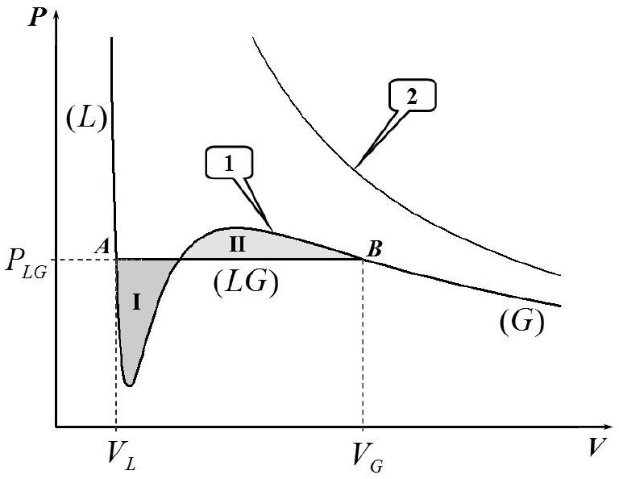
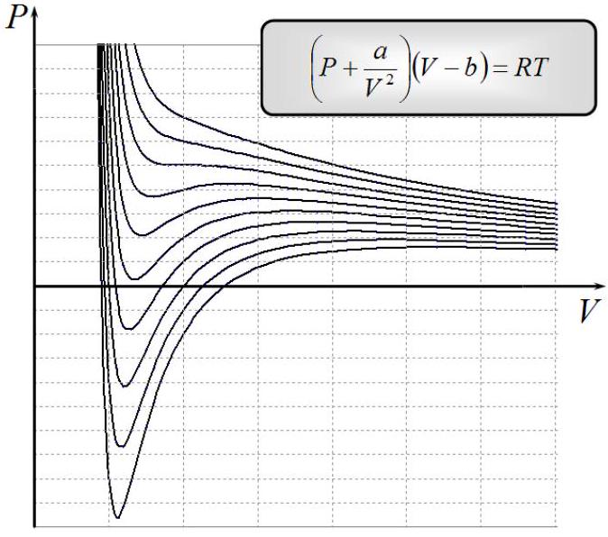
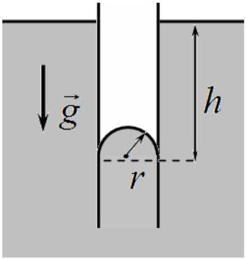

## Problem 2. Van der Waals equation of state (11 points)

In a well-known model of an ideal gas, whose equation of state obeys the Clapeyron-Mendeleev law, the following important physical effects are neglected. First, molecules of a real gas have a finite size and, secondly, they interact with one another. In all parts of this problem one mole of water is considered.

## Part A. Non-ideal gas equation of state (2 points)

Taking into account the finite size of the molecules, the gaseous equation of state takes the form

$$
P(V-b)=R T,
$$

where $P, V, T$ stands for the gas pressure, its volume per mole and temperature, respectively, $R$ denotes the universal gas constant, and $b$ is a specific constant extracting some volume.

A1 Estimate $b$ and express it in terms of the diameter of the molecules $d$. (0.3 points)
With account of intermolecular attraction forces, van der Waals proposed the following equation of state that neatly describes both the gaseous and liquid states of matter

$$
\left(P+\frac{a}{V^{2}}\right)(V-b)=R T .
$$

where $a$ is another specific constant.
At temperatures $T$ below a certain critical value $T_{c}$ the isotherm of equation (2) is well represented by a non-monotonic curve 1 shown in Figure 1 which is then called van der Waals isotherm. In the same figure curve 2 shows the isotherm of an ideal gas at the same temperature. A real isotherm differs from the van der Waals isotherm by a straight segment $\boldsymbol{A} \boldsymbol{B}$ drawn at some constant pressure $P_{L G}$. This straight segment is located between the volumes $V_{L}$ and $V_{G}$, and corresponds to the equilibrium of the liquid phase (indicated by $L$ ) and the gaseous phase (referred to by $G$ ). From the second law of thermodynamics J. Maxwell showed that the pressure $P_{L G}$ must be chosen such that the areas $I$ and $I I$ shown in Figure 1 must be equal.

Figure 1. Van der Waals isotherm of gas/liquid (curve 1) and the isotherm of an ideal gas (curve 2).

Figure 2. Several isotherms for van der Waals equation of state.

With increasing temperature the straight segment $A B$ on the isotherm shrinks to a single point when the temperature and the pressure reaches some values $T_{c}$ and $P_{L G}=P_{c}$, respectively. The parameters $P_{c}$ and $T_{c}$ are called critical and can be measured experimentally with high degree of accuracy.

| A2 | Express the van der Waals constants $a$ and $b$ in terms of $T_{c}$ and $P_{c}$. (1.3 points) |
| :--- | :--- |
| A3 | For water $T_{c}=647 \mathrm{~K}$ and $P_{c}=2.2 \cdot 10^{7} \mathrm{~Pa}$. Calculate $a_{w}$ and $b_{w}$ for water. ( $\mathbf{0 . 2}$ points) |
| A4 | Estimate the diameter of water molecules $d_{w}$. (0.2 points) |

## Part B. Properties of gas and liquid (6 points)

This part of the problem deals with the properties of water in the gaseous and liquid states at temperature $T=100^{\circ} \mathrm{C}$. The saturated vapor pressure at this temperature is known to be $p_{L G}=p_{0}=1.0 \cdot$ $10^{5} \mathrm{~Pa}$, and the molar mass of water is $\mu=1.8 \cdot 10^{-2} \frac{\mathrm{~kg}}{\mathrm{~mole}}$.

Gaseous state
It is reasonable to assume that the inequality $V_{G} \gg b$ is valid for the description of water properties in a gaseous state.

| B1 | Derive the formula for the volume $V_{G}$ and express it in terms of $R, T, p_{0}$, and $a$. ( $\mathbf{0 . 8}$ points) |
| :--- | :--- |
| Almost the same volume $V_{G 0}$ can be approximately evaluated using the ideal gas law. |  |
| B2 | Evaluate in percentage the relative decrease in the gas volume due to intermolecular forces, $\frac{\Delta V_{G}}{V_{G 0}}=\frac{V_{G 0}-V_{G}}{V_{G 0}}$. (0.3 points) |

If the system volume is reduced below $V_{G}$, the gas starts to condense. However, thoroughly purified gas can remain in a mechanically metastable state (called supercooled vapor) until its volume reaches a certain value $V_{G \text { min }}$.

The condition of mechanical stability of supercooled gas at constant temperature is written as: $\frac{d P}{d V}<$ 0.

| B3 | Find and evaluate how many times the volume of water vapor can be reduced and still remains in a metastable state. In other words, what is $V_{G} / V_{G \min }$ ? ( $\mathbf{0 . 7}$ points) |
| :--- | :--- |

Liquid state
For the van der Waals' description of water in a liquid state it is reasonable to assume that the following inequality holds $P \ll a / V^{2}$.

| B4 | Express the volume of liquid water $V_{L}$ in terms of $a, b, R$, and $T$. (1.0 points) |
| :--- | :--- |

Assuming that $b R T \ll a$, find the following characteristics of water. Do not be surprised if some of the data evaluated do not coincide with the well-known tabulated values!

| B5 | Express the liquid water density $\rho_{L}$ in some of the terms of $\mu, a, b, R$ and evaluate it. (0.5 points) |
| :--- | :--- |
| B6 | Express the volume thermal expansion coefficient $\alpha=\frac{1}{V_{L}} \frac{\Delta V_{L}}{\Delta T}$ in terms of $a, b, R$, and evaluate it. (0.6 points) |
| B7 | Express the specific heat of water vaporization $L$ in terms of $\mu, a, b, R$ and evaluate it. (1.1 points) |
| B8 | Considering the monomolecular layer of water, estimate the surface tension $\sigma$ of water. (1.2 points) |

## Part C. Liquid-gas system (3 points)

From Maxwell's rule (equalities of areas, by applying trivial integration) and the van der Waals' equation of state together with the approximations made in Part B, it can be shown that the saturated vapor pressure $p_{L G}$ depends on temperature $T$ as follows

$$
\ln p_{L G}=A+\frac{B}{T},
$$

where $A$ and $B$ are some constants, that can be expressed in terms of $a$ and $b$ as $A=\ln \left(\frac{a}{b^{2}}\right)-1 ; B=-\frac{a}{b R}$
W. Thomson showed that the pressure of saturated vapor depends on the curvature of the liquid surface. Consider a liquid that does not wet the material of a capillary (contact angle 180°). When the capillary is immersed into the liquid, the liquid in the capillary drops to a certain level because of the surface tension (see Figure 3).

| C1 | Find a small change in pressure $\Delta p_{T}$ of the saturated vapor over the curved surface of liquid and express it in terms of the vapor density $\rho_{s}$, the liquid density $\rho_{L}$, the surface tension $\sigma$ and the radius of surface curvature $r$. (1.3 points) |
| :--- | :--- |

Metastable states, considered in part B3, are widely used in real experimental setups, such as the cloud chamber designed for registration of elementary particles. They also occur in natural phenomena such as the

Figure 3. Capillary immersed in a liquid that does not wet its material

formation of morning dew. Supercooled vapor is subject to condensation by forming liquid droplets. Very small droplets evaporate quickly but large enough ones can still grow.

| C2 | Suppose that at the evening temperature of $t_{e}=20^{\circ} \mathrm{C}$ the water vapor in the air was saturated, but in the morning the ambient temperature has fallen by a small amount of $\Delta t=5.0{ }^{\circ} \mathrm{C}$. Assuming that the vapor pressure has remained unchanged, estimate the minimum radius of droplets that can grow. Use the tabulated value of water surface tension $\sigma=7.3 \cdot 10^{-2} \mathrm{~N} / \mathrm{m}$. (1.7 points) |
| :--- | :--- |
