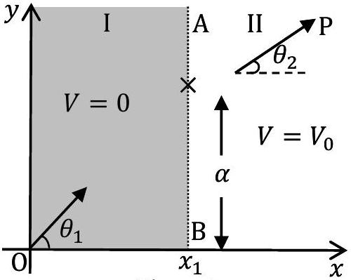
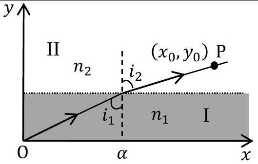
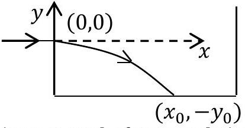
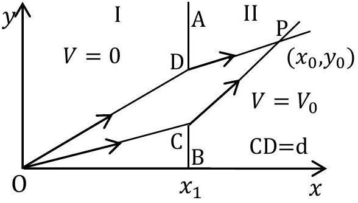
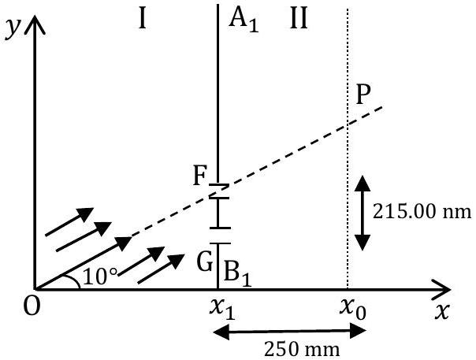

## A The Extremum Principle in Mechanics

Consider a horizontal frictionless $x-y$ plane shown in Fig. 1. It is divided into two regions, I and II, by a line AB satisfying the equation $x=x_{1}$. The potential energy of a point particle of mass $m$ in region I is $V=0$ while it is $V=V_{0}$ in region II. The particle is sent from the origin O with speed $v_{1}$ along a line making an angle $\theta_{1}$ with the $x$-axis. It reaches point P in region II traveling with speed $v_{2}$ along a line that makes an angle $\theta_{2}$ with the $x$-axis. Ignore gravity and relativistic effects in this entire task T-2 (all parts).

Figure 1

| A1 | Obtain an expression for $v_{2}$ in terms of $m, v_{1}$ and $V_{0}$. | 0.2 |
| :--- | :--- | :--- |
| A2 | Express $v_{2}$ in terms of $v_{1}, \theta_{1}$ and $\theta_{2}$. | 0.3 |

We define a quantity called action $A=m \int v(s) d s$, where $d s$ is the infinitesimal length along the trajectory of a particle of mass $m$ moving with speed $v(s)$. The integral is taken over the path. As an example, for a particle moving with constant speed $v$ on a circular path of radius $R$, the action $A$ for one revolution will be $2 \pi m R v$. For a particle with constant energy $E$, it can be shown that of all the possible trajectories between two fixed points, the actual trajectory is the one on which $A$ defined above is an extremum (minimum or maximum). Historically this is known as the Principle of Least Action (PLA).

PLA implies that the trajectory of a particle moving between two fixed points in a region of constant potential will be a straight line. Let the two fixed points O and P in Fig. 1 have coordinates (0,0) and $\left(x_{0}, y_{0}\right)$ respectively and the boundary point where the particle transits from region I to region II have coordinates $\left(x_{1}, \alpha\right)$. Note that $x_{1}$ is fixed and the action depends on the coordinate $\alpha$ only. State the expression for the action $A(\alpha)$. Use PLA to obtain the relationship between $v_{1} / v_{2}$ and these coordinates.

B The Extremum Principle in Optics
A light ray travels from medium I to medium II with refractive indices $n_{1}$ and $n_{2}$ respectively. The two media are separated by a line parallel to the $x$-axis. The light ray makes an angle $i_{1}$ with the $y$-axis in medium I and $i_{2}$ in medium II (see Fig. 2). To obtain the trajectory of the ray, we make use of another extremum (minimum or maximum) principle known as Fermat's principle of least time.

Figure 2

| B1 | The principle states that between two fixed points, a light ray moves along a path such that time taken between the two points is an extremum. Derive the relation between $\sin i_{1}$ and $\sin i_{2}$ on the basis of Fermat's principle. | 0.5 |
| :--- | :--- | :--- |

Shown in Fig. 3 is a schematic sketch of the path of a laser beam incident horizontally on a solution of sugar in which the concentration of sugar decreases with height. As a consequence, the refractive index of the solution also decreases with height.

Figure 3: Tank of Sugar Solution

| B2 | Assume that the refractive index $n(y)$ depends only on $y$. Use the equation obtained in B1 to obtain the expression for the slope $d y / d x$ of the beam's path in terms of refractive index $n_{0}$ at $y=0$ and $n(y)$. | 1.5 |
| :--- | :--- | :--- |
| B3 | The laser beam is directed horizontally from the origin $(0,0)$ into the sugar solution at a height $y_{0}$ from the bottom of the tank as shown in figure 3. Take $n(y)=n_{0}-k y$ where $n_{0}$ and $k$ are positive constants. Obtain an expression for $x$ in terms of $y$ and related quantities for the actual trajectory of the laser beam. | 1.2 |

[^0]|  | You may use: $\int \sec \theta d \theta=\ln (\sec \theta+\tan \theta)+\operatorname{constant}$, where $\sec \theta=1 / \cos \theta$ or $\int \frac{d x}{\sqrt{x^{2}-1}}=\ln \left(x+\sqrt{x^{2}-1}\right)+\text { constant }$ |  |
| :--- | :--- | :--- |
| B4 | Obtain the value of $x_{0}$, the point where the beam meets the bottom of the tank. Take $y_{0}=10.0 \mathrm{~cm}$, $n_{0}=1.50, k=0.050 \mathrm{~cm}^{-1}\left(1 \mathrm{~cm}=10^{-2} \mathrm{~m}\right)$. | 0.8 |

C The Extremum Principle and the Wave Nature of Matter
We now explore the connection between the PLA and the wave nature of a moving particle. For this we assume that a particle moving from O to P can take all possible trajectories and we will seek a trajectory that depends on the constructive interference of de Broglie waves.

| C1 | As the particle moves along its trajectory by an infinitesimal distance $\Delta s$, relate the change $\Delta \varphi$ in the phase of its de Broglie wave to the change $\Delta A$ in the action and the Planck constant. |  | 0.6 |
| :--- | :--- | :--- | :--- |
| C2 | Recall the problem from part A where the particle traverses from O to P (see Fig. 4). Let an opaque partition be placed at the boundary AB between the two regions. There is a small opening CD of width $d$ in AB such that $d \ll\left(x_{0}-x_{1}\right)$ and $d \ll x_{1}$.   Consider two extreme paths OCP and ODP such that OCP lies on the classical trajectory discussed in part A. Obtain the phase difference $\Delta \varphi_{\mathrm{CD}}$ between the two paths to first order. |  Figure 4 | 1.2 |

D Matter Wave Interference
Consider an electron gun at O which directs a collimated beam of electrons to a narrow slit at F in the opaque partition $\mathrm{A}_{1} \mathrm{~B}_{1}$ at $x=x_{1}$ such that OFP is a straight line. P is a point on the screen at $x=x_{0}$ (see Fig. 5). The speed in I is $v_{1}=2.0000 \times 10^{7} \mathrm{~m} \mathrm{~s}^{-1}$ and $\theta=10.0000^{\circ}$. The potential in II is such that speed $v_{2}=$ $1.9900 \times 10^{7} \mathrm{~m} \mathrm{~s}^{-1}$. The distance $x_{0}-x_{1}$ is 250.00 mm $\left(1 \mathrm{~mm}=10^{-3} \mathrm{~m}\right)$. Ignore electron-electron interaction.

Figure 5

| D1 | If the electrons at O have been accelerated from rest, calculate the accelerating potential $U_{1}$. | 0.3 |
| :--- | :--- | :--- |
| D2 | Another identical slit G is made in the partition $\mathrm{A}_{1} \mathrm{~B}_{1}$ at a distance of $215.00 \mathrm{~nm}\left(1 \mathrm{~nm}=10^{-9} \mathrm{~m}\right)$ below slit F (Fig. 5). If the phase difference between de Broglie waves arriving at P through the slits F and G is $2 \pi \beta$, calculate $\beta$. | 0.8 |
| D3 | What is the smallest distance $\Delta y$ from P at which null (zero) electron detection maybe expected on the screen? [Note: you may find the approximation $\sin (\theta+\Delta \theta) \approx \sin \theta+\Delta \theta \cos \theta$ useful] | 1.2 |
| D4 | The beam has a square cross section of $500 \mathrm{~nm} \times 500 \mathrm{~nm}$ and the setup is 2 m long. What should be the minimum flux density $I_{\text {min }}$ (number of electrons per unit normal area per unit time) if, on an average, there is at least one electron in the setup at a given time? | 0.4 |

[^0]:    ${ }^{1}$ Manoj Harbola (IIT-Kanpur) and Vijay A. Singh (ex-National Coordinator, Science Olympiads) were the principal authors of this problem. The contributions of the Academic Committee, Academic Development Group and the International Board are gratefully acknowledged.
