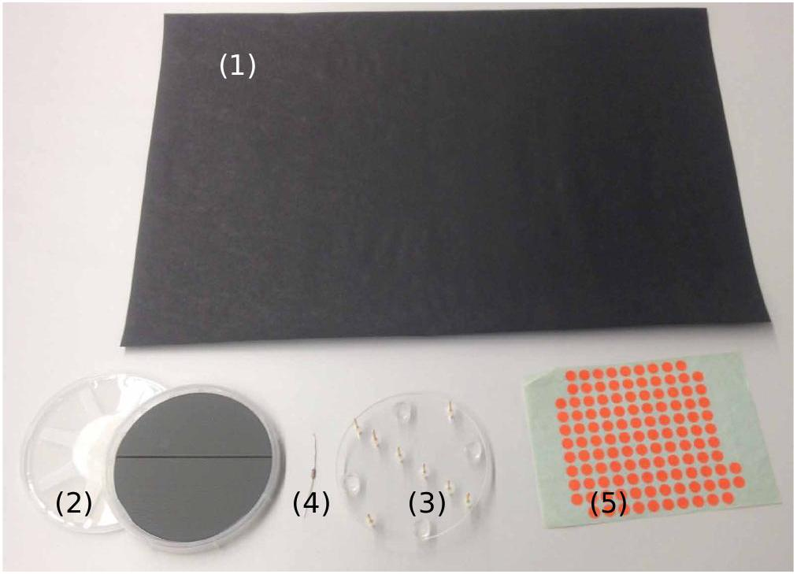
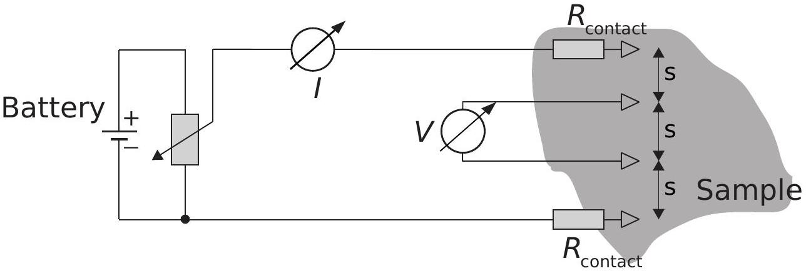
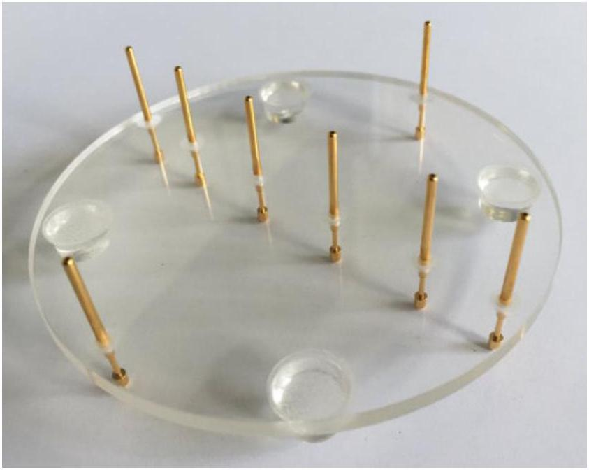
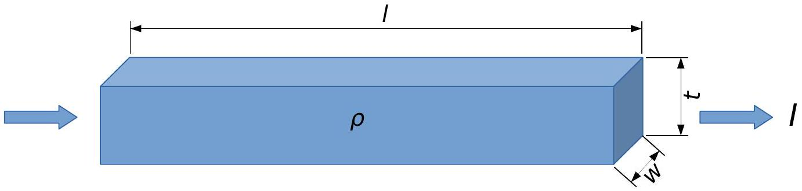
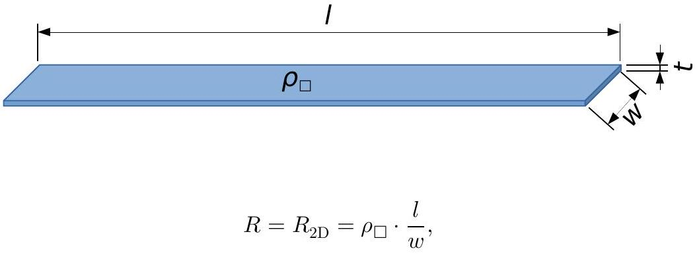
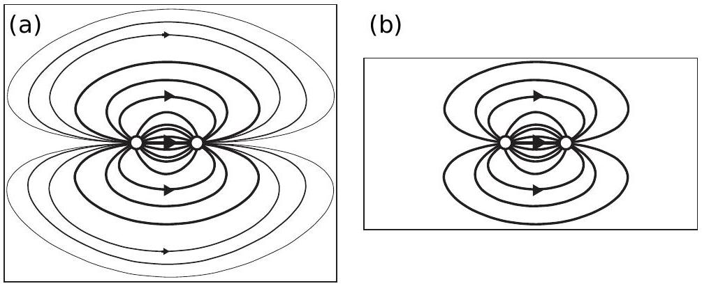
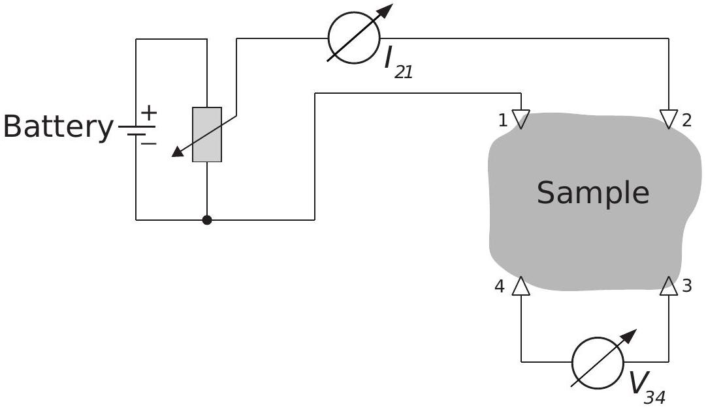
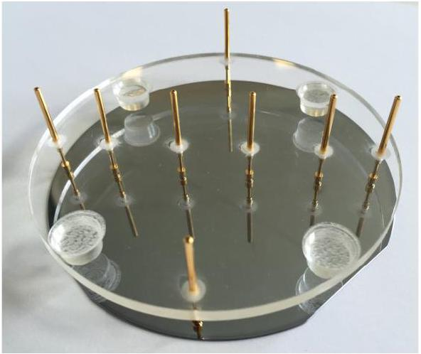

## Electrical conductivity in two dimensions (10 points)

Please read the general instructions in the separate envelope before you start this problem.

Introduction
In the quest to develop next generation devices based on semi-conductor technology like computer chips or solar cells, researchers are looking for materials which exhibit outstanding transport properties, e.g. low electrical resistivity. Measurements of these properties are carried out using samples of finite size, contacts with finite contact resistance and in a special geometry. These effects have to be taken into account in order to extract the true material properties. Moreover, a thin film of the material may behave differently than bulk material.
In this task, we will investigate the measurement of electrical properties. We will use two different definitions:

- Resistance $R$ : The resistance is the electrical property of a sample or device. It is the quantity which we actually measure on a specific sample with given dimensions.
- Resistivity $\rho$ : The resistivity is the material property which determines the resistance. It depends on the material itself and on external parameters like the temperature, but it does not depend on the geometry of the sample.

In particular, we will measure the so-called sheet resistivity. This is the resistivity divided by the thickness of the very thin sheet.
We will explore the influence of the following parameters on the measurement of the electrical resistance of thin layers of material:

- the measurement circuitry,
- the measurement geometry,
- and the sample dimensions.

A sheet of conductive paper and a metal coated silicon wafer will serve as samples.
-

-

"
x x
"
-
"

-

منحدبا -

-

y sams arguan -
burger of per burger sompation burger such surfares the the

## Part A. Four-point-probe (4PP) measurements (1.2 points)

In order to measure the resistivity of a sample precisely, the contacts used for the voltage measurement and the contacts used for current injection should be separated.

This technique is called four-point-probe technique (4PP). The four contacts are arranged into a symmetric geometry that is as simple as possible: The current $I$ flows into the sample through one of the outer contacts (called source), then on all possible paths through the sample and out of the sample through the other contact (drain). In between, the voltage $V$ is measured over a certain path length $s$ on the sample.

Everything becomes quite simple if we have a symmetric setup, i.e. the same distance $s$ between all contacts and the contacts in the center of the sample as shown in following sketch:

The curve $I$ versus $V$ represents the $I-V$-characteristics of the sample and allows the resistance of this sample segment to be determined. In the following we will only use the 4PP technique. To start, we will use the linear equidistant arrangement of four out of the eight probes (contacts) shown in the photograph.

Figure 2: Acrylic glass plate for 4PP measurements, with the four rubber feet and the eight contacts or probes.

For the following measurement, use the whole sheet of conducting paper.

## Q1-4

GAÓ HECH
GAÓ
منح
GAOZHONGSHUXUXUE "
" " RT. 2. atp points "
" н новенностика "
" неникальном но не на -

Part B. Sheet resistivity (0.3 points)
The resistivity $\rho$ represents a material property, by means of which the resistance of a 3D conductor of given dimensions and geometry is calculated. Here we consider a bar of dimensions length $l$, width $w$, and thickness $t$ :

The electrical resistance $R$ of the upper, thick conductor is given by:

$$
R=R_{3 \mathrm{D}}=\rho \cdot \frac{l}{w \cdot t}
$$

On the same basis we may define the resistance of the 2D conductor of thickness $t \ll w$ and $t \ll l$

using the sheet resistivity $\rho_{\square} \equiv \rho / t$ ("rho box"). Its unit is given in Ohms: $\left[\rho_{\square}\right]=1 \Omega$.
Important: Eq. 2 is only valid for a homogeneous current density and constant potential in the crosssectional plane of the conductor. In the case of point-like contacts on the surface this does not hold. Instead one can show that the sheet resistivity is related to the resistance in that case by

$$
\rho_{\square}=\frac{\pi}{\ln (2)} \cdot R
$$

for $l, w \gg t$.

B. 1 Calculate the sheet resistivity $\rho_{\square}$ of the paper from the 4PP measurement in part A. We will call this particular value $\rho_{\infty}$ (and the measured resistance from part A $R_{\infty}$ ) because the sample dimensions of the whole sheet are much larger than the spacing of the contacts $s: l, w \gg s$.

## Q1-6

## Part C. Measurements for different sample dimensions (3.2 points)

Up to now, the finite sample dimensions $w$ and $l$ were not taken into account. If the sample becomes smaller, it can carry less current if the voltage is kept constant: If we apply a voltage between the two point contacts (white circles), current will flow on all possible, non-crossing paths through the sample as visualized by the lines: the longer the line, the smaller the current as indicated by the line thickness. For a small sample (b) and the same applied voltage, the total current decreases because there are less possible pathways. Thus, the measured resistance will increase:

The (sheet) resistivity will not change as function of sample size. Thus, in order to convert the measured resistance into a resistivity using Eq. 3, we need to introduce a correction factor $f(w / s)$ :

$$
\rho_{\square}=\frac{\pi}{\ln (2)} \cdot \frac{R(w / s)}{f(w / s)} .
$$

For a sample of length $l \gg s$ the factor $f$ only depends on the ratio $w / s$ and is larger than 1 : $f(w / s) \geq 1$. For the sake of simplicity we will focus on the dependence on the width $w$ and only ensure that the sample is long enough for our measurements. We assume that the value approaches the correct result $\rho_{\square}$ for large dimensions:

$$
R(w / s)=R_{\infty} \cdot f(w / s) \quad \text { with } \quad f(w / s \rightarrow \infty) \rightarrow 1.0 .
$$

C. 1 Using the 4PP-method, measure the resistance $R(w, s)$ for 4 values $w / s$ within the range 0.3 to 5.0 and record your results in Table C.1. Ensure that the sample length is larger than five times the probe spacing: $l>5 s$ and that the length $l$ of the samples is always taken along the same (long) side of the sheet of paper. For each value of $w / s$ measure the voltage for 4 different current values and calculate the average resistance $R(w / s)$ out of the 4 measurements. Enter your results in Table C.1.

C. 2 Compute $f(w / s)$ for each of these measurements.

## Part D. Geometrical correction factor: scaling law (1.9 points)

You have seen in part C that the measured resistivity scales with the ratio of width to probe distance $w / s$. Starting from the data acquired in part C we choose the following generic function to describe the data

## Q1－7

＂
－
Goomargess of

## Part E. The silicon wafer and the van der Pauw-method (3.4 points)

In the semi-conductor industry, knowledge of the electrical (sheet) resistance of semi-conductors and thin metal layers is very important because it determines the properties of devices. In the following you will work with the silicon wafer. The semi-conducting wafer is coated with a very thin layer of chromium metal (on the shiny side).

Open the wafer container (rotate in the sense of the arrow RELEASE) and take the wafer out. Be careful not to drop or to break it nor to scratch or touch the shiny surface. For the measurements place it on the table with the shiny side point up towards you.

E. 1 Use the same 4PP setup as previously to measure the voltage $V$ as function of 0.4 pt current $I$.
Write down the reference number of your wafer in the Answer Sheet. You find this number on the plastic wafer holder.
E. 2 Plot the data in Graph E. 2 and determine the resistance $R_{4 \mathrm{PP}}$. 0.4pt
E. 3 In order to determine the correction for a circular sample like the wafer, we will approximate the effective width $w$ of the sample by the diameter $D=100 \mathrm{~mm}$ of the wafer. Under this assumption calculate the ratio $w / s$. Use the fit function in Eqn. 6 and your parameters $a$ and $b$ to determine the correction factor $f(w / s)$ for the wafer measurement.
0.2pt
E. 4 Calculate the sheet resistivity $\rho_{\square}$ of the chromium layer using Eq. 4.

In order to measure the sheet resistivity precisely without need for geometrical corrections, Philips engineer L.J. van der Pauw developed a simple measurement scheme: The four probes are mounted at the circumference of a sample of arbitrary shape as shown in the figure (numbered 1 through 4). The current flows through two adjacent probes, e.g. probes 1 and 2, and the voltage is measured between probes 3 and 4. This yields a resistance value $R_{I, V}=R_{21,34}$.

For symmetry reasons $R_{21,34}=R_{34,21}$ and $R_{14,23}=R_{23,14}$. Van der Pauw showed that for an arbitrary but

## Q1-9

$$
3
$$

никалогонананогомананогоном HECN

никаمنح منح

" настонк настрий trans
" праненикатованствитьстваной себ деляет
и натокация по нато поканика са GAÓ
" настонких настьющий на GAÓ HECNMP
"о печених на GAÓ "
