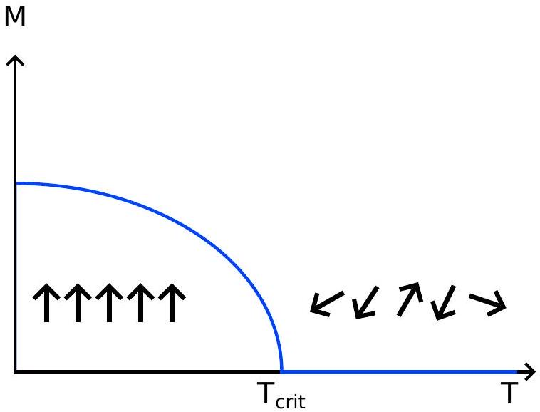
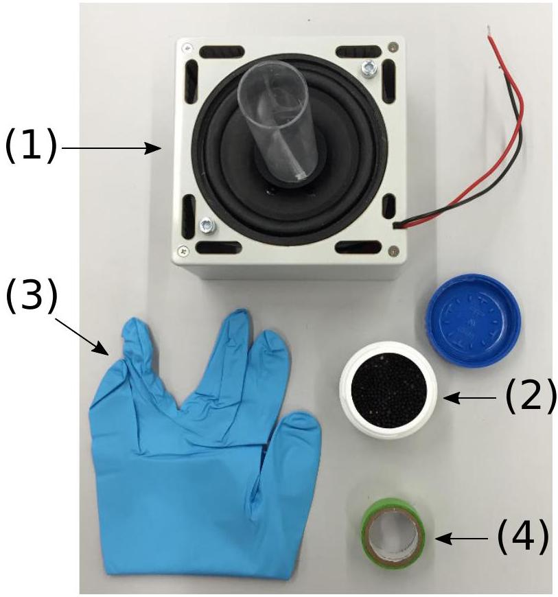

## Jumping beads - A model for phase transitions and instabilities (10 points)

Please read the general instructions in the separate envelope before you start this problem.

Introduction

Phase transitions are well known from every day life, e.g. water takes different states like solid, liquid and gaseous. These different states are separated by phase transitions, where the collective behaviour of the molecules in the material changes. Such a phase transition is always associated with a transition temperature, where the state changes, i.e. the freezing and boiling temperatures of water in the above examples.

Phase transitions are however even more wide-spread and also occur in other systems, such as magnets or superconductors, where below a transition temperature the macroscopic state changes from a paramagnet to a ferromagnet and a normal conductor to a superconductor, respectively.

All of these transitions can be described in a common framework when introducing a so-called orderparameter. For instance, in magnetism the order parameter is associated with the alignment of the magnetic moments of the atoms with a macroscopic magnetisation.

In the so-called continuous phase transitions, the order parameter will always be zero above the critical temperature and then grow continuously below it, as shown in the schematic for a magnet in figure 1 below. The transition temperature of a continuous phase transition is called the critical temperature. The figure also contains a schematic representation of the microscopic order or disorder in the case of a magnet, where the individual magnetic moments align in the ferromagnetic state to give rise to a macroscopic magnetization, whereas they are randomly oriented in the paramagnetic phase yielding a macroscopic magnetization of zero.

Figure 1: Schematic representation of the temperature dependence of an order parameter $M$ at a phase transition. Below the critical temperature $T_{\text {crit }}$, the order parameter grows and is non-zero, whereas it is equal to zero at temperatures above $T_{\text {crit }}$.

For continuous phase transitions, one generally finds that the order parameter close to a transition follows a power-law, e.g. in magnetism the magnetization $M$ below the critical temperature, $T_{\text {crit }}$, is given
"
指拜
Goous □
"
ника-кипника- ansmany
никай atp of surg the pounct of answer
Georle денаних на "
Gounctanctor
"

"

S
"
-

-

منح GAOZHONGSHUXUXUE -
منحاتar -
никай "
ன்ன்றோரு منح никай answers
منح nonewore

## Q2-4

## Part A. Critical excitation amplitude (3.3 points)

Before you start the actual tasks of this problem, wire up the loudspeaker to the terminals on the side of the signal generator (make sure you use the correct polarity). Put some (e.g. 50) poppy seeds into the cylinder mounted on the loudspeaker and use a piece cut from the glove provided to close the cylinder at the top in order to keep the poppy seeds in the cylinder. Switch on the excitation using the toggle switch and adjust the amplitude by turning the right potentiometer labeled speaker amplitude (4) by means of the screwdriver provided. Observe the sorting of the beads by testing different amplitudes.

The first task is to determine the critical excitation amplitude of this transition. In order to do this, you have to determine the number of beads $N_{1}$ and $N_{2}$ in the two compartments (choosing the compartment labels such that $N_{1} \leq N_{2}$ ) as a function of the displayed amplitude $A_{D}$, which is the voltage measured at the speaker amplitude socket (6). This voltage is proportional to the amplitude of the saw-tooth waveform driving the loudspeaker. Make at least 5 measurements per voltage.

Hint:

- In order to always have a motion in the particles you study, only investigate amplitudes corresponding to speaker amplitude voltages exceeding 0.7 V. Start with watching the behaviour of the system just by varying the voltage slowly without any counting of he beads. It can be that some of the beads stick to the ground due to electrostatic reasons. Don't count these beads.
A. 1 Record your measurements of the number of particles $N_{1}$ and $N_{2}$ in each half 1.2pt of the container for various amplitudes $A_{D}$ in Table A.1.
A. 2 Calculate the standard deviation of your measurements of $N_{1}$ and $N_{2}$ and list 1.1pt your results in Table A.1. Plot $N_{1}$ and $N_{2}$ as a function of the displayed amplitude $A_{D}$ in Graph A.2, including their uncertainties.
A. 3 Based on your graph, determine the critical displayed amplitude $A_{D, \text { crit }}$ at which 1pt $N_{1}=N_{2}$, after waiting until a stationary state is reached.

## Part B. Calibration (3.2 points)

The displayed amplitude $A_{D}$, corresponds to a voltage applied to the loudspeaker. However, the physically interesting quantity is the maximum displacement $A$ of the oscillation of the loudspeaker, since this relates to how strongly the beads are excited. Therefore, you need to calibrate the displayed amplitude. For this purpose, you can use any of the provided material and tools.

B. 1 Sketch the setup you use to measure the excitation amplitude, i.e. the maxi- 0.5pt mum travel distance $A$ (in mm) of the loudspeaker in one period of oscillation.
B. 2 Determine the amplitude $A$ in mm for a suitable number of points, i.e. record the amplitude $A$ as a function of displayed amplitude $A_{D}$ in Table B. 2 and indicate the uncertainties of your measurements.

" " T's HAMM
" настонаниканика столькующем

Part C. Critical exponent (3.5 points)
In our system, the temperature corresponds to the input kinetic energy of the excitation. This energy is proportional to the speed squared of the loudspeaker, i.e. to $v^{2}=A^{2} f^{2}$, where $f$ is the frequency of the oscillation. We will now test this dependence and determine the exponent $b$ of the power-law governing the behavior of the order parameter (see Eq. 1).

C. 1 The imbalance $\left|\frac{N_{1}-N_{2}}{N_{1}+N_{2}}\right|$ is a good candidate for an order parameter for our system in that it is zero above the critical amplitude and equal to 1 at low excitation. Determine this order parameter as a function of the amplitude $A$. Record your results in the Table C.1.
C. 2 Plot the imbalance $\left|\frac{N_{1}-N_{2}}{N_{1}+N_{2}}\right|$ as a function of $\left|A_{\text {crit }}^{2}-A^{2}\right|$, in Graph C.2, where both
C. 2 Plot the imbalance $\left|\frac{N_{1}-N_{2}}{N_{1}+N_{2}}\right|$ as a function of $\left|A_{\text {crit }}^{2}-A^{2}\right|$, in Graph C.2, where both axes have logarithmic scales (double-logarithmic plot). You can use the Table axes have logarithmic scales (double-logarithmic plot). You can use the Table C. 1 for your calculations. The points on the plot may seem not to obey a linear C. 1 for your calculations. The points on the plot may seem not to obey a linear relation, but a linear regression should be made nevertheless, to match the relation, but a linear regression should be made nevertheless, to match the critical exponent formula. critical exponent formula.
C. 3 Determine the exponent $b$ and estimate the error. 1.4pt
