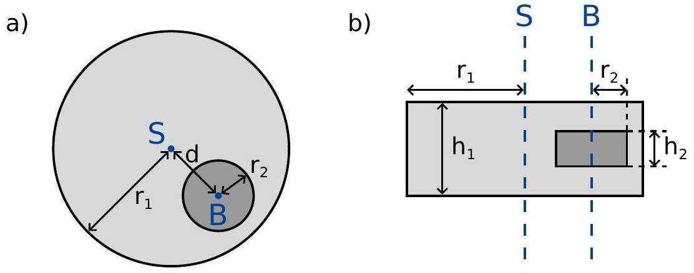
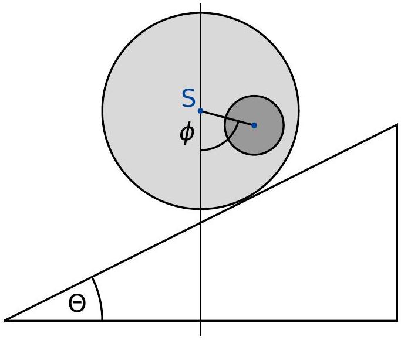
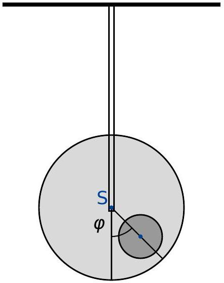
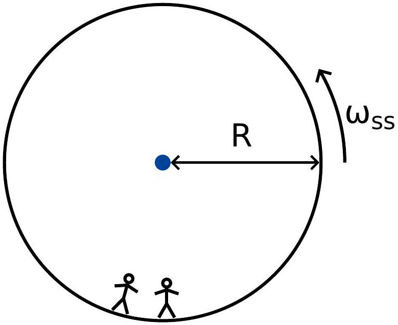
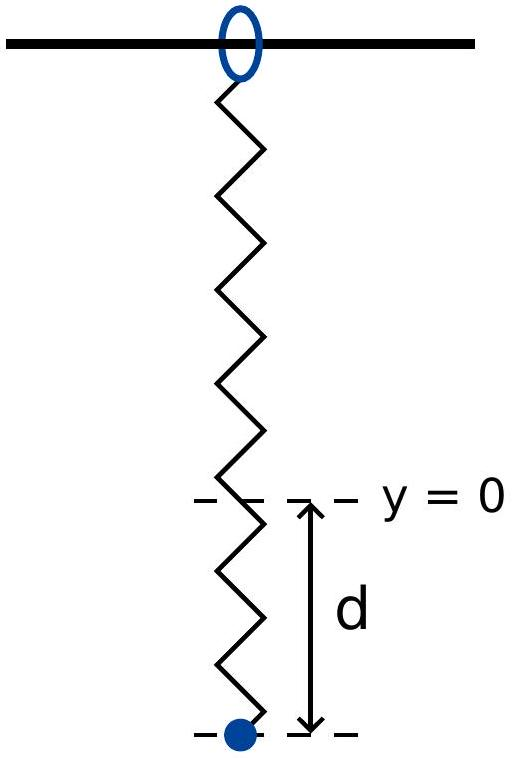

## Two Problems in Mechanics (10 points)

Please read the general instructions in the separate envelope before you start this problem.
Part A. The Hidden Disk (3.5 points)
We consider a solid wooden cylinder of radius $r_{1}$ and thickness $h_{1}$. Somewhere inside the wooden cylinder, the wood has been replaced by a metal disk of radius $r_{2}$ and thickness $h_{2}$. The metal disk is placed in such a way that its symmetry axis $B$ is parallel to the symmetry axis $S$ of the wooden cylinder, and is placed at the same distance from the top and bottom face of the wooden cylinder. We denote the distance between $S$ and $B$ by $d$. The density of wood is $\rho_{1}$, the density of the metal is $\rho_{2}>\rho_{1}$. The total mass of the wooden cylinder and the metal disk inside is $M$.
In this task, we place the wooden cylinder on the ground so that it can freely roll to the left and right. See Fig. 1 for a side view and a view from the top of the setup.
The goal of this task is to determine the size and the position of the metal disk.
In what follows, when asked to express the result in terms of known quantities, you may always assume that the following are known:

$$
r_{1}, h_{1}, \rho_{1}, \rho_{2}, M .
$$

The goal is to determine $r_{2}, h_{2}$ and $d$, through indirect measurements.

Figure 1: a) side view b) view from above

We denote $b$ as the distance between the centre of mass $C$ of the whole system and the symmetry axis $S$ of the wooden cylinder. In order to determine this distance, we design the following experiment: We place the wooden cylinder on a horizontal base in such a way that it is in a stable equilibrium. Let us now slowly incline the base by an angle $\Theta$ (see Fig. 2). As a result of the static friction, the wooden cylinder can roll freely without sliding. It will roll down the incline a little bit, but then come to rest in a stable equilibrium after rotating by an angle $\phi$ which we measure.

Figure 2: Cylinder on an inclined base.

A. 1 Find an expression for $b$ as a function of the quantities (1), the angle $\phi$ and the 0.8pt tilting angle $\Theta$ of the base.

From now on, we can assume that the value of $b$ is known.

Figure 3: Suspended system.

Next we want to measure the moment of inertia $I_{S}$ of the system with respect to the symmetry axis $S$. To this end, we suspend the wooden cylinder at its symmetry axis from a rigid rod. We then turn it away from its equilibrium position by a small angle $\varphi$, and let it go. See figure 3 for the setup. We find that $\varphi$ describes a periodic motion with period $T$.

" настокатической gthal রমে GAOZM

никай g

" нениканиканиканости " th samp "
" неметрической прогреста сто
" неникай GAOZNONATIENS

никти口-калогический atp

" нестро прямоугольника (т) никти口-

никай никти-кай atp денимин не J

" ненктиранта GAOZM
" н

никай ன ன

-

- притающаными GAOZHONGSHUXUXUEL GAOZHONGSHUXUXUE

"
Осень ன GAOZH PHOMON
ன

$$
\theta
$$

十又
"
никай منكني nomewer

" "ણ " " никти-кай atp GAÓ

ослемаямомногонантий Graphas

и новенностиканикай по "

ногонанта منح ate servent ник новом منح y

" ноконатической "
    до новом asker
    ன "

Alice and Bob continue to argue.
