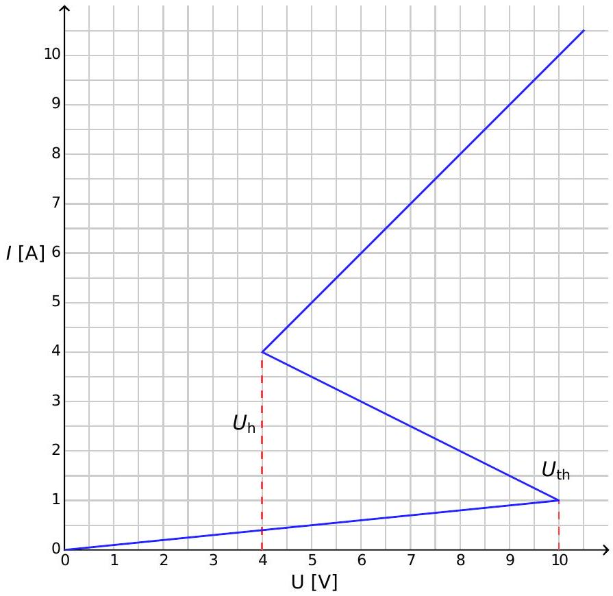
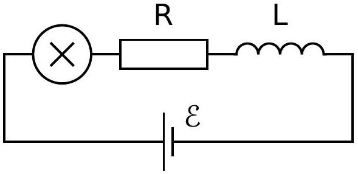
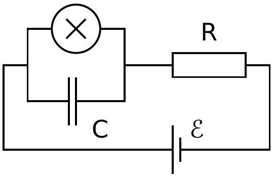
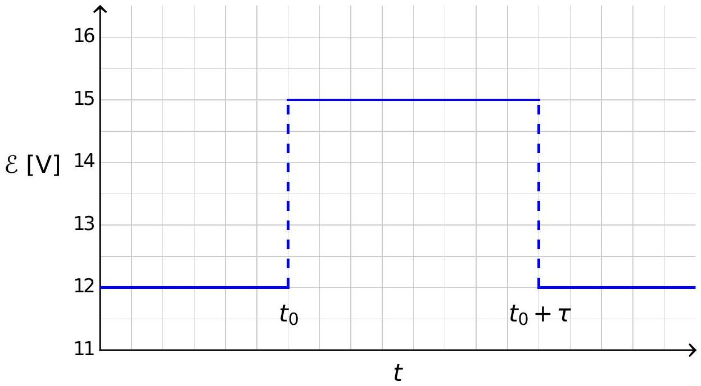

## Nonlinear Dynamics in Electric Circuits (10 points)

Please read the general instructions in the separate envelope before you start this problem.

Introduction
Bistable non-linear semiconducting elements (e.g. thyristors) are widely used in electronics as switches and generators of electromagnetic oscillations. The primary field of applications of thyristors is controlling alternating currents in power electronics, for instance rectification of AC current to DC at the megawatt scale. Bistable elements may also serve as model systems for self-organization phenomena in physics (this topic is covered in part B of the problem), biology (see part C) and other fields of modern nonlinear science.

Goals
To study instabilities and nontrivial dynamics of circuits including elements with non-linear $I-V$ characteristics. To discover possible applications of such circuits in engineering and in modeling of biological systems.

Part A. Stationary states and instabilities (3 points)
Fig. 1 shows the so-called S-shaped $I-V$ characteristics of a non-linear element $X$. In the voltage range between $U_{\mathrm{h}}=4.00 \mathrm{~V}$ (the holding voltage) and $U_{\mathrm{th}}=10.0 \mathrm{~V}$ (the threshold voltage) this $I-V$ characteristics is multivalued. For simplicity, the graph on Fig. 1 is chosen to be piece-wise linear (each branch is a segment of a straight line). In particular, the line in the upper branch touches the origin if it is extended. This approximation gives a good description of real thyristors.

Figure 1: $I-V$ characteristics of the non-linear element $X$.

" " " □ GAOZM
$$
=
$$
никалогий

никай

" наструктировантатика " GAÓ "

конт покалениками any GAOZHONGSHUXUXUEL

" н неникальнокими (" GAOZE

доказаниманоманий asper so some the ascripor at никух за منح

atton

" grapt
" the the
" th th att att dow dow astate astate
" "
- att her the the

" th ate seconsate semgress asket some "
" -
attox
atp semg. semg semg. sembrancies m
нин н semorrent burger stries burger some assamer "

ного новогонанатомнений

" "ребой пря по на HECH
"
