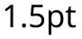
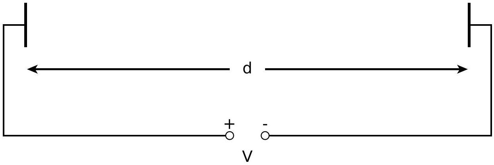
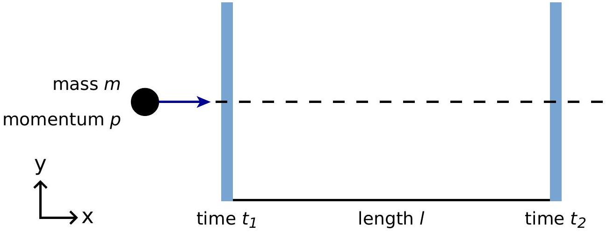
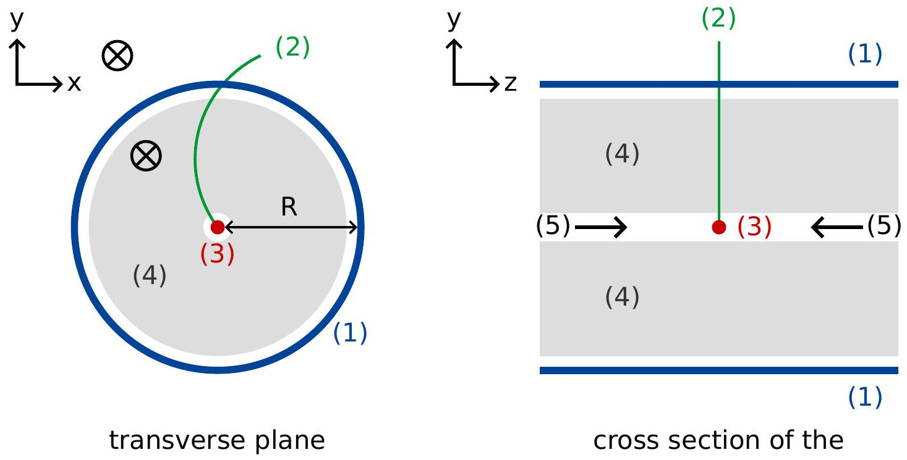
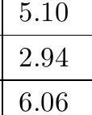

## Large Hadron Collider (10 points)

Please read the general instructions in the separate envelope before you start this problem.
In this task, the physics of the particle accelerator LHC (Large Hadron Collider) at CERN is discussed. CERN is the world's largest particle physics laboratory. Its main goal is to get insight into the fundamental laws of nature. Two beams of particles are accelerated to high energies, guided around the accelerator ring by a strong magnetic field and then made to collide with each other. The protons are not spread uniformly around the circumference of the accelerator, but they are clustered in so-called bunches. The resulting particles generated by collisions are observed with large detectors. Some parameters of the LHC can be found in table 1.

| LHC ring |  |
| :--- | :--- |
| Circumference of ring | 26659 m |
| Number of bunches per proton beam | 2808 |
| Number of protons per bunch | $1.15 \times 10^{11}$ |
| Proton beams |  |
| Energy of protons | 7.00 TeV |
| Centre of mass energy | 14.0 TeV |

Table 1: Typical numerical values of relevant LHC parameters.

Particle physicists use convenient units for the energy, momentum and mass: The energy is measured in electron volts [eV]. By definition, 1 eV is the amount of energy gained by a particle with elementary charge, e, moved through a potential difference of one volt $\left(1 \mathrm{eV}=1.602 \cdot 10^{-19} \mathrm{~kg} \mathrm{~m}^{2} \mathrm{~s}^{-2}\right)$.

The momentum is measured in units of $\mathrm{eV} / c$ and the mass in units of $\mathrm{eV} / c^{2}$, where $c$ is the speed of light in vacuum. Since 1 eV is a very small quantity of energy, particle physicists often use $\mathrm{MeV}\left(1 \mathrm{MeV}=10^{6} \mathrm{eV}\right)$, $\mathrm{GeV}\left(1 \mathrm{GeV}=10^{9} \mathrm{eV}\right)$ or $\mathrm{TeV}\left(1 \mathrm{TeV}=10^{12} \mathrm{eV}\right)$.

Part A deals with the acceleration of protons or electrons. Part B is concerned with the identification of particles produced in the collisions at CERN.

Part A. LHC accelerator (6 points)

Acceleration:

Assume that the protons have been accelerated by a voltage $V$ such that their velocity is very close to the speed of light and neglect any energy loss due to radiation or collisions with other particles.

A. 1 Find the exact expression for the final velocity $v$ of the protons as a function of 0.7pt the accelerating voltage $V$, and physical constants.

A design for a future experiment at CERN plans to use the protons from the LHC and to collide them with electrons which have an energy of 60.0 GeV.

" " P30 Ray p amp ameration

"年нановости

" н
ன mork T

-

" наслежанахостичного "

никаимисаний answers

к ного некретовнонтиканой GAO

-

как ன "
" " Tocal Came 

## Part B. Particle Identification (4 points)

Time of flight:
It is important to identify the high energy particles that are generated in the collision in order to interpret the interaction process. A simple method is to measure the time $(t)$ that a particle with known momentum needs to pass a length $l$ in a so-called Time-of-Flight (ToF) detector. Typical particles which are identified in the detector, together with their masses, are listed in table 2.

| Particle | Mass $\left[\mathrm{MeV} / \mathrm{c}^{2}\right]$ |
| :--- | :--- |
| Deuteron | 1876 |
| Proton | 938 |
| charged Kaon | 494 |
| charged Pion | 140 |
| Electron | 0.511 |

Table 2: Particles and their masses.

Figure 2: Schematic view of a time-of-flight detector.

B. 1 Express the particle mass $m$ in terms of of the momentum $p$, the flight length $l$ and the flight time $t$, assuming that particles have elementary charge $e$ and travel with velocity close to $c$ on straight tracks in the ToF detector and that they travel perpendicular to the two detection planes (see figure 2).

## Q3－5

＂＂ણ 10 R nome дея ноном ate nevent

ника－ nongus atp

"
"
"
"
"
"

никай poople GAOZHONGSHUXUXUE GAOZHONGSHUXUE

" наструктировающаемность Get "

" منحدبا

|  | " |
| :--- | :--- |
| ${ }_{2}$ |  |

Theory
English (Official)
B. 4 Identify the four particles by calculating their mass. 0.8pt
