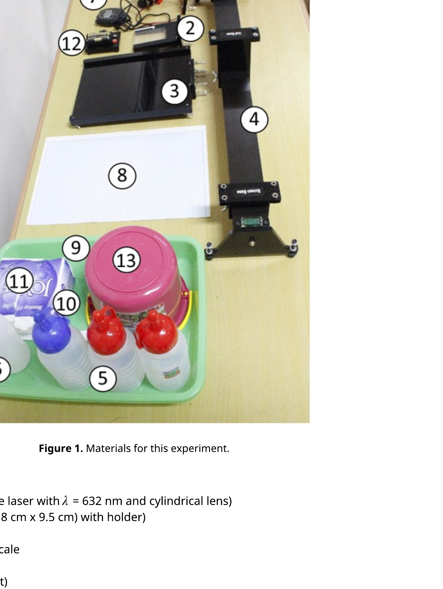
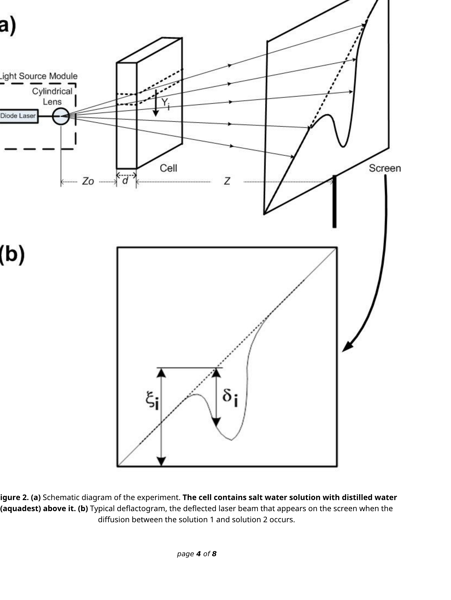

## Determination of Refractive Index Gradient and Diffusion Coefficient of Salt Solution from Laser Deflection Measurement

## I. Introduction

Diffusion is a process involving random walk of atoms or molecules leading a system towards its thermodynamic equilibrium. For instance, if a vessel contains a mixture of water and a salt solution, there will be a diffusive flux of salt molecules from regions of high salt concentration towards regions of lower salt concentration. The diffusion rate is characterized by the diffusion coefficient $D$. Diffusion plays a major role in a wide range of processes, from biochemistry to astrophysics. In the following experimental problem, diffusion of salt molecules is studied. Salt molecules will move diffusively from a salt solution towards the region with distilled water, creating a transition layer of variable salt concentration. The refraction index of this solution depends on the salt concentration. Therefore, we can study diffusion process through optical experiments using laser beam deflection method.

## II. Objectives

1. To determine the diffusion coefficient of salt-water solution in water by measuring the gradient of refractive index.
2. To determine the rate of change of the diffusion coefficient to the change of salt solution concentrations.

## III. List of Materials

Figure 1. Materials for this experiment.

1. Line Laser Module (Diode laser with $\lambda=632 \mathrm{~nm}$ and cylindrical lens)
2. Diffusion cell ( $6.5 \mathrm{~cm} \times 0.8 \mathrm{~cm} \times 9.5 \mathrm{~cm}$ ) with holder)
3. Screen with holder
4. Optical rail with length scale
5. Salt-water Solutions
6. Distilled Water (Aquadest)
7. Stopwatch
8. Paper with scale (block millimeter paper)

## Experiment

English (Official)
E1
9. Pipette (dropper)
10. Knife + Tissue for cleaner
11. Tissue
12. Battery
13. Buckets as waste container of salt and water solution

The schematic diagram of the experimental set-up can be seen in Figure 2.

Figure 2. (a) Schematic diagram of the experiment. The cell contains salt water solution with distilled water (aquadest) above it. (b) Typical deflactogram, the deflected laser beam that appears on the screen when the diffusion between the solution 1 and solution 2 occurs.

## Experiment

English (Official)
E1

To obtain a profile of the refractive index gradient as a function of vertical position in the fluid we must relate the vertical position on the screen $(\xi)$ to the vertical height in the cell $(Y)$, and relate the vertical deflection $(\delta)$ to the gradient of refractive index $(d n / d Y)$. From the geometry of the experimental setup (see Figure 2) we have:

$$
Y_{i}=\frac{\xi_{i} Z_{0}}{Z_{0}+d+Z}
$$

where $Z_{0}, Z$ and $d$ that are shown in Figure 2(a) denote the distance between the light source module and the diffusion cell, the distance between the diffusion cell and the screen, and the diffusion cell's thickness, respectively. For measuring $Z_{0}$, the line marked on the laser module stand indicates the position of the cylindrical lens.

The thickness of the cell (d) and the refractive index gradient are both small enough so that the refraction produces negligible vertical displacement of the ray within the cell. In this limit each ray travels at nearly constant vertical height within the cell and is deflected by a single refractive gradient associated with this height.

It can be shown that:

$$
\left(\frac{d n}{d Y}\right)_{i}=\frac{\delta_{i}}{Z d}
$$

## Experimental Procedures:

- In order to obtain the deflected laser trace on the screen (as in Figure 2b) you must assemble all the components depicted in Figure 1 by following the schematic shown in Figure 2(a).
- Ensure that the laser is on and its spot and its projection on the screen have diagonal form when it hits perpendicularly the diffusion cell. You may adjust $Z, Z_{0}$, and the focal length of the laser (by rotating the back of the laser) in order to obtain a bright and focussed line. You can also adjust the direction of the diagonal line on the screw by rotating the laser as a whole (release the laser using the screw on top). In the condition without any water or salt solutions you will see the straight diagonal laser beam.
- Deflected laser trace will appear when the two different solutions are diffusively mixed. Ensure that you pour the salt solution first into the diffusion cell container up to the limit which is marked by white line. Drop the water into the container slowly about 40 drops down the side channel using a pipette, after which you may turn on the stop watch to measure the evolution time of diffusion profile. If the set up of $Z, Z_{0}$ and the height of the laser are already optimized, the deflacted laser trace on the screen will be centered, clear and the depth of the dip as large as possible. You need to find this optimum set-up in order to minimize the error of the measurement.
- After the evolution time of 30 minutes you may draw the laser trace into millimeter block paper attached to the screen using a pencil. Note that in this experiment, you will be asked to do the measurement for 3 different salt solution concentrations (i.e. $C_{0}=23 \mathrm{~g} / 150 \mathrm{ml}, C_{0}=28 \mathrm{~g} / 150 \mathrm{ml}$ and $C_{0}=33 \mathrm{~g} / 150 \mathrm{ml}$ ) so that you need to replace the millimeter block frequently. The millimeter block paper should be inserted to the screen and it can be loosen or tighten by rotating the screw attached in the corner of the screen.
- Please make sure that you have written your student code number and the concentration of the solution that you used on this millimeter block paper.

## IV. Experiments and Tasks

## A: Measurement of Refractive Index Gradient of Salt Water Solution (4.5 points)

You need to perform the steps below for all three salt concentration. Note that no error estimation is needed.

| A. 1 | Perform the experiment to obtain the deflected laser trace on the screen. Duplicate the laser trace into the millimeter block paper attached to the screen using a pencil for evolution time of the diffusion ( $t$ ) of 30 minutes. | 1.2 pt. |
| :--- | :--- | :--- |
| A. 2 | Measure $Z, d, Z_{0}, \xi_{i}$ and $\delta_{i}$ (with $i=1, \ldots, 20$, are the data points corresponding to different horizontal position) from the laser trace in the millimeter block for evolution time of the diffusion $(t)$ of 30 minutes. The parameters $Z, d, Z_{0}, \xi_{i}$ and $\delta_{i}$ are stated in cm . Note that $Z, d$ and $Z_{0}$ are the same for all measurement. Record the results in the Table 1. | 1.5 pt. |
|  | Calculate $Y_{i}$ and $\left(\frac{d n}{d Y}\right)_{i}$ (with $i=1, \ldots, 20$, are the data points) for duration time of |  |

| A. 3 | diffusion ( $t$ ) of 30 minutes. Note that $Z, d$ and $Z_{0}$ are the same for all measurement. Record the results in Table 2. Plot $\left(\frac{d n}{d Y}\right)_{i}$ vs. $Y_{i}$ for $t=30$ minutes. | 1.5 pt. |
| :--- | :--- | :--- |
| A. 4 | Determine the $Y_{i}$ at $\left(\frac{d n}{d Y}\right)_{i}$ maximum obtained from question A3. Assign this $Y_{i}$ as $h$. | 0.3 pt . |

## B: Determination of Diffusion Coefficient ( $\mathbf{4 . 2}$ points)

The curves found from question A. 3 can be fitted using the following equations:

$$
\begin{aligned}
\left(\frac{d n}{d Y}\right)_{i} & =\left(\frac{d n}{d C}\right)\left(\frac{d C}{d Y}\right)_{i} \\
\left(\frac{d C}{d Y}\right)_{i} & \approx \frac{C_{o}}{2 \sqrt{\pi D t}} e^{-\frac{\left(h-Y_{i}\right)^{2}}{4 D t}}
\end{aligned}
$$

where $C, C_{0}, D, t, h$ denoted as concentration, initial salt solution concentration, diffusion coefficient, duration time of diffusion, and $Y_{i}$ at maximum of refractive index gradient ( $d n / d Y$ ), respectively. Note that ( $d n / d C$ ) is constant. The diffusion coefficient can be obtained by using equations (3) and (4) to form a linear relation between $(d n / d Y)_{i}$ and $Y_{i}$.

| B. 1 | Based on Eqns $(3,4)$, find such functions $f\left(\frac{d n}{d Y}\right)$ and $g(Y)$ that the dependence between $f\left(\frac{d n}{d Y}\right)$ and $g(Y)$ would be linear. | 0.9 pt. |
| :--- | :--- | :--- |
| B. 2 | Make a table (Table 3 in the answer sheet) that contains the data points, abscissa axis, ordinate axis of linear equation from B1 for dataset taken from Tasks A. Plot this table. | 1.8 pt . |
| B. 3 | Determine the diffusion coefficient $D$ from linear plot obtained from B2 for data set at $t=30$ minutes. Note that linear dependence may hold only for a subrange of your data. | 1.5 pt . |

## C. Nonlinear diffusion (1.3 points)

| C. 1 | The analysis above is based on the assumption that $D$ is independent of $C$. If this is not true, we have so-called nonlinear diffusion. However, near the maximum of $\frac{d n}{d Y}$ we can consider this as an ordinary diffusion, with diffusion coefficient corresponding to the local value of concentration. Determine the rate of change of the diffusion coefficient with the change of salt solution concentration graphically using data from part B. | 1.3 pt. |
| :--- | :--- | :--- |
