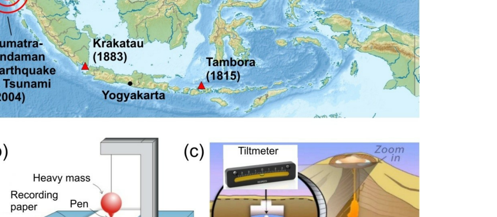
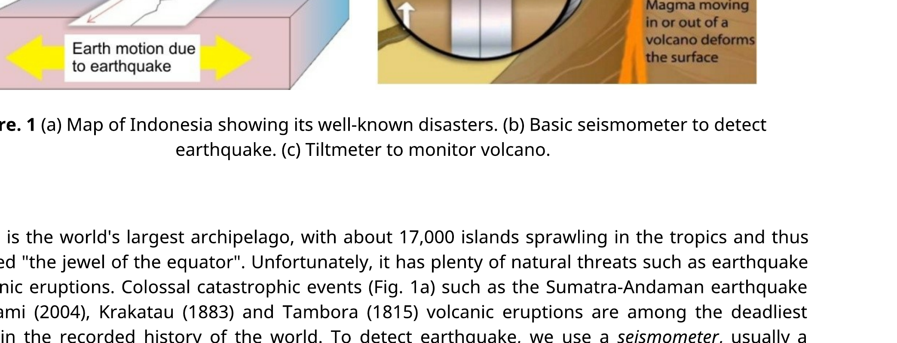
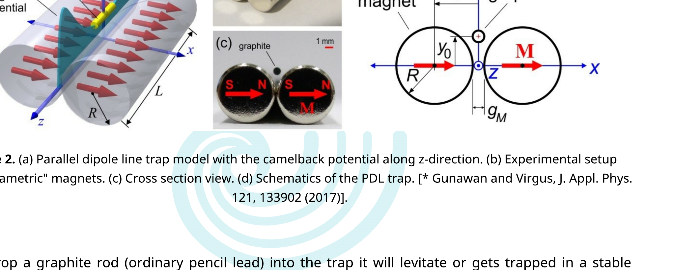
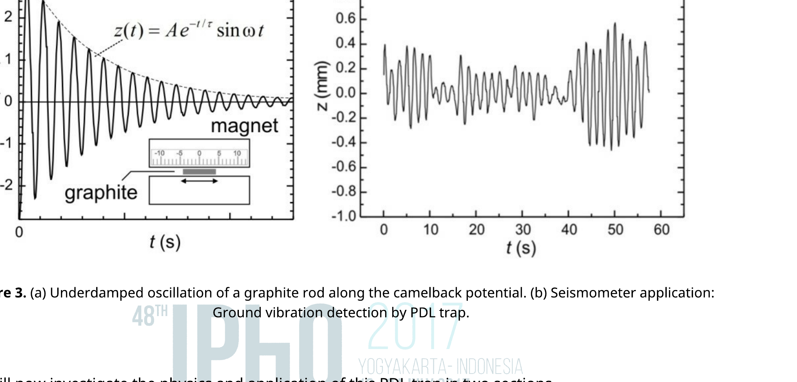
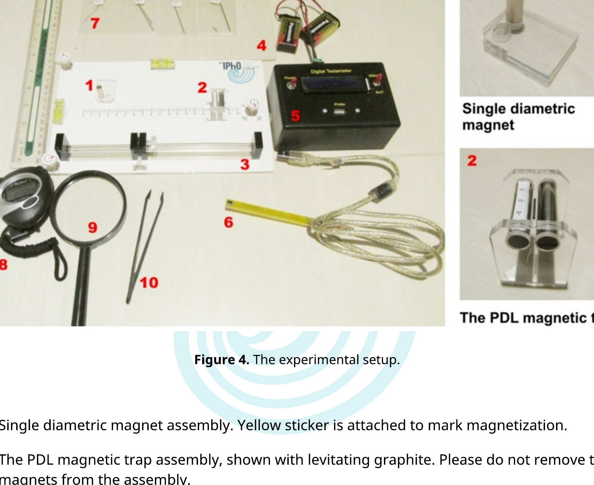
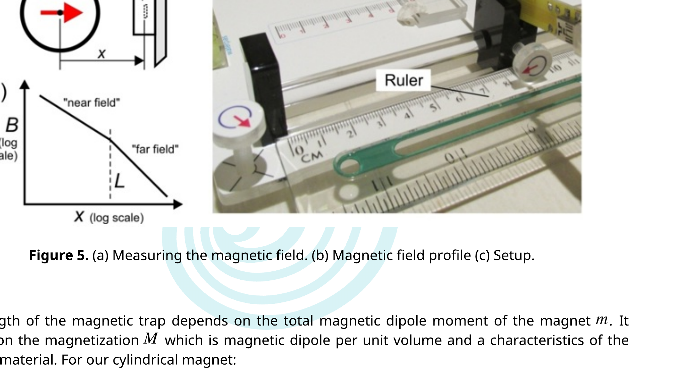
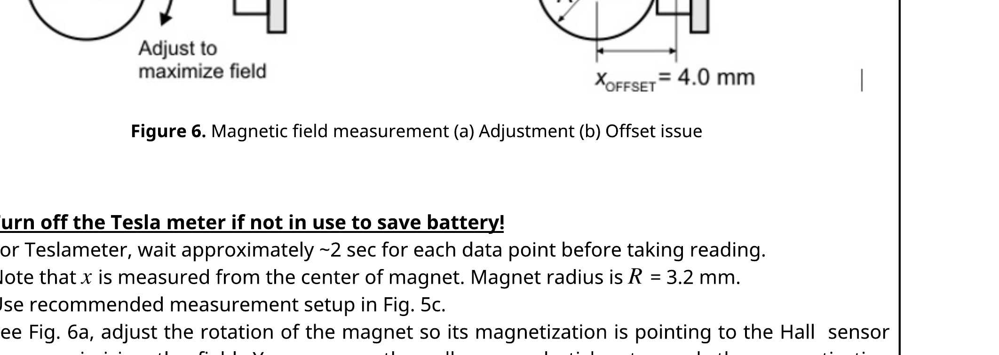
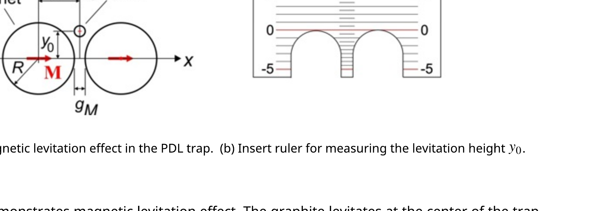
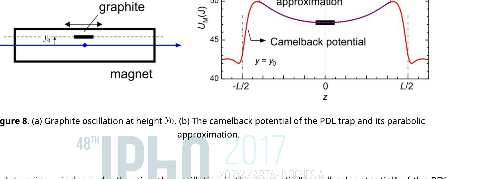
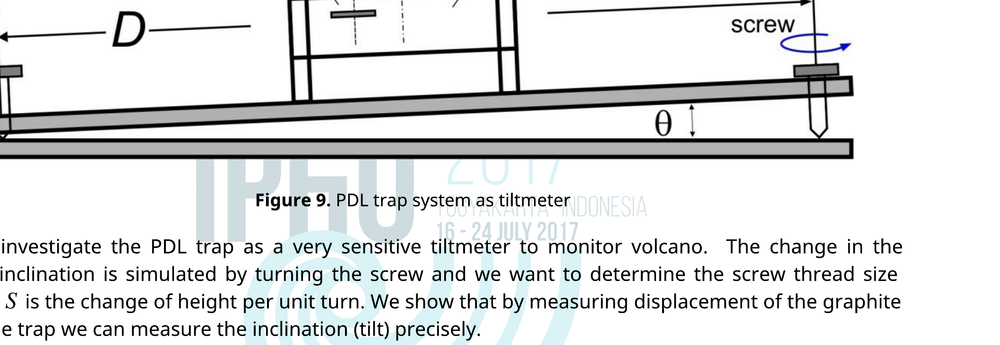

## Parallel Dipole Line Magnetic Trap for Earthquake and Volcanic Sensing

## A. Introduction

Figure. 1 (a) Map of Indonesia showing its well-known disasters. (b) Basic seismometer to detect earthquake. (c) Tiltmeter to monitor volcano.

Indonesia is the world's largest archipelago, with about 17,000 islands sprawling in the tropics and thus often called "the jewel of the equator". Unfortunately, it has plenty of natural threats such as earthquake and volcanic eruptions. Colossal catastrophic events (Fig. 1a) such as the Sumatra-Andaman earthquake and tsunami (2004), Krakatau (1883) and Tambora (1815) volcanic eruptions are among the deadliest disasters in the recorded history of the world. To detect earthquake, we use a seismometer, usually a pendulum-based system to measure the ground displacement or acceleration (Fig. 1b). To monitor volcano, we use tiltmeter to detect a change in ground inclination due to underground magma movement (Fig. 1c). In this problem we will explore the physics and applications of a new kind of magnetic trap and sensor called Parallel Dipole Line (PDL) trap system - for sensing earthquake and to monitor volcano.

Parallel dipole line system is an arrangement of two linear distribution of magnetic dipole (also called $a$
dipole line) as shown in Fig. 2. Recently two Indonesian physicists discovered a very interesting effect in this system: if the length of the dipole line is longer than certain critical length the magnetic field becomes stronger on the edges which produces a "camelback potential" as shown in Fig. 2a.* This "camelback effect" is important as it enables this system to serve as a new type of magnetic trap called Parallel Dipole Line (PDL) trap. Experimentally we can realize this PDL trap using a pair of diametric magnets i.e. a cylinder magnets with magnetization along diameter as shown in Fig. 2c where the north and south poles are on the curved sides instead of the flat faces.

Figure 2. (a) Parallel dipole line trap model with the camelback potential along z-direction. (b) Experimental setup using "diametric" magnets. (c) Cross section view. (d) Schematics of the PDL trap. [* Gunawan and Virgus, J. Appl. Phys. 121, 133902 (2017)].

If we drop a graphite rod (ordinary pencil lead) into the trap it will levitate or gets trapped in a stable condition. This occurs because in $x$-direction the graphite is repelled by the magnets from both sides and in vertical ( $y$ ) direction the magnetic repulsion force balance the gravity making it levitates at height $y_{0}$ (Fig. 2d). In longitudinal direction ( $z$ ) the camelback potential holds the graphite stable.

The camelback potential of the magnetic trap serves as a one-dimensional oscillator. If you give a little perturbation along the $z$-axis to the graphite rod, it will exhibit underdamped oscillation as shown in Fig. 3a. This PDL trap can be used as a sensitive seismometer. If the ground underneath shakes, the graphite rod tends to remain stable and its relative displacement (Fig. 3b) is the "earthquake" signal. Similarly, it can also be used as sensitive tiltmeter: if you tilt the trap slightly, the graphite rod will move significantly without any friction.

Figure 3. (a) Underdamped oscillation of a graphite rod along the camelback potential. (b) Seismometer application: Ground vibration detection by PDL trap.
We will now investigate the physics and application of this PDL trap in two sections.

## Section A: Basic characteristics

(1) Determination of the magnet's magnetization $M$ ( 2.5 pt .)
(2) Magnetic levitation and magnetic susceptibility $\chi$ ( 1.0 pt .)
(3) The camelback potential oscillation and magnetic susceptibility $\chi$ ( 1.0 pt .)
(4) Oscillator quality factor $Q$ and determination of air viscosity $\mu_{A}$ ( 3.0 pt .)

## Section B: Applications

(5) PDL Trap Seismometer (0.5 pt.)
(6) PDL Trap Tiltmeter ( 2.0 pt .)

## B. Apparatus

Figure 4. The experimental setup.

Figure 4. The experimental setup.

1. Single diametric magnet assembly. Yellow sticker is attached to mark magnetization.
2. The PDL magnetic trap assembly, shown with levitating graphite. Please do not remove the magnets from the assembly.
3. Top platform with 3 screws
4. Bottom platform
5. Tesla meter to measure magnetic field. Batteries are provided to power up the Tesla meter and a cable to connect the Hall probe to Tesla meter.
6. Hall sensor probe of the Tesla meter
7. Graphite rods (pencil leads) with 4 diameter sizes HB/0.3, HB/0.5, HB/0.7, and HB/0.9. See the constants and data for exact diameters. You may need to break these graphite rods to specific lengths as required.
8. Stopwatch
9. Magnifying glass
10. Tweezer, anti-static

## Experiment

English (Official)
E2
11. Round yellow sticker-to mark the magnetization direction (north-south pole) of single magnet
12. "Insert-ruler" to measure graphite levitation height
13. Toothpick to move around the graphite rod
14. Silly putty to stick magnet assemblies to platform
15. Ruler

## INSTRUCTIONS \& WARNING:

1. Keep the single magnet and the PDL trap (double magnet) assemblies away from each other. They can hit each other and crack!
2. Turn off the Tesla meter if not in use to save battery!
3. Please detach items 7, 11-14 carefully from bottom platform (item 4) and then place the top platform (item 3) on the bottom platform.
4. You can use the three screws to adjust the level of the top platform.

## CONSTANTS AND DATA:

Radius of the diametric magnet
Length of the diametric magnet
Gap of the PDL trap

$$
\begin{array}{ll}
: & R=3.2 \mathrm{~mm} \\
: & L=25.4 \mathrm{~mm} \\
: & g_{M}=1.5 \mathrm{~mm}
\end{array}
$$

Mass density of graphite
Graphite rod "HB/0.3" diameter
: $\rho=1680 \mathrm{~kg} / \mathrm{m}^{3}$

Graphite rod "HB/0.5" diameter
: $d=0.38 \mathrm{~mm}$

Graphite rod "HB/0.7" diameter
: $d=0.56 \mathrm{~mm}$

Graphite rod "HB/0.9" diameter
: $d=0.70 \mathrm{~mm}$
Graphite rod "HB/0.9" diameter
: $d=0.90 \mathrm{~mm}$

Room temperature
: $T=298 \mathrm{~K}$
Magnetic permeability in vacuum
: $\mu 0=1.257 \times 10^{-6} \mathrm{H} / \mathrm{m}$
Boltzman constant
: $k_{B}=1.38064852 \times 10^{-23} \mathrm{~m}^{2} \mathrm{~kg} / \mathrm{s}^{2} \mathrm{~K}$
Acceleration of gravity
: $g=9.8 \mathrm{~m} / \mathrm{s}^{2}$

## C. Experiment \& Questions

## SECTION A. BASIC CHARACTERISTICS OF THE PDL TRAP

## [1] Determination of the magnet's magnetization $(M)(2.5 \mathrm{pt}$.

Figure 5. (a) Measuring the magnetic field. (b) Magnetic field profile (c) Setup.

The strength of the magnetic trap depends on the total magnetic dipole moment of the magnet $m$. It depends on the magnetization $M$ which is magnetic dipole per unit volume and a characteristics of the magnetic material. For our cylindrical magnet:

$$
M=\frac{m}{\pi R^{2} L}
$$

where $R$ is the radius and $L$ is the length of the magnet (see Constants and Data). The value of $M$ is considered the same for all magnets in this experiment. We will study the magnetic field profile and the determine $M$ of the diametric magnet used in our PDL trap.

Take the single diametric magnet assembly and setup the experiment as shown in Fig. 5c. Align the magnetization (as shown in Fig. 6a) pointing towards the Hall (magnetic field) sensor. Measure the strength of the magnetic field along the $x$-axis using Tesla meter. The magnetic field profile $B$ in near field or "Dipole Line" limit for approximately $x \leq 16 \mathrm{~mm}$ :

$$
B_{I}(x)=\frac{\mu_{0} m}{2 \pi x^{P} L}
$$

The $x$-axis is along the magnetization axis of the diametric magnet as shown in Figure 6a and $x$ refers to the distance from the center of diametric magnet to hall probe sensor inside the sensor chip. Please refer to issue of offset shown in Figure 6b.

## Experiment

English (Official)
E2

We will perform measurements only in the "Near field" region:

| A. 1 | Record zero offset ( $B_{0}$ ) of the Teslameter without any magnet nearby. Subtract subsequent field measurement with this value. | 0.1 pt. |
| :--- | :--- | :--- |
| A. 2 | Measure magnetic field $B$ vs. $x$ in the near field region ( $7 \leq x \leq 16 \mathrm{~mm}$ )! Where $x$ is the position measured from the center of the magnet. Record and plot your result on the answer sheet. Follow the "HINT \& DIRECTIONS" below. | 1.15 pt. |
| A. 3 | Use your experimental data to determine the value of the exponent $p$. | 0.75 pt. |
| A. 4 | Determine the magnet's magnetization $M$. | 0.5 pt. |

## HINTS \& DIRECTIONS:

Figure 6. Magnetic field measurement (a) Adjustment (b) Offset issue

1. Turn off the Tesla meter if not in use to save battery!
2. For Teslameter, wait approximately $\sim 2 \mathrm{sec}$ for each data point before taking reading.
3. Note that $x$ is measured from the center of magnet. Magnet radius is $R=3.2 \mathrm{~mm}$.
4. Use recommended measurement setup in Fig. 5c.
5. See Fig. 6a, adjust the rotation of the magnet so its magnetization is pointing to the Hall sensor thus maximizing the field. You can use the yellow round sticker to mark the magnetization direction on the magnet.
6. When the Hall sensor touches the magnet the actual distance between the center of the magnet and the actual Hall sensor element is the offset value given as: $x_{\text {OFFSET }}=4 \mathrm{~mm}$
7. Start your measurement with Hall sensor at $x=5 \mathrm{~mm}$ ! Don't use the data when the sensor touches the magnet $(x=4 \mathrm{~mm})$ as the sensor is saturated or the probe is flexing during touch.

## [2] The Magnetic Levitation effect and Magnetic Susceptibility ( $\chi$ )(1 pt.)

Figure 7. (a) The magnetic levitation effect in the PDL trap. (b) Insert ruler for measuring the levitation height $y_{0}$.

The PDL trap also demonstrates magnetic levitation effect. The graphite levitates at the center of the trap at height $y_{0}$ as shown in Fig. 7(a). The graphite is repelled by the magnet with a force $F_{M}\left(y_{0}\right)$ that depends on the magnetic susceptibility $\chi$ and the rod position $y_{0}$. Magnetic susceptibility describes how much a material gets magnetized in response to an applied field. It appears in relation: $\mu=(1+\chi) \mu_{0}$ where $\mu$ is the magnetic permeability of the material. This magnetic repulsion force on a graphite rod in the PDL trap is given as:

$$
F_{M}\left(y_{0}\right)=-\frac{\mu_{0} M^{2} \chi V_{r}}{2} \frac{R^{4}}{a^{5}} f\left(\frac{y_{0}}{a}\right)
$$

Note that when $F_{M}\left(y_{0}\right)$ is positive the force is directed upwards and there is a negative sign in the formula. Here $V_{r}$ is the volume of the graphite rod, $M$ is the volume magnetization of the magnet (obtained from Question 1), $a$ is the position of the magnet center given as: $a=R+g_{M} / 2$ (see Fig. 7a) where $g_{M}$ is the gap between magnets: $g_{M}=1.5 \mathrm{~mm} . f(u)$ is the dimensionless function for the magnetic repulsion force in this trap given as:

$$
f(u)=\frac{4 u\left(3-u^{2}\right)\left(1-u^{2}\right)}{\left(1+u^{2}\right)^{5}}
$$

| A. 5 | Place gently a graphite rod HB/0.5 and length $=8 \mathrm{~mm}$. Measure the levitation height $y_{0}$ of the rod (see Fig. 7a)! Hint: Use the insert ruler provided as shown in Fig. 7b. Press the ruler on the magnets to read the position of the graphite rod. | 0.1 pt. |
| :--- | :--- | :--- |
| A. 6 | Use the result from part A. 5 to determine the magnetic susceptibility $\chi$ of the graphite rod. | 0.8 pt. |
| A. 7 | What kind of magnetic material is graphite? Choose one: (i) Ferromagnetic; (ii) Paramagnetic; or (iii) Diamagnetic? | 0.1 pt. |

## [3] The camelback potential oscillation and magnetic susceptibility ( $\chi$ )(1 pts)

Figure 8. (a) Graphite oscillation at height $y_{0}$. (b) The camelback potential of the PDL trap and its parabolic approximation.

We will determine $\chi$ independently using the oscillation in the magnetic "camelback potential" of the PDL trap as shown in Fig. 8. For small amplitude ( $z<4 \mathrm{~mm}$ ) the magnetic potential can be approximated as a parabolic (shown as dotted curve in Fig. 8b):

$$
U_{M}=\frac{1}{2} k_{z} z^{2}
$$

where $k_{z}$ is the spring constant of the potential and $z$ is center of mass displacement of the rod. This spring constant $k_{z}$ depends on the magnet magnetization $M$ (from Question 1 ) and $\chi$ :

$$
k_{z}=-C_{1} \mu_{0} \chi M^{2} V_{r}
$$

where $\mu_{0}$ is the magnetic permeability, $V_{r}$ is the volume of the graphite rod, $C_{1}=198.6 / \mathrm{m}^{2}$ is a constant for this magnetic trap setup.

Drop the graphite rod at the center of the magnetic trap. Adjust the platform level with the screw knobs so that the rod stays at the center of the trap. Displace the rod with a toothpick to induce oscillation along the camelback potential.

| A. 8 | Perform an oscillation for the "HB/0.5" graphite and $l=8 \mathrm{~mm}$. Limit to small oscillation amplitude i.e. $A<4 \mathrm{~mm}$. Determine the oscillation period. (The oscillation will decay over time due to damping, ignore this damping effect). | 0.2 pt. |
| :--- | :--- | :--- |
| A. 9 | Calculate the magnetic susceptibility $(\chi)$ of the graphite using this oscillation. | 0.8 pt . |

## [4] Oscillator quality factor $(Q)$ and estimate of air viscosity (3 pt.)

We observe that the graphite rod oscillation is damped due to the air friction and we want to understand how the friction depends on the size of the graphite rod (diameter and length) and estimate the air viscosity $\mu_{A}$. The motion of the rod can be modeled as underdamped oscillation: $z(t)=A e^{-t / \tau} \sin (\omega t)$ as shown in Fig. 3(a) where $A$ is the initial amplitude and $\omega=2 \pi f$ is the angular frequency and $t$ is time. The amplitude decays with time by a factor of $\exp (-t / \tau)$ where $\tau$ is the damping time constant. This determines the oscillator "quality factor" defined as: $Q=\omega \tau / 2$. If $Q>0.5$ the oscillation is underdamped, $Q=0.5$ is critically damped and $Q<0.5$ is overdamped. This quality factor is important for designing PDL trap as seismometer or tiltmeter sensors.

We can calculate the damping time constant $\tau$ by approximating the cylinder rods as long ellipsoid and calculate the Stokes drag force. The damping time constant is given as:

$$
\tau=\frac{2}{3} \frac{\rho r^{2}}{\mu_{A}} \ln \left(0.607 \times \frac{l}{r}\right)
$$

where $\rho, r$ and $l$ are the mass density, radius and length of the graphite rod and $\mu_{A}$ is the viscosity of the air. We want to estimate the air viscosity using this model.

| A. 10 | We need to determine the damping time constant of the oscillation $\tau$. Sketch how you measure $\tau$ in a simple way. | 0.5 pt. |
| :--- | :--- | :--- |
| A. 11 | Perform oscillation damping experiments with a group of rods with various diameters and fixed length of 8 mm . Determine the damping time constant $\tau$ for each rods. | 1.5 pt. |
| A. 12 | Determine the air viscosity $\mu_{A}$. | 1.0 pt . |

## SECTION B. SENSOR APPLICATIONS

## [5] PDL Trap Seismometer (0.5 pt.)

Imagine you are designing seismometer using this PDL magnetic trap. For seismometer application we want very high sensitivity or very low acceleration "noise floor" i.e. the lowest acceleration that it can detect. This acceleration noise floor is given as (in unit of $\mathrm{m} /\left(\mathrm{s}^{2} \mathrm{~Hz}{ }^{0.5}\right)$ ):

$$
a_{n}=\sqrt{\frac{4 k_{B} T \omega}{Q m_{R}}}
$$

where $k_{B}$ is the Boltzmann constant, $T$ is the temperature (see Constants and Data), and $m_{R}$ is the mass of the rod, all are in SI units. In Question 4 in you have measured $\tau$ of several graphite diameters. Pick one that you think will serve as the best seismometer.

| B.1 | Which diameter of rod do you choose? | 0.2 pt. |
| :--- | :--- | ---: |
| B.2 | Calculate the seismometer acceleration noise floor $\left(a_{n}\right)$ for the rod of your choice. | 0.3 pt. |

## [6] PDL Trap Tiltmeter (2 pt.)

Figure 9. PDL trap system as tiltmeter

We will investigate the PDL trap as a very sensitive tiltmeter to monitor volcano. The change in the ground inclination is simulated by turning the screw and we want to determine the screw thread size $S$ where $S$ is the change of height per unit turn. We show that by measuring displacement of the graphite rod in the trap we can measure the inclination (tilt) precisely.

Use pencil rod HB/0.5 and length $l=8 \mathrm{~mm}$ in this experiment. Start from the center position. Assume the camelback potential can be approximated as harmonic potential like in problem 3:

| B. 3 | Derive the relation theoretically between displacement $\Delta z$ with the screw thread size $S$ and the number of turns ( $N$ ). | 0.5 pt . |
| :--- | :--- | :--- |
| B. 4 | By turning the screw slowly, determine the rod displacement $\Delta z$ vs. the number of screw turns $(N)$. Determine the thread size $S$. | 1.25 pt . |
| B. 5 | When the ground tilt changes we want the graphite rod to go to equilibrium as fast as possible (instead of sustaining very long oscillation) to allow easy reading. What is the ideal $Q$ factor for a tiltmeter? | 0.25 pt. |
