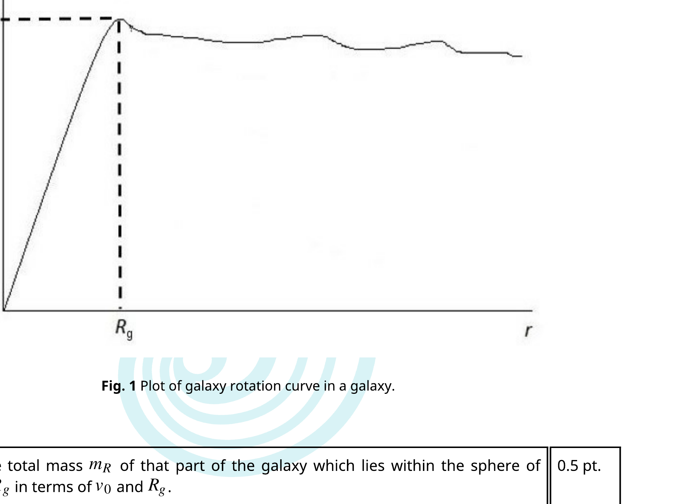

## Theory

English (Official)
T1

## Dark Matter

The first formal inference for the existence of dark matter was provided by Fritz Zwicky based on his observation on the dynamics of the Coma galaxy cluster, a cluster of galaxies that consist of about a thousand of galaxies. Zwicky used the Virial theorem to estimate the mass of the galaxy cluster. In a simple sun-planet system, where the planet revolves around the sun in a circular orbit, the Virial theorem states that the kinetic energy of the planet is exactly related to its gravitational potential energy. While in a general case for a system of many particles bounded by some interaction, the Virial theorem, relates the time average total kinetic energy with its time average total potential energy.

In 1933, based on his observation on the velocity of the galaxies near the edge of the Coma galaxy cluster, Zwicky estimated that the cluster has more mass than what was visually observed (i.e. the galaxies). The gravitational attraction from the observable matter (the galaxies) was too small to account for the velocities of the galaxies. Thus there must be some hidden masses that account for such a large velocity. That hidden mass is the dark matter mass. In what follows, assume that the mass of each galaxy is the sum of its visible mass and the mass of the dark matter which moves together with that galaxy, and dark matter interacts with visible matter only gravitationally.

## A. Cluster of Galaxies

Consider a cluster of galaxies consist of a large number $N$ of galaxies and dark matter that are distributed homogeneously in a sphere of radius $R$ with the total mass (galaxies and dark matters) of the cluster $M$. Assume that the average total mass (visible and dark matter) of a galaxy is $m$.

| A.1 | Assuming a continuous distribution of matter in the cluster, find the total   gravitational potential energy of the cluster, in terms of $M$ and $R$. | 1.0 pt. |
| :--- | :--- | :--- |

Due to cosmological expansion, any distance object will be moving away from an observer on Earth with a speed that depends on the distance from the observer to the object. A certain Lyman (a hydrogen emission spectral line) frequency from a type IA supernova on the $i$-th galaxy in the galaxy cluster is observed to be $f_{i}$, with $i=1, \ldots, N$, while the same corresponding Lyman frequency on Earth is $f_{0}$.

| A. 2 | Determine the average speed $V_{c r}$ of the whole galaxy cluster moving away from   the Earth in terms of $f_{i}$ (with $\left.i=1, \ldots, N.\right), f_{0}$ and $N$. Note that a galaxy speed is   very small compared to the speed of light $c$. | 0.5 pt. |
| :--- | :--- | :--- |

| A. 3 | By assuming that the galaxies velocities with respect to the center of the cluster are isotropic (the same in all direction), determine the root-mean square speed $v_{r m s}$ of the galaxies with respect to the center of the cluster in terms of $N, f_{i}$ (with $i=1, \ldots, N$.), and $f_{0}$. From this result determine the mean kinetic energy of a galaxy with respect to the center of the cluster in terms of $v_{r m s}$ and $m$. | 1.5 pt . |
| :--- | :--- | :--- |

## Theory

English (Official)
T1

To find the total mass of the cluster, one can use Virial theorem. The theorem stated that for a system of particles bounded by their conservative force,

$$
\langle K\rangle_{t}=-\gamma\langle U\rangle_{t},
$$

where $\langle K\rangle_{t}$ is the time average total kinetic energy, $\langle U\rangle_{t}$ is the time average total potential energy, and $\gamma$ is a constant. This theorem can be derived by assuming that for a system of particles bounded by its own interaction, the magnitudes of the position and momentum of each particle are finite, and thus the following quantity

$$
\Gamma=\sum_{i} \overrightarrow{p_{i}} \cdot \overrightarrow{r_{i}}
$$

is finite.

| A. 4 | Using the fact that the time average over a long period of time of $d \Gamma / d t$ vanishes, $\left\langle\frac{d \Gamma}{d t}\right\rangle_{t}=0$, determine $\gamma$ in the Virial theorem above for the case of gravitational interaction. (Hint: Try to do the problem with the summation in $\Gamma$ for a small finite number of galaxies). | 1.7 pt . |
| :--- | :--- | :--- |
| A. 5 | From the previous results determine the total dark matter mass of the cluster in terms of $N, m_{g}, R$ and $v_{r m s}$, where $m_{g}$ is the average total visible mass of a galaxy. Note that the root-mean square speed of the dark matter is the same as that of the galaxies. | 0.5 pt . |

## B. Dark Matter in a Galaxy

Dark matter also exists inside and around a galaxy. Consider a spherical galaxy with a visible edge radius $R_{g}$ (an approximate outermost distance where a large number of stars still visible, but note that a very small number of stars may still be distributed in the region beyond $R_{g}$ ). Assume that the stars in the galaxy are point particles with an average mass $m_{s}$. The stars in the galaxy, distributed homogeneously with a number density $n$, are assumed to move in circular orbits.

| B.1 | If the galaxy consists only of stars, find the speed $v(r)$ of a star as a function of its   distance to the center of the galaxy and sketch $v(r)$ for $r<R_{g}$ and $r \geq R_{g}$. | 0.8 pt. |
| :--- | :--- | :--- |

The existence of dark matter can be inferred from the galaxy rotation curve, which is a plot of $v(r)$ obtained from observations. The figure below shows a common pattern of the galaxy rotation curve. You

## Theory

English (Official)
T1
may assume simplifyingly that $v(r)$ is a linear function for $r \leq R_{g}$ and a constant $v_{0}$ for $r>R_{g}$.

Fig. 1 Plot of galaxy rotation curve in a galaxy.

| B. 2 | Find the total mass $m_{R}$ of that part of the galaxy which lies within the sphere of   radius $R_{g}$ in terms of $v_{0}$ and $R_{g}$. | 0.5 pt. |
| :--- | :--- | :--- |

The discrepancy between the figure in B. 2 and the plot obtained in B. 1 indicates the existence of dark matter.

| B. 3 | Determine the dark matter mass density as a function of $r, R_{g}, v_{0}, n$, and $m_{s}$ for   $r<R_{g}$ and $r \geq R_{g}$. | 1.5 pt. |
| :--- | :--- | :--- | :--- |

## C. Interstellar Gas and Dark Matter

Now consider a young galaxy whose mass is dominated by interstellar gas and dark matters (neglect the mass of the stars). The interstellar gas is assumed to consist of identical particles of mass $m_{p}$. The number density $n(r)$ and temperature $T(r)$ of the gas depend on the distance from the center of the galaxy $r$. Although many physical processes happen in the gas, we can assume the gas is in a hydrostatic equilibrium due to its pressure and the galaxy gravitational attraction.

| C. 1 | Find the pressure gradient of the gas $d P / d r$, in terms of $m^{\prime}(r), r$ and $n(r)$. Here,   $m^{\prime}(r)$ is the total mass of gas and dark matters within a sphere of radius $r$ from the   galaxy center. | 0.5 pt. |
| :--- | :--- | :--- |

C. 2

Assuming the interstellar gas as an ideal gas, find $m^{\prime}(r)$ in terms of $n(r), T(r)$ and their derivatives with respect to $r$.

Next for simplicity assume that the gas is in isothermal distribution at temperature $T_{0}$ and the interstellar gas number density is given by

$$
n(r)=\frac{\alpha}{r(\beta+r)^{2}}
$$

where $\alpha$ and $\beta$ are some constants.

| C. 3 | Find the dark matter mass density as a function of $r$ inside the galaxy. | 1.0 pt. |
| :--- | :--- | :--- |
