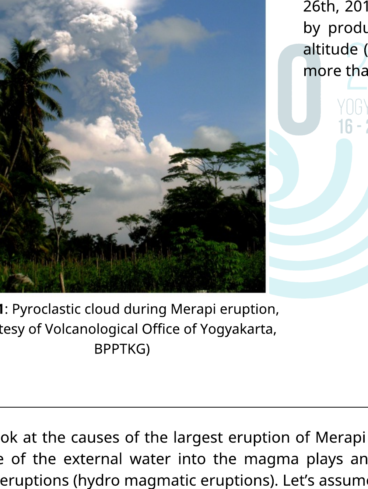
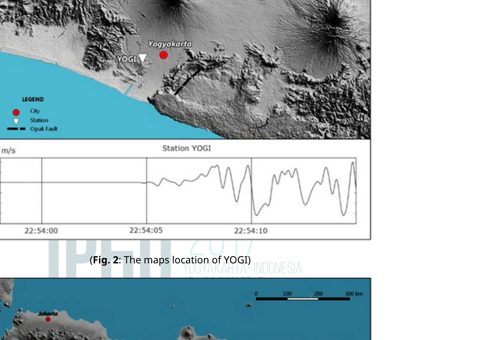
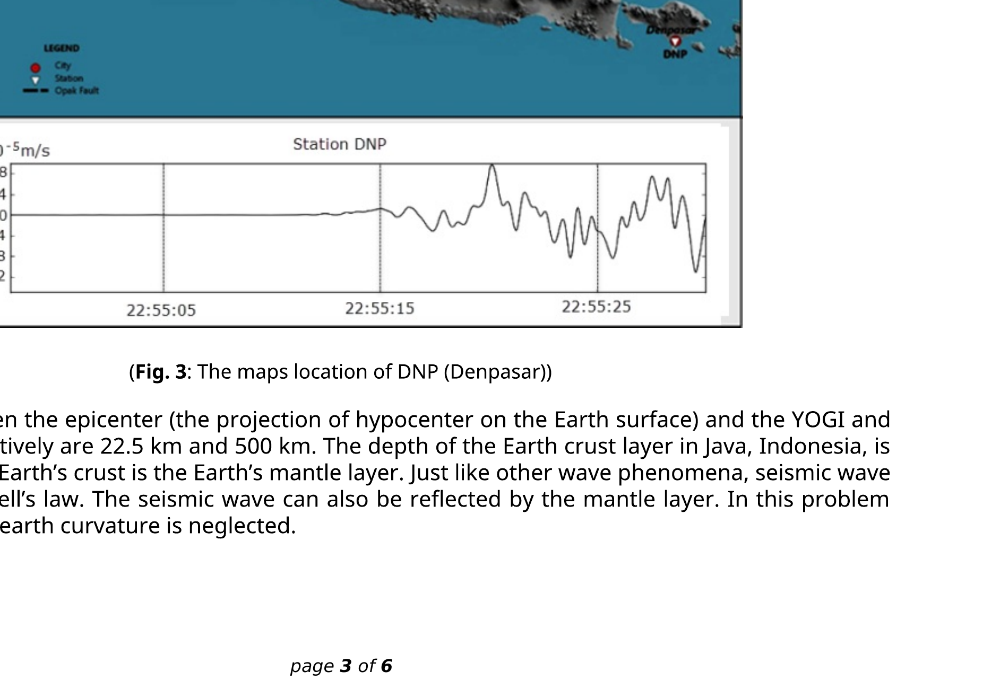
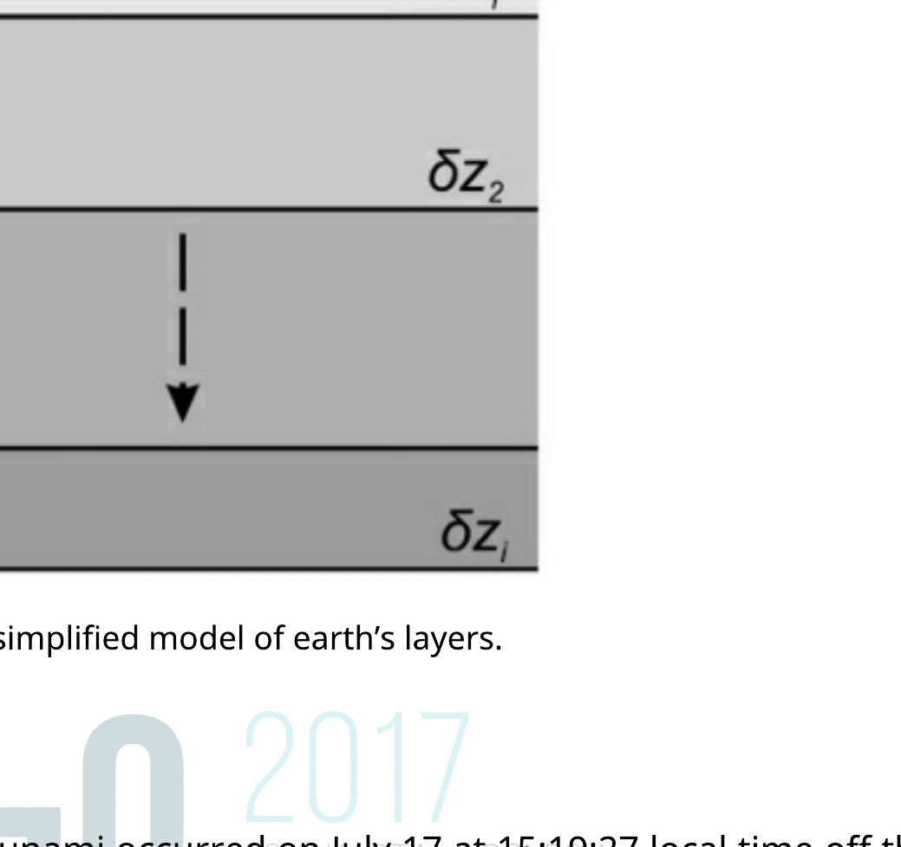
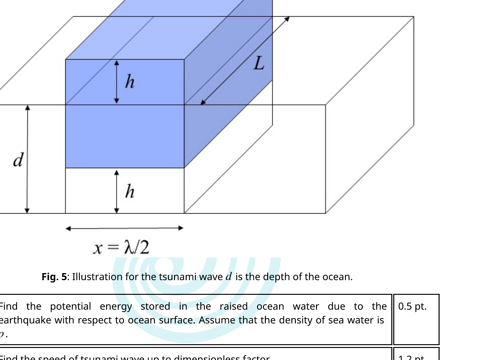

## Theory

English (Official)
T2

## Earthquake, Volcano and Tsunami

Indonesia is the supermarket of natural hazards. Almost all of the natural hazards have occurred in Indonesia, such as volcano eruptions, earthquakes and tsunami.

## A. Merapi Volcano Eruption

(Fig. 1: Pyroclastic cloud during Merapi eruption, Courtesy of Volcanological Office of Yogyakarta, BPPTKG)

Merapi volcano in Yogyakarta is one of the most active volcano in Java. Pyroclastic flows are wellknown eruption characteristics of the volcano. The pyroclastic flow is a hot mixture of gas and rock which travels away from a volcano. In October 26th, 2010, Merapi showed his explosive character by producing an ash plume that reached 12 km altitude (Fig. 1) and pyroclastic currents displacing more than 20,000 people around the volcano.

Let us look at the causes of the largest eruption of Merapi in 2010. It is known by geophysicists that the influence of the external water into the magma plays an important role to the explosive behavior of volcanic eruptions (hydro magmatic eruptions). Let's assume that we dealt with a volcano as a system that consists of mixture of magmatic particles and water. The volcano vents structures and atmosphere are being boundary of the system. The explosive eruption is considered to be happening in two stages, (1) an instantaneous magma-water interaction, and (2) a system expansion. In the first stage, a mass of magma ( $m_{m}$ ) at an absolute temperature ( $T_{m}$ ) mixes with a mass of external water ( $m_{w}$ ) at an absolute temperature ( $T_{w}$ ). The thermal equilibrium is reached almost instantaneously. This interaction can be perceived as a nearly-constant volume process. Latent heat of evaporation of water and latent heat of melting of magma can be neglected.

## Theory

English (Official)
T2

| A. 1 | Find the equilibrium temperature at the first stage in terms of the masses and heat capacity per unit mass of water $c_{V w}$ and magma $c_{V m}$. | 0.5 pt . |
| :--- | :--- | :--- |
| A. 2 | Determine its equilibrium pressure at the first stage by assuming that the mixture can be modeled as ideal gas. Assume that the volume per unit mole of the mixture is $v_{e}$. | 0.3 pt . |

The system expansion (the second stage) can occur through several possibilities, one of which is thermal detonation. Although such process is quite complicated, we can empirically measure the relative velocity of the erupted mixture. The velocity of gas during the eruption depend on the pressure $p$, the total mass $m$ and the volume $V$ of the mixture in the conduit of a volcano.

| A. 3 | Express the velocity of gas during the eruption in terms of $p, m$, and $V$ up to a   proportional constant $\kappa$. | 0.5 pt. |
| :--- | :--- | :--- | :--- |

The observed pressure is around the order of 100 MPa . This makes the eruption (relative) velocity can be as large as ballistic velocity.

## B. The Yogyakarta Earthquake

The 2006 Yogyakarta earthquake of magnitude $M_{w}=6.4$, which destroyed many buildings in the Bantul and Yogyakarta area, occured at 05:54:00.00 local time or 22:54:00.00 UTC. The earthquake was caused by a sudden displacement of the Opak fault segment (see Fig. 2). The hypocenter was located 15 km below the surface.

The seismic wave that propagates on the earth crust can be recorded using seismometer. The diagram from seismometer is called seismogram (Fig. 2 and 3, Lower graph). The seismograms represent the vertical ground velocity as a function of time recorded by the seismic station at Gamping Station Yogyakarta (YOGI) (Fig. 2) and Denpasar, Bali (DNP) (Fig. 3). In general, seismic wave consists of three wave types: the longitudinal or primary ( $P$-wave), the transversal or secondary ( $S$-wave), and the surface wave. The $P$-wave and $S$-wave travel in the subsurface while the surface wave travels along the Earth surface. Seismic waves traveling through subsurfaces to the stations can be divided into those that propagate in a straight line, those that are reflected by a layer's boundary, and those that are refracted into the next layer. The longitudinal wave or the primary wave has the highest velocity, while the surface wave has the lowest velocity, around $60 \%$ of the $P$-wave.

(Fig. 2: The maps location of YOGI)

(Fig. 3: The maps location of DNP (Denpasar))

The distance between the epicenter (the projection of hypocenter on the Earth surface) and the YOGI and DNP stations respectively are 22.5 km and 500 km . The depth of the Earth crust layer in Java, Indonesia, is 30 km . Beneath the Earth's crust is the Earth's mantle layer. Just like other wave phenomena, seismic wave also satisfies the Snell's law. The seismic wave can also be reflected by the mantle layer. In this problem we assume that the earth curvature is neglected.

## Theory

English (Official)
T2

| B. 1 | Fig. 2 shows the seismogram at the YOGI station. Use the data to find the velocity of the $P$-wave in the Earth crust. | 0.5 pt . |
| :--- | :--- | :--- |
| B. 2 | Find the travel time of the direct $P$ wave and reflected wave due to the Yogyakarta earthquake that arrived at the DNP station in Denpasar. | 0.6 pt . |

By assuming that the Earth is composed of only two layers: the crust and the mantle, the primary wave propagates in the crust and in the mantle with different constant velocities. The velocity in the mantle is faster than in the crust. Note that $P$-wave refracted into the mantle at the right angle ( $90^{\circ}$ ) is being partly refracted back into the crust along its entire path of propagation along the crust-mantle boundary.

| B. 3 | Find the velocity of the $P$-wave in the mantle. | 1.2 pt. |
| :--- | :--- | :--- |

For a more realistic Earth structure, the crust can be divided into a number of thin layers so that the velocity of the seismic wave is a function of the depth $z$ according to $v(z)=v_{0}+a z$ where $a$ is a constant and the hypocenter is approximated on the surface. In this model, the wave ray is curving.

| B. 4 | Let us define the ray parameter $p=\sin \theta(z) / v(z)$, where $\theta(z)$ is the angle between the ray and the normal. Suppose a seismic wave arrives to the station with ray parameter $p$; express the distance to the hypocenter in terms of $p, v_{0}$, and $a$. Assume that the hypocenter is very close to the ground surface. | 1.4 pt. |
| :--- | :--- | :--- |
| B. 5 | Find the travel time $T$ from hypocenter to any station, in form of integral over $z$. | 1.0 pt . |

The earth consists of a stack of homogeneous layers with the velocity of each layer is $v_{i}$ and the thickness of $\delta z_{i}$.

| B. 6 | From the result of the previous problem, approximate the travel time ( $T$ ) from the hypocenter to DNP station by assuming that the crust consists of only three discretized layers, ( $i=1,2,3$ ), characterized by $v_{1}=6.65 \mathrm{~km} / \mathrm{sec}, v_{2}=6.97 \mathrm{~km} / \mathrm{sec}$, $v_{3}=6.99 \mathrm{~km} / \mathrm{sec}, p=0.143 \mathrm{sec} / \mathrm{km}, \delta z_{1}=6.0 \mathrm{~km}, \delta z_{2}=9.0 \mathrm{~km}, \delta z_{3}=15 \mathrm{~km}$. | 1.0 pt . |
| :--- | :--- | :--- |

## Theory

English (Official)

Fig. 4: A simplified model of earth's layers.

## C. Java Tsunami $48^{\text {TH }}$ □ □

The 2006 Pangandaran earthquake and tsunami occurred on July 17 at 15:19:27 local time off the coast of west and central Java. During the earthquake where the epicenter fault is on the ocean floor, the fault may be displaced producing a remarkably large water wave called tsunami. In other words, a tsunami is a shallow-water wave which is initiated by a tiny amplitude, but with an extremely large wavelength. Consider a sudden fault causing a lifting of some ocean floor as shown in Fig. 5. Assume that the energy of the earthquake is transformed to the potential energy of this raised ocean water. For simple model we approximate that the raised water has a geometry of a box with its area of $\lambda L / 2$ (where $L \gg \lambda$ ) and height of $h$.

Fig. 5: Illustration for the tsunami wave $d$ is the depth of the ocean.

| C. 1 | Find the potential energy stored in the raised ocean water due to the earthquake with respect to ocean surface. Assume that the density of sea water is $\rho$. | 0.5 pt . |
| :--- | :--- | :--- |
| C. 2 | Find the speed of tsunami wave up to dimensionless factor. | 1.2 pt . |
| C. 3 | Using energy argument, determine the amplitude of the tsunami wave as a function of the depth, assuming that the depth varies slowly and also knowing that at a depth of $d_{0}$ the amplitude is $A_{0}$. | 1.3 pt . |
