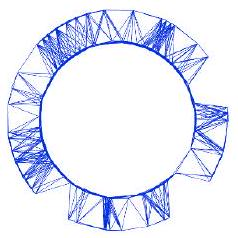
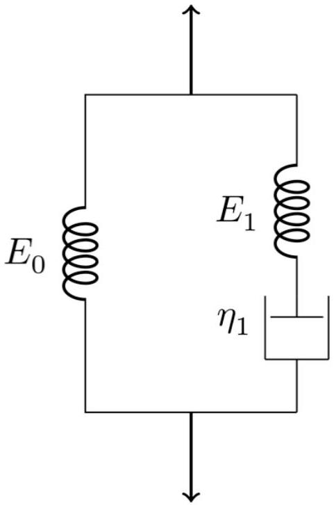
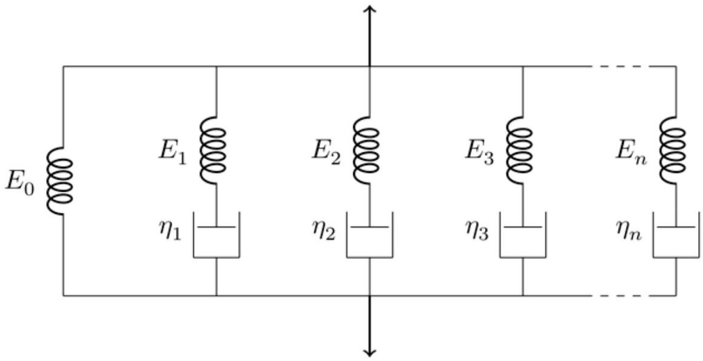
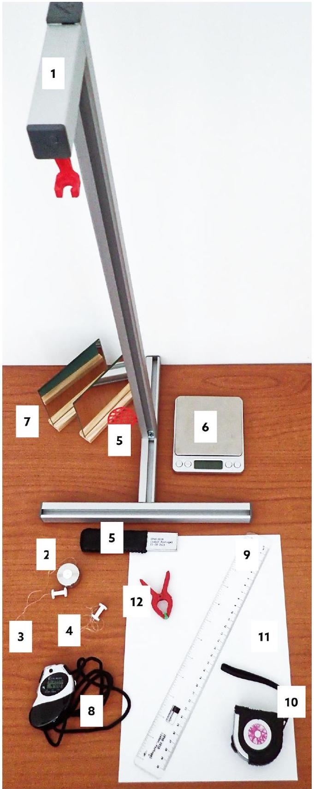
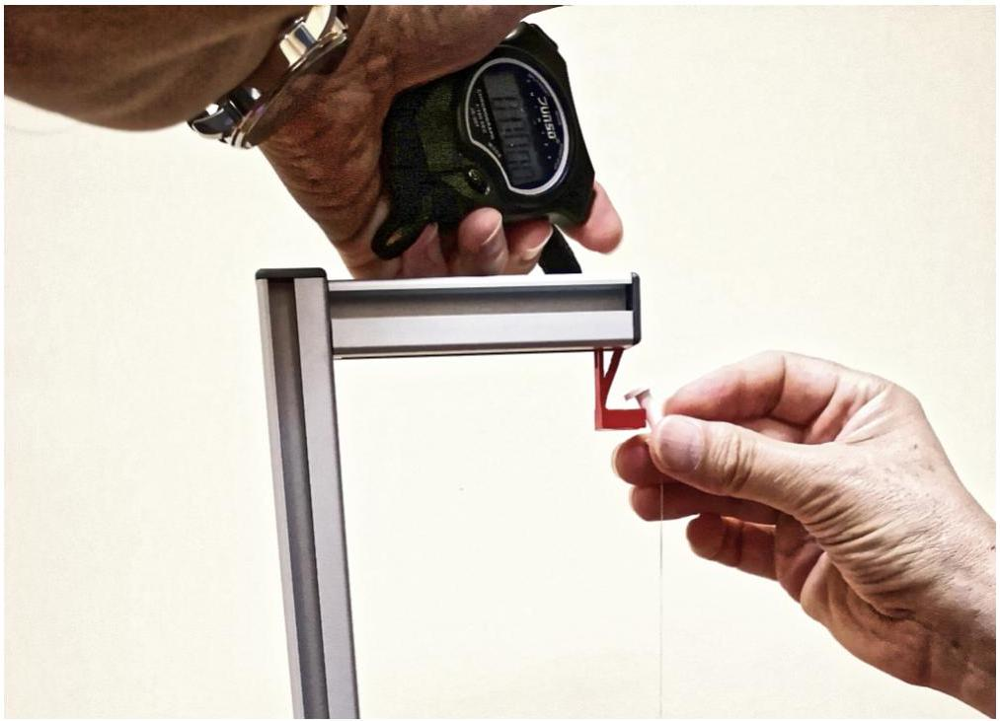
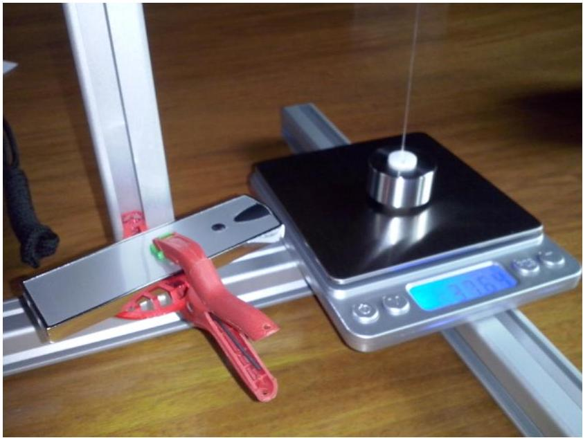
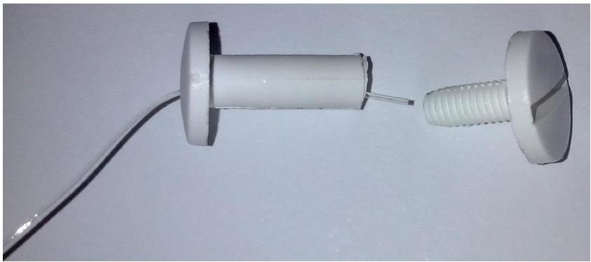

## Q2-1   English (Official)

## Viscoelasticity of a polymer thread (10 points)

Please note that the thread must not be stressed before the beginning of the experiment!
Switch on the scale right now (warming time is about 10 minutes). Do not change the settings of the scale.

Introduction

When a solid material is subject to an external force, it deforms. For small applied forces, this deformation is proportional to the force (Hooke's law) and is reversible, so that the material recovers its initial shape when the force is removed.

For a solid, the description is more conveniently expressed using the concepts of stress and strain. The stress $\sigma$ is defined as the force per unit area, i.e. the force $F$ divided by the area $S$ on which it acts, whereas the strain, $\epsilon$, is the relative change of length:

$$
\sigma=\frac{F}{S} \quad \text { and } \quad \epsilon=\frac{\ell-\ell_{0}}{\ell_{0}}
$$

where $\ell$ and $\ell_{0}$ are the final and original length, respectively. In the simple elastic behaviour, the stress is simply proportional to the strain $\sigma=E \in$ (Hooke's law) and the proportionality factor, $E$, is named modulus of Young.

The elastic behaviour expressed in Hooke's law is an approximation valid only for small enough strains. For higher strains changes gradually become irreversible as the plastic regime is reached, in which case the molecular movements start to be unconstrained, resembling those of a viscous fluid. That is, if stretched or compressed beyond the elastic limit, the material becomes asymptotically fluid.

Viscoelastic materials

Certain materials combine aspects of an elastic solid with features resembling viscous fluids, and are therefore known as viscoelastic.

On dealing with a viscoelastic material it is reasonable to consider separately the purely elastic behaviour and the additional viscous behaviour, thus implying that the total stress $\sigma$ needed to develop a given strain $\epsilon$ is the sum of a purely elastic term $\sigma_{0}=E_{0} \epsilon_{0}$ and a viscoelastic term $\sigma_{1}$ :

$$
\sigma=\sigma_{0}+\sigma_{1}
$$

Both stress terms are assumed to correspond to the same strain $\left(\epsilon=\epsilon_{0}=\epsilon_{1}\right)$. However, the strain, $\epsilon_{1}$, corresponding to the viscoelastic term is usually modelled as the sum of a purely elastic strain, $\epsilon_{1}^{\mathrm{e}}=\sigma_{1} / E_{1}$, with a purely viscous strain, $\epsilon_{1}^{v}$, (both subject to the same stress $\sigma_{1}=\sigma_{1}^{\mathrm{e}}=\sigma_{1}^{\mathrm{v}}$ ):

$$
\epsilon_{1}=\epsilon_{1}^{\mathrm{e}}+\epsilon_{1}^{\mathrm{v}}
$$

## Experiment

## Q2-2   English (Official)

In the purely viscous process, a linear relation between the stress and the time derivative of the strain is admitted (similarly to that found in viscous fluids),

$$
\sigma_{1}=\eta_{1} \frac{\mathrm{~d} \epsilon_{1}^{v}}{\mathrm{~d} t},
$$

where $\eta_{1}$ is the viscosity coefficient.
This phenomenological model is the so called standard linear solid model of linear viscoelasticity, and is depicted in Figure 1, where the springs represent pure elastic components and the pot represents the purely viscous component.

Figure 1. Standard linear solid model of linear viscoelasticity.

From the above equations the following relation is obtained:

$$
\frac{\mathrm{d} \epsilon_{1}}{\mathrm{~d} t}=\frac{1}{E_{1}} \frac{\mathrm{~d} \sigma_{1}}{\mathrm{~d} t}+\frac{\sigma_{1}}{\eta_{1}}
$$

Therefore, within the standard linear model of viscoelasticity, it is possible to show that

$$
\sigma=E_{0} \epsilon+\tau_{1}\left(E_{0}+E_{1}\right) \frac{\mathrm{d} \epsilon}{\mathrm{~d} t}-\tau_{1} \frac{\mathrm{~d} \sigma}{\mathrm{~d} t}
$$

where $\tau_{1}=\eta_{1} / E_{1}$. This differential equation shows that the relation between the strain and the stress is no longer linear, and that the strain and the stress are both in general functions of time. To get $\epsilon(t)$ it is necessary to specify the function $\sigma(t)$, and vice-versa.

There are two special cases of practical interest, in which either $\mathrm{d} \epsilon / \mathrm{d} t=0$ or $\mathrm{d} \sigma / \mathrm{d} t=0$, commonly known as the stress relaxation conditions and the creep conditions, respectively. Under the stress relaxation conditions, a sudden strain $\epsilon$ is applied to the material, which is kept constant over time, so that $\mathrm{d} \epsilon / \mathrm{d} t=0$.

## Experiment

## Q2-3   English (Official)

In such a case, the function $\sigma(t)$ is then dependent only on the viscoelastic parameters of the medium and the solution of eq. (5) is

$$
\sigma(t)=\epsilon\left(E_{0}+E_{1} \mathrm{e}^{-t / \tau_{1}}\right)
$$

where it was admitted that at $t=0$ only the elastic components contribute to the stress and thus $\sigma(t=0)=\epsilon\left(E_{0}+E_{1}\right)$. This solution shows that the viscoelastic stress decays exponentially with time, with a time constant $\tau_{1}$.

## Multi-viscoelastic processes

The standard linear model can be readily extended to include many viscoelastic processes, as suggested by Figure 2.

Figure 2. Generalised model for multi-viscoelastic processes.

Thus, considering $N$ different viscoelastic components,

$$
\sigma=\sigma_{0}+\sum_{k} \sigma_{k}, \quad k=1,2, \cdots, N
$$

where $\frac{\mathrm{d} \epsilon_{k}}{\mathrm{~d} t}=\frac{1}{E_{k}} \frac{\mathrm{~d} \sigma_{k}}{\mathrm{~d} t}+\frac{\sigma_{k}}{\eta_{k}}$, and as above, $\frac{\mathrm{d} \epsilon_{0}}{\mathrm{~d} t}=\frac{\mathrm{d} \epsilon_{k}}{\mathrm{~d} t}=\frac{\mathrm{d} \epsilon}{\mathrm{d} t}$. The following generalization of eq. (5) is thus applicable:

$$
\sigma=E_{0} \epsilon+\eta_{t} \frac{\mathrm{~d} \epsilon}{\mathrm{~d} t}-\sum_{k} \tau_{k} \frac{\mathrm{~d} \sigma_{k}}{\mathrm{~d} t}, \quad k=1,2, \cdots, N
$$

where $\eta_{t}=\sum_{k} \eta_{k}$, and $\tau_{k}=\eta_{k} / E_{k}$.

## Experiment

## Q2-4   English (Official)

In constant strain conditions, the various viscoelastic stresses should still decay exponentially with time, $\sigma_{k}=A_{k} \mathrm{e}^{-t / \tau_{k}}$, leading to the solution:

$$
\sigma(t)=\epsilon\left(E_{0}+\sum_{k} E_{k} \mathrm{e}^{-t / \tau_{k}}\right), \quad k=1,2, \cdots, N
$$

where it was assumed that at $t=0$ only the elastic components contribute to the total stress and thus $\sigma_{0}=\epsilon\left(E_{0}+\sum_{k} E_{k}\right)$. The resulting viscoelastic response is evidently non-linear.

## Experiment

## Q2-5   English (Official)

## Equipment

The following set of equipments is provided for this experimental problem (see Figure 3):

1. 1 standing structure, with a supporting system to position a laser pointer and another upper supporting system to hold the thread stretched vertically with constant strain above the scale;
2. 1 mass-set, consisting of a hollow cylindrical mass and a holding screw to attach the thread;
3. 1 long thermoplastic polyurethane (TPU) thread attached to the mass-set and to another holding screw used to hang the thread from the upper support;
4. 1 short TPU thread attached to a single holding screw;
5. 1 laser pointer and the respective support;
6. 1 digital scale;
7. 2 plane mirrors;
8. 1 stopwatch;
9. 1 ruler;
10. 1 metallic measuring tape;
11. 1 sheet of A4 paper to act as a screen;
12. 1 spring clamp to hold the laser in place and to switch it on.

## Experiment

## Q2-6   English (Official)

Figure 3. Equipment for this experimental problem.

## Experiment

## Q2-7   English (Official)

## Part A: Stress-relaxation measurements (1.9 points)

Please note that the thread must not be stressed before the beginning of the experiment! In case the thread is inadvertently stressed, ask for a spare one, but be reminded that this will take some time, therefore reducing the time you have for your experiment.

You should read carefully the indications given on "Part D: Data Analysis" before starting the measurements on this part in order to plan the way you make the measurements.

A. 1 Measure the length of the unstretched thread between the screw heads. To obtain the total thread length, $\ell_{0}$, including the length inside the screws, add 5 mm for each screw. Write down in the answer sheet the measured value of $\ell_{0}$ and its uncertainty.
A. 2 Measure the total weight of the mass-set, $P_{0}$, in gram-force (gf) units. Remember that 1 gram-force is the force corresponding to the weight of a mass of 1 gram ( $1 \mathrm{gf}=9.80 \times 10^{-3} \mathrm{~N}$ ). Write down in the answer sheet the measured value and an estimation of its uncertainty.

0.3pt To observe experimentally the various relaxation components it is necessary to measure the stress for a long enough time. In this case, it is sufficient to sample the stress evolution during about 45 minutes.

You should now perform two simultaneous actions 1. and 2. Please read the instructions carefully before starting.

Important: if the experiment is interrupted for any reason it cannot be resumed. It has to be restarted with a new thread. In such case, ask for a spare one.

Take the following simultaneous actions:

1. Keeping the mass-set on the scale platform, stretch the thread so that the holding screw at the opposite side is placed on the thread supporting system, at the standing structure (Figure 4).
2. Start the chronometer simultaneously with action 1.

## Experiment

## Q2-8   English (Official)

Figure 4. Hanging the thread on the support and starting the measurements.

A. 3 Record the readings of the scale, $P(t)$, and the corresponding reading instant, 1.0pt $t$, during around 45 min, in the table provided in the answer sheet.
A. 4 Measure the length of the stretched thread, $\ell$, and estimate the corresponding 0.3pt uncertainty. Write down in the answer sheet the measured value of $\ell$ and its uncertainty.

Part B: Measurement of the streched thread diameter (1.5 points)
Never look directly at the laser! When not in use, the laser pointer should be off. If you have difficulties in getting a diffraction pattern, please ask for a new laser.

In this part you will use light diffraction to measure the diameter of the polymer thread. The nominal diameter of the unstretched thread is 0.5 mm. As you may know, the diffraction pattern of a rectangular slit of width $d$ is similar to that of a cylindrical object with the same diameter $d$ as the slit width. In the far-field (Fraunhofer) regime, where the diffraction pattern is observed in a target screen placed at a distance much larger than the diameter of the object, the distance between the diffraction minima for small angles is the same for both the slit and the object and is given by

$$
d \sin \theta=n \lambda, \quad n=1,2,3, \cdots,
$$

where $\theta$ is the diffraction angle.
You will use laser light with a wavelength $\lambda=650 \pm 10 \mathrm{~nm}$.
To perform this part, proceed as follows:

1. Turn on the laser using the spring clamp (see Figure 5).
2. Position the laser so that it hits the stretched thread directly.

## Experiment

## Q2-9   English (Official)

3. With the provided material, devise a method to project the diffraction pattern into a paper screen, and to measure the data needed to determine the diameter of the thread using eq. (10).

Figure 5. Turning on the laser using the spring clamp.
B. 1 Make a sketch of your method in the answer sheet. 0.6pt
B. 2 Measure the optical distance, $D$, between the thread and the projected diffraction pattern. Write it down in the answer sheet with an estimation of its uncertainty.
B. 3 Determine the average distance, $\bar{x}$, between diffraction minima and its uncer- 0.3pt tainty. Write it down in the answer sheet with an estimation of its uncertainty. tainty. Write it down in the answer sheet with an estimation of its uncertainty.
B. 4 Applying eq. (10) to your diffraction data, determine the diameter, $d$, of the streched polymer thread and its uncertainty. Write it down in the answer sheet with an estimation of its uncertainty.

0.3pt

Part C: Changing to a new thread (0.3 points)
Before proceeding with the data analysis (Part D) you have to prepare the setup for the measurement with the shorter thread (Part E).

Detach the mass-set from the long thread (unscrewing it) and transfer it to the free end of the shorter thread (inserting the thread through the hole and fixing it with the screw-thread, see Figure 6).

In case you are unable to insert the thread through the hole, please ask for help.

## Experiment

## Q2-10   English (Official)

Figure 6. Mounting the TPU thread on the holding screw.

C. 1 Measure the length, $\ell_{0}^{\prime}$ of the thread as in A.1. Write it down in the answer sheet 0.3pt with an estimation of its uncertainty.

Hang this new thread on the upper support so that the mass will exert a constant stress. The thread will eventually reach the stationary strain $\epsilon=\sigma / E$, while you work out the data analysis (it should be suspended for at least 30 minutes).

Part D: Data analysis (5.7 points)
N.B.: The acceleration of gravity in Lisbon is $g=9.80 \mathrm{~ms}^{-2}$.

D. 1 Calculate the force on the thread, $F$, in gf, for all data points and fill the corre- 0.3pt sponding column in the table used in A.3.

D. 2 Plot $F(t)$ in the graph paper provided in the answer sheet. 0.4pt

Since the scale platform does not move, the measurements can be considered at constant strain and eq. (9) can be used. The ratio $\frac{\sigma}{\epsilon}$ can be written as $\frac{\sigma}{\epsilon}=\beta F$, where $\beta$ is a constant. Therefore,

$$
\frac{\sigma}{\epsilon}=\beta F(t)=E_{0}+E_{1} \mathrm{e}^{-t / \tau_{1}}+E_{2} \mathrm{e}^{-t / \tau_{2}}+E_{3} \mathrm{e}^{-t / \tau_{3}}+\ldots
$$

where the sum was ordered $\left(\tau_{1}>\tau_{2}>\tau_{3}>\ldots\right)$ for convenience.

D. 3 Determine the constant strain, $\epsilon$, and the corresponding uncertainty. Write it 0.3pt down in the answer sheet with an estimation of its uncertainty.
D. 4 Calculate the factor $\beta$, with $\sigma$ in SI units and $F$ in gf units. Write it down in the 0.3pt answer sheet (no uncertainty required).
D. 5 Look at the data in the graph used in D.2: it cannot be explained by a purely 0.4pt elastic process. Sketch qualitatively in the graph paper provided in the answer sheet what you would expect for $F(t)$ in the purely elastic case.

The data analysis is easier if we consider $\frac{\mathrm{d} F}{\mathrm{~d} t}$ instead of $F(t)$. This means that the relaxation parameters can then be extracted by hand in successive steps. In order to do this, the time derivative $\frac{\mathrm{d} F}{\mathrm{~d} t}$ should be

## Experiment

## Q2-11

English (Official)
calculated at every point. This can be done either graphically or numerically. In the simpler case where the data points are taken at equal intervals, the numerical value of the derivative of a function $f(t)$ at point $t_{i}$, in a data set $\left(t_{1}, f_{1}\right),\left(t_{2}, f_{2}\right),\left(t_{3}, f_{3}\right), \cdots$, is approximately given by

$$
\left.\frac{\mathrm{d} f}{\mathrm{~d} t}\right|_{i}=\frac{f_{i+1}-f_{i-1}}{2 h} \quad i=2, \cdots, N-1
$$

where $h$ is the (constant) interval between the points and $N$ is the number of points.
If the intervals between data points are not equal, the numerical value of the derivative is approximately given by:

$$
\left.\frac{\mathrm{d} f}{\mathrm{~d} t}\right|_{i}=\frac{h_{-}^{2} f_{i+1}-h_{+}^{2} f_{i-1}+\left(h_{+}^{2}-h_{-}^{2}\right) f_{i}}{h_{+}^{2} h_{-}+h_{+} h_{-}^{2}} \quad i=2, \cdots, N-1
$$

where $h_{+}=\left(t_{i+1}-t_{i}\right)$ and $h_{-}=\left(t_{i}-t_{i-1}\right)$ and $N$ is the number of data points. This expression represents the average derivative at left and right, weighted by the inverse time interval.

To analyse the data and extract the relevant parameters it is necessary to follow a sequence of steps. Hence, given the ordered sum in equation (11), do the following:

D. 6 Assume that your data set lasts for longer than $\tau_{2}$ and calculate the
0.5pt derivative, $\frac{\mathrm{d} F}{\mathrm{~d} t}$, for data points at times $t>1000 \mathrm{~s}$. Register the values in the derivative, $\frac{\mathrm{d} F}{\mathrm{~d} t}$, for data points at times $t>1000 \mathrm{~s}$. Register the values in the table used in A.3. In case you use a graphical method for calculating $\frac{\mathrm{d} F}{\mathrm{~d} t}$, use table used in A.3. In case you use a graphical method for calculating $\frac{\mathrm{d} F}{\mathrm{~d} t}$, use the graph paper provided in the answer sheet. the graph paper provided in the answer sheet.
D. 7 In the answer sheet, write an expression for the expected time dependence of
D. 7 In the answer sheet, write an expression for the expected time dependence of
0.3pt $\frac{\mathrm{d} F}{\mathrm{~d} t}$ in the case of a single viscoelastic process. $\frac{\mathrm{d} F}{\mathrm{~d} t}$ in the case of a single viscoelastic process. $\frac{\mathrm{d} t}{\mathrm{~d} t}$ in the case of a single viscoelastic process.
D. 8 Extract, using a graphical method, the parameters $E_{1}$ and $\tau_{1}$ in SI units from the
1.0pt data points referred in D.6. Write $E_{1}$ and $\tau_{1}$ in the answer sheet (no uncertainties required). required).
D. 9 Extract the parameter $E_{0}$ in SI units from the data points referred in D.6. Write
0.3pt it down in the answer sheet (no uncertainty required). it down in the answer sheet (no uncertainty required).
D. 10 Fill column $y(t)$ in the table used in A. 3 by subtracting the elastic and the longest viscoelastic components from $F(t)$ (the points used in D. $\mathbf{6}$ do not need to be considered here). considered here).
0.3pt
D. 11 Extract from $y(t)$ (see D.10), using a graphical method, the parameters for the second viscoelastic component, $E_{2}$ and $\tau_{2}$, in SI units. Write $E_{2}$ and $\tau_{2}$ in the answer sheet (no uncertainties required). answer sheet (no uncertainties required).

1.0pt

Additional viscoelastic components can be extracted in a similar way.

## Experiment

## Q2-12   -

" S of "

## Grave many May

" S om a att "

