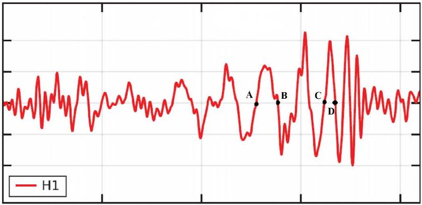

## Q1-1   English (Official)

## LIGO-GW150914 (10 points)

In 2015, the gravitational-wave observatory LIGO detected, for the first time, the passing of gravitational waves (GW) through Earth. This event, named GW150914, was triggered by waves produced by two black holes that were orbiting on quasi-circular orbits. This problem will make you estimate some physical parameters of the system, from the properties of the detected signal.

Part A: Newtonian (conservative) orbits (3.0 points)

A. 1 Consider a system of two stars with masses $M_{1}, M_{2}$, at locations $\vec{r}_{1}, \vec{r}_{2}$, respectively, with respect to the center-of-mass of the system, that is,
$$
M_{1} \vec{r}_{1}+M_{2} \vec{r}_{2}=0
$$
The stars are isolated from the rest of the Universe and moving at nonrelativistic velocities. Using Newton's laws, the acceleration vector of mass $M_{1}$ can be expressed as
$$
\frac{\mathrm{d}^{2} \vec{r}_{1}}{\mathrm{~d} t^{2}}=-\alpha \frac{\vec{r}_{1}}{r_{1}^{n}},
$$
where $r_{1}=\left|\vec{r}_{1}\right|, r_{2}=\left|\vec{r}_{2}\right|$. Find $n \in \mathbb{N}$ and $\alpha=\alpha\left(G, M_{1}, M_{2}\right)$, where $G$ is Newton's constant $\left[G \simeq 6.67 \times 10^{-11} \mathrm{~N} \mathrm{~m}^{2} \mathrm{~kg}^{-2}\right]$.
A. 2 The total energy of the 2-mass system, in circular orbits, can be expressed as: 1.0pt
$$
E=A(\mu, \Omega, L)-G \frac{M \mu}{L},
$$
where
$$
\mu \equiv \frac{M_{1} M_{2}}{M_{1}+M_{2}}, \quad M \equiv M_{1}+M_{2}
$$
are the reduced mass and total mass of the system, $\Omega$ is the angular velocity of each mass and $L$ is the total separation $L=r_{1}+r_{2}$. Obtain the explicit form of the term $A(\mu, \Omega, L)$.
A. 3 Equation 3 can be simplified to $E=\beta G \frac{M \mu}{L}$. Determine the number $\beta$. 1.0pt

## Part B: Introducing relativistic dissipation (7.0 points)

The correct theory of gravity, General Relativity, was formulated by Einstein in 1915, and predicts that gravity travels with the speed of light. The messengers carrying information about the interaction are called GWs. GWs are emitted whenever masses are accelerated, making the system of masses lose energy.
Consider a system of two point-like particles, isolated from the rest of the Universe. Einstein proved that for small enough velocities the emitted GWs: 1) have a frequency which is twice as large as the orbital frequency; 2) can be characterized by a luminosity, i.e. emitted power $\mathcal{P}$, which is dominated by Einstein's

## Q1-2   English (Official)

quadrupole formula,

$$
\mathcal{P}=\frac{G}{5 c^{5}} \sum_{i=1}^{3} \sum_{j=1}^{3}\left(\frac{\mathrm{~d}^{3} Q_{i j}}{\mathrm{~d} t^{3}}\right)\left(\frac{\mathrm{d}^{3} Q_{i j}}{\mathrm{~d} t^{3}}\right) .
$$

Here, $c$ is the velocity of light $c \simeq 3 \times 10^{8} \mathrm{~m} / \mathrm{s}$. For a system of 2 pointlike particles orbiting on the $x-y$ plane, $Q_{i j}$ is the following table ( $i, j$ label the row/column number)

$$
\begin{aligned}
Q_{11}=\sum_{A=1}^{2} \frac{M_{A}}{3}\left(2 x_{A}^{2}-y_{A}^{2}\right), \quad Q_{22} & =\sum_{A=1}^{2} \frac{M_{A}}{3}\left(2 y_{A}^{2}-x_{A}^{2}\right), \quad Q_{33}=-\sum_{A=1}^{2} \frac{M_{A}}{3}\left(x_{A}^{2}+y_{A}^{2}\right), \\
Q_{12} & =Q_{21}=\sum_{A=1}^{2} M_{A} x_{A} y_{A},
\end{aligned}
$$

and $Q_{i j}=0$ for all other possibilities. Here, ( $x_{A}, y_{A}$ ) is the position of mass A in the center-of-mass frame.

B. 1 For the circular orbits described in A. 2 the components of $Q_{i j}$ can be expressed as a function of time $t$ as:
$$
Q_{i i}=\frac{\mu L^{2}}{2}\left(a_{i}+b_{i} \cos k t\right), \quad Q_{i j} \stackrel{i \neq j}{=} \frac{\mu L^{2}}{2} c_{i j} \sin k t .
$$
Determine $k$ in terms of $\Omega$ and the numerical values of the constants $a_{i}, b_{i}, c_{i j}$.
B. 2 Compute the power $\mathcal{P}$ emitted in gravitational waves for that system, and obtain:
$$
\mathcal{P}=\xi \frac{G}{c^{5}} \mu^{2} L^{4} \Omega^{6} .
$$
What is the number $\xi$ ? [If you could not obtain $\xi$, use $\xi=6.4$ in the following.]
B. 3 In the absence of GW emission the two masses will orbit on a fixed circular orbit indefinitely. However, the emission of GWs causes the system to lose energy and to slowly evolve towards smaller circular orbits. Obtain that the rate of change $\frac{\mathrm{d} \Omega}{\mathrm{d} t}$ of the orbital angular velocity takes the form
$$
\left(\frac{\mathrm{d} \Omega}{\mathrm{~d} t}\right)^{3}=(3 \xi)^{3} \frac{\Omega^{11}}{c^{15}}\left(G M_{\mathrm{c}}\right)^{5},
$$
where $M_{\mathrm{c}}$ is called the chirp mass. Obtain $M_{\mathrm{c}}$ as a function of $M$ and $\mu$. This mass determines the increase in frequency during the orbital decay. [The name "chirp" is inspired by the high pitch sound (increasing frequency) produced by small birds.]

## Q1-3   English (Official)

B. 4 Using the information provided above, relate the orbital angular velocity $\Omega$ with the GW frequency $f_{\text {GW }}$. Knowing that, for any smooth function $F(t)$ and $a \neq 1$,
$$
\frac{\mathrm{d} F(t)}{\mathrm{d} t}=\chi F(t)^{a} \quad \Rightarrow \quad F(t)^{1-a}=\chi(1-a)\left(t-t_{0}\right),
$$
where $\chi$ is a constant and $t_{0}$ is an integration constant, show that (10) implies that the GW frequency is
$$
f_{\mathrm{GW}}^{-8 / 3}=8 \pi^{8 / 3} \xi\left(\frac{G M_{c}}{c^{3}}\right)^{(2 / 3)+p}\left(t_{0}-t\right)^{2-p}
$$
and determine the constant $p$.

On September 14, 2015 GW150914 was registered by the LIGO detectors, consisting of two L-shaped arms, each 4 km long. These arms changed by a relative length according to Fig. 1. The arms of the detector respond linearly to a passing gravitational wave, and the response pattern mimics the wave. This wave was created by two black holes on quasi-circular orbits; the loss of energy through gravitational radiation caused the orbit to shrink and the black holes to eventually collide. The collision point corresponds, roughly, to the peak of the signal after point D, in Fig. 1.

Figure 1. Strain, i.e. relative variation of the size of each arm, at the LIGO detector H1. The horizontal axis is time, and the points A, B, C, D correspond to $t=0.000,0.009,0.034,0.040$ seconds, respectively.

B. 5 From the figure, estimate $f_{\mathrm{GW}}(t)$ at
$$
t_{\overline{\mathrm{AB}}}=\frac{t_{\mathrm{B}}+t_{\mathrm{A}}}{2} \quad \text { and } \quad t_{\overline{\mathrm{CD}}}=\frac{t_{\mathrm{D}}+t_{\mathrm{C}}}{2} .
$$
Assuming that (12) is valid all the way until the collision (which strictly speaking is not true) and that the two objects have equal mass, estimate the chirp mass, $M_{c}$, and total mass of the system, in terms of solar masses $M_{\odot} \simeq 2 \times 10^{30} \mathrm{~kg}$.
B. 6 Estimate the minimal orbital separation between the two objects at $t_{\overline{\mathrm{CD}}}$. Hence estimate a maximum size for each object, $R_{\text {max }}$. Obtain $R_{\odot} / R_{\text {max }}$ to compare this size with the radius of our Sun, $R_{\odot} \simeq 7 \times 10^{5} \mathrm{~km}$. Estimate also their orbital linear velocity at the same instant, $v_{\text {col }}$, comparing it with the speed of light, $v_{\text {col }} / c$.

## Theory

## Q1-4   English (Official)

Conclude that these are extremely fast moving, extremely compact objects indeed!
