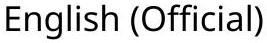
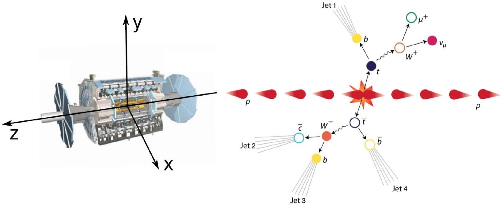
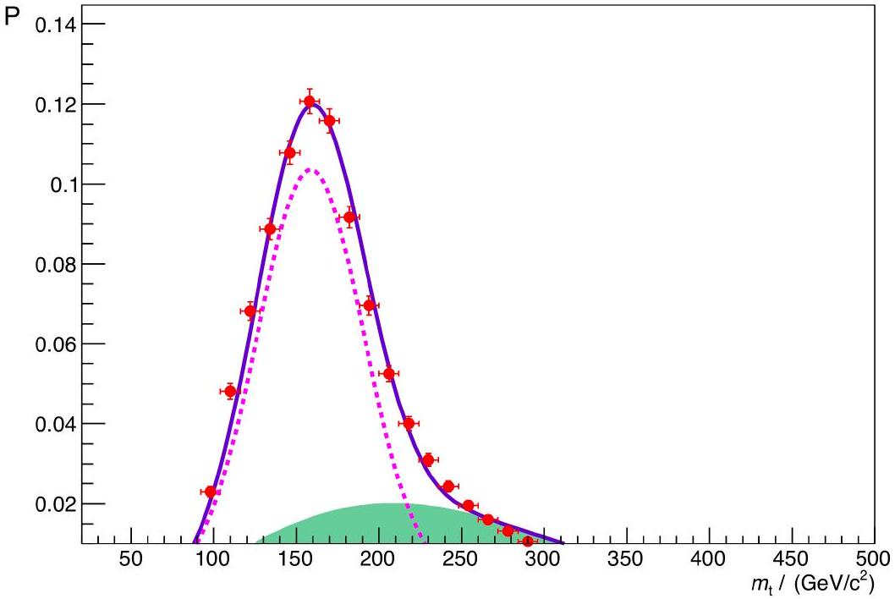

## Q2-1   English (Official)

## Where is the neutrino? (10 points)

When two protons collide with a very high energy at the Large Hadron Collider (LHC), several particles may be produced as a result of that collision, such as electrons, muons, neutrinos, quarks, and their respective anti-particles. Most of these particles can be detected by the particle detector surrounding the collision point. For example, quarks undergo a process called hadronisation in which they become a shower of subatomic particles, called "jet". In addition, the high magnetic field present in the detectors allows even very energetic charged particles to curve enough for their momentum to be determined. The ATLAS detector uses a superconducting solenoid system that produces a constant and uniform 2.00 Tesla magnetic field in the inner part of the detector, surrounding the collision point. Charged particles with momenta below a certain value will be curved so strongly that they will loop repeatedly in the field and most likely not be measured. Due to its nature, the neutrino is not detected at all, as it escapes through the detector without interacting.
Data: Electron rest mass, $m=9.11 \times 10^{-31} \mathrm{~kg}$; Elementary charge, $e=1.60 \times 10^{-19} \mathrm{C}$; Speed of light, $c=3.00 \times 10^{8} \mathrm{~m} \mathrm{~s}^{-1}$; Vacuum permittivity, $\epsilon_{0}=8.85 \times 10^{-12} \mathrm{~F} \mathrm{~m}^{-1}$

## Part A. ATLAS Detector physics (4.0 points)

A. 1 Derive an expression for the cyclotron radius, $r$, of the circular trajectory of an electron acted upon by a magnetic force perpendicular to its velocity, and express that radius as a function of its kinetic energy, $K$; charge modulus, $e$; mass, $m$; and magnetic field, $B$. Assume that the electron is a non-relativistic classical particle.

Electrons produced inside the ATLAS detector must be treated relativistically. However, the formula for the cyclotron radius also holds for relativistic motion when the relativistic momentum is considered.

A. 2 Calculate the minimum value of the momentum of an electron that allows it to escape the inner part of the detector in the radial direction. The inner part of the detector has a cylindrical shape with a radius of 1.1 meters, and the electron is produced in the collision point exactly in the center of the cylinder. Express your answer in $\mathrm{MeV} / c$.

When accelerated perpendicularly to the velocity, relativistic particles of charge $e$ and rest mass $m$ emitt electromagnetic radiation, called synchrotron radiation. The emitted power is given by

$$
P=\frac{e^{2} a^{2} \gamma^{4}}{6 \pi \epsilon_{0} c^{3}}
$$

where $a$ is the acceleration and $\gamma=\left[1-(v / c)^{2}\right]^{-1 / 2}$.

A. 3 A particle is called ultrarelativistic when its speed is very close to the speed of light. For an ultrarelativistic particle the emitted power can be expressed as:
$$
P=\xi \frac{e^{4}}{\epsilon_{0} m^{k} c^{n}} E^{2} B^{2}
$$
where $\xi$ is a real number, $n, k$ are integers, $E$ is the energy of the charged particle and $B$ is the magnetic field. Find $\xi, n$ and $k$.

## Theory

## Q2-2 

A. 4 In the ultrarelativistic limit, the energy of the electron as a function of time is: 1.0pt
$$
E(t)=\frac{E_{0}}{1+\alpha E_{0} t},
$$
where $E_{0}$ is the initial energy of the electron. Find $\alpha$ as a function of $e, c, B, \epsilon_{0}$ and $m$.
A. 5 Consider an electron produced at the collision point along the radial direction with an energy of 100 GeV. Estimate the amount of energy that is lost due to synchrotron radiation until the electron escapes the inner part of the detector? Express your answer in MeV.
0.5pt A. 6 Find an expression for the cyclotron frequency of the electron as a function of time in the ultrarelativistic limit.

## Part B. Finding the neutrino (6.0 points)

The collision between the two protons shown in Figure 1 leads to the production of a top quark $(t)$ and an anti-top quark ( $\bar{t}$ ), the heaviest elementary particles ever detected. The top quark decays into a $W^{+}$ boson and a bottom quark (b), while the anti-top quark decays into a $W^{-}$boson and an anti-bottom quark $(\bar{b})$. In the case depicted in Figure 1, the $W^{+}$boson decays into a anti-muon $\left(\mu^{+}\right)$and a neutrino $(\nu)$, and the $W^{-}$boson decays into a quark and an anti-quark. The task of this problem is to reconstruct the full momentum of the neutrino using the momenta of some detected particles. For simplicity, all particles and jets in this problem will be considered massless, except for the top quark and $\mathbf{W}^{ \pm}$bosons.

The momenta of the top quark decay products can be determined from the experiment (see Table), except for the neutrino momentum component along the ( $z$-axis). The total linear momentum of the final state particles caught by the detector is only zero on the transverse plane ( $x y$ plane), and not along the collision line ( $z$-axis). As such, one can find the transverse momentum of the neutrino from the missing momentum in the transverse plane.

On June 4, 2015, the ATLAS experiment at the LHC recorded a proton-proton collision at 00:21:24 GMT+1 like the one represented in Figure 1.

## Q2-3   English (Official)

Figure 1. Schematic representation of the ATLAS detector coordinate system (left) and proton-proton collision (right).

The linear momenta of the three final-state particles coming from the top quark decay, including the neutrino, is presented below for each component.

| Particle | $p_{x}(\mathrm{GeV} / c)$ | $p_{y}(\mathrm{GeV} / c)$ | $p_{z}(\mathrm{GeV} / c)$ |
| :--- | :--- | :--- | :--- |
| anti-muon ( $\mu^{+}$) | -24.7 | -24.9 | -12.4 |
| jet $1\left(j_{1}\right)$ | -14.2 | +50.1 | +94.1 |
| neutrino $(\nu)$ | -104.1 | +5.3 | --- |

B. 1 Find an equation which relates the square of the $W^{+}$boson mass, $m_{\mathrm{W}}^{2}$, with the neutrino and anti-muon momentum components presented in the table above. Express your answer in terms of the neutrino and anti-muon transverse momentum,
$$
\vec{p}_{\mathrm{T}}^{(\nu)}=p_{x}{ }^{(\nu)} \hat{\imath}+p_{y}{ }^{(\nu)} \hat{\jmath} \text { and } \vec{p}_{\mathrm{T}}{ }^{(\mu)}=p_{x}{ }^{(\mu)} \hat{\imath}+p_{y}{ }^{(\mu)} \hat{\jmath}_{\mathbf{,}}
$$
and their $z$-axis momentum components, $p_{z}{ }^{(\mu)}$ and $p_{z}{ }^{(\nu)}$.
B. 2 Assuming a $W^{+}$boson mass of $m_{\mathrm{W}}=80.4 \mathrm{GeV} / c^{2}$ calculate the two possible solutions for the neutrino momentum along the $z$-axis, $p_{z}{ }^{(\nu)}$. Express your answer in GeV/c.
B. 3 Calculate the top quark mass for each one of the two previous solutions. Express your answer in $\mathrm{GeV} / c^{2}$.
[If you did not obtain the two solutions in B.2, use
$$
p_{z}{ }^{(\nu)}=70 \mathrm{GeV} / c \text { and } p_{z}{ }^{(\nu)}=-180 \mathrm{GeV} / c \text {.] }
$$

## Q2-4   English (Official)

from the experiment), has two components: the so-called "signal" (corresponding to the decay of top quarks) and "background" (corresponding to events from other processes that do not include top quarks). Experimental data include both processes, see Fig. 2.

Figure 2. Top quark mass distribution as determined from the experiment, i.e. the normalised number of events plotted against the top quark mass. The dots correspond to the data. The dashed line corresponds to the "signal" and the shade to the "background".

B. 4 According to the top quark mass distribution, which one of the two previous solutions is more likely to be the right one? Estimate the probability for the most likely solution.
B. 5 Calculate the distance traveled by the top quark before decaying, using the most likely solution. Assume the top quark has a mean lifetime at rest of $5 \times 10^{-25} \mathrm{~s}$.
