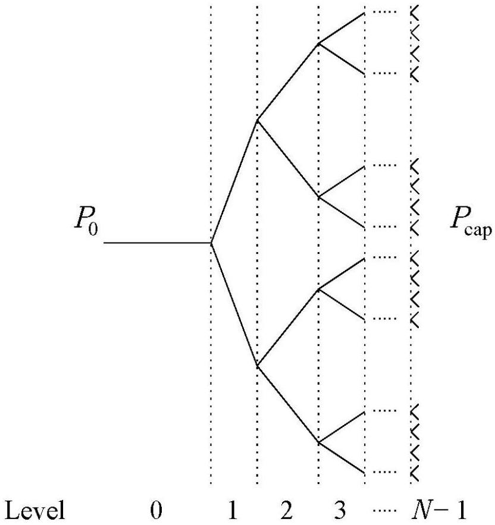
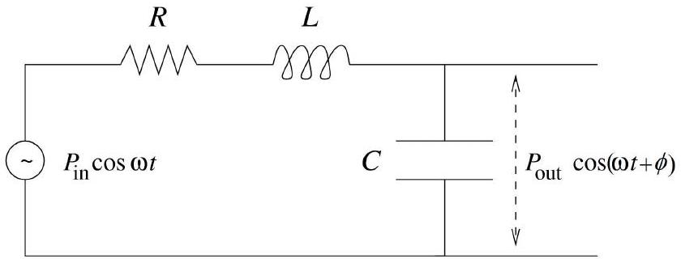
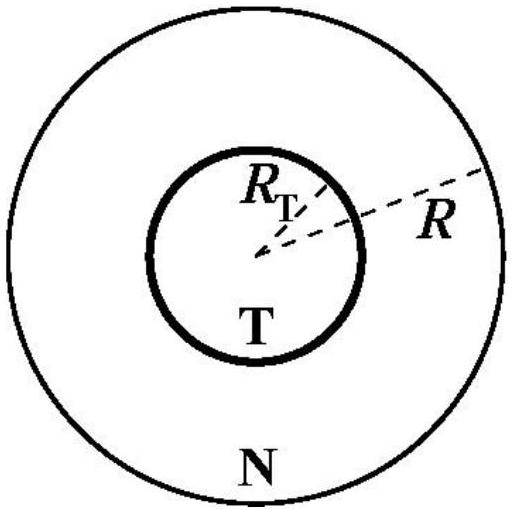

## Q3-1   English (Official)

## Physics of Live Systems (10 points)

Data: Normal atmospheric pressure, $P_{0}=1.013 \times 10^{5} \mathrm{~Pa}=760 \mathrm{mmHg}$

## Part A. The physics of blood flow (4.5 points)

In this part you will analyse two simplified models of blood flow in vessels.
Blood vessels are approximately cylindrical in shape, and it is known that for a steady, non turbulent flow of an incompressible fluid in a rigid cylinder, the difference in pressure of the fluid at the two ends of the cylinder is given by

$$
\Delta P=\frac{8 \ell \eta}{\pi r^{4}} Q,
$$

where $\ell$ and $r$ are the length and radius of the cylinder, $\eta$ is the fluid viscosity and $Q$ is the volumetric flow rate, i.e. the fluid volume that passes the cylinder cross section per unit time. This expression is often able to provide the correct order of magnitude for the pressure difference in a vessel, even without taking into account the pulsatile flow, the vessel's compressibility and irregular shape, and the fact that blood is not a simple fluid but a mixture of cells and plasma. Moreover, this expression has the same form as Ohm's law, with the volumetric flow rate being interpreted as a current, the difference in pressure as a voltage, and the factor $R=\frac{8 \ell \eta}{\pi r^{4}}$ as a resistance.
Consider for example the symmetrical network of arterioles (small arteries) depicted in Figure 1 that delivers blood to the capillary bed of a tissue. In this network, at each bifurcation a vessel is divided in two identical vessels. However, the vessels of higher levels are thinner and shorter: consider that the radii and lengths of vessels in two consecutive levels, $i$ and $i+1$, are related by $r_{i+1}=r_{i} / 2^{1 / 3}$ and by $\ell_{i+1}=\ell_{i} / 2^{1 / 3}$.

Figure 1. Network of arterioles.

## Q3-2   English (Official)

A. 1 Obtain an expression for the volumetric flow rate, $Q_{i}$, in a vessel at any level $i$, as a function of the total number of levels $N$, of the viscosity $\eta$, of the radius $r_{0}$ as a function of the total number of levels $N$, of the viscosity $\eta$, of the radius $r_{0}$ and length $\ell_{0}$ of the first vessel, and of the difference $\Delta P=P_{0}-P_{\text {cap }}$ between and length $\ell_{0}$ of the first vessel, and of the difference $\Delta P=P_{0}-P_{\text {cap }}$ between the pressure at the arteriole at level $0, P_{0}$, and the pressure at the capillary bed, the pressure at the arteriole at level $0, P_{0}$, and the pressure at the capillary bed, $P_{\text {cap }}$. $P_{\text {cap }}$.
1.3pt
A. 2 Calculate the numerical value of the volumetric flow rate $Q_{0}$ of the arteriole at level 0, if its radius is $6.0 \times 10^{-5} \mathrm{~m}$ and its length is $2.0 \times 10^{-3} \mathrm{~m}$. Consider that the pressure at the arteriole inlet is 55 mmHg and the vessel network has $N=6$ levels linking this arteriole to the capillary bed at the pressure 30 mmHg . Consider that the blood viscosity is $\eta=3.5 \times 10^{-3} \mathrm{~kg} \mathrm{~m}^{-1} \mathrm{~s}^{-1}$. Express your result in $\mathrm{ml} / \mathrm{h}$.

0.5pt

A blood vessel as an LCR circuit
The approximation of rigid cylindrical vessels falls short for several reasons. It is particularly important to include the time dependent flow and to take into account the change in vessel diameter that occurs when the pressure varies during a blood pumping cycle done by the heart. Moreover, it is observed that in the larger vessels the blood pressure varies significantly during a cycle, while in the smaller vessels the amplitude of the oscillations in pressure is much smaller, and the flow is almost time independent.

When the pressure increases in a single elastic vessel, there will be an increase in its diameter, thus permitting to store more fluid in the vessel, and to deliver it when the pressure drops. For this reason, the elastic behaviour of the vessel can be simulated by adding a capacitor to our initial description. Moreover, when taking into account the time dependent blood flow rate, one has to consider the inertia of the fluid, proportional to its density $\rho=1.05 \times 10^{3} \mathrm{~kg} \mathrm{~m}^{-3}$. This inertia can be described by an inductance in our model. In Figure 2 we represent the equivalent circuit for a single vessel in this model. The equivalent capacitance and inductance are given by

$$
C=\frac{3 \ell \pi r^{3}}{2 E h} \quad \text { and } \quad L=\frac{9 \ell \rho}{4 \pi r^{2}},
$$

respectively, where $h$ is the width of the vessel wall and $E$ is the artery Young's modulus, a coefficient that describes the alteration in size of the vessel tissue when a force is applied. The Young's modulus has units of pressure and is on the order of $E=0.06 \mathrm{MPa}$ for arterioles.

Figure 2. Equivalent electric circuit for a single vessel.

## Q3-3   English (Official)

A. 3 Obtain, in the stationary regime, the pressure amplitude at the vessel outlet, $P_{\text {out }}$, as a function of the pressure amplitude at the inlet, $P_{\text {in }}$, the equivalent resistance, $R$, inductance, $L$ and capacitance, $C$, for a flow with angular frequency $\omega$. Establish the condition between $\eta, \rho, E, h, r$ and $\ell$ so that, for low frequencies, the pressure oscillation amplitude at the outlet is smaller than that of $P_{\text {in }}$.
A. 4 For the vessel network in A. 2 estimate the maximum arteriole wall thickness $h$ so that the condition established in A. 3 is satisfied (consider that $h$ is level independent).

## Part B. Tumour growth (5.5 points)

Tumour growth is a very complex process where biological mechanisms such as cell proliferation and natural selection are intertwined with physics. In this problem we will consider a simplified model of tumour growth that addresses the increase in pressure commonly observed in solid tumors.

Consider a group of normal cells forming a tissue surrounded by an inextensible basement membrane, which forces the tissue to maintain always the same form: a sphere of radius $R$ (Figure 3).

Figure 3. Simplified tumour.

Initially the tissue does not have residual stresses, i.e. the pressure at every point is equal to the atmospheric pressure.

At time $t=0$, a tumour starts growing at the centre of this sphere and, as it grows, the pressure inside the tissue increases. Consider that both tissues (normal, N, and tumour, T) are compressible such that their densities, $\rho_{\mathrm{N}}$ and $\rho_{\mathrm{T}}$, increase linearly with pressure:

$$
\rho_{\mathrm{N}}=\rho_{0}\left(1+\frac{p}{K_{\mathrm{N}}}\right), \quad \rho_{\mathrm{T}}=\rho_{0}\left(1+\frac{p}{K_{\mathrm{T}}}\right),
$$

where $\rho_{0}$ is the rest tissue density, $p$ is the pressure difference to the atmospheric pressure and $K_{\mathrm{N}}, K_{\mathrm{T}}$ are the compressibility moduli (bulk moduli) of the normal and tumour tissues, respectively. In general, tumours are stiffer and so they have a higher bulk modulus.

## Q3-4   English (Official)

B. 1 The mass of normal cells is not altered while the tumour is growing. Obtain the ratio between the tumour volume and the total tissue volume, $v=V_{\mathrm{T}} / V$, as a function of the ratio between the tumour mass $\left(M_{\mathrm{T}}\right)$ and the normal tissue mass $\left(M_{\mathrm{N}}\right), \mu=M_{\mathrm{T}} / M_{\mathrm{N}}$ and the ratio of the bulk moduli, $\kappa=K_{\mathrm{N}} / K_{\mathrm{T}}$.

1.0pt Hyperthermia is sometimes used together with chemotherapy and radiotherapy in the treatment of cancer. In hyperthermia the cancer cells are selectively heated from the normal human body temperature, 37 °C, to temperatures above 43 °C, inducing their death. Researchers are currently developing carbon nanotubes covered with special proteins capable of binding to tumour cells. When the tissue is irradiated with near-infrared radiation, the nanotubes absorb it in a much greater extent than the surrounding tissues and therefore can be selectively heated as well as the tumour cells to which they are attached.

Consider that the tumour, the normal cells and the surrounding tissue have a constant thermal conductivity $k$, i.e. in the geometry of this problem, the energy that crosses a spherical surface of radius $r$ per unit time and per unit area is equal to $k$ times the derivative of the temperature with respect to $r$. The nanotubes are uniformly distributed in the tumour volume and are able to deliver a power $\mathcal{P}$ of thermal energy per unit volume. Assume that the temperature is equal to the normal human body temperature very far away from the tumour.

B. 2 Obtain, for the stationary state, the temperature at the centre of the tumour as a function of $\mathcal{P}, k$, the human body temperature and the tumour radius, $R_{\mathrm{T}}$. a function of $\mathcal{P}, k$, the human body temperature and the tumour radius, $R_{\mathrm{T}}$.

1.7pt
B. 3 Obtain the minimum power per unit volume, $\mathcal{P}{ }_{\text {min }}$, needed to heat up all tumour
0.5pt cells in a tumour with 5.0 cm radius to a temperature larger than 43.0 °C. Take the thermal conductivity of the tissue to be equal to $k=0.60 \mathrm{~W} \mathrm{~K}^{-1} \mathrm{~m}^{-1}$. the thermal conductivity of the tissue to be equal to $k=0.60 \mathrm{~W} \mathrm{~K}^{-1} \mathrm{~m}^{-1}$.

Consider that the tumour is irrigated by a vessel network with a branched structure like in question A.1. As the tumour grows, when its pressure $p$ becomes larger than the pressure $P_{\text {cap }}$ at the thinnest vessels, the radii of these vessels will decrease by a small amount $\delta r$. If this pressure reaches a critical value $p_{\mathrm{c}}$ (which would correspond to a radius decrease of $\delta r_{\mathrm{c}}$ ), the thinnest vessels would collapse, compromising seriously the irrigation to the tumour. The pressure and the radius change can be related by the following phenomenological relation:

$$
\frac{p}{P_{\text {cap }}}-1=\left(\frac{p_{\mathrm{c}}}{P_{\text {cap }}}-1\right)\left(2-\frac{\delta r}{\delta r_{\mathrm{c}}}\right) \frac{\delta r}{\delta r_{\mathrm{c}}} .
$$

Consider that just the smallest vessels (of level $N-1$ ) have their radius altered when the tumour increases its pressure.

B. 4 In the linear regime (i.e. consider that $p-P_{\text {cap }}$ is very small), express the relative drop in the flow rate, $\frac{\delta Q_{N-1}}{Q_{N-1}}$, in these thinnest vessels, as a function of the tumour volume ratio $v=V_{\mathrm{T}} / V$ and $K_{N}, N, p_{\mathrm{c}}, \delta r_{\mathrm{c}}, r_{N-1}, P_{\text {cap }}$.
