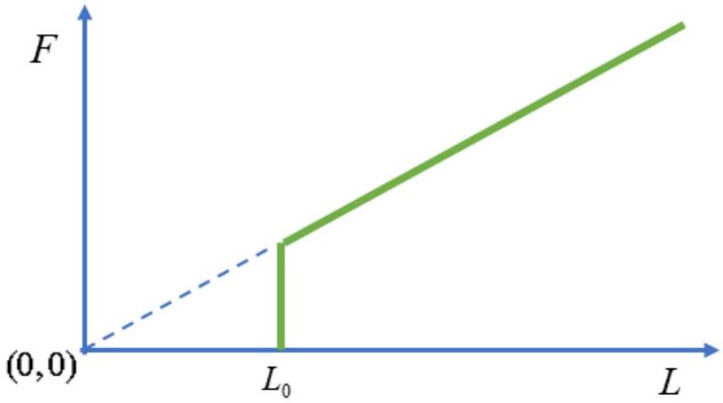
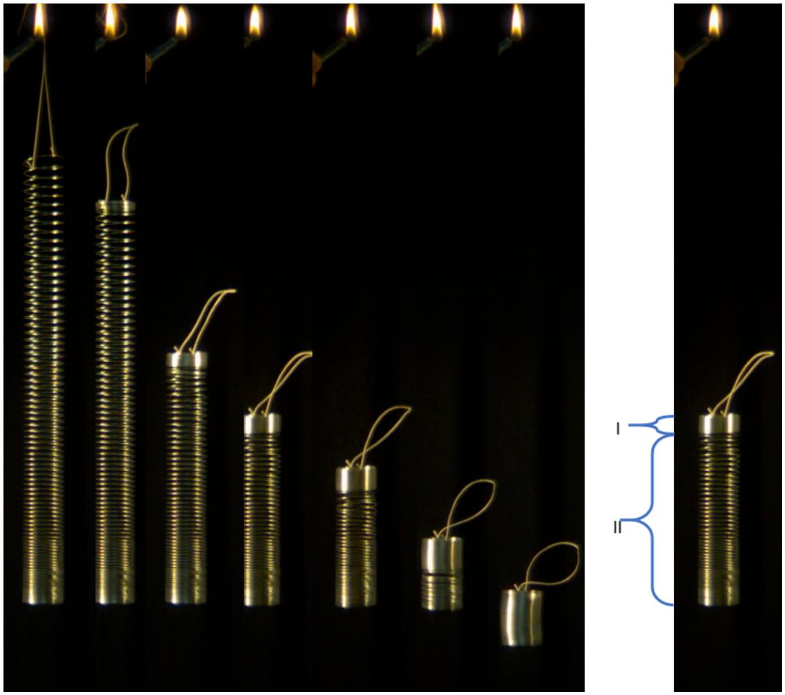

## Zero-length springs and slinky coils

A zero effective length spring (ZLS) is a spring for which the force is proportional to the spring's length, $F=k L$ for $L>L_{0}$ where $L_{0}$ is the minimal length of the spring as well as its unstretched length. Figure 1 shows the relation between the force $F$ and the spring length $L$ for a ZLS, where the slope of the line is the spring constant $k$.

Figure 1: the relation between the force $F$ and the spring length $L$

A ZLS is useful in seismography and allows very accurate measurement of changes in the gravitational acceleration $g$. Here, we shall consider a homogenous ZLS, whose weight $M g$ exceeds $k L_{0}$. We define a corresponding dimensionless ratio, $\alpha=k L_{0} / M g<1$ to characterize the relative softness of the spring. The toy known as "slinky" may be (but not necessarily) such a ZLS.

Part A: Statics (3.0 points)

A. 1 Consider a segment of length $\Delta \ell$ of the unstretched ZLS spring which is then 0.5pt stretched by a force $F$, under weightless conditions. What is the length $\Delta y$ of this segment as a function of $F, \Delta \ell$ and the parameters of the spring?
A. 2 For a segment of length $\Delta \ell$, calculate the work $\Delta W$ required to stretch it from 0.5pt its original length $\Delta \ell$ to a length $\Delta y$.

Throughout this question, we will denote a point on the spring by its distance $0 \leq \ell \leq L_{0}$ from the bottom of the spring when it is unstretched. In particular, for every point on the spring, $\ell$ remains unchanged as the spring stretches.

A. 3 Suppose that we hang the spring by its top end, so that it stretches under its 2.0pt own weight. What is the total length $H$ of the suspended spring in equilibrium? Express your answers in terms of $L_{0}$ and $\alpha$.

Part B: Dynamics (5.5 points)
Experiments show that when the spring is hung at rest and then released, it gradually contracts from the top, while the lower part remains stationary (see Figure 2). As time advances, the contracting part moves as a solid chunk and accumulates additional turns of the spring, while the stationary part becomes shorter. Every point on the spring begins to move only when the moving part reaches it. The bottom end

## Theory

of the spring starts moving only when the spring is fully collapsed and reaches its unstretched length $L_{0}$. After that, the contracted spring continues falling straight downwards, without tumbling, as a rigid body under the influence of gravity.

Figure 2: Left: a sequence of pictures taken during the free fall of slinky. Right: the moving part I and the stationary part II during the free fall of the spring.

In the remaining parts of the question, you are asked to base your solution on this described model. You may neglect air resistance, but you are not allowed to neglect $L_{0}$.

B. 1 Calculate the time $t_{c}$ it takes from the moment the spring is released, until it fully collapses back to its minimal length $L_{0}$. Express your answer in terms of $L_{0}, g$ and $\alpha$.
Compute the numerical value of $t_{c}$ for a spring with $k=1.02 \mathrm{~N} / \mathrm{m}, L_{0}=0.055 \mathrm{~m}$ and $M=0.201 \mathrm{~kg}$, while taking $g$ to be $9.80 \mathrm{~m} / \mathrm{s}^{2}$.

## Theory

## Q1-3   -

" н p ou her hth her the the the atp he have
" нанка ன " "

"
Gratura

" "ребинское GAÓ the chext
