## Crystallography

Errors - no evaluation required. A list of equipment and recommendations for its use are at the very end of the problem.

## Introduction

Crystallography is when a football stadium-sized synchrotron is used to measure distances on the order of several angstroms (the length of the peptide bond between amino acids $1.3 \AA$ ).

The main object studied in crystallography is a crystal. It can be thought of as one periodically repeating element in space - a unit cell. (Fig. 1)

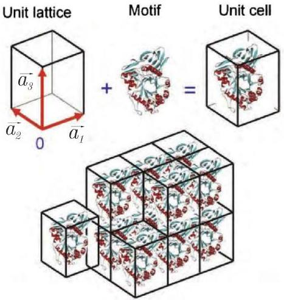
Figure 1: Unit cell represents whole crystal.

If $\rho(\vec{x})$ is some real function that describes the structure of the unit cell (for example, the positions of atoms or the density of electrons) and $\overrightarrow{a_{1}}, \overrightarrow{a_{2}}, \overrightarrow{a_{3}}$ - lattice vectors (may not be perpendicular to each other), then a complete crystal can be generated using the following equation:

$$
\rho\left(\vec{x}+e \cdot \overrightarrow{a_{1}}+f \cdot \overrightarrow{a_{2}}+g \cdot \overrightarrow{a_{3}}\right)=\rho(\vec{x}), \quad e, f, g, \in \mathbb{Z} .
$$

In the case of 1D or 2D crystals, one $\left(\overrightarrow{a_{1}}\right)$ or two vectors $\left(\overrightarrow{a_{1}}\right.$ and $\left.\overrightarrow{a_{2}}\right)$, respectively, is sufficient to create a crystal from a unit cell.

The main task of the crystallographic experiment is to determine the crystal structure (in particular, $\left.\rho(\vec{x}), \overrightarrow{a_{1}}, \overrightarrow{a_{2}}, \overrightarrow{a_{3}}\right)$.

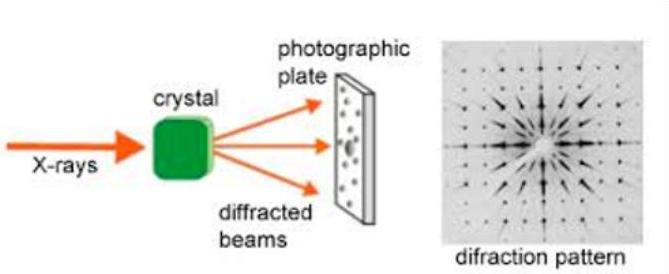
Figure 2: Scheme of a crystallographic experiment.

Due to the periodicity of the crystal, one method that can be used to determine the structure is radiation diffraction.

In the crystallographic experiment (Fig. 2), an incident beam with intensity $I_{0}$, wavelength $\lambda$ and wave vector $\vec{k}_{i},\left(\left|\vec{k}_{i}\right|=2 \pi / \lambda\right)$ passes through the crystal (in the case of a 2D crystal $\vec{k}_{i}$, it is perpendicular to the crystal plane). The diffracted beam has the same wavelength $\lambda$, wave vector $\vec{k}_{s^{\prime}}\left|\vec{k}_{s}\right|=\left|\vec{k}_{i}\right|$ and can be denoted by the scattering vector $\vec{q}=\vec{k}_{s}-\vec{k}_{i}$ (Fig. 3). It is clear that $q=2 k_{i} \sin (\theta / 2)$. The angle $\theta$ between $\vec{k}_{s} u \vec{k}_{i}$ can be considered much less than one, that is, $q \ll k_{i}$.

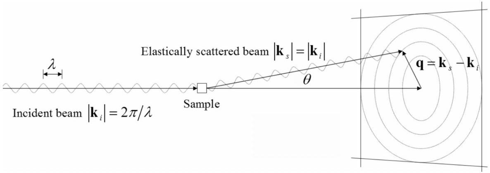
Figure 3: Scattering vector.

The complex amplitude $F(\vec{q})$ of the diffracted ray $\vec{q}$ is called the structure factor (since it is determined by the crystal structure) and is denoted $F(\vec{q})$. It has a module $|F|$ and $\varphi$ phase:

$$
F(\vec{q})=|F| \cdot \exp (i \varphi) .
$$

The measured intensity $I(\vec{q})$ is the square of the modulus of the complex amplitude:

$$
I=|F|^{2}=F F^{*} .
$$

Further processing of these intensities gives the densites $\rho(\vec{x})$. Usually the crystals under investigation contain small inorganic (salts or complex compounds) or even large organic molecules (proteins or DNA), and the density $\rho(\vec{x})$ determines the atomic positions of the compound. In this case, coherent X-rays with a wavelength of $1 \div 10 \AA$ (for example, synchrotron radiation) are used, corresponding to typical distances between atoms. If the distances are greater, a different wavelength should be chosen (for example, visible light can be used for optical gratings).

Now you will try to become a crystallographer. In Part A, using the example of a diffraction grating (1D crystal), we will study the basic laws. In Parts B, C, D you will define the lattice parameters, unit cell symmetries and then the detailed structure.

## A. From slit to crystal

The simplest example of a crystal is an optical diffraction grating - it can be viewed as a one-dimensional crystal. Such a crystal has a slit (width $b$ ) and an inter-slit gap as a unit cell (Fig. 4A). The lattice period $a_{1}=a$ is a one-dimensional vector that generates the crystal.

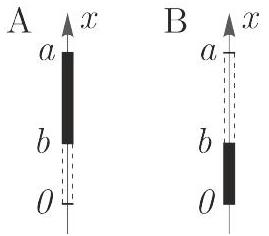
Figure 4: Unit cells (A and B) of a 1D crystal (diffraction grating). The non-transparent areas are shown in black.

When observing Fraunhofer diffraction on a diffraction grating, the light intensity $I$ depends on the light propagation angle $\theta$ as follows

$$
I(\theta)=\frac{I_{0}}{N^{2}}\left(\frac{\sin \left(\frac{N \pi a \sin \theta}{\lambda}\right)}{\sin \left(\frac{\pi a \sin \theta}{\lambda}\right)}\right)^{2} \cdot\left(\frac{\sin \left(\frac{\pi b \sin \theta}{\lambda}\right)}{\left(\frac{\pi b \sin \theta}{\lambda}\right)}\right)^{2},
$$

where $I_{0}$ is the intensity at $\theta=0, N$ is the number of illuminated slits of the diffraction grating. To understand equation 4, you need to know that:

$$
\lim _{x \rightarrow 0} \frac{\sin x}{x}=1 .
$$

A. 1 Write the formula 4 using the scattering vector $q\left(q \ll k_{i}\right)$. 0.3pt
A. 2 Find scattering vector $q$ for the maximum numbered $h$ for a diffraction grating
0.2pt with a period $a$. with a period $a$.
A. 3 Let $q_{1}$ be the scattering vector for the first maximum. Express $q$ in terms of $q_{1}$ 0.2pt for intensity maxima. How are $q_{1}$ and $a$ related?
A. 4 Observe the diffraction of samples DG1-DG5. Determine experimentally $q_{1}$, and $a$ for each sample. Draw a scheme of your setup, write the quantities you measure, and write down the formulas for the calculations.
A. 5 Conduct an experiment and determine the $a / b$ ratio for samples DG3, DG4, DG5. 1.5pt Explain your solution using formulas, diagrams, and pictures. It is known that $b \leq a / 2$.
It can be noted that the period of the crystal $a_{1}=a$ is responsible for the periodicity of the diffraction maxima, and the unit cell parameters (slit width $b$ ) are responsible for the intensity of the maxima. This fact is used to simplify the calculation of the relative intensities of the maxima by using the structure factor $F(q)$ :

$$
F(q) \sim \int \rho(x) \exp (i q x) d x
$$

where $\rho(x)$ - is transmission (the ratio of the amplitudes of the transmitted wave to the incident wave), $q$ - the scattering vector, which describes the position in the diffraction pattern. Integration is carried out
over the entire unit cell. If we replace $q$ with the position of this or that maximum, it will be possible to find the relative intensities of the maxima as $I=|F|^{2}$. Here and below $\rho(x) \in \mathbb{R}$.
The positions of the intensity maxima for crystal diffraction (called reflexes) can always be represented as a sum of vectors (called reciprocal lattice vectors):

1-D: $\vec{q}=h \cdot \vec{q}_{1}$, where $h \in \mathbb{Z}$;
2-D: $\vec{q}=h \cdot \vec{q}_{1}+k \cdot \vec{q}_{2}$, where $h, k \in \mathbb{Z}$;
3-D: $\vec{q}=h \cdot \vec{q}_{1}+k \cdot \vec{q}_{2}+l \cdot \vec{q}_{3}$, where $h, k, l \in \mathbb{Z}$.

Thus, each reflex for a 3D crystal can be denoted by three numbers $(h, k, l)$ (and $(h)$ for 1D and $(h, k)$ for 2D) and has its own complex amplitude $F(h, k, l)$ and intensity $I(h, k, l)$.

A. 6 Write down $\rho(x)$ for the unit cell of the diffraction grating from A1 (Fig. 4A). Use the coordinate system as shown in the figure. Suppose that the unit cell is such that the period of the lattice $a$ is $p$ times the width of the slit $b: a=p b, \quad p \in \mathbb{N}$. Calculate the structure factor $F_{A}(h)$ for this unit cell for reflex $h$. Record your answer using $h$ and $q_{1}$. What maxima have intensity 0 ? Write the equation for $h$ for such maxima.
A. 7 Consider another unit cell (Fig. 4B) of the diffraction grating. Calculate the
0.7pt structure factor $F_{B}(h)$ for this unit cell for reflex $h$. What reflexes of this diffraction grating have an intensity of 0? Write the equation for $h$ for such reflexes. tion grating have an intensity of 0? Write the equation for $h$ for such reflexes.
A. 8 These two diffraction gratings described above are illuminated with light of the same intensity. Find the quotients $I_{A, h=0} / I_{B, h=0}$ and $I_{A, h=1} / I_{B, h=1}$.

## B. 2D crystal

In this part you will go through the first step in defining the structure - finding the lattice parameters.

## The reciprocal lattice vectors in the case of 2D

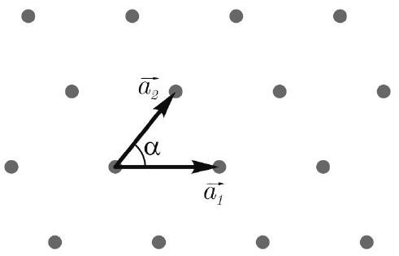
Figure 5: 2D crystal with vectors $\overrightarrow{a_{1}}$ and $\overrightarrow{a_{2}}$ as lattice vectors. The points represent the positions of the atoms in this crystal.

Let us consider diffraction on a two-dimensional crystal. A schematic 2D crystal of point atoms is shown in Fig. 5. Lattice vectors $\overrightarrow{a_{1}}$ and $\overrightarrow{a_{2}}$ has an angle $\alpha \leq 90^{\circ}$ between them.

If the plane of a given 2D crystal is placed perpendicular to the beam, then a periodic diffraction pattern appears on the screen behind the crystal, the position of the maxima of which is described by the expression $\vec{q}=h \cdot \vec{q}_{1}+k \cdot \vec{q}_{2}$, where $h, k \in \mathbb{Z}$.

You can get an idea of such a diffraction pattern by looking at the diffraction patterns of UC1-UC7 samples.

B. 1 Find the angle $\beta$ between the vectors $\vec{q}_{1}$ and $\vec{q}_{2}$ and their lengths $q_{1}, q_{2}$. Please note that these vectors must be of minimum length and the angle between them must be $\leq 90^{\circ}$. Express your answer through the crystal parameters $a_{1}, a_{2}, \alpha$ (Fig. 5)

1.0pt

Samples UC1-UC4: the simplest 2D crystals
Consider four 2D crystals A, B, C, D (Fig. 6). These crystals have a square unit cell with perpendicular lattice vectors of equal length. The unit cell of each crystal contains an atom (a non-transparent square with a side $b$ on a transparent film). Unit cells C and D also contain displaced atoms of the second type. In crystal C, the size of an atom of the second type $b^{\prime}$ is larger than that of the first: $b^{\prime}>b$. In crystal D, the second atom is the same size as the first, and is displaced half a period to the right and half a period up.

B. 2 For crystals A and D, find the complex amplitude modulus $|F(h, k)|$ for the reflex $(h, k)$. Express your answer in terms of $a$ (crystal period) and $b$ (atom size). It is enough to indicate an expression that is true for all reflexes except for the central one ( $h=0, k=0$ )

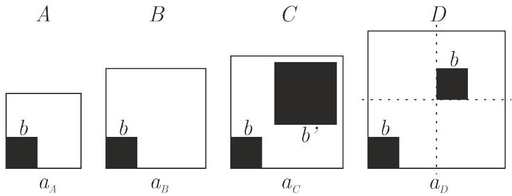
Figure 6: The unit cells for crystals A-D are square. It is known that $a_{B}>a_{A}$. No other size ratios are known.

B. 3 Look at the diffraction patterns of samples UC1-UC4. For each UC1-UC4 sample, 0.6pt experimentally determine the crystal lattice period $a_{U C 1}, a_{U C 2}, a_{U C 3}, a_{U C 4}$.
B. 4 For each UC1-UC4 sample, find the corresponding crystal structure among Fig. 0.4pt 6. Explain your choice using diagrams, pictures and formulas.
B. 5 Determine the size of the atom $b$.

0.8pt

Samples UC5-UC6: Still Simple 2D Crystals

B. 6 Observe the diffraction patterns of samples UC5, UC6, UC7. Determine experimentally the parameters $a_{1}, a_{2}$ and the angle $\alpha$ for each sample. Explain which parameters of the diffraction pattern you are using with the help of diagrams and figures.

1.2pt
C. Crystal Symmetries

The second step after calculating the parameters of the unit cell is to determine the symmetry of the unit cell.

Symmetries: Understand Theoretically
The unit cells of real crystals often contain several molecules with some symmetry between them (Fig. 7). Knowing these symmetries greatly simplifies the process of defining the structure. The symmetry of the unit cell causes reciprocal symmetries and systematic absences (reflexes with zero intensity for each unit cell with this symmetry). Systematic absence is determined by special conditions for $h$ and $k$ (Fig. 8).

Typical Symmetries for Reflex Intensities:

- mirror symmetry about some straight line. This line is called the axis of symmetry and is denoted by the equation of this line;
- rotational symmetry of order $m$ (denoted as $C_{m}$ for a specific center of rotation, $m \in \mathbb{N}$ ). When rotated through an angle of $360^{\circ} \cdot n / m, n \in \mathbb{Z}$, the picture transforms into itself).

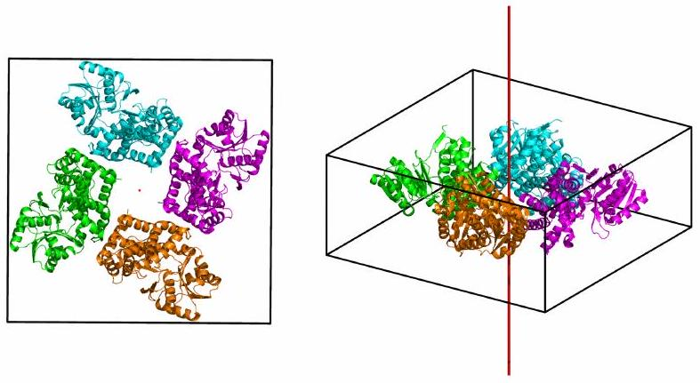
Figure 7: This unit cell has the rotation symmetry $C_{4}$ : rotation around the red axis by $n \cdot 90^{\circ}$ degrees, $n \in \mathbb{Z}$ gives the same cell.

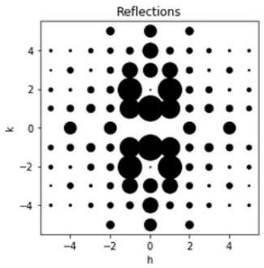
Figure 8: Reflexes ( $h=2 n+1, k=0$ ) are systematically absent. Note: Reflex ( 0,0 ) with relatively high intensity is omitted here for clarity.

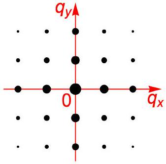
Figure 9: Diffraction image of 2D crystal.

Consider a diffraction image (Fig. 9) from a 2D crystal with perpendicular lattice vectors equal to each other ( $a_{1}=a_{2}$ ). This diffraction image (only reflexes with $|h|,|k| \leq 2$ ) is shown in the figure.

C. 1 Specify $h$ and $k$ for the point that will be the center of rotation. What orders of rotational symmetry $m$ are possible for a given image? Draw all possible axes of mirror symmetry in the image. Name your lines.

The axis of symmetry is - a straight line, which means it can be indicated as an equation of the straight line $c_{1} \cdot q_{x}+c_{2} \cdot q_{y}=d$, where $c_{1}, c_{2}, d$ are some coefficients.

C. 2 Specify the equation of the straight line for each axis of mirror symmetry drawn in the previous task. Do not forget to note which equation corresponds to which line.
C. 3 For each rotation symmetry and axis of mirror symmetry, write down the corresponding notation ( $C_{m}$ for rotation and equation for mirror symmetry) and the equation for the intensities $I\left(q_{x}, q_{y}\right)$, which should take place if this symmetry element is present.
C. 4 Write down the equation for the intensities of the reflexes $(h, k)$ and $(-h,-k)$. 0.2pt What symmetry from question C1 corresponds to this equation? Explain your answer.

Let us consider some crystals with unit cells as in Fig. 10. Black squares represent non-transparent elements, white squares represent transparent elements. The unit cell of crystal 2 was obtained by mirror symmetry of the initial unit cell relative to the $x=0$ axis. The unit cell of crystal 3 was obtained by the
mirror symmetry of the initial unit cell about the $y=x$ axis. Crystal 4 is obtained by shifting the original one by the vector $\left(x_{1}, y_{1}\right)$.

C. 5 Using the definition of the structure factor and symmetry find the structural factors $f_{2}\left(q_{x}, q_{y}\right), f_{3}\left(q_{x}, q_{y}\right), f_{4}\left(q_{x}, q_{y}\right)$ for crystals 2, 3, 4, respectively. Express factors $f_{2}\left(q_{x}, q_{y}\right), f_{3}\left(q_{x}, q_{y}\right), f_{4}\left(q_{x}, q_{y}\right)$ for crystals 2, 3, 4, respectively. Express your answer in terms of the structure factor $F\left(q_{x}, q_{y}\right)=f_{1}\left(q_{x}, q_{y}\right)$ of crystal 1. your answer in terms of the structure factor $F\left(q_{x}, q_{y}\right)=f_{1}\left(q_{x}, q_{y}\right)$ of crystal 1.
0.4pt
C. 6 Consider an arbitrary 2D crystal (Fig. 5). Indicate what orders of $m$ symmetry
C. 6 Consider an arbitrary 2D crystal (Fig. 5). Indicate what orders of $m$ symmetry of rotation can be in 2D crystals. Explain the answer. of rotation can be in 2D crystals. Explain the answer.

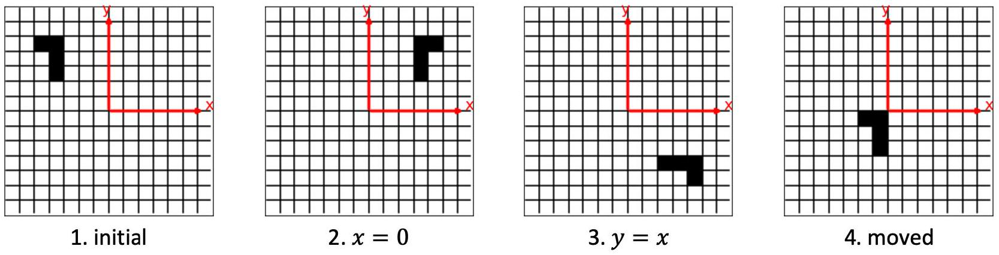
Figure 10: The unit cells of crystals 2, 3, 4 were obtained from 1 using different symmetries.

Symmetries: Observe Experimentally
The answer sheet contains unit cells for the patterns PG1-PG9. Having studied the symmetry of unit cells and diffraction patterns, and reflex absences, we will find a correspondence between them.

C. 7 Determine what symmetries the crystals with unit cells $K, L, M, N$, and $P, Q$, $R, S, T$ have. (Fig. in the answer sheet). Draw the axes of mirror symmetry, at $R, S, T$ have. (Fig. in the answer sheet). Draw the axes of mirror symmetry, at the bottom of the picture indicate which rotational symmetries are present on the bottom of the picture indicate which rotational symmetries are present on it. it.
0.9pt
C. 8 Observe the diffraction patterns of the samples PG 1, 2, 5, 8. These samples correspond to the unit cells $K, L, M, N$. Determine what symmetries the given diffraction patterns have. Find the correspondence between patterns and unit cells.

The symmetries of diffraction patterns can be calculated using the sum rule (the complex amplitude of a complex object is the sum of the complex amplitudes of the parts of that object) and knowledge of how the symmetries change the complex amplitudes of the terms. In addition, the sum rule allows you to define absences.

C. 9 Observe the diffraction of the samples PG 3, 4, 6, 7, 9. These samples correspond to the unit cells $P, Q, R, S, T$. Find the correspondence between samples and unit cells. Explain your solution using formulas, diagrams and pictures.

C. 10 Observe the diffraction pattern of the UC8 sample. Could this sample be a crys- 0.3pt tal? Explain your answer.
D. You still need phases ...

When you know the parameters of the unit cell and the symmetry of the unit cell, it is time for the last step - to determine the complete structure of the crystal.

Phase problem ...
When radiation is scattered by a crystal, the complex amplitudes can be calculated using the formula (the so-called Fourier transform)

$$
F(\vec{q}) \sim \int \rho(\vec{x}) \cdot \exp (i \vec{q} \vec{x}) d \vec{x}
$$

To determine the density of a crystal using a diffraction image, it is necessary to perform the inverse Fourier transform:

$$
\rho(\vec{x}) \sim \int F(\vec{q}) \cdot \exp (-i \vec{q} \vec{x}) d \vec{q}
$$

Since we have discrete reflexes, the above formula can be written as follows

$$
\rho(\vec{x}) \sim \sum|F(\vec{q})| e^{i \varphi} \cdot \exp (-i \vec{q} \vec{x}),
$$

where summation is performed over all reflexes. In fact, it is enough to take only the brightest reflexes, since their contribution to the sum is the largest.

The experimentally measured intensities $I(\vec{q})$ make it possible to determine only the modulus $|F(\vec{q})|$. Unfortunately, the intensities do not contain information about the phases $\varphi$, so it is impossible to directly calculate $\rho(\vec{x})$ from the intensities. This problem is called phase problem.
The usual way to solve the phase problem is to get some approximate phases, then calculate the density of the crystals using them, then update the phases using that density, and repeat this until you are satisfied with the resulting structure.

There are several methods for obtaining initial phases. One assumes that you already have a known crystal structure, and that the known and unknown crystals are structurally similar. In this case, you can simply use the phases calculated from the known structure with the measured intensities in the inverse Fourier transform (9) for the unknown structure.
... which you successfully solve
You have 3 different 2D crystals: MR0, MR1, MR2. The unit cell of each of them is a $4 \times 4$ square, with some squares non-transparent ( $\rho=0$ ), and others transparent ( $\rho=1$ ). The unit cell MR0 is known (Fig. 11). The structures MR1 (possible variants are shown in Fig. 12) and MR2 (contains 7 white squares) are unknown, but you know that they are quite similar to MR0.

Using the above approach, you will define the structures MR1 and MR2. Reflexes phases (in radians) with $|h|,|k| \leq 2$ were preliminary calculated (Fig. 13) for the MR0 structure (in the coordinate system shown in Fig. 11). Hint: the imaginary parts of the densities $\operatorname{Im} \rho(\vec{x})$ vanish with good accuracy, which means that it is enough to take into account only the real part of each term (9).

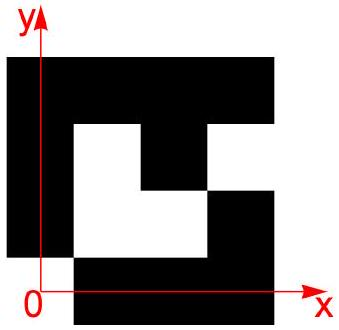
Figure 11: MR0 structure with coordinate system. White squares - transparent, black - nontransparent.

|  |  |  |  |
| :--- | :--- | :--- | :--- |
| W | X | Y | Z |

Figure 12: Possible unit cells of the MR1 crystal.

|  | 2 | 3.142 | 0.4636 | 0 | -0.4636 | 3.142 |
| :--- | :--- | :--- | :--- | :--- | :--- | :--- |
|  | 1 | 0 | -0.4636 | 2.034 | -1.571 | 0 |
| k | 0 | 3.142 | -1.571 | 0 | 1.571 | 3.142 |
|  | -1 | 0 | 1.571 | -2.034 | 0.4636 | 0 |
|  | -2 | 3.142 | 0.4636 | 0 | -0.4636 | 3.142 |
|  |  | -2 | -1 | 0 | 1 | 2 |

h

Figure 13: Reflexes phases (in radians) for the MR0 structure for the $|h| \leq 2, \quad|k| \leq 2$ reflexes.

D. 1 The crystal (MR0 or MR2) is illuminated with light with an intensity of $I_{0}$. Find 1.0pt the intensity of the maximum at $\vec{q}=0$.
D. 2 Determine the structure of the unit cell of the MR1 crystal. The MR1 crystal has 2.0pt one of the indicated units cell (Fig. 12). Describe your solution.
D. 3 Determine the unit cell structure of the MR2 crystal. The structure of MR2 is 2.0pt similar to MR0: two non-transparent squares have become transparent.

## Experiment Il ${ }^{\text {I }}$ Pho 2020

## Q1-11   English (Official)

## Equipment

## Equipment list

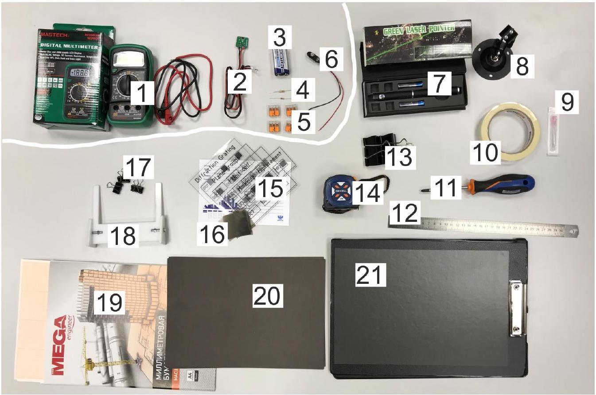
Figure 14: Equipment. In the upper left corner - details of the intensity detector.

1. Multimeter
2. Photodiode with magnet
3. Battery
4. Resistors 10 kOhm and 200 kOhm
5. Splicing Connectors (4 pcs.)
6. Battery holder
7. Red laser (wavelength $\lambda=630 \mathrm{~nm}$ )
8. Laser stand
9. Needle
10. Masking tape
11. Screwdriver
12. Ruler
13. Large clips (2 pcs.)
14. Tape Measure
15. Slides ("Diffraction grating", "Unit cell", "Plane group", "Molecular replacement") with samples

16. Film for reducing laser intensity
17. Small clips (4 pcs.)
18. Slide holder (needs to be assembled)
19. Graph paper
20. Cardboard
21. Tablet with magnetic layer

Samples

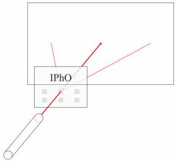
Figure 15: Place and illuminate the samples as shown.

Samples should be illuminated with a laser as follows. Position the sample so that the caption (slide title in English) is on top of the slide and reads from left to right. In this case, the laser should be in front of the slide, and the screen for observing should be behind the slide (Fig. 15).

Intensity detector

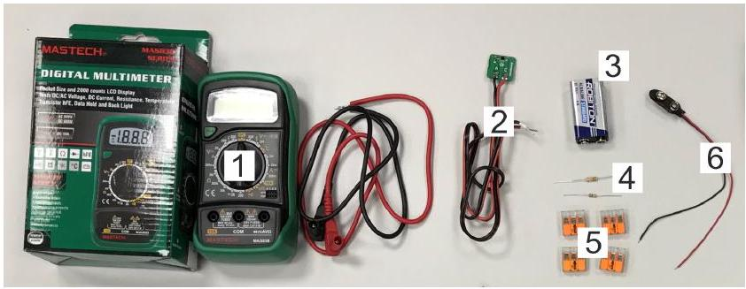
Figure 16: Items of the intensity detector.

To measure intensities, use a photodiode connected to a voltmeter, resistor and battery according to the circuit shown in Fig. 17. In such a circuit, the current through the diode is proportional to the intensity of the incident light.

Pay attention to the polarity of the connection. On the battery block, the red wire is positive. By default, use a $10 \mathrm{k} \Omega$ resistor, in case the measured intensities are very small - use a $200 \mathrm{k} \Omega$ resistor.

To use the connectors (fig. 18), do the following. Lift the lever up, insert the wire into the connector, lower the lever. All three connector points are electrically connected to each other.

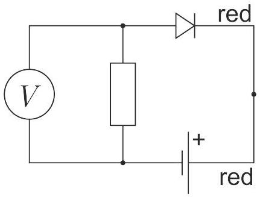
Figure 17: Intensity detector circuit. Pay attention to the polarity of the connection.

Figure 18: Scheme of splicing connector. All three connector points are electrically connected to each other.

## Laser

Mount the laser in the stand 8. Use a large clip to fix the laser on. If you need to make the laser beam narrower, then seal the laser hole with masking tape and make a hole in it with a needle. If you want to reduce the intensity of the laser - use a darkening film. Figure 19 is for your reference about that.
!WARNING! Direct exposure to the laser beam is hazardous to the eyes. Do not point the laser beam at yourself or other people. If you don't use the laser - turn it off.
!WARNING! A sharp needle is dangerous: you can get hurt! Use it carefully. When not in use, put the needle in the protective cover.

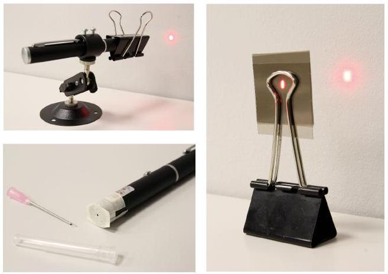
Figure 19: Laser is kept switched on using large clip. To reduce beam size use sticky tape and a needle. Darkening film in a holder (large clip) to reduce laser intensity.
