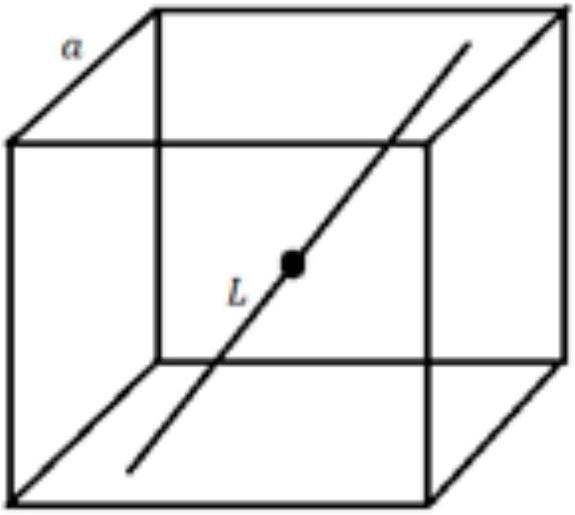
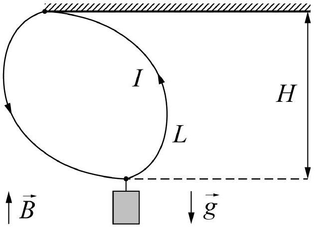

## Problem mix (10 points)

Part A. Cubic oscillations (2.5 points)

A. 1 A narrow straight channel passes through the center of a fixed cube with a side $a$. The cube is uniformly charged, the charge density is $\rho$. The distance from the cube center to the point of intersection of the channel and a face is $L$. In the channel there is a particle of a mass $m$ and a charge $q$. Find the period of small oscillations of the particle near the center. The gravitational interaction of the particle and the cube can be neglected. The cube and the particle are oppositely charged.

Part B. Suspension in magnetic field (3 points)

B. 1 A current $I$ flows through a loop made of a weightless flexible wire. The loop upper point is attached to the ceiling and a weight is suspended to its lowest point. The half length of the loop is $L$. The loop is placed in a vertical magnetic field $B$. The system has reached a stable equilibrium in which the point of suspension at the ceiling and the point of weight suspension are not on the same vertical. Find the wire tension $T$ and the weight $P$ if the distance from the ceiling to the lowest point of the loop is $H$.

Part C. Rod in magnetic field (4.5 points)

C. 1 A weightless rod of a length $2 R$ is placed perpendicular to a uniform magnetic field $\vec{B}$. Two identical small balls of mass $m$ and charge $q$ each are attached at the rod ends. Let us direct $z$-axis along the magnetic field and place the origin at the rod center. The balls are given the same initial velocity $v$ but in opposite directions so that one of the velocities is precisely in the $z$-direction. What are the maximum coordinates $z_{\text {max }}$ of the balls? Express your answer in terms of $q, B, m, v$, and $R$. Find the magnitude of the ball accelerations at this moment and express your answer in terms of $q, B, m, v, R$, and $z_{\text {max }}$.
