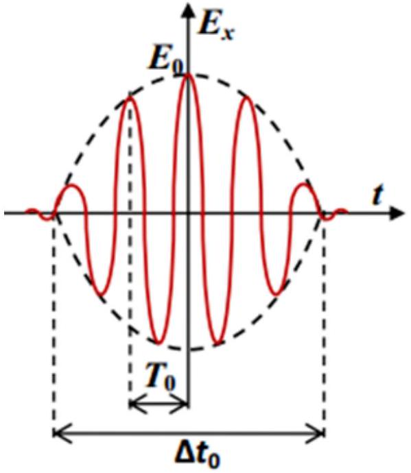

## Laser technologies (10 points)

When solving the problem, use the following values of the physical constants:
the speed of light in vacuum $c=3.00 \cdot 10^{8} \mathrm{~m} / \mathrm{s}$;
Planck's constant $\hbar=1.055 \cdot 10^{-34} \mathrm{~J} \cdot \mathrm{~s}$;
constant in Coulomb's law and electric constant $k=\frac{1}{4 \pi \varepsilon_{0}}=8.99 \cdot 10^{9} \frac{\mathrm{~N} \cdot \mathrm{~m}^{2}}{\mathrm{C}^{2}}$;
elementary charge $e=1.60 \cdot 10^{-19} \mathrm{C}$.

## Part A. Classical superradiance model

A laser is a source of coherent optical radiation. Laser radiation is generated when a large number of atoms transferred to an excited state by external action (pumping) emit photons with the same phase and polarization. A consistent theory of laser radiation is based on quantum mechanics but some aspects of this phenomenon can be understood by means of classical electrodynamics.

Let us first consider emission of a photon by a single atom. According to classical electrodynamics, an atom can be regarded as dipole emitter. In this model an electric dipole is associated with an atom comprised of an immobile atomic nucleus with a positive charge $+q$ and a negative charge $-q$ oscillating harmonically around it (the negative charge is located at the center of the charge distribution of electron cloud).

Here the atomic dipole moment oscillates according to the law $\vec{p}(t)=\vec{p}_{m} \cos (\omega t+\varphi)$. The cyclic oscillation frequency is related to the energy of emitted photons by the Planck relation $E_{\gamma}=\hbar \omega$. Hereinafter the frequency of photons means cyclic frequency. The radiation power of a classical system with a variable dipole moment $\vec{P}(t)$ is given by the formula

$$
W=\frac{2 k}{3 c^{3}}\left\langle\left(\frac{d^{2} \vec{P}}{d t^{2}}\right)^{2}\right\rangle,
$$

where the angle brackets stand for the averaging over the oscillation period.

A. 1 An atom emits light with a wavelength $\lambda_{0}=300 \mathrm{~nm}$. Using the classical model estimate an emission time $\tau$ (that is, the period of time it takes the atom to emit the energy equal to that of a single photon). This time coincides with the characteristic time, during which the atom emits a photon, by the order of magnitude. All radiation is due to a single electron located at a distance about $a_{0}=0.1 \mathrm{~nm}$ from the nucleus. Express your answer in terms of the physical constants, $\lambda_{0}$, and $a_{0}$.

Suppose $N$ atoms in a certain volume are transferred to an excited state by a short-term pumping action. It is known that one atom emits a photon with a frequency $\omega$ for a characteristic time $\tau$.

A. 2 Estimate the power $W_{s}$ of electromagnetic radiation of all $N$ atoms in the spontaneous emission mode, i.e. when the direction of atomic dipole and the phase of its oscillations randomly change from atom to atom. In your answer write down the formula for the power in terms of $N, \omega$, and $\tau$.

A. 4 Estimate the power $W_{i}$ of electromagnetic radiation of all $N$ atoms in the superradiance mode, i.e. when the direction of atomic dipoles and the phases of their oscillations are the same for all atoms in the excited state. Express your answer in terms of $N, \omega$, and $\tau$.

0.5pt

A. 5 Estimate the duration of the radiation pulse of the system of atoms in the superradiance mode. Express your answer in terms of the same quantities.

Part B. Nonlinear optics and pulse compression
Pulses of even shorter duration can be obtained by reducing the duration of already generated laser pulses. A pulse duration $\Delta t$ and a dispersion of frequency of pulse oscillations $\Delta \omega$ (spectral width) are related by the inequality $\Delta \omega \Delta t \geq 2 \pi$. Laser pulses generated in the superradiance mode already have the shortest possible duration for the given dispersion of frequencies, $\Delta t_{0} \approx \frac{2 \pi}{\Delta \omega_{0}}$. Therefore, the pulse duration can be reduced in two steps: first, increase the spectral width of the pulse (without changing the duration) and second, compress the pulse in time.

One of the most common ways to solve the first problem is pulse chirping. This method is based on the use of nonlinearity of a medium, i.e. dependence of the refractive index of the medium $n$ on the amplitude of oscillations of the electric field $E_{m}$ of the wave. The dependence is of the form $n=n_{0}+n_{2} E_{m}^{2}$, where $n_{0}$ and $n_{2}$ are some constants specific for the medium. Nonlinear effects are small, e.g. in quartz at a light intensity $I_{1}=10^{9} \mathrm{~W} / \mathrm{cm}^{2}$ the refractive index increases only by $n_{2} E_{m 1}^{2} \approx 3.2 \cdot 10^{-7}$. The intensity of an electromagnetic wave in a medium is determined by the formula $I=\frac{\varepsilon_{0} n_{0} c}{2} E_{m}^{2}$.
Consider a pulse of duration $\Delta t_{0}$ with a small dispersion of frequencies $\Delta \omega_{0} \approx \frac{2 \pi}{\Delta t_{0}}$, the average pulse frequency is $\omega_{0}$. An approximate dependence of the electric field on time in such a pulse is shown in the Figure. The speed of the wave maxima is the same at the pulse edges and in the central part it decreases due to the nonlinearity effects. Because of that the total pulse duration does not change, the frequency increases at the rear part of the pulse and decreases at the front. Such a pulse is called "chirped".

B. 1 Let the amplitudes of two wave maxima be $E_{m 1}$ and $E_{m 2}$. Find the difference in their propagation speeds $\Delta v$. Express your answer in terms of $n_{0}, n_{2}, c, E_{m 1}$, and $E_{m 2}$.
B. 2 A light pulse with a wavelength in vacuum of $\lambda_{0}=300 \mathrm{~nm}$ and a maximum intensity of $I_{0}=3 \cdot 10^{9} \mathrm{~W} / \mathrm{cm}^{2}$ propagates along the axis of a quartz fiber. Assume the envelope of a time dependence of the electric field squared $E_{m}^{2}(t)$ of the wave to be a parabola. How far (find the distance $s$ ) does the pulse propagate along the fiber before its spectral width increases by the factor of $K=200$ ? Express your answer in terms of $K, \lambda_{0}, n_{2}, E_{m}$ and calculate the numerical value (in meters, rounded to an integer).

To compress a chirped pulse in time one can pass it through a medium in which the group velocity of the wave depends on its frequency. For the medium under consideration, the dependence of wavenumber on frequency in the vicinity of the mean frequency $\omega_{0}$ can be represented as $k(\omega)=k_{0}+\beta_{1}\left(\omega-\omega_{0}\right)+$ $\frac{\beta_{2}}{2}\left(\omega-\omega_{0}\right)^{2}$, where $\beta_{1}=5 \mathrm{~ns} / \mathrm{m}$ and $\left|\beta_{2}\right|=20 \mathrm{fs}^{2} / \mathrm{mm}$.

B. 3 What sign should the constant $\beta_{2}$ have in order for the pulse chirped according to the scheme described above to be compressed in time in this medium? Please, indicate "+" or "-" in your answer. In what follows consider that $\beta_{2}$ has exactly this sign.
B. 4 A pulse described in B2 has a duration $\Delta t_{0}=10 \mathrm{ps}$ and an initial spectral width $\Delta \omega_{0} \approx 2 \pi / \Delta t_{0}$ (before chirping) and propagates in the medium described above. Find the distance the pulse should travel in order to achieve the minimum possible duration after chirping with spectrum broadening by the factor of $K=200$. Express your answer in terms of physical constants, $K, \Delta t_{0}, \beta_{1}$, and $\beta_{2}$ and calculate the numerical value in meters, rounded to an integer.
B. 5 Nonlinearity of a medium leads to disappearance of diffraction of a light beam of sufficiently high intensity. Estimate the minimum power of a light pulse $W_{c}$ at which it does not experience diffraction, i.e. propagates inside a narrow cylindrical channel of constant radius. Express your answer for $W_{c}$ in terms of physical constants, frequency $\omega_{0}, n_{0}$, and $n_{2}$. Assume the intensity distribution over the channel cross section to be approximately uniform. Find the numerical value of the power for a pulse with a wavelength in vacuum $\lambda_{0}=300 \mathrm{~nm}$ propagating in quartz. Coefficient $n_{0}=1.47$.

## Part C. Exoplanets

In astronomy observations of luminous objects are being made for long periods of time. This makes it possible to study variations of their emission spectra. Spectral measurements can detect planets orbiting distant stars -- "exoplanets". Exoplanets do not have their own radiation so one is bound to study radiation spectra of their stars. If the line of sight from Earth to an exoplanet lies almost in its orbital plane, such an exoplanet can be discovered by a decrease of the star brightness at a moment the exoplanet is crossing the star disk. However, if the orbital plane is tilted with respect to the direction to Earth this method does not work.

C. 1 Propose a method that would allow one to detect an exoplanet with a noticeable inclination of its orbital plane with respect to the line of sight by means of studying the spectrum of its star in the optical range. As an answer name the physical phenomenon underlying your method.
C. 2 Suppose an exoplanet of mass $m$ orbits a star of mass $M$ in a circular orbit of a radius $R$ and the period of revolution is $T$. The orbital plane is at an angle $\theta$ to the direction to Earth. Estimate the accuracy of the relative frequency measurement, $\Delta \omega / \omega$, required to detect such an exoplanet by your method. In your answer express $\Delta \omega / \omega$ in terms of the fundamental constants, $R, T, \theta, m$, and $M$.
C. 3 Assume the mass of the exoplanet and its star to be equal to the mass of Earth and the Sun, respectively. Assume the radius of the circular orbit to be equal to the distance from Earth to the Sun $\left(R \approx 1.5 \cdot 10^{11} \mathrm{~m}\right)$, the angle $\theta=60^{\circ}$. The Solar mass is 330,000 times of the Earth's mass, the period of the Earth's revolution around the Sun is 1 year. Find an integer $n$ such that $10^{-n}$ is the accuracy of relative frequency measurement required by your method. Usage of ultrashort (femtosecond) laser pulses makes it possible to measure frequencies in the optical range $\left(10^{15} \mathrm{~Hz}\right)$ with an accuracy of about 10 Hz. Is this accuracy enough to register the exoplanet?
