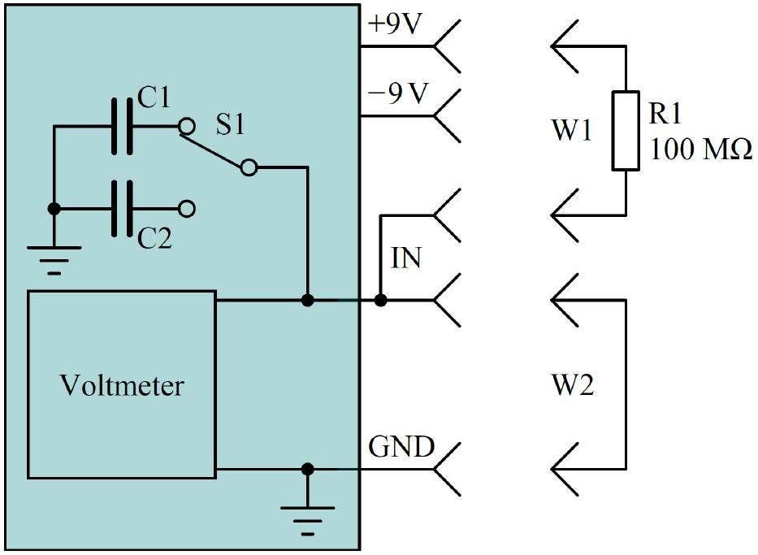

## Non-ideal capacitors (10 points)

This experiment is designed to investigate the properties of capacitors.
Capacitor's capacitance (which always means differential capacitance in this text) can be found based on its charging graph of its voltage $U(t)$ via the resistor $R_{1}$. Depending on the circuit, it is necessary to find the relation of capacitor's charging current vs voltage $I(U)$ and use it to determine capacitance:

$$
C(U)=\frac{\mathrm{d} q}{\mathrm{~d} U}=\frac{I \mathrm{~d} t}{\mathrm{~d} U}=\frac{I(U)}{\mathrm{d} U / \mathrm{d} t} .
$$

The electric circuit implemented in this experiment is shown in Fig. 1.1. Switch S1 on the board can be used to switch between capacitors C1 and C2. The middle position of the switch does not play any role in this experiment and should never be used.

Figure 1.1. Electric circuit for the experiment.

Caution: one of the sample capacitors contains a dielectric with dielectric permittivity that depends on the capacitor voltage change rate. To keep this rate as stable as possible, when measuring at the positive voltages, the capacitor should be charged from 9 V down to -9 V, while measurements at the negative voltages should be done when capacitor is charged from -9 V towards 9 V . The measured capacitance can be influenced by the previous state of the capacitor, thus capacitor should be kept at the starting voltage for at least 10 s before the measurement.

## Part A. Capacitors at room temperature (4.0 points)

Measure and graph the capacitance of the capacitors C1 and C2 versus the voltage at room temperature (draw all graphs together on the same axes).

A. 1 Measure and graph $C_{1}(U)$ and $C_{2}(U)$ in range from -7 V to 7 V. In the answer sheet write $C_{1}$ and $C_{2}$ values at 0 V, 3 V, and 6 V. Write down the formula used for calculating capacitance from raw measurements. Also write Board ID and room temperature.

## Q1-2

" □ GTA -
"

-

Part B. Calibrating NTC thermistor (1.0 point)
Measure the NTC (Negative Temperature Coefficient) thermistor voltage at a known room temperature (from examination hall thermometer). The formula (1) for its resistance vs temperature and it's circuit is show in "Experimental Examination - Overall Guide G1".

B. 1 Find the NTC thermistor constant $R_{0}$.
1.0pt

Part C. Capacitors at different temperatures (3.0 points)

C. 1 Measure and graph $C_{1}(U)$ and $C_{2}(U)$ in range from - 7 V to 7 V at temperatures of 40 °C, 65 °C and 85 °C.
C. 2 Graph $C_{1}(T)$ and $C_{2}(T)$ at 0 V and 6 V versus temperature from room tempera-
C. 2 Graph $C_{1}(T)$ and $C_{2}(T)$ at 0 V and 6 V versus temperature from room temperature up to $85^{\circ} \mathrm{C}$. ture up to $85^{\circ} \mathrm{C}$.
C. 3 In the answer sheet write the ratio $\mathcal{C}\left(85^{\circ} \mathrm{C}\right) / C\left(40^{\circ} \mathrm{C}\right)$ for both capacitors C 1 and C2 at 0 V and 6 V. C2 at 0 V and 6 V.

1.2pt

Part D. Sources of measurement errors (2.0 points)
The previous tasks in this experiment were done in conditions of long initial charge. When looking at shorter recharging times (0.1-10 s) there can be multiple sources of errors:

1. Leakage current.
2. Polarization properties of the capacitor's dielectric media that can be expressed as the dielectric permittivity that depends on process time scale.

Caution: heat-insulating material may absorb air moisture and become conductive. Remove it when doing leakage measurements.

Determine the main source of error for measuring C1 and C2, since capacitor leakage and voltmeter input currents depend on the voltage, estimate these errors at voltage close to 9 V. Decide, which auxiliary measurements and under what conditions should be taken in order to answer these questions. In your answers to the following D. 1 and D. 2 questions, you might indicate the conditions of your measurements, which quantities you measure and what conclusions you make based on your measurements, as exemplified in the tables below.

Note: these are just the examples how to describe schematically your measurements; you need determine the relevant conditions of your measurements by yourself.

Examples of how answers to questions D. 1 and D. 2 should be written:
Example 1.
Showing that voltage change rate of C1 connected to the measuring circuit is faster at 9 V than at 0 V.
Possible S1 positions: C1, C2
Possible IN connection: +9V, -9V, GND, Free
Initial settings:

| S1 position | IN connection |
| :--- | :--- |
| C1 | 9V |

Process:

| Step number | S1 position | IN connection | Duration, s | Measured variable |
| :--- | :--- | :--- | :--- | :--- |
| 1 | C1 | Free |  | $\|\mathrm{d} u C(t)\| / \mathrm{d} t$ |
| 2 | C1 | GND |  |  |
| 3 | C1 | Free |  | $\|\mathrm{d} u C(t)\| / \mathrm{d} t$ |

Verification: $|\mathrm{d} u C(t)| /\left.\mathrm{d} t\right|_{1}>|\mathrm{d} u C(t)| /\left.\mathrm{d} t\right|_{3}$

Example 2.
Showing that voltage change rate of C1 at 9 V is larger than the average voltage change rate starting at 0 V over 1000 seconds.
Possible S1 positions: C1, C2
Possible IN connection: +9V, -9V, GND, Free
Initial settings:

| S1 position | IN connection |
| :--- | :--- |
| C1 | 9V |

Process:

| Step number | S1 position | IN connection | Duration, s | Measured variable |
| :--- | :--- | :--- | :--- | :--- |
| 1 | C1 | Free |  | $\|\mathrm{d} u C(t)\| / \mathrm{d} t$ |
| 2 | C1 | GND |  |  |
| 3 | C1 | Free |  | $u C$ |
| 4 | C1 | Free | 1000 |  |
| 5 | C1 | Free |  | $u C$ |

Verification: $|\mathrm{d} u C(t)| /\left.\mathrm{d} t\right|_{1}>\left(\left.u C\right|_{3}-\left.u C\right|_{5}\right) / 1000$

## Q1-4

D. 1 What is the main source of error for measuring $C_{1}(9 \mathrm{~V})$ ? Write the measurement 1.0pt steps in the tables.
D. 2 What is the main source of error for measuring $C_{2}(9 \mathrm{~V})$ ? Write the measurement 1.0pt steps in the tables.
