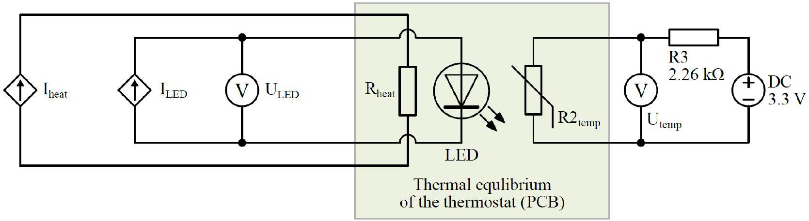

## Q2-1   English (Official)

## Light Emitting Diodes (LEDs) (10 points)

This experiment is designed to investigate the electrical and thermal properties of LEDs. For the temperature measurements of the PCB you should use coefficients, obtained in Experiment-1 B. 1 section. The electric circuit used in this experiment is shown in Fig. 2.1. For equipment guide see description for question 1.

Figure 2.1. Experimental setup of the LED investigation experiment. LED is driven by the constant current (continuous or pulsed mode) and forward voltage measured by high impedance voltmeter. Heating and temperature measurement parts are the same as in Experiment 1. Thermal equilibrium is maintained between all components on printed circuit board (PCB).

The LEDs typically are driven by the constant current in contrast to constant voltage used for incandescent lamps. The measured voltage of the LEDs depends on set current and temperature of the semiconductor die. The mathematical expression of volt-ampere characteristics is complicated and depends on physical and technological parameters, which are usually not known. Therefore, in this experiment the two-dimensional dependence of the voltage vs LED current and LED die temperature $T_{\mathrm{J}}$ will have to be investigated:

$$
U_{\text {LED }}=\text { function }\left(I_{\text {LED }}, T_{\mathrm{J}}\right) .
$$

The thermal resistance between the LED semiconductor die and the PCB is related to electrical power $P$ as follows (at several values of the current $\left(I_{\text {LED }}\right)$ ):

$$
\frac{\Delta T}{P}=\frac{\left(T_{\mathrm{J}}-T_{\mathrm{PCB}}\right)}{P} .
$$

Caution: LED can be driven at continuous current or short current pulses. In the latter case it is assumed that the duration of the pulse is short enough to avoid the LED self-heating (for example 1 ms pulse duration with measurements spaced at least 100 ms apart), and to assume that $T_{\mathrm{J}}=T_{\text {PCB }}$ at such driving regime. During the continuous operation $T_{\mathrm{J}}>T_{\text {PCB }}$ and thermal resistance $\frac{\Delta T}{P}$ can be calculated.

## Part A. Volt-ampere characteristics at different temperatures ( $\mathbf{5 . 0}$ points)

The physical mechanisms of the heating in both Experiment 1 and 2 are the same. Hence, you can use the result you obtained earlier in Experiment 1 to relate thermistor voltage with its temperature. Alternatively, you can use this explicit approximate relation:

## Q2-2   English (Official)

$$
T(U)=\frac{3500}{9.9-\ln \left(\frac{1}{U}-0.3\right)},
$$

where $T$ is temperature of the thermistor, expressed in kelvins, and $U$ is voltage on the thermistor, expressed in volts.

Measure and graph the Current vs Voltage of the LED at temperatures ranging from room temperature to 80 °C in pulsed mode.

A. 1 Measure and graph $I_{\mathrm{LED,pulsed}}\left(U_{\mathrm{LED,pulsed}}, T\right)$ dependence in the range from 3 mA to 50 mA at the room temperature, and 40, 60, and 80 °C. Draw all curves on the same graph.
A. 2 In the answer sheet, fill the table with $U_{\mathrm{LED,pulsed}}$ values at 3, 10, 20, and 40 mA driving currents $I_{\mathrm{LED,pulsed}}$ at room temperature, 40, 60, and 80 °C.
A. 3 Graph main points of $U_{\mathrm{LED,pulsed}}\left(I_{\mathrm{LED,pulsed}}, T\right)$ (those listed in question A.2) and calculate (approximate graphically) the linear voltage dependence on the temperature coefficient $(\Delta U(I) / \Delta T)$ at 3, 10, 20, and 40 mA.

Part B. Measurement of the LED volt-ampere characteristics at continuous driving current (3.5 points)

B. 1 Measure and graph the $I_{\mathrm{LED,continuous}}\left(U_{\mathrm{LED,continuous}}\right)$ dependence in the range from 3 mA to 50 mA with the heater turned off in the continuous driving regime. In the answer sheet, also write down the values of $U_{\mathrm{LED,continuous},\mathrm{PCB}}$ (thermostat) temperature $T_{\mathrm{PCB}}$, and the difference $\Delta U=U_{\mathrm{LED,pulsed}}-U_{\mathrm{LED,continuous}}$ at 3, 10, 20, and 40 mA.
B. 2 Since the resistance of the LEDs is not constant (depends on current), the term Dynamic Resistance is used and expressed as $\frac{\mathrm{d} U}{\mathrm{~d} I}$. Using graph (B.1), estimate the reciprocal of the LED dynamic resistance $1 /\left(\frac{\mathrm{d} U}{\mathrm{~d} I}\right)=\frac{\mathrm{d} I}{\mathrm{~d} U}$. In the answer sheet, write the values of $\frac{\mathrm{d} I}{\mathrm{~d} U}$ at $3,10,20$, and 40 mA . Draw tangents $\frac{\mathrm{d} I}{\mathrm{~d} U}$ at these points on the graph.
B. 3 Calculate and graph the difference $\Delta T(P)$ between the temperature of continuously operating semiconductor die $\left(T_{\mathrm{J}}\right)$ and temperature of the PCB $\left(T_{\text {PCB }}\right)$ as a function of electrical power (at 3, 10, 20, and 40 mA). Calculate (approximate graphically) the linear LED thermal resistance $\frac{\Delta T}{P}$, and write it in the answer sheet.
Note: Assume that all electrical energy consumed by LED is converted into the heat and the energy emitted as light can be ignored.

## Q2-3   English (Official)

## Part C. Calculation of the LED current drift due to the temperature (1.5 points)

In the Introduction, it was mentioned that LEDs are typically driven by the constant current, but not constant voltage. Assume that one decided to drive the LED at nominal current value of 20 mA with constant voltage value you have measured for 20 mA current in the task B.1.

C. 1 Using the LED characteristics calculated in section B, estimate the actual current flowing through LED, if voltage is kept constant (voltage measured in B.1, $U(20 \mathrm{~mA})$ ), but PCB temperature is at 0 °C and 40 °C.
