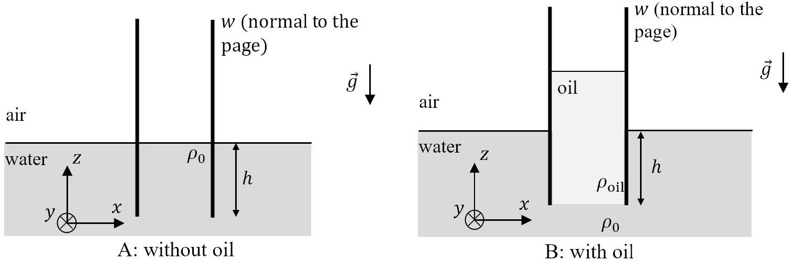
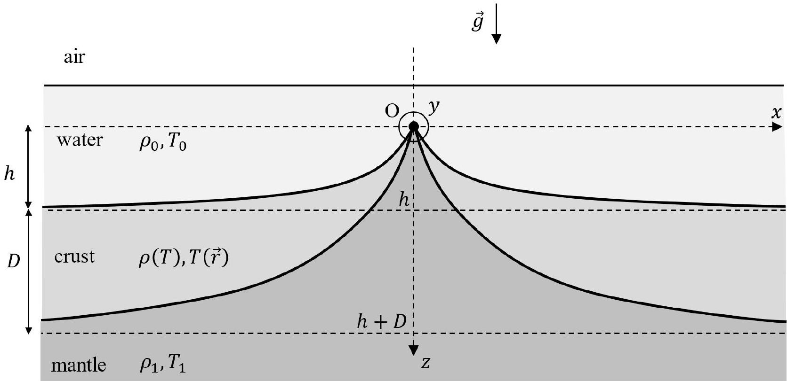
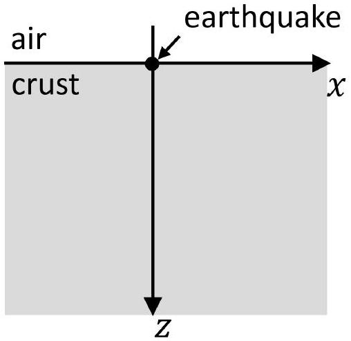

## Q1-1   English (Official)

## Planetary Physics (10 points)

This problem consists of two independent problems related to the interior of planets. The effects of the surface curvature of the planets can be neglected. You might need to use the formula

$$
(1+x)^{\varepsilon} \approx 1+\varepsilon x \text {, when }|x| \ll 1 \text {. }
$$

## Part A. Mid-ocean ridge (5.0 points)

Consider a large vessel of water that is situated in a uniform gravitational field with free-fall acceleration $g$. Two vertical rectangular plates parallel to each other are fitted into the vessel so that the vertical edges of the plates are in a tight gap-less contact with the vertical walls of the vessel. Length $h$ of each plate is immersed in water (Fig. 1). The width of the plates along the $y$-axis is $w$, water density is $\rho_{0}$.

Figure 1. Parallel plates in water.

Oil of density $\rho_{\text {oil }}$ ( $\rho_{\text {oil }}<\rho_{0}$ ) is poured into the space between the plates until the lower level of the oil has reached the lower edges of the plates. Assume that plates and vessel edges are high enough for oil not to overflow them. Surface tension and mixing of fluids can be neglected.
A. 1 What is the $x$-component of the net force $F_{x}$ acting on the right plate (magnitude 0.8pt and direction)?

Fig. 2 shows a cross-section of a mid-ocean ridge. It consists of overlaying layers of mantle, crust and ocean water. The mantle is composed of rocks that we assume can flow in geological timescales and therefore, in this problem will be treated as a fluid. The thickness of the crust is much smaller than the characteristic length scale in the $x$-direction, hence, the crust behaves as a freely bendable plate. To high accuracy, such a ridge can be modeled as a two-dimensional system, without any variation of variables along the $y$-axis, which is perpendicular to the plane of Fig. 2. Assume that the ridge length $L$ along the $y$-axis is much larger than any other length introduced in this problem.

At the centre of the ridge the thickness of the crust is assumed to be zero. As the horizontal distance $x$ from the centre increases, the crust gets thicker and approaches a constant thickness $D$ as $x \rightarrow \infty$. Correspondingly, the ocean floor subsides by a vertical height $h$ below the top of the ridge O , which we define as the origin of our coordinate system (see Fig. 2). Water density $\rho_{0}$ and temperature $T_{0}$ can be assumed to be constant in space and time. The same can be assumed for mantle density $\rho_{1}$ and its temperature $T_{1}$. The temperature of the crust $T$ is also constant in time but can depend on position.

## Q1-2   English (Official)

It is known that, to high accuracy, the crustal material expands linearly with temperature $T$. Since water and mantle temperatures are assumed to be constant, it is convenient to use a rescaled version of the thermal expansion coefficient. Then $l(T)=l_{1}\left[1-k_{l}\left(T_{1}-T\right) /\left(T_{1}-T_{0}\right)\right]$, where $l$ is the length of a piece of crustal material, $l_{1}$ is its length at temperature $T_{1}$, and $k_{l}$ is the rescaled thermal expansion coefficient, which can be assumed to be constant.

Figure 2. Mid-ocean ridge. Note that the $z$-axis is pointing downwards.

A. 2 Assuming that the crust is isotropic, find how its density $\rho$ depends on its temperature $T$. Assuming that $\left|k_{l}\right| \ll 1$, write your answer in the approximate form
$$
\rho(T) \approx \rho_{1}\left[1+k \frac{T_{1}-T}{T_{1}-T_{0}}\right],
$$
where terms of order $k_{l}^{2}$ and higher are neglected. Then, identify constant $k$.

It is known that $k>0$. Also, thermal conductivity of the crust $\kappa$ can be assumed to be constant. As a consequence, very far away from the ridge axis the temperature of the crust depends linearly with depth.

A. 3 By assuming that mantle and water each behave like an incompressible fluid at hydrostatic equilibrium, express the far-distance crust thickness $D$ in terms of $h$, $\rho_{0}, \rho_{1}$, and $k$. Any motion of the material can be neglected. $\rho_{0}, \rho_{1}$, and $k$. Any motion of the material can be neglected.
A. 4 Find, to the leading order in $k$, the net horizontal force $F$ acting on the right half $(x>0)$ of the crust in terms of $\rho_{0}, \rho_{1}, h, L, k$ and $g$.

## Q1-3

A. 5 By using dimensional analysis or order-of-magnitude analysis, estimate the char- acteristic time $\tau$ in which the difference between the upper and lower surface temperatures of the crust far away from the ridge axis is going to approach zero. You can assume that $\tau$ does not depend on the two initial surface temperatures of the crust.

## Part B. Seismic waves in a stratified medium (5.0 points)

Suppose that a short earthquake happens at the surface of some planet. The seismic waves can be assumed to originate from a line source situated at $z=x=0$, where $x$ is the horizontal coordinate and $z$ is the depth below the surface (Fig. 3). The seismic wave source can be assumed to be much longer than any other length considered in this question.

As a result of the earthquake, a uniform flux of the so-called longitudinal P waves is emitted along all the directions in the $x-z$ plane that have positive component along the $z$-axis. Since the wave theory in a solid is generally complicated, in this problem we neglect all the other waves emitted by the earthquake. The crust of the planet is stratified so that the P -wave speed $v$ depends on depth $z$ according to $v=v_{0}\left(1+z / z_{0}\right)$, where $v_{0}$ is the speed at the surface and $z_{0}$ is a known positive constant.

Figure 3. Coordinate system used in part B.

B. 1 Consider a single ray emitted by the earthquake that makes an initial angle $0<$ $\theta_{0}<\pi / 2$ with the $z$-axis and travels in the $x-z$ plane. What is the horizontal coordinate $x_{1}\left(\theta_{0}\right) \neq 0$ at which this ray can be detected at the surface of the planet? It is known that the ray path is an arc of a circle. Write your answer in the form $x_{1}\left(\theta_{0}\right)=A \cot \left(b \theta_{0}\right)$, where $A$ and $b$ are constants to be found.

If you were unable to find $A$ and $b$, in the following questions you can use the result $x_{1}\left(\theta_{0}\right)=A \cot \left(b \theta_{0}\right)$ as given. Suppose that total energy per unit length of the source released as P waves into the crust during the earthquake is $E$. Assume that waves are completely absorbed when they reach the surface of the planet from below.
B. 2 Find how the energy density per unit area $\varepsilon(x)$ absorbed by the surface depends on the distance along the surface $x$. Sketch the plot of $\varepsilon(x)$.

## Q1-4   English (Official)

From now on, assume that the waves are instead fully reflected when reaching the surface. Imagine a device positioned at $z=x=0$ that has the same geometry as the previously considered earthquake source. The device is capable of emitting P waves in a freely chosen angular distribution. We make the device emit a signal with a narrow range of emission angles. In particular, the initial angle the signal makes with the vertical belongs to the interval $\left[\theta_{0}-\frac{1}{2} \delta \theta_{0}, \theta_{0}+\frac{1}{2} \delta \theta_{0}\right]$, where $0<\theta_{0}<\pi / 2, \delta \theta_{0} \ll 1$ and $\delta \theta_{0} \ll \theta_{0}$.

B. 3 At what distance $x_{\text {max }}$ along the surface from the source is the furthest point 2.0pt that the signal does not reach? Write your answer in terms of $\theta_{0}, \delta \theta_{0}$ and other constants given above.
