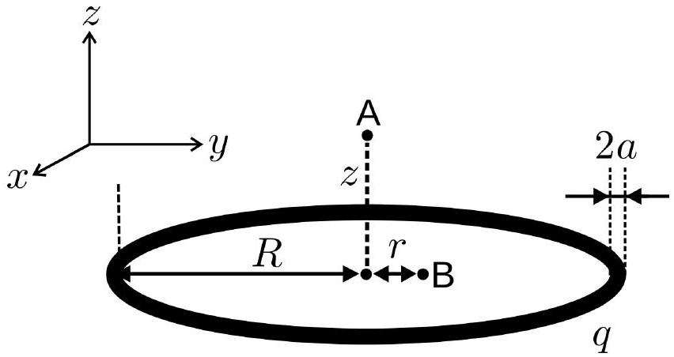
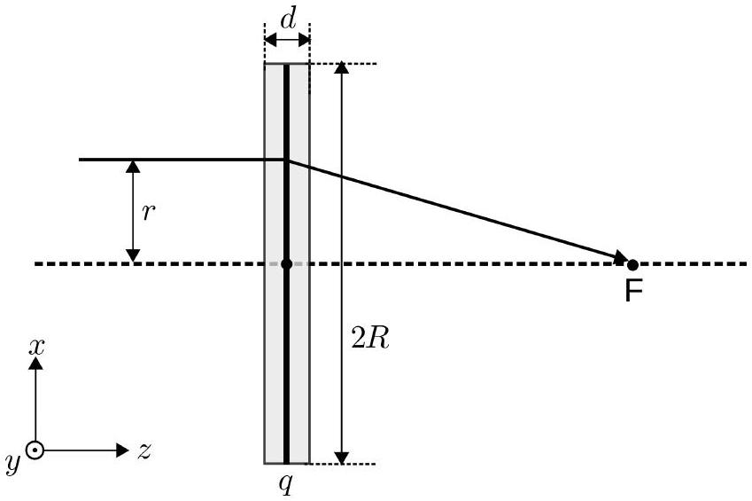
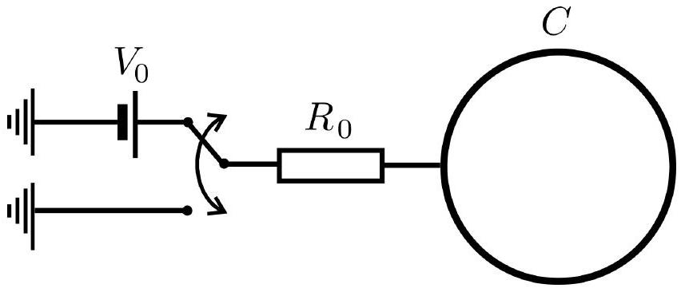

## Q2-1   English (Official)

## Electrostatic lens (10 points)

Consider a uniformly charged metallic ring of radius $R$ and total charge $q$. The ring is a hollow toroid of thickness $2 a \ll R$. This thickness can be neglected in parts $\mathrm{A}, \mathrm{B}, \mathrm{C}$, and E . The $x y$ plane coincides with the plane of the ring, while the $z$-axis is perpendicular to it, as shown in Figure 1. In parts A and B you might need to use the formula (Taylor expansion)

$$
(1+x)^{\varepsilon} \approx 1+\varepsilon x+\frac{1}{2} \varepsilon(\varepsilon-1) x^{2}, \text { when }|x| \ll 1 .
$$

Figure 1. A charged ring of radius $R$.

## Part A. Electrostatic potential on the axis of the ring (1 point)

A. 1 Calculate the electrostatic potential $\Phi(z)$ along the axis of the ring at a $z$ distance 0.3pt from its center (point A in Figure 1).
A. 2 Calculate the electrostatic potential $\Phi(z)$ to the lowest non-zero power of $z$, as- 0.4pt suming $z \ll R$.
A. 3 An electron (mass $m$ and charge $-e$ ) is placed at point A (Figure $1, z \ll R$ ). What $\quad 0.2$ pt is the force acting on the electron? Looking at the expression of the force, determine the sign of $q$ so that the resulting motion would correspond to oscillations. The moving electron does not influence the charge distribution on the ring.

## Part B. Electrostatic potential in the plane of the ring (1.7 points)

In this part of the problem you will have to analyze the potential $\Phi(r)$ in the plane of the ring $(z=0)$ for $r \ll R$ (point B in Figure 1). To the lowest non-zero power of $r$ the electrostatic potential is given by $\Phi(r) \approx q\left(\alpha+\beta r^{2}\right)$.

## Q2-2   English (Official)

B. 1 Find the expression for $\beta$. You might need to use the Taylor expansion formula 1.5pt given above.

## B. 2 An electron is placed at point B (Figure $1, r \ll R$ ). What is the force acting on the   B. 2 An electron is placed at point B (Figure $1, r \ll R$ ). What is the force acting on the electron? Looking at the expression of the force, determine the sign of $q$ so that electron? Looking at the expression of the force, determine the sign of $q$ so that the resulting motion would correspond to harmonic oscillations. The moving the resulting motion would correspond to harmonic oscillations. The moving electron does not influence the charge distribution on the ring. electron does not influence the charge distribution on the ring.

0.2pt

## Part C. The focal length of the idealized electrostatic lens: instantaneous charging (2.3 points)

One wants to build a device to focus electrons-an electrostatic lens. Let us consider the following construction. The ring is situated perpendicularly to the $z$-axis, as shown in Figure 2. We have a source that produces on-demand packets of non-relativistic electrons. Kinetic energy of these electrons is $E=m v^{2} / 2$ ( $v$ is velocity) and they leave the source at precisely controlled moments. The system is programmed so that the ring is charge-neutral most of the time, but its charge becomes $q$ when electrons are closer than a distance $d / 2(d \ll R)$ from the plane of the ring (shaded region in Figure 2, called "active region"). In part C assume that charging and de-charging processes are instantaneous and the electric field "fills the space" instantaneously as well. One can neglect magnetic fields and assume that the velocity of electrons in the $z$-direction is constant. Moving electrons do not perturb the charge distribution on the ring.

Figure 2. A model of an electrostatic lens.

C. 1 Determine the focal length $f$ of this lens. Assume that $f \gg d$. Express your answer in terms of the constant $\beta$ from question B. 1 and other known quantities. Assume that before reaching the "active region" the electron packet is parallel to the $z$-axis and $r \ll R$. The sign of $q$ is such so that the lens is focusing.

1.3pt In reality the electron source is placed on the $z$-axis at a distance $b>f$ from the center of the ring. Consider that electrons are no longer parallel to the $z$-axis before reaching the "active region", but are emitted from a point source at a range of different angles $\gamma \ll 1$ rad to the $z$-axis. Electrons are focused in a point situated at a distance $c$ from the center of the ring.

## Q2-3   English (Official)

C. 2 Find $c$. Express your answer in terms of the constant $\beta$ from question B. 1 and 0.8pt other known quantities.
C. 3 Is the equation of a thin optical lens 0.2pt
$$
\frac{1}{b}+\frac{1}{c}=\frac{1}{f}
$$
fulfilled for the electrostatic lens? Show it by explicitly calculating $1 / b+1 / c$.

## Part D. The ring as a capacitor (3 points)

The model considered above was idealized and we assumed that the ring charged instantaneously. In reality charging is non-instantaneous, as the ring is a capacitor with a finite capacitance $C$. In this part we will analyze the properties of this capacitor. You might need the following integrals:

$$
\int \frac{\mathrm{d} x}{\sin x}=-\ln \left|\frac{\cos x+1}{\sin x}\right|+\mathrm{const}
$$

and

$$
\int \frac{\mathrm{d} x}{\sqrt{1+x^{2}}}=\ln \left|x+\sqrt{1+x^{2}}\right|+\text { const. }
$$

D. 1 Calculate the capacitance $C$ of the ring. Consider that the ring has a finite width 2.0pt $2 a$, but remember that $a \ll R$.

When electrons reach the "active region", the ring is connected to a source of voltage $V_{0}$ (Figure 3). When electrons pass the "active region", the ring is connected to the ground. The resistance of contacts is $R_{0}$ and the resistance of the ring itself can be neglected.

Figure 3. Charging of the electrostatic lens.

## Q2-4   English (Official)

D. 2 Determine the dependence of the charge on the ring as a function of time, $q(t)$, and make a schematic plot of this dependence. $t=0$ corresponds to a time moment when electrons are in the plane of the ring. What is the charge on the ring $q_{0}$ when the absolute value $q(t)$ is maximal? The capacitance of the ring is $C$ (i.e., you do not have to use the actual expression found in D.1). Remark: the drawn polarity in Figure 3 is for indicative purposes only. The sign should be chosen so that the lens is focusing.

## Part E. Focal length of a more realistic lens: non-instantaneous charging (2 points)

In this part of the problem, we will consider the action of this more realistic lens. Here we will again neglect the width of the ring $2 a$ and will assume that electrons travel parallel to the $z$-axis before reaching the "active region". However, the charging of the ring is no longer instantaneous.

E. 1 Find the focal length $f$ of the lens. Assume that $f / v \gg R_{0} C$, but $d / v$ and $R_{0} C$ are of the same order of magnitude. Express your answer in terms of the constant $\beta$ from part B and other known quantities.
1.7pt E. 2 You will see, that the result for $f$ is similar to that obtained in part C, whereby the value $q$ is substituted with $q_{\text {eff }}$. Find the expression for $q_{\text {eff }}$ in terms of quantities given in formulation of the problem.
