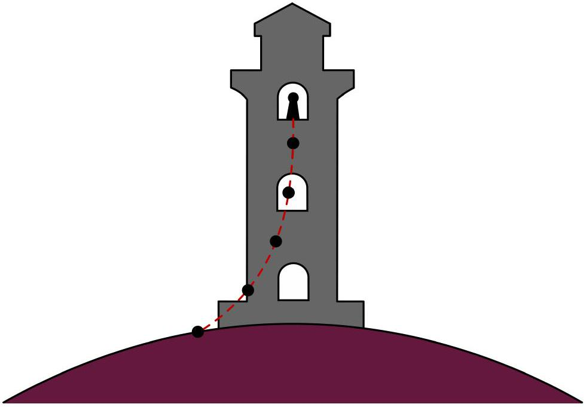

## Planet (12 points)

You find yourself on an alien planet with no knowledge of how you got there. The first thing you try to do is to learn more about the planet you're on. You remember how Galileo experimented with falling balls and inspired by this, build a perfectly vertical tower of height $H=2000 \mathrm{~m}$. Given the tower, you can now start dropping balls from any height $h$ on the tower (measured between the ground and the bottom of the ball immediately before it's released). Due to the limitations of the materials available to you, you can only drop balls of radius $5 \mathrm{~cm} \leq r \leq 50 \mathrm{~cm}$ and densities $0.1 \mathrm{~g} / \mathrm{cm}^{3} \leq \rho \leq 10 \mathrm{~g} / \mathrm{cm}^{3}$.

Any time you drop a ball, you let it go from rest, and are able to measure the duration $t$ over which it falls, and the horizontal distance $s$ between where the ball lands and the point below where the ball was dropped.

Before you start your experiments, you make the following observations about the planet:

- Based on the movement of the Sun, you find that you're somewhere on the equator of the planet.
- The planet has an atmosphere; the air density is small enough for neglecting the buoyancy force due to it.
- The ground temperature is $T_{0}=20^{\circ} \mathrm{C}$.
- There seems to be a wind blowing along the equator that's uniform throughout the height of the tower; neglect the effect of the tower on the wind velocity.


An artist's exaggerated rendition of the problem.

## Description of the simulation software

The command line program simulates the measurements of the fall time $t$ and deflection from the base of the tower $s$, after providing the height $h$ at which the ball is dropped, its radius $r$, and density $\rho$. All values of the input parameters are entered through the keyboard after the corresponding prompts and are validated by pressing the Enter key.

In order to get started, use the following authorization key when prompted:

Entering an incorrect value will put the program into test mode; you will need to restart the program.
A typical output of a single simulation cycle of the program looks like:

$$
\begin{aligned}
& 0<\quad h(m) \quad<2000 \mid h(m): 90 \\
& 5<\mathrm{r}(\mathrm{~cm}) \quad<50 \quad \mathrm{r}(\mathrm{~cm}): 13 \\
& 0.1<r h o\left(g / \mathrm{cm}^{\wedge} 3\right)<10.0 \mid \mathrm{rho}\left(\mathrm{~g} / \mathrm{cm}^{\wedge} 3\right): 2 \\
& \text {... } \\
& \mathrm{t}(\mathrm{~s})=3.5, \mathrm{~s}(\mathrm{~m})=0.1 \\
& 0<\quad h(m) \quad<2000 \mid \quad h(m):_{-}
\end{aligned}
$$

First, you enter the height $h$ in m (the number between 0 and 2000), then the radius of the ball $r$ in cm (the number between 5 and 50) and finally the density of the ball $\rho$ in $\mathrm{g} / \mathrm{cm}^{3}$ (the number between 0.1 and 10). Each input is confirmed with the Enter key. The program will then output $t$ in s and $s$ in m.
The program then loops back to the height of the tower query.
Entering a value that is out of range for the experiment will result in an error message,

```
Value Out Of Bounds!
```

and then return you to the incorrectly answered prompt.
The height input $h$ will be rounded to 1 m, $r$ to 1 cm and $\rho$ to $0.01 \mathrm{~g} / \mathrm{cm}^{3}$. (There is no point in trying to input more precise numbers).

The results of the experiment will have random errors associated with them, as to simulate the limited precision one would have in real life. The sizes of the errors can be found by observing the fluctuations in the output.

Any time you need to quit the program, press Ctrl+C.
List of constants and useful relations
The gravitational constant $G=6.67 \times 10^{-11} \mathrm{~m}^{3} \mathrm{~kg}^{-1} \mathrm{~s}^{-2}$.
Ideal gas constant $R=8.314 \mathrm{~J} \mathrm{~mol}^{-1} \mathrm{~K}^{-1}$,

$$
0^{\circ} \mathrm{C}=273.15 \mathrm{~K} .
$$

The air drag of a ball of cross-sectional area $A$ and speed $v$ in air of density $\rho_{a}$ is given by

$$
F_{d}=0.24 A \rho_{a} v^{2} .
$$

An adiabatic atmosphere has a density profile given by

$$
\rho_{a}(h)=\rho_{a 0}\left(1-\frac{\gamma-1}{\gamma} \frac{\mu g h}{R T_{0}}\right)^{\frac{1}{\gamma-1}}=\rho_{a 0}\left(1-\frac{h}{H_{0}}\right)^{\frac{1}{\gamma-1}},
$$

valid until the top of the atmosphere where $T=0 \mathrm{~K}$. Here, $\gamma$ is the adiabatic coefficient, $\mu$ the molar mass of air (i.e. the gas in the atmosphere of the planet), $g$ the free-fall acceleration and $h$ the height from the ground.

Part A. Planetary properties (3.0 points)

A. 1 Determine the free-fall acceleration $g$ on the planet by making a suitable set of measurements and sketching an appropriate graph in the space provided. Provide an analysis of the uncertainty in your result.
A. 2 Walking away from the tower along the equator, you find that you can see the tower up to a distance of $L=230 \mathrm{~km}$ away (measured as the distance between you and the top of the tower). What is the radius $R$ of the planet? You may assume that your height is much smaller than the height of the tower.
A. 3 Estimate the mass $M$ of the planet. Provide an analysis of the uncertainty in your result. What physical effect contributes the most to the accuracy of your estimate for $M$ ? Tick the appropriate effect the answer sheet.

Part B. Atmospheric properties (6.5 points)

B. 1 Determine the wind speed $u$ on the surface of the planet by making a suitable set of measurements and sketching an appropriate graph in the space provided. Provide an analysis of uncertainty in your result.
B. 2 Determine the air density $\rho_{a 0}$ on the surface of the planet either by collecting additional data or by reusing previous data, and sketching an appropriate graph in the space provided. Provide an analysis of the uncertainty in your result.
B. 3 Assuming the atmosphere to be adiabatic with an adiabatic coefficient $\gamma=1.4$, determine the thickness $H_{0}$ of the atmosphere by making a suitable set of measurements and sketching an appropriate graph in the space provided. Provide an analysis of the uncertainty in your result.
B. 4 Determine the molar mass $\mu$ of the air and the air pressure $p_{0}$ at the base of the tower. Provide an analysis of the uncertainty in your result.

0.5pt

Part C. Duration of a day (2.5 points)

C. 1 Determine the duration of a day, $T_{p}$, on the planet by making a suitable set of measurements and sketching an appropriate graph in the space provided. Provide an analysis of the uncertainty in your result.
