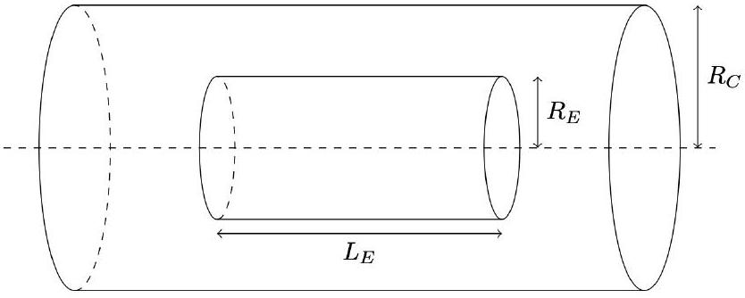

## Q2-1 <br> English (Official)

## Cylindrical Diode (8.0 pts)

Experimental setup and tasks
A cylindrical vacuum diode consists of two coaxial cylinders. There is an emitter of radius $R_{E}$ and length $L_{E}$, which gives off electrons; these electrons travel through the vacuum to the collector, that has a radius $R_{C}$ and an effective infinite length. The collector is at a positive potential $V$, while the emitter is grounded, so electrons are drawn from the emitter to the collector.

The emitter is heated so that there are always excess electrons available to be accelerated through the potential difference toward the collector. The electrons fill the vacuum with a plasma. Because of the properties of a plasma there is a maximum current that can flow through the diode that depends on the potential of the collector and the geometry of the system.

Throughout this experiment you should restrict your measurements to $R_{C} \geq 5 R_{E}$.
When $L_{E}$ is sufficiently large compared to $R_{C}$ it is hypothesized that the maximum current through the diode is

$$
I_{\infty}=G R_{C}{ }^{\alpha} L_{E}{ }^{\beta} V^{\gamma}
$$

where $G=G\left(R_{C} / R_{E}\right)$ is not a constant, but is instead a function of the dimensionless ratio $R_{C} / R_{E}$.
When $L_{E}$ is comparable to $R_{C}$ it is necessary to issue a correction to the above expression, and the maximum current through the diodes is given by

$$
I_{L}=I_{\infty} F\left(R_{C}, R_{E}, L_{E}, V\right)
$$

where $F$ is a dimensionless function of some or all of $R_{C}, R_{E}, L_{E}$, and $V$. Equation (1) is the special case of Equation (2) when $F=1$

In doing this experiment you have simulated access to any cylinder of radii 0.1 cm to a maximum of 20.0 cm, in steps of 0.1 cm; the cylinder lengths can be between 1.0 cm and 99.0 cm, also in steps of 0.1 cm. There is a simulated power supply that can provide a positive voltage to the collector between 0 and 2000 volts, and an ammeter that can measure the current through the diode.

You are encouraged to read all the tasks through quickly before beginning in order to plan your data collection more efficiently.

Description of the simulation software
The simulation program, named Exp2, allows users to perform an unlimited number of measurements of the maximum current $I$ for different sets of input parameters: the collector radius $R_{C}$, the emitter radius
and length $R_{E}$ and $L_{E}$, and the potential difference between the emitter and the collector $V$. All values of the input parameters are entered through the keyboard after corresponding prompts and validated by pressing the Enter key.

In order to get started, use the following authorization key when prompted:

```
Enter Valid Authorization Key: 12345678.888
```

Entering an incorrect value will put the program into test mode; you will need to restart the program.
A typical interface of a single simulation cycle of the program looks like:

```
0.1 < R_C (cm) < 20.0 | R_C (cm): 18.5
0.1 < R_E (cm) < 20.0 | R_E (cm): 13.2
0.1 < L_E (cm) < 99.0 | L_E (cm): 35.3
1.0 < V_C (V) < 2000.0 | V_C (V): 207
I (A) = 1.04
0.1 < R_C (cm) < 20.0 | R_C (cm):
```

First you enter the collector radius, then the emitter radius, then the emitter length, each in centimeters, and finally the potential difference, in volts. Each input is confirmed with the Enter key.

The program then loops back to the collector radius query.
Entering a value that is out of range for the experiment will result in an error message,

```
Value Out Of Bounds
```

and then return you to the incorrectly answered prompt.
All lengths are only recorded to the nearest millimeter while all voltages are only recorded to the nearest volt; entering in a more precise number does not improve the measurement. However, there is an uncertainty of as much as 0.5 mm in any length, and 0.5 V in any voltage. As such, repeated measurements could give different results for the current.

The ammeter is auto-ranging, so that it shows only three significant figures, and switches between the amp or milliamp scale as appropriate. The uncertainty is $\pm \frac{1}{2}$ of the last displayed digit. Pay attention to whether it is reporting in mA or A.

Exceeding the 40 amp current rating on the ammeter will burn it out. The program will notify you of this, and then automatically fix the ammeter for the next measurement.

Any time you need to quit the program in order to restart, press Ctrl+C.

## Part A: Finding Exponents (4.5 pts)

Find the exponents in Eq (1), providing an analysis on error bounds on each result:

## Q2-3 <br> -

A. 1 Collect a set of data that can be used to find the exponent $\gamma$ on the variable
1.5pt $V$. Sketch an appropriate graph in the space provided; for your convenience $V$. Sketch an appropriate graph in the space provided; for your convenience both linear and log-log graph paper is provided, but you only need to draw one both linear and log-log graph paper is provided, but you only need to draw one graph. State your value of $\gamma$ and provide an analysis of the uncertainty in your graph. State your value of $\gamma$ and provide an analysis of the uncertainty in your result. result.
A. 2 Collect a set of data that can be used to find the exponent $\beta$ on the variable $L_{E}$.
A. 2 Collect a set of data that can be used to find the exponent $\beta$ on the variable $L_{E}$. Sketch an appropriate graph in the space provided; a single graph is sufficient. Sketch an appropriate graph in the space provided; a single graph is sufficient. State your value of $\beta$ and provide an analysis of the uncertainty in your result. State your value of $\beta$ and provide an analysis of the uncertainty in your result. State your value of $\beta$ and provide an analysis of the uncertainty in your result.
1.5pt
A. 3 Collect a set of data that can be used to find the exponent $\alpha$ on the variable $R_{C}$. Sketch an appropriate graph in the space provided; a single graph is sufficient. State your value of $\alpha$ and provide an analysis of the uncertainty in your result. State your value of $\alpha$ and provide an analysis of the uncertainty in your result.

1.5pt

Part B: Finding the Coefficient G (1.0 pts)
Find the value of the function $G$ when $R_{C}=10 R_{E}$ :

B. 1 Either by collecting additional data or by reusing previous data, determine the value for $G$ when $R_{C}=10 R_{E}$ and provide an analysis of uncertainty in your result.

1.0pt

Part C: Finding dimensionless function F (2.5 pts)
Experimentally determine which of $R_{C}, R_{E}, L_{E}$, and $V$ affect $F$ when $L_{E}$ is comparable to the size $R_{C}$ in Equation (2).

C. 1 In the list of the variables on the answer sheet, state the direction of the effect;
0.5pt for example, does $F$ increase, decrease, or stay the same if $R_{C}$ is increased? for example, does $F$ increase, decrease, or stay the same if $R_{C}$ is increased?
C. 2 It is observed that when $L_{E} \approx R_{C}$ the function $F$ can be approximated as linear
0.5pt in a single variable $x$, where $x$ is a function of only two from $R_{C}, R_{E}, L_{E}$, and $V$. The answer sheet has several possible functional forms for $x$; select the one $V$. The answer sheet has several possible functional forms for $x$; select the one that captures the most significant behavior. that captures the most significant behavior.
C. 3 Assume a linear function of the form $F(x)=A+B x$ for values of $L_{E} \approx R_{C}$, and experimentally determine the parameter $B$. Restrict to the range $R_{C} / 2 \leq L_{E} \leq$ $2 R_{C}$. Sketch an appropriate graph for $F$ in terms of your single appropriate quantity $x$ to approximate $F$ as a linear function. Error analysis is not necessary
