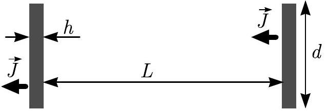
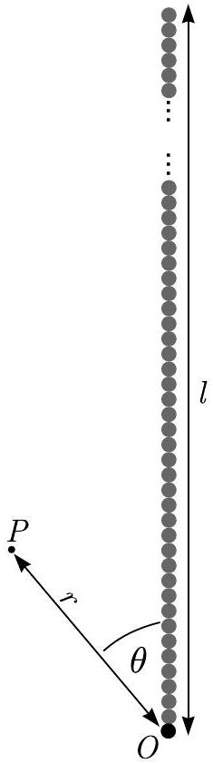
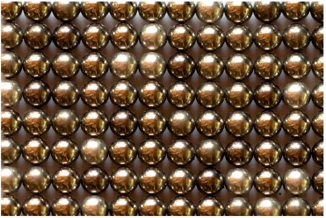
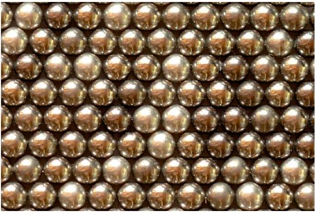

## Permanent magnets (10 points)

Strong permanent magnets are made from NdFeB alloy which obeys a very wide hysteresis loop so that the magnetization $J$ can be assumed to be constant over a wide range of applications; in what follows, we assume that $J \equiv 1.5 \mathrm{~T} / \mu_{0}$, where $\mu_{0}=4 \pi \times 10^{-7} \mathrm{~N} / \mathrm{A}^{2}$, and the magnetization of all the permanent magnets is homogeneous. Magnetization is defined as the volume density of the magnetic dipole moment of the matter.

Hint 1. The following equality might be useful:

$$
\sum_{n=1}^{\infty} \frac{1}{n^{4}}=\frac{\pi^{4}}{90} .
$$

Hint 2.The magnetic field created by a spherical magnet is identical to that of a point dipole. The magnetic fields created by magnets of other shapes become equivalent to a point dipole fields only at distances much larger than their diameter.

Hint 3. Electric and magnetic fields of electric and magnetic point dipoles as functions of coordinates and of the corresponding dipole moment are similar, i.e. one can be obtained from the other by multiplying it by a constant factor.

Hint 4. The induced field due to a boundary condition can always be replaced by some configuration of field sources outside the given boundaries.

## Part A. Interaction of magnets (4.5 points)

When the distance to a magnet is much larger than its size, the magnetic field created by it can be approximated with the magnetic field of its dipole moment $\vec{m}$,

$$
\vec{B}=\frac{\mu_{0}}{4 \pi r^{3}}\left(2 \vec{m}_{\|}-\vec{m}_{\perp}\right) .
$$

Here $r=|\vec{r}|$, and we have decomposed the dipole moment into components parallel and perpendicular to the radius vector $\vec{r}$ drawn from the dipole to the observation point, $\vec{m}=\vec{m}_{\perp}+\vec{m}_{\|}$.

A. 1 Find the magnitude of the interaction force between two coaxially placed cylindrical magnets of diameter $d=20 \mathrm{~mm}$ and thickness $h=2 \mathrm{~mm}$, magnetized parallel to their axis, if the distance between the centres of the magnets is $L=20 \mathrm{~cm}$. You may assume that $L \gg d, h$.

A. 2 At distances much larger than $\frac{h}{2}$, the field created by the magnet from task A. 1 0.4pt is the same as that created by a circular current $I$. Find $I$.

A. 3 Find the interaction force between the magnets for the setup of task A. 1 if in- 1.0pt stead $L=5 \mathrm{~mm}$. You may assume that $d \gg L \gg h$. stead $L=5 \mathrm{~mm}$. You may assume that $d \gg L \gg h$.
A. 4 Identical spherical magnets of diameter $\delta=5 \mathrm{~mm}$, bound together by magnetic 1.0pt attraction, form a chain. What is the maximal length $l$ for such a chain which does not break under its own weight when hanging beneath the topmost magnet? The density of NdFeB magnets $\rho=7500 \mathrm{~kg} / \mathrm{m}^{3}$.
A. 5 Consider the chain from part A.4. Obtain an expression for the magnitude of 1.5pt the magnetic $B$-field at such a point $P$ which is at distance $r$ from one of the chain's endpoint $O$, and the angle between the chain and the line $O P$ is $\theta$ (cf. figure below), assuming that $l \gg r$ and $r \sin \theta \gg \delta$

## Part B. Interaction with ferromagnets (3.5 points)

Now we assume that in addition to the permanent magnets we have also plates made from a ferromagnetic material, similar to what is used in transformer cores. In the situations we're concerned with, it can be considered to have a constant but very large relative permeability $\mu_{r} \sim 10^{5}$.

Hint 5. Large permeability means that magnetic field lines near the outside surface of an object made of the material are nearly perpendicular to the surface. This is similar to the behavior of electric field lines near the outside surface of a conductor.

## Q1-3   English (Official)

B. 1 A spherical magnet from part A. 4 is at a distance $s=\delta$ from a thick infinite ferromagnetic plate (see the answer sheet). The magnetization of the sphere is oriented perpendicular to the plate. Sketch the field lines in the cross-section shown in the answer sheet. In that figure, three points (denoted as 1, 2, and 3) are marked; you need to show field lines passing through each of these points in their full length, i.e. as much as fits into the figure.
B. 2 Now the spherical magnet is brought into direct contact with the plate. Which direction is taken by the magnetization vector of the spherical magnet at a stable equilibrium and what is the normal force between the plate and the magnet? Mark the correct direction(s) with a tick in the corresponding box in the answer sheet. Incorrect ticks will reduce your score.
B. 3 Now a magnet from part A. 1 is placed between two thick circular ferromagnetic plates of diameter $D=2 d$ so that the flat faces of the magnet are pressed against the plates and all three discs are coaxial. Find the magnetic force $F$ acting on each plate. Hint: You may neglect the magnetic field both outside the ferromagnetic plates and outside the gap between them.

The magnetic properties of materials are due to the magnetic dipole moments of electrons and atomic nuclei. If the dipole moments orient themselves parallel to each other, the field created by them is magnified - these are ferromagnetic materials. On the other hand, if for each dipole moment there is another antiparallel dipole moment nearby, the fields cancel out - these are anti-ferromagnetic materials.

In what follows, we consider a very large number of spherical magnets of part A.4, arranged at the nodes of a two-dimensional lattice; see real photos of stable equilibrium configurations below. Assume that all the magnetization vectors lie in the plane of the figure. Consider in your calculations only nearestneighbour interactions (on the figure of C.1, each magnet has four nearest neighbours, and on the figure of C. 2 - six).

## Q1-4   English (Official)

C. 1 Show the magnetization directions of the magnets in the figure below. You are not required to prove that the configuration you suggested is the only possibility. You still need to justify that the configuration you suggested is indeed stable. Find the energy needed to pull one magnet out of this lattice from somewhere in the middle of the lattice, assuming the other magnets are kept stationary. Does this configuration correspond to the order of ferromagnetic or antiferromagnetic materials?

C. 2 Answer the same questions as in task C. 1 for the configuration shown in the figure below.

