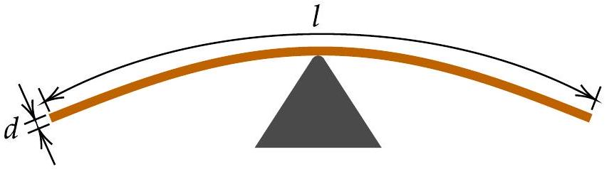

## Scaling laws (8 points)

Scaling laws describe the functional relationship between two physical quantities that scale with each other over a significant interval. This functional relationship can be a power law, but there are other possibilities, too. Oftentimes, exact expressions are beyond reach, but scaling laws can still be derived.

Part A. Spaghetto (2.0 points)

A. 1 A spaghetto straw of diameter $d$ is being balanced horizontally from its middle. If $d=1 \mathrm{~mm}$, the straw breaks under its own weight once its length reaches $l=50 \mathrm{~cm}$. What is the maximum length $l^{\prime}$ of the straw of diameter $d^{\prime}=1 \mathrm{~cm}$ before it breaks under its own weight?

## Part B. Sand castle (2.0 points)

B. 1 The average grain volume of coarse-grained sand is 10 times as large as that of fine-grained sand. Wet fine-grained sand and wet coarse-grained sand have both optimal water content (i.e. assuming the maximal strength of the constructions from it) and are used to build two cylinders of exactly the same shape and size. The strength of each cylinder is tested by pressing it between two parallel plates. The cylinder made of coarse-grained sand gets destroyed once the force applied to press the plates reaches $F_{\mathrm{c}}=10 \mathrm{~N}$. How large is the force $F_{\mathrm{f}}$ needed to destroy the cylinder made of fine-grained sand? You may ignore the effects of gravity.

## Q3-2   English (Official)

## Part C. Interstellar travel (2.0 points)

C. 1 The spaceship of an interstellar expedition travels at a constant magnitude of the proper acceleration $g=10 \mathrm{~m} / \mathrm{s}^{2}$, i.e., this is the acceleration of the spaceship in the inertial frame of reference where it is instantaneously at rest. The passengers must be able to return to Earth within their remaining expected lifetime of 50 years. The maximum distance from Earth reached by the spaceship is $d$. If the acceleration is increased to $g^{\prime}=15 \mathrm{~m} / \mathrm{s}^{2}$, the spaceship can reach a farther distance $d^{\prime}$. What is the ratio $d^{\prime} / d$ ?
Hint 1. You may wish to use the relativistic velocity addition formula, however, there are also other approaches.
Hint 2. You may need to deal with hyperbolic functions defined as follows: $\cosh x=\frac{1}{2}\left(\mathrm{e}^{x}+\mathrm{e}^{-x}\right), \sinh x=\frac{1}{2}\left(\mathrm{e}^{x}-\mathrm{e}^{-x}\right), \tanh x=\frac{\mathrm{e}^{x}-\mathrm{e}^{-x}}{\mathrm{e}^{x}+\mathrm{e}^{-x}}$.
Hint 3. Depending on your approach, you may need one or more of these integrals: $\int \frac{\mathrm{d} x}{1-x^{2}}=\operatorname{atanh} x+C, \int \frac{\mathrm{~d} x}{\sqrt{1+x^{2}}}=\operatorname{asinh} x+C, \int \sinh x \mathrm{~d} x=\cosh x+C$, where asinh $x$ and atanh $x$ are the inverse functions of the respective hyperbolic functions.

## Part D. That sinking feeling (2.0 points)

D. 1 A solid wooden ball of radius $r_{0}$ is floating in the water. Ignoring frictional effects, the frequency of small oscillations would be $\omega_{0}$, but because of viscous friction, after being displaced vertically, the frequency of decaying oscillations is actually $0.99 \omega_{0}$. What is the minimum radius $r_{\text {min }}$ of a wooden ball floating in water that undergos small oscillations when displaced? Hint: the viscous drag force acting on a given body is proportional to its speed relative to the bulk of the fluid, and to the viscosity $\eta$ of the fluid it is moving in. The unit of the viscosity is $\mathrm{kg} /(\mathrm{m} \cdot \mathrm{s})$.
