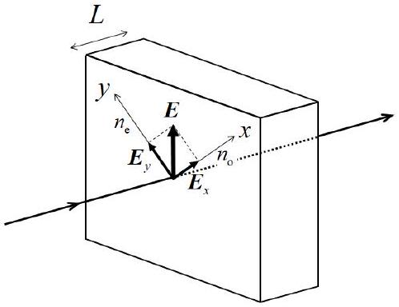
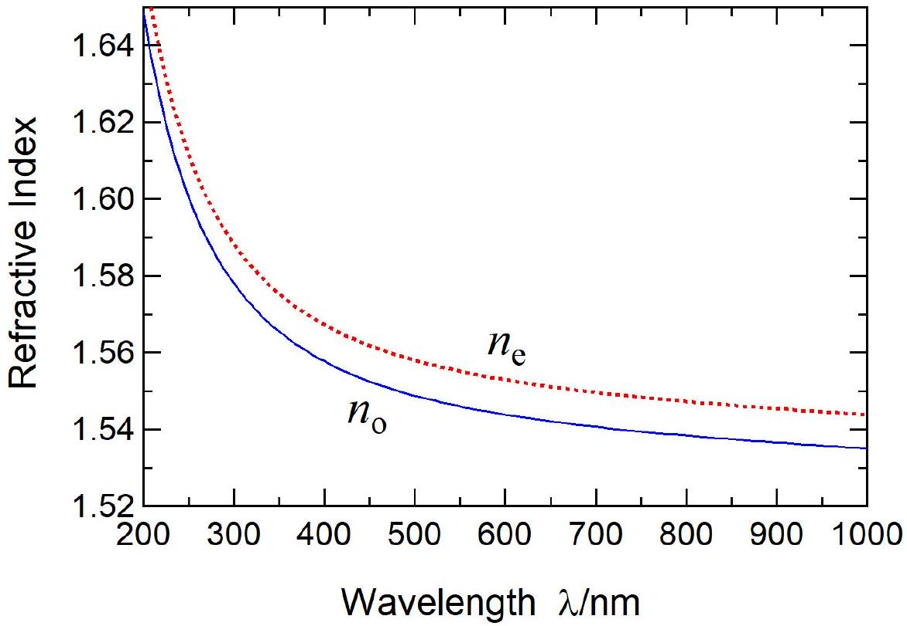
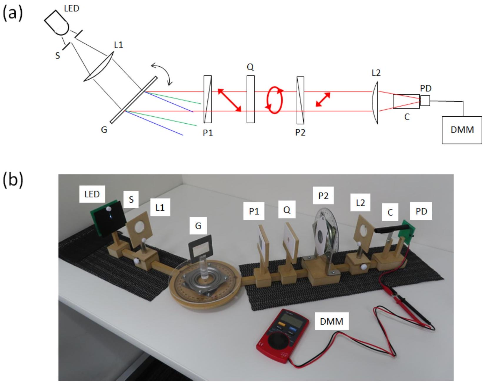
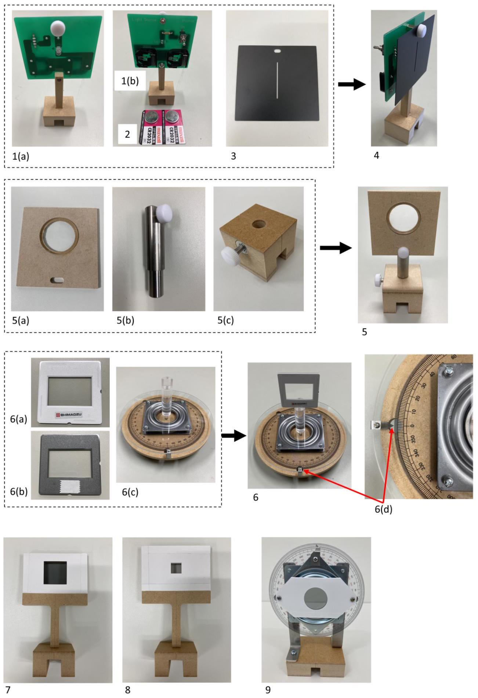
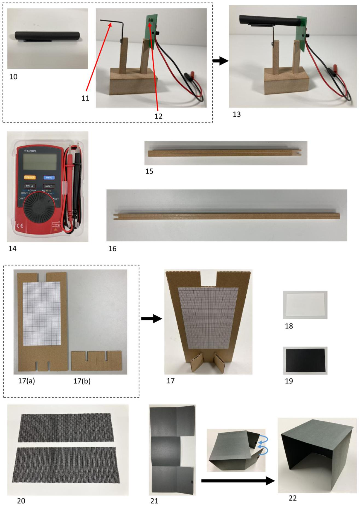
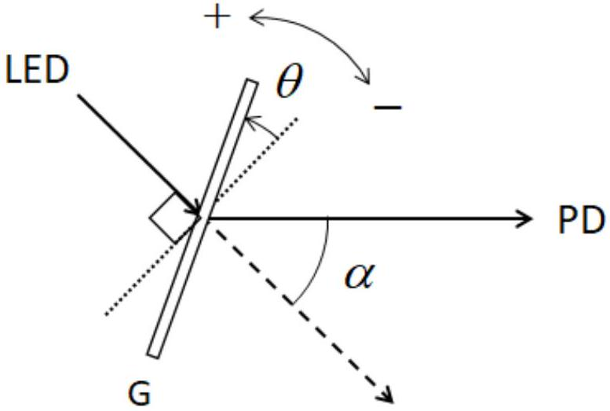
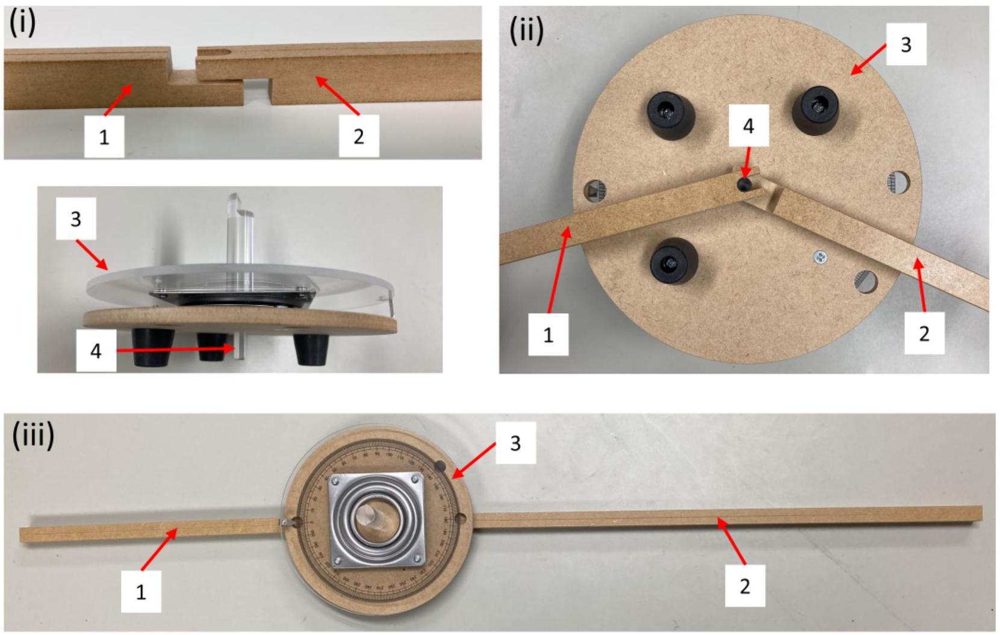

## Q2-1   English (Official)

## Thickness Measurements Using Birefringence (10 points)

Uncertainty analysis is not required throughout this question.
Birefringence is an optical property of a crystal that light propagates as two rays experiencing different refractive indices. When the orthogonal crystal axes $x$ and $y$ lie in the plane of the input face of a birefringent crystal (Fig. 1), the electric field $E$ of linearly polarized light at normal incidence on the crystal is decomposed into two orthogonal components $E_{x}$ and $E_{y}$ accompanied by refractive indices $n_{0}$ and $n_{\mathrm{e}}$, respectively. For a crystal of thickness $L$, the phase shift of the $x$-polarized light $\Gamma_{x}$ and that of the $y$-polarized light $\Gamma_{y}$ as they pass through the crystal are respectively given by

$$
\begin{aligned}
\Gamma_{x} & =\frac{2 \pi}{\lambda} n_{\mathrm{o}} L, \\
\Gamma_{y} & =\frac{2 \pi}{\lambda} n_{\mathrm{e}} L,
\end{aligned}
$$

where $\lambda$ is the wavelength of light in vacuum.

Figure 1: Vectorial decomposition of the electric field $\boldsymbol{E}$ of linearly polarized light at normal incidence on the surface of a birefringent crystal.

The phase difference $\Gamma$ between the two rays is

$$
\Gamma=\Gamma_{y}-\Gamma_{x}=\frac{2 \pi}{\lambda} \Delta n L,
$$

where

$$
\Delta n=n_{\mathrm{e}}-n_{\mathrm{o}}
$$

is the birefringence. Since the electric field of light is the vectorial sum of $\boldsymbol{E}_{x}$ and $\boldsymbol{E}_{y}$ with a phase difference $\Gamma$, the light after passing through the crystal has a polarization component perpendicular to the initial linear polarization of the incident light.

Let $I_{\|}$and $I_{\perp}$ denote the intensities of the components of the light after passing through the crystal which are parallel and perpendicular to the direction of the linear polarization of the incident light, respectively. Hereafter the direction of the linear polarization of the incident light ( $\boldsymbol{E}$ in Fig. 1) is 45° with respect to the $x$ axis. Then the normalized intensity of the perpendicular component $I_{\text {Norm }}$ is given by

$$
I_{\text {Norm }}=\frac{I_{\perp}}{I_{\text {Total }}}=\sin ^{2} \frac{\Gamma}{2},
$$

GAÓ
ன . . منح "

$$
\theta=
$$

GAÓ -
никаим منحدبا

Figure 2: Wavelength dependence of the refractive indices $n_{\mathrm{o}}$ and $n_{\mathrm{e}}$ of quartz.

Figure 3 shows the thickness-measurement system. Shown in Figs. 4 and 5 are the optomechanical and photonic components and devices. A white light-emitting diode (LED) is used as the light source, which contains a blue LED and a phosphor. When light from the blue LED is irradiated onto the phosphor, white light is emitted with a continuous spectrum. Light from this white LED is dispersed, i.e., spectrally resolved, using the transmission diffraction grating G, and linearly polarized by the polarizer P1. Its direction of polarization ( $\boldsymbol{E}$ in Fig. 1) is 45° off the $x$-axis of the quartz plate Q. The polarization component of light after passing through $\mathbf{Q}$, i.e., parallel and perpendicular to the direction of polarization of $\mathbf{P 1}$, is selected by rotating the polarizer P2. The photodetector measures the light intensity.

углогахностиканующий p out of Lace "

- 㐄= ன GAOZHONGSHUXUXUE никухности никонанизма Yous

## Q2-6   English (Official)

## Part A. Measurement System Setup (2.3 points)

The LED output is incident on the grating surface (Fig. 6). The rotation angle $\theta$ of G for normal incidence is defined as 0°. The counterclockwise and clockwise rotations are denoted by + and -, respectively. The first-order diffraction angle $\alpha$ is defined as illustrated. Using the groove period (or slit separation) $d$ of G, the wavelength $\lambda$ is given in terms of $\theta$ as

$$
\begin{aligned}
\lambda & =d \sin (\alpha-\theta)+d \sin \theta \\
& =2 d \sin \frac{\alpha}{2} \cos \left(\frac{\alpha}{2}-\theta\right) .
\end{aligned}
$$

Hereafter use $d=1.00 \mu \mathrm{~m}$ and the fixed diffraction angle $\alpha=40.0^{\circ}$.

Figure 6: The rotation angle $\theta$ of the transmission diffraction grating $\mathbf{G}$ and the diffraction angle $\alpha$.

A. 1 Calculate the longest wavelength $\lambda$ that can be measured and the associated $\theta$. 0.3pt
A. 2 Calculate the numeric values of $\theta$ for $\lambda=440 \mathrm{~nm}$. 0.2pt

Setup procedures for the measurement system are as follows.
[1] Stand the scale assembly upright (17 in Fig. 5) using the pedestal (17(b)).
[2] Set two batteries on the white LED module. The "+" sides must face toward you.
[3] Turn on the LED.
[4] Remove the screw on the front side of the LED module. Attach the slit to the LED module with the screw (4 in Fig. 4). Using the scale assembly, adjust the slit position to make the transmitted white light flux brightest, and measure the height of the beam center at the exit of the slit (for the procedure [9]).
[5] Let the U-shaped open-slotted end of the long guide rail ride on that of the short one (Fig. 7(i)). Insert the rotation axle sticking out of the bottom face of the rotation stage into the "virtual through-hole" made by the guide rails (Fig. 7(ii)). Ensure free and smooth rotation of both arms about the axle referring to Fig. 7(iii). Make sure that the long guide rail will stay on the table $0^{\circ} \leq \alpha \leq 40.0^{\circ}$.

никай никти－кай никти口－ никти口－ num

ослежаний GAOZHONGSHUXUXUE
HECRE
ного прямоугольника Gen⿱一夕 Change out
обобое или منكام⿻丷木 ＂
никай
ни н GAOZHONGSHUXUEL asper
Get них но н

осеразатическогонананостий att
ника－ atp points منح ＂
униранта －
никай ＂
ного на；нак нак нак и ＂

＂н atp ate the the atp atp any ate ＂

GAOZHONGSHUXUXUXDUCHE

＂н неника при на askew at atp aspans are a none of ＂
＂насладномантаника poopor some atp nemer he the her atp GAOZHONGSHUXUE
＂наникантых Gen⿱一⿻儿口⿱日十⿱人⿱一土⿱ y

## Part B. Measurement of transmitted light intensities (4.7 points)

Hereafter use the values of $\lambda$ calculated using the corrected value of $\alpha$ in A. 3 as necessary.

B. 1 Place the quartz plate between polarizers P1 and P2 and measure the transmitted light intensities $I_{\perp}$ and $I_{\|}$at various angles $\theta$. Your measurements should fully cover the wavelength range of 440 nm to 660 nm . Tabulate the following parameters: $\theta_{\text {Stage }}$ (angle readings of the rotation stage), $\theta, \lambda, I_{\perp}, I_{\|}, I_{\text {Total }}=$ $I_{\perp}+I_{\|}, I_{\text {Norm }}=I_{\perp} / I_{\text {Total }}$. Note that when the value of $\theta_{\text {Stage }}$ increases, the value of $\theta$ decreases with the same value, and vice versa. You do not have to use every row of the provided table, but you should take enough data to obtain accurate results.
B. 2 Plot the spectrum of the white LED, i.e., $I_{\text {Total }}$, versus wavelength on the graph. 1.0pt
B. 3 Find the full width at half maximum $\Delta \lambda_{\text {FWHM }}$ of the spectrum of the blue LED built in the white LED. It is the width of a peak measured between those points which are at half the maximum amplitude

B. 4 Plot the spectrum of $I_{\text {Norm }}$ on the graph.

## Part C. Analyses of Measured Results (3.0 points)

C. 1 From the $I_{\text {Norm }}$ graph, find all the wavelengths at which the intensities go through local minima. The associated order number $m$ according to Eq. (6) must be given below the corresponding wavelength. To determine the birefringence $\Delta n$, use the values of $n_{\mathrm{o}}$ and $n_{\mathrm{e}}$ given in Table 1.

| 1.5 | 465 465 466 |  |  |
| :--- | :--- | :--- | :--- |
|  |  |  |  |
|  |  |  |  |
|  |  |  |  |
|  |  |  |  |
|  |  |  |  |
|  |  |  |  |

| $\lambda / \mathrm{nm}$ | $n_{\circ}$ | $n_{\mathrm{e}}$ | $\lambda / \mathrm{nm}$ | $n_{\circ}$ | $n_{\mathrm{e}}$ | $\lambda / \mathrm{nm}$ | $n_{\circ}$ | $n_{\mathrm{e}}$ |
| :--- | :--- | :--- | :--- | :--- | :--- | :--- | :--- | :--- |
| 500 | 1.54875 | 1.55801 | 534 | 1.54678 | 1.55597 | 567 | 1.54518 | 1.55432 |
| 501 | 1.54868 | 1.55794 | 535 | 1.54673 | 1.55592 | 568 | 1.54514 | 1.55427 |
| 502 | 1.54862 | 1.55788 | 536 | 1.54667 | 1.55587 | 569 | 1.54509 | 1.55423 |
| 503 | 1.54856 | 1.55781 | 537 | 1.54662 | 1.55581 | 570 | 1.54505 | 1.55418 |
| 504 | 1.54850 | 1.55775 | 538 | 1.54657 | 1.55576 | 571 | 1.54500 | 1.55414 |
| 505 | 1.54843 | 1.55768 | 539 | 1.54652 | 1.55570 | 572 | 1.54496 | 1.55409 |
| 506 | 1.54837 | 1.55762 | 540 | 1.54647 | 1.55565 | 573 | 1.54492 | 1.55405 |
| 507 | 1.54831 | 1.55756 | 541 | 1.54642 | 1.55560 | 574 | 1.54487 | 1.55400 |
| 508 | 1.54825 | 1.55749 | 542 | 1.54637 | 1.55555 | 575 | 1.54483 | 1.55396 |
| 509 | 1.54819 | 1.55743 | 543 | 1.54632 | 1.55549 | 576 | 1.54479 | 1.55391 |
| 510 | 1.54813 | 1.55737 | 544 | 1.54627 | 1.55544 | 577 | 1.54474 | 1.55387 |
| 511 | 1.54807 | 1.55731 | 545 | 1.54622 | 1.55539 | 578 | 1.54470 | 1.55383 |
| 512 | 1.54801 | 1.55725 | 546 | 1.54617 | 1.55534 | 579 | 1.54466 | 1.55378 |
| 513 | 1.54795 | 1.55718 | 547 | 1.54612 | 1.55529 | 580 | 1.54462 | 1.55374 |
| 514 | 1.54789 | 1.55712 | 548 | 1.54607 | 1.55524 | 581 | 1.54458 | 1.55370 |
| 515 | 1.54783 | 1.55706 | 549 | 1.54602 | 1.55519 | 582 | 1.54453 | 1.55365 |
| 516 | 1.54777 | 1.55700 | 550 | 1.54597 | 1.55514 | 583 | 1.54449 | 1.55361 |
| 517 | 1.54772 | 1.55694 | 551 | 1.54592 | 1.55509 | 584 | 1.54445 | 1.55357 |
| 518 | 1.54766 | 1.55688 | 552 | 1.54587 | 1.55504 | 585 | 1.54441 | 1.55352 |
| 519 | 1.54760 | 1.55682 | 553 | 1.54583 | 1.55499 | 586 | 1.54437 | 1.55348 |
| 520 | 1.54754 | 1.55676 | 554 | 1.54578 | 1.55494 | 587 | 1.54433 | 1.55344 |
| 521 | 1.54749 | 1.55671 | 555 | 1.54573 | 1.55489 | 588 | 1.54429 | 1.55340 |
| 522 | 1.54743 | 1.55665 | 556 | 1.54568 | 1.55484 | 589 | 1.54425 | 1.55336 |
| 523 | 1.54738 | 1.55659 | 557 | 1.54564 | 1.55479 | 590 | 1.54421 | 1.55331 |
| 524 | 1.54732 | 1.55653 | 558 | 1.54559 | 1.55474 | 591 | 1.54417 | 1.55327 |
| 525 | 1.54726 | 1.55648 | 559 | 1.54554 | 1.55470 | 592 | 1.54413 | 1.55323 |
| 526 | 1.54721 | 1.55642 | 560 | 1.54550 | 1.55465 | 593 | 1.54409 | 1.55319 |
| 527 | 1.54715 | 1.55636 | 561 | 1.54545 | 1.55460 | 594 | 1.54405 | 1.55315 |
| 528 | 1.54710 | 1.55631 | 562 | 1.54541 | 1.55455 | 595 | 1.54401 | 1.55311 |
| 529 | 1.54705 | 1.55625 | 563 | 1.54536 | 1.55451 | 596 | 1.54397 | 1.55307 |
| 530 | 1.54699 | 1.55619 | 564 | 1.54531 | 1.55446 | 597 | 1.54393 | 1.55303 |
| 531 | 1.54694 | 1.55614 | 565 | 1.54527 | 1.55441 | 598 | 1.54389 | 1.55299 |
| 532 | 1.54688 | 1.55608 | 566 | 1.54522 | 1.55437 | 599 | 1.54385 | 1.55295 |
| 533 | 1.54683 | 1.55603 |  |  |  |  |  |  |

| $\lambda / \mathrm{nm}$ | $n_{\mathrm{O}}$ | $n_{\mathrm{e}}$ | $\lambda / \mathrm{nm}$ | $n_{\mathrm{o}}$ | $n_{\mathrm{e}}$ | $\lambda / \mathrm{nm}$ | $n_{\mathrm{o}}$ | $n_{\mathrm{e}}$ |
| :--- | :--- | :--- | :--- | :--- | :--- | :--- | :--- | :--- |
| 600 | 1.54382 | 1.55291 | 634 | 1.54260 | 1.55165 | 667 | 1.54157 | 1.55059 |
| 601 | 1.54378 | 1.55287 | 635 | 1.54257 | 1.55162 | 668 | 1.54154 | 1.55056 |
| 602 | 1.54374 | 1.55283 | 636 | 1.54254 | 1.55159 | 669 | 1.54151 | 1.55053 |
| 603 | 1.54370 | 1.55279 | 637 | 1.54250 | 1.55155 | 670 | 1.54148 | 1.55050 |
| 604 | 1.54366 | 1.55275 | 638 | 1.54247 | 1.55152 | 671 | 1.54145 | 1.55047 |
| 605 | 1.54363 | 1.55271 | 639 | 1.54244 | 1.55148 | 672 | 1.54143 | 1.55044 |
| 606 | 1.54359 | 1.55267 | 640 | 1.54241 | 1.55145 | 673 | 1.54140 | 1.55041 |
| 607 | 1.54355 | 1.55264 | 641 | 1.54237 | 1.55142 | 674 | 1.54137 | 1.55038 |
| 608 | 1.54351 | 1.55260 | 642 | 1.54234 | 1.55138 | 675 | 1.54134 | 1.55035 |
| 609 | 1.54348 | 1.55256 | 643 | 1.54231 | 1.55135 | 676 | 1.54131 | 1.55032 |
| 610 | 1.54344 | 1.55252 | 644 | 1.54228 | 1.55132 | 677 | 1.54128 | 1.55029 |
| 611 | 1.54340 | 1.55248 | 645 | 1.54224 | 1.55128 | 678 | 1.54125 | 1.55026 |
| 612 | 1.54337 | 1.55245 | 646 | 1.54221 | 1.55125 | 679 | 1.54123 | 1.55023 |
| 613 | 1.54333 | 1.55241 | 647 | 1.54218 | 1.55122 | 680 | 1.54120 | 1.55020 |
| 614 | 1.54330 | 1.55237 | 648 | 1.54215 | 1.55119 | 681 | 1.54117 | 1.55017 |
| 615 | 1.54326 | 1.55233 | 649 | 1.54212 | 1.55115 | 682 | 1.54114 | 1.55014 |
| 616 | 1.54322 | 1.55230 | 650 | 1.54209 | 1.55112 | 683 | 1.54111 | 1.55011 |
| 617 | 1.54319 | 1.55226 | 651 | 1.54206 | 1.55109 | 684 | 1.54109 | 1.55009 |
| 618 | 1.54315 | 1.55222 | 652 | 1.54202 | 1.55106 | 685 | 1.54106 | 1.55006 |
| 619 | 1.54312 | 1.55219 | 653 | 1.54199 | 1.55102 | 686 | 1.54103 | 1.55003 |
| 620 | 1.54308 | 1.55215 | 654 | 1.54196 | 1.55099 | 687 | 1.54100 | 1.55000 |
| 621 | 1.54305 | 1.55211 | 655 | 1.54193 | 1.55096 | 688 | 1.54098 | 1.54997 |
| 622 | 1.54301 | 1.55208 | 656 | 1.54190 | 1.55093 | 689 | 1.54095 | 1.54994 |
| 623 | 1.54298 | 1.55204 | 657 | 1.54187 | 1.55090 | 690 | 1.54092 | 1.54992 |
| 624 | 1.54294 | 1.55201 | 658 | 1.54184 | 1.55087 | 691 | 1.54090 | 1.54989 |
| 625 | 1.54291 | 1.55197 | 659 | 1.54181 | 1.55083 | 692 | 1.54087 | 1.54986 |
| 626 | 1.54287 | 1.55193 | 660 | 1.54178 | 1.55080 | 693 | 1.54084 | 1.54983 |
| 627 | 1.54284 | 1.55190 | 661 | 1.54175 | 1.55077 | 694 | 1.54081 | 1.54980 |
| 628 | 1.54280 | 1.55186 | 662 | 1.54172 | 1.55074 | 695 | 1.54079 | 1.54978 |
| 629 | 1.54277 | 1.55183 | 663 | 1.54169 | 1.55071 | 696 | 1.54076 | 1.54975 |
| 630 | 1.54274 | 1.55179 | 664 | 1.54166 | 1.55068 | 697 | 1.54073 | 1.54972 |
| 631 | 1.54270 | 1.55176 | 665 | 1.54163 | 1.55065 | 698 | 1.54071 | 1.54969 |
| 632 | 1.54267 | 1.55172 | 666 | 1.54160 | 1.55062 | 699 | 1.54068 | 1.54967 |
| 633 | 1.54264 | 1.55169 |  |  |  | 700 | 1.54066 | 1.54964 |
