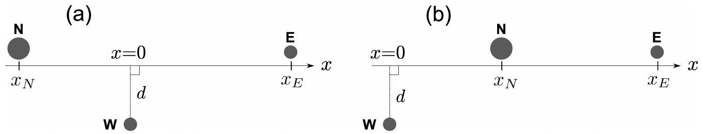
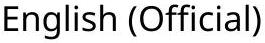
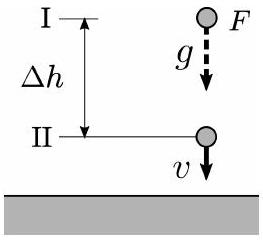
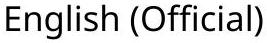
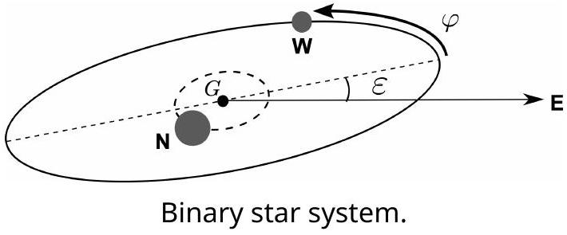
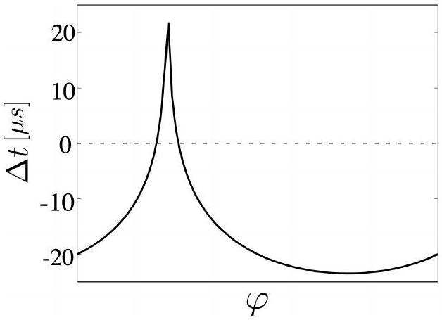
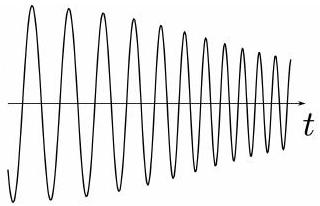
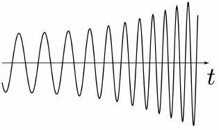
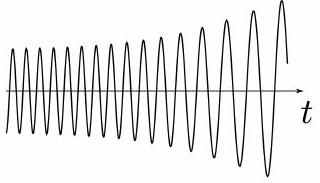
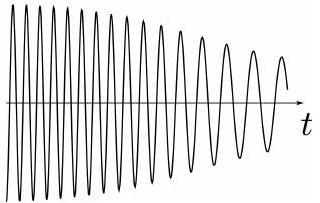

## Neutron Stars (10 points)

We discuss the stability of large nuclei and estimate the mass of neutron stars theoretically and experimentally.

Part A. Mass and stability of nuclei (2.5 points)
The rest-energy of a nucleus $m(Z, N) c^{2}$ consisting of $Z$ protons and $N$ neutrons is smaller than the sum of rest-energies of protons and neutrons, hereafter called nucleons, by the binding energy $B(Z, N)$, where $c$ is the speed of light in vacuum. Ignoring minor corrections, we can approximate the binding energy consisting of the volume term with $a_{V}$, the surface term with $a_{S}$, the Coulomb energy term with $a_{C}$, and the symmetry energy term with $a_{\text {sym }}$ in the following way.

$$
m(Z, N) c^{2}=A m_{N} c^{2}-B(Z, N), \quad B(Z, N)=a_{V} A-a_{S} A^{2 / 3}-a_{C} \frac{Z^{2}}{A^{1 / 3}}-a_{\text {sym }} \frac{(N-Z)^{2}}{A},
$$

where $A=Z+N$ is the mass number and $m_{N}$ is the nucleon mass. In the calculation, use $a_{V} \approx 15.8 \mathrm{MeV}$, $a_{S} \approx 17.8 \mathrm{MeV}, a_{C} \approx 0.711 \mathrm{MeV}$, and $a_{\text {sym }} \approx 23.7 \mathrm{MeV}$ ( $\mathrm{MeV}=10^{6}$ electron volts).

A. 1 Under the condition of $Z=N$, determine $A$ for maximizing the binding energy 0.9pt per nucleon, $B / A$.
A. 2 Under the condition of fixed $A$, the atomic number of the most stable nucleus $Z^{*}$ is determined by maximizing $B(Z, A-Z)$. For $A=197$, calculate $Z^{*}$ using Eq. (1).
A. 3 A nucleus having large $A$ breaks up into lighter nuclei through fission in order to minimize the total rest-mass energy. For simplicity, we consider one of multiple ways to break a nucleus with $(Z, N)$ into two equal nuclei, which occurs when the following energy relation holds,
$$
m(Z, N) c^{2}>2 m(Z / 2, N / 2) c^{2} .
$$
When this relation is written as
$$
Z^{2} / A>C_{\text {fission }} \frac{a_{S}}{a_{C}},
$$
obtain $C_{\text {fission }}$ up to two significant digits.

Part B. Neutron star as a gigantic nucleus (1.5 points)
For large nuclei with a large enough mass number $A>A_{c}$ with a threshold $A_{c}$, these nuclei stay stable against nuclear fission because of the sufficiently large binding energy due to gravity.

## Q2－2   

＂＂н ；надь𧰨нований ＂
$$
p
$$
－㐄＝ ＂
ного на atp никти口－ ＂

## Part C．Neutron star in a binary system（6．0 points）

Some neutron stars are pulsars regularly emitting electromagnetic waves，which we call＂light＂for sim－ plicity here，at a constant period．Neutron stars often make binary systems with a White Dwarf．Let us consider the star configuration shown in Fig．1，where a light pulse from a neutron star $\mathbf{N}$ to the Earth E passes near a White Dwarf W of the binary system．Measuring these pulses influenced by the star＇s gravity leads to an accurate estimation of the mass of W as explained below，resulting in the estimation of the mass of $\mathbf{N}$ ．

Fig．1：Configurations with the $x$－axis along the line connecting $\mathbf{N}$ and $\mathbf{E}$ ．（a）for $x_{N}<0$ and（b） for $x_{N}>0$ ．

## Q2－3   

＂н none of𧰨новой ＂

＂

GAOZHONGSHUXUXUE منحدبالتها ＂
о инаногонаниканос⿱亠䒑 assualty م⿻大从
$$
=
$$
наструктированта𧰨ноканий
ate awalts ages aways
asper ي ctajes none of the y ник новом

## Q2-4   

о ин при poople aways ate بтскати-ка

- assum any asper ate server socia the never(spersons GAÓ
и новенных не ни astates aster the SECTING "

и новененных нениканика GAOZH SHAR никти-кай any nomes

## Q2-5   Q

" "ણ доказании " S " "

"

"

"

"

