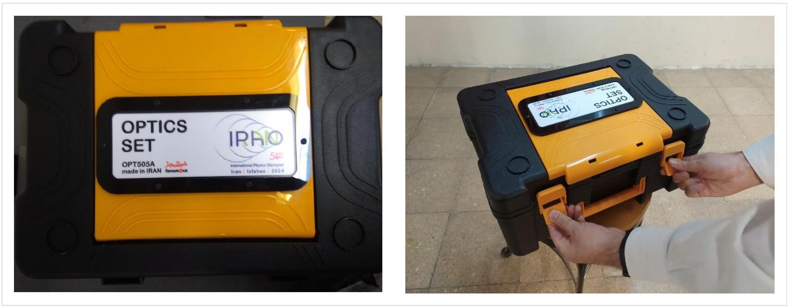
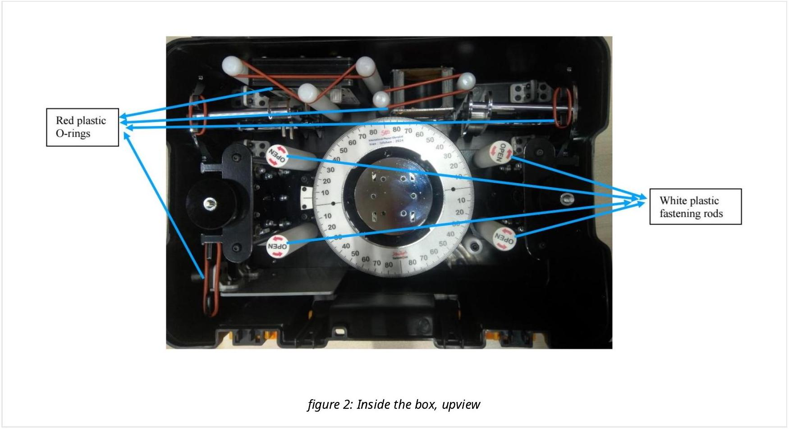
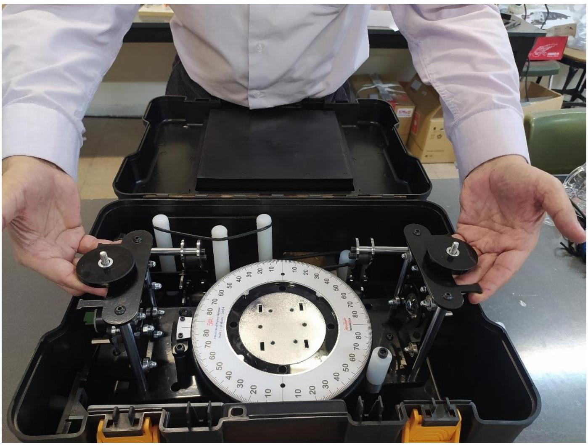
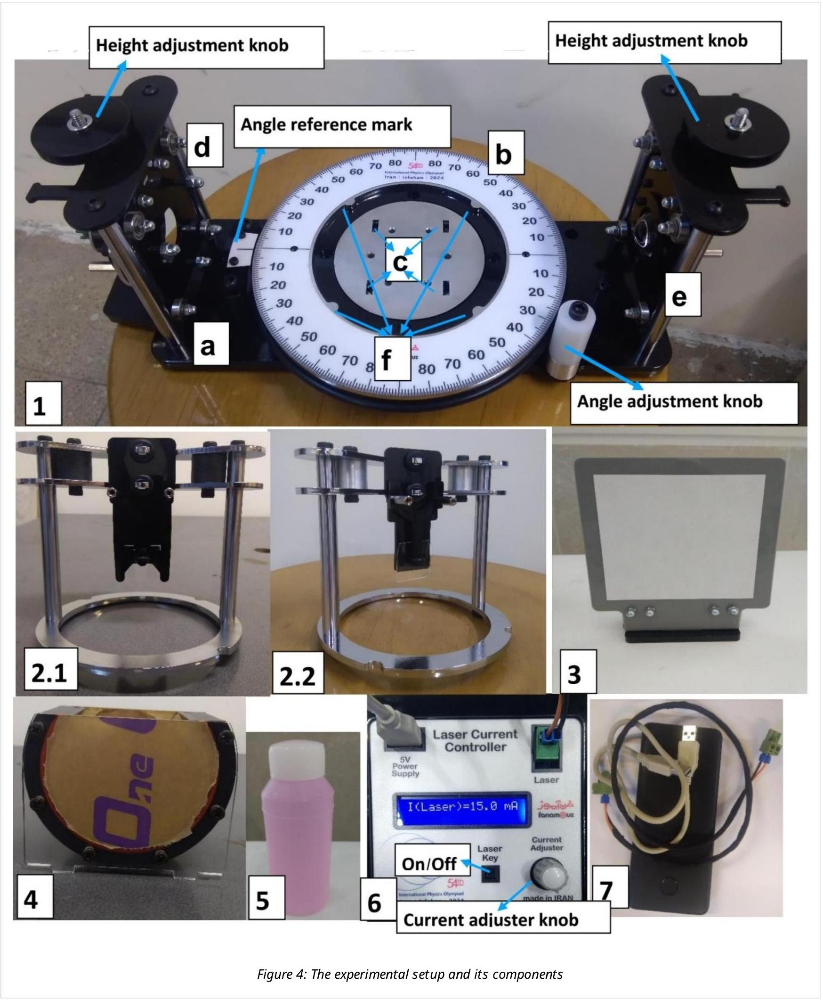
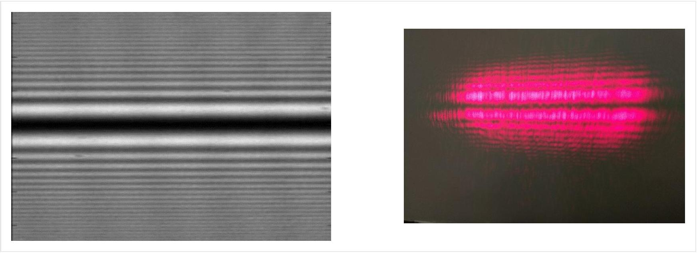
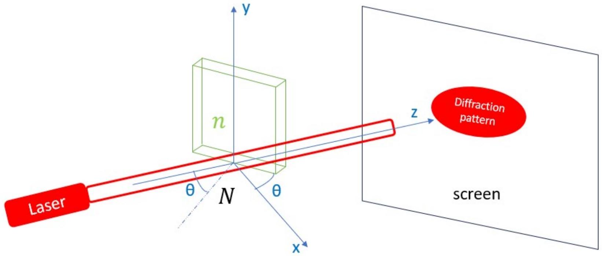
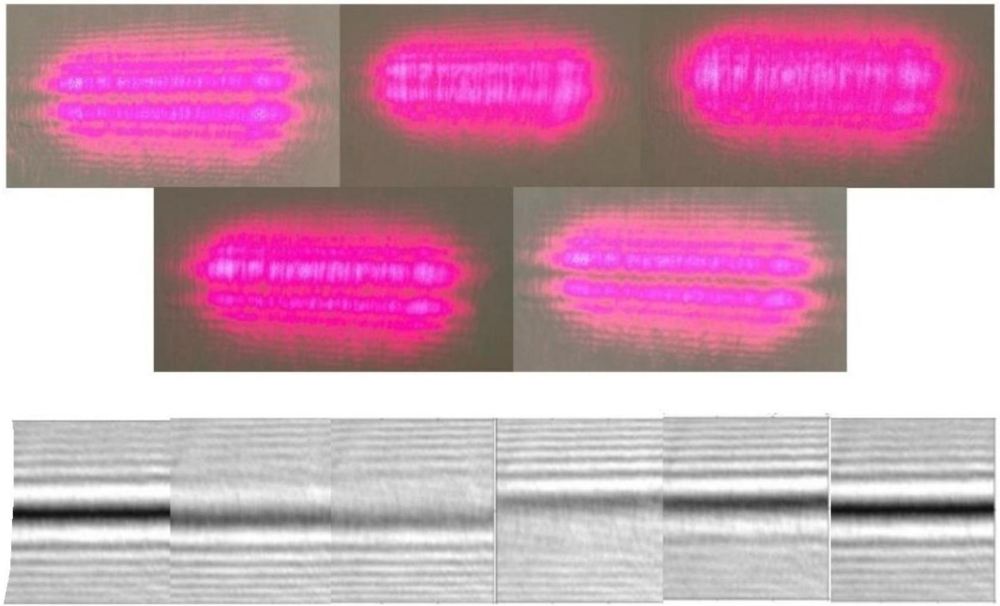
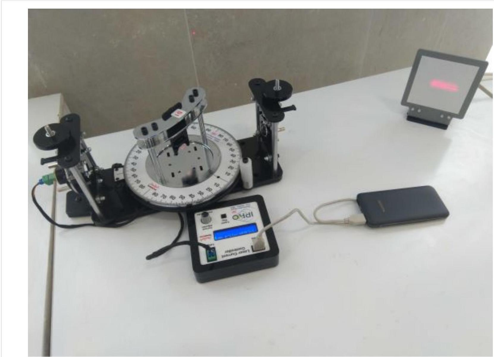

## Diffraction from Phase Steps (10 points)

## The Equipment Box

figure 1: The equipment box

To release the setup, you need to unscrew the white plastic fastening rods in the direction indicated on the top. You can pull out the main platform from the box as shown in Figure 3. After this, remove the red plastic O-rings indicated in Figure 2 and remove the other components inside the box one by one. To remove the instruments hold them by their metallic parts or by their outer surface.

Figure 3: Extracting the main platform from the box.

## The setup (Details)

Points: 20

1. The main platform of the experimental setup, which consists of:
(a) A horizontal base.
(b) A white rotating protractor: it can be rotated using the white plastic knob next to it. A reference mark on the metallic plate can be used to read the angle (see Figure 4-1).
(c) A circular plate with 4 square holes to hold the container of an unknown liquid.
(d) A red laser and (e) convex lenses for magnifying the diffraction pattern, installed on the walls at the two sides of the platform: their height can be adjusted by turning the knobs at the top.
(f) Four protrusions on the inner wall of the protractor to hold the glass pieces' holders.
2. Holders S1 (2.1) and S2 (2.2): each Holder stands on the circular metallic plate concentric with protractor and the four protrusions (Figure 4-1f) keep it fixed. The S1 holder includes a black piece which holds a thin microscope slide. The lower edge of the slide is completely free and laser light can be shone onto it. The S2 Holder is quite similar to S1, the only difference being that it holds a thick microscope slide.
3. The observation screen: it can be placed at any distance from the setup.
4. The unknown liquid container: after removing the protective adhesive paper, it can be placed on the square holes in the middle of the protractor (Figure 4-1c). The effect of container walls on the diffraction pattern is negligible.
5. The pink liquid, inside the bottle on your desk, has an unknown refractive index.
6. The laser electronic board: it can be turned on by connecting the laser to the board (and the board to the power bank). Use the On/Off switch on the board to turn the laser on or off. The intensity of the laser light can be adjusted by turning the current adjuster knob on the electronic board. Set the intensity of the laser to a level at which your eyes are comfortable.
7. Power bank and electrical cables.

Please take note of the following:

1. Do not touch the glass lens and the microscope slides at all, because your fingerprints can affect the results of your experiment, and the slides are rather thin and can easily break.
2. Do not drink the unknown liquid.
3. Do not look directly into the laser.

## Theory

When a laser beam is shone at the edge of a transparent slide, a phase difference is introduced between the part that travels through the slide and the part that does not. This phase difference results in a diffraction pattern, the lines of which are parallel to the edge of the slide (see Figure 5).

Figure 5: A theoretical diffraction pattern (left), and the diffraction pattern observed in the lab (right).

Let us take the direction of the beam as the z-direction (see Figure 6), and at first, we'll assume that the slide is in the x-y plane and its horizontal edge coincides with the x-axis (i.e. the angle in Figure 6 is equal to zero). In this case the phase difference between the two parts of the beam clearly is:

$$
\phi_{0}=\frac{2 \pi h}{\lambda}(n-N)
$$

where $h$ is the thickness of the slide, $\lambda$ is the wavelength of the laser beam, $N$ is the refractive index of the environment, and $n$ is the refractive index of the transparent slide.

Figure 6: Schematic of the laser beam, the slide, and the screen.

If we rotate the slide around the y-axis so that the normal to the surface of the slide makes an angle of $\theta$ with the incident beam, a simple calculation gives the following formula for the phase difference

$$
\phi=\frac{2 \pi h}{\lambda}\left(\sqrt{n^{2}-N^{2} \sin ^{2} \theta}-N \cos \theta\right)
$$

Hence the phase difference is a function of $\theta$. If we continuously change this angle, the phase difference increases continuously and the shape of the pattern changes, but when the phase difference reaches $2 \pi$, the pattern reverts to its initial shape. We call this full cycle one fringe shift. Figure 7 displays the various stages of one fringe shift.

Figure 7: Various stages of fringe shift as seen on the screen in the lab and as predicted theoretically (from left to right, each figure has phase difference equals to $\varphi, \varphi+4 \pi / 9, \varphi+6 \pi / 9, \varphi+10 \pi / 9, \varphi+14 \pi / 9, \varphi+2 \pi)$.

We can start from $\theta=0$ and gradually increase the angle. After $m$ such fringe shifts corresponding to a rotation by $\theta=\theta_{\mathrm{m}}$, we will have:

$$
\phi=\frac{2 \pi h}{\lambda}\left(\sqrt{n^{2}-N^{2} \sin ^{2} \theta_{\mathrm{m}}}-N \cos \theta_{\mathrm{m}}\right)=2 \pi m+\phi_{0}
$$

or:

$$
m=\frac{h}{\lambda}\left(\sqrt{n^{2}-N^{2} \sin ^{2} \theta_{\mathrm{m}}}-N \cos \theta_{\mathrm{m}}\right)-\frac{\phi_{0}}{2 \pi}
$$

## Important note:

1. You only need to calculate the uncertainty in the final results of each part (Errors need to be calculated and reported whenever the ± sign is present in the answer sheet).
2. You can use the provided calculator to find the slope and the vertical axis intercept of the curves.

3. Note:
Regression, r, is a number between 1 and -1 showing how much the data can be fitted to a line. If $|\mathrm{r}|=1$ it means data are completely on a line.
In case we're calculating slope (B) and intercept (A) using a calculator in linear mode, we can use these formulas below in order to calculate their uncertainty:
$$
\begin{gathered}
\Delta B=B \sqrt{\frac{1}{(\mathfrak{n}-2)}\left(\frac{1}{r^{2}}-1\right)} \\
\Delta A=\Delta B \sqrt{\overline{x^{2}}}
\end{gathered}
$$
Which $\mathfrak{n}$ is number of data points we've got, and $\overline{x^{2}}$ is average of square of X.
- You must calculate uncertainty of the slope and the intercept only by the formulas above.

## Part A: Thickness of the thin slide (S1) (2.0 points)

For the following tasks, take the refractive index of the glass components (S1, S2) to be 1.51 and that of air to be 1.00 . Take the wavelength of the red laser to be 650 nm , and ignore any uncertainty in these values.

Turn on the laser. Place the S1 Holder on the protractor, and adjust the height of the laser such that it shines on the bottom edge of the microscope slide. Then adjust the height of the lens until you can observe the diffraction pattern on the screen (this height should almost be equal to the height of the laser beam). Note that the fringes in the diffraction pattern are horizontal. figure 8 shows the experimental setup for part A. Now slowly turn the protractor and observe the fringe shift.

Figure 8: experimental setup in operation (part A)

| A-1 | Starting with zero degrees, rotate the protractor and go up to 70 degrees. Watch the number of fringe shifts and write down the angle $\theta_{\mathrm{m}}$ corresponding to each fringe shift number $m$. Take at least 25 data points and fill out the table. | 0.8 pt |
| :--- | :--- | :--- |
| A-2 | Draw appropriate graph. | 0.3 pt |
| A-3 | Find the slope (B) and the vertical axis intercept (A). | 0.1 pt |
| A-4 | Using the slope, find the thickness of the thin slide. | 0.8 pt |

## Part B: Thickness of the thick slide (S2) (1.6 points)

Go back to the setup for Part A using the S2 Holder instead of the S1 Holder.

| B-1 | Repeat the task A-1 for $\theta$ between 0 and 20 degrees and record at least 15 data points. | 0.6 pt |
| :--- | :--- | :--- |
| B-2 | Assuming $\theta_{\mathrm{m}}$ in Equation 4 is small enough, expand the relation to the order $\theta_{\mathrm{m}}^{2}$ and find a linear relation between the fringe shift number and $\theta_{\mathrm{m}}^{2}$ (assume $N=1.00$ ). | 0.1 pt |
| B-3 | Draw an appropriate graph. | 0.2 pt |
| B-4 | Find the slope and the vertical axis intercept. | 0.1 pt |
| B-5 | Using the slope, find the thickness of the thick slide. | 0.6 pt |

## Part C: Finding $N$ using the thick microscope slide (S2) (1.6 points)

Pour the unknown liquid into the container. Place the container at the center of the protractor and gently place the S2 Holder back onto the protractor in such a way that the microscope slide is immersed inside the liquid. Adjust the height of the laser and the microscope slide so that the laser beam shines at the boundary between the slide and the ambient liquid. Again, a diffraction pattern will be observed on the screen.

| C-1 | Repeat the task B-1 (15 data points up to 20 degrees). | 0.6 pt |
| :--- | :--- | :--- |
| C-2 | Repeat the task B-2 for arbitrary $N$. | 0.1 pt |
| C-3 | Draw an appropriate graph. | 0.2 pt |
| C-4 | Find the slope and the vertical intercept. | 0.1 pt |

| C-5 | Find the refractive index of the unknown liquid $(N)$. | 0.6 pt |
| :--- | :--- | :--- |

## Part D: Finding $N$ using the thin microscope slide (S1) (4.8 points)

Put S1 holder instead of S2 inside unknown liquid.

| D-1 | Repeat the task A-1 for this case (25 data points up to 70 degrees). | 0.7 pt |
| :--- | :--- | :--- |
| D-2 | Do a simple calculation and eliminate $\phi_{0}$ from Equations 1 and 4 to obtain a relation like $N(n-N)+u N=w$. Find $u$ and $w$ in terms of $m, n, h, \lambda$, and $\theta$. | 0.8 pt |
| D-3 | Use your calculator to determine $u$ and $w$. | 1.2 pt |
| D-4 | Draw $w$ versus $u$. | 0.3 pt |
| D-5 | In the previous graph, find the linear region and calculate the slope and the vertical axis intercept of the curve. | 0.2 pt |
| D-6 | Find the refractive index, first using the slope $\left(N_{\mathrm{B}}\right)$, and then using the vertical intercept $\left(N_{\mathrm{A}}\right)$. | 1.6 pt |
