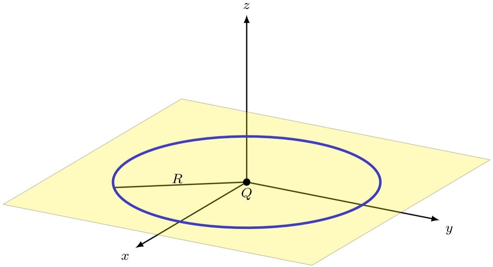
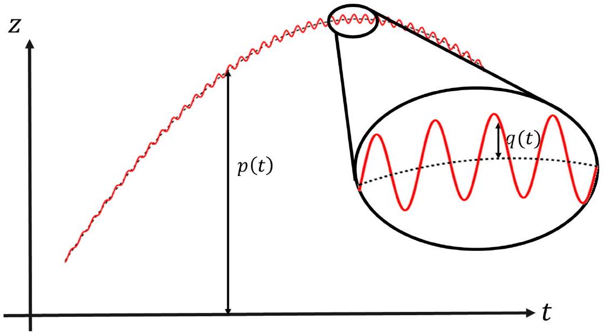
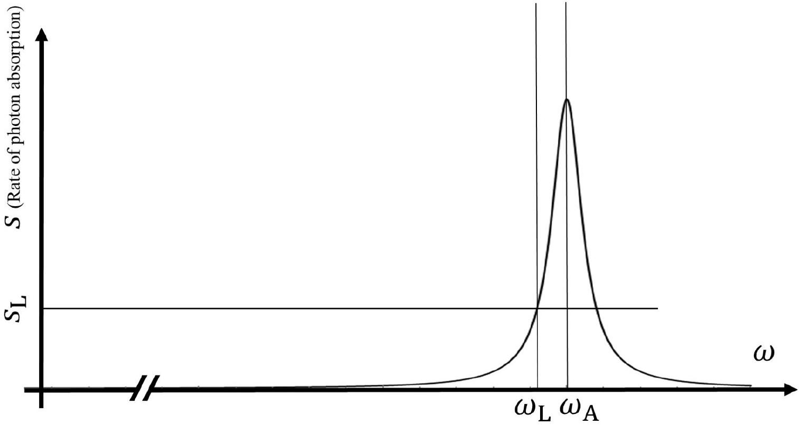

## Trapping Ions and Cooling Atoms

In recent decades, trapping and cooling atoms and ions has been a fascinating topic for physicists, with several Nobel prizes awarded for work in this area. In the first part of this question, we will explore a technique for trapping ions, known as the "Paul trap". Wolfgang Paul and Hans Dehmelt received one half of the 1989 Nobel Prize in Physics for this work. Next, we investigate the Doppler cooling technique, one of the works cited in the press release for the 1997 Nobel Prize in Physics awarded to Steven Chu, Claude Cohen-Tannoudji, and William Daniel Phillips "for developments of methods to cool and trap atoms with laser light".

## A. The Paul Trap

It is known that with electrostatic fields, it is not possible to create a stable equilibrium for a charged particle. Therefore, creating a stable equilibrium point for ions requires more sophisticated techniques. The Paul trap is one of these techniques.

Consider a ring of charge with a radius $R$ and a uniform positive linear charge density $\lambda$. A positive point charge $Q$ with mass $m$ is placed at the center of the ring.

Figure 1 - A positively charged ring with a uniform linear charge density $\lambda$ and radius $R$ : the origin of the coordinate system is at the center of the ring.

| A-1 | a) In cartesian coordinates $(x, y, z)$, obtain the electric field due to the charged ring in the vicinity of the ring's center to the first order in $x / R$, $y / R$, and $z / R$.   b) Find the angular frequency of small oscillations of the charged particle around the center of the ring in the directions for which a stable equilibrium exists. | 1.5 pt |
| :--- | :--- | :--- |

In order to trap the charge $Q$ fully, we would like to apply alternating fields to produce a dynamic equilibrium. Assume that the charge density is $\lambda=\lambda_{0}+u \cos \Omega t$ in which $\lambda_{0}, u$, and $\Omega$ are adjustable. We shall ignore radiative effects. Then the equation of motion for small displacements from the center of the ring, along the direction perpendicular to the plane of the ring will turn out to be:

$$
\ddot{z}=\left(+k^{2}+a \Omega^{2} \cos \Omega t\right) z
$$

| A-2 | Write $a$ and $k$ in terms of the known parameters. | 0.4 pt |
| :--- | :--- | :--- |

We would like to obtain an approximate solution to Equation (1) by making the following simplifying assumptions: $a \ll 1, \Omega \gg k$, and $a \Omega^{2} \gg k^{2}$. With these assumptions, it can be shown that the solution of this equation can be split into two parts: $z(t)=p(t)+q(t)$, where $p(t)$ is a slowly varying component and $q(t)$ is a small-amplitude rapidly-varying component with a mean value of zero. In other words, $p(t)$ may be assumed constant over a few oscillations of $q(t)$ (see Figure 2).

Figure 2 - A typical solution for the equation of motion of the charged particle: $p(t)$ gives the overall motion, and $q(t)$ represents small oscillations around this trajectory. The ellipse on the right is a magnification of a part of this trajectory.

| A-3 | a) Using the approximations stated above, find the equation of motion for $q(t)$ in terms of $a, \Omega$, and $p$.   b) Find the solution of this equation by considering appropriate initial conditions corresponding to the required properties of this function. | 1.8 pt |
| :--- | :--- | :--- |
| A-4 | a) Using the mean effect of the rapidly varying component and obtain an effective equation of motion for $p(t)$.   b) Investigate the stability of the equilibrium point and find the condition for a stable equilibrium. | 1.5 pt |

Assume that $\lambda_{0}=8 \times 10^{-9} \mathrm{C} / \mathrm{m}$ and $R=10 \mathrm{~cm}$. We would like to use this device to trap a singly ionized atom 100 times heavier than a hydrogen atom.

| A-5 | Calculate $k$. Assume $a=0.04$ and estimate the smallest frequency required to stabilize the motion of this ion. Use the data given at the end of the question. | 0.4 pt |
| :--- | :--- | :--- |

## B. Doppler Cooling

It may be necessary to cool a trapped atom or ion. Assume that a trapped atom of mass $m$, has two energy levels with an energy difference of $E_{0}=\hbar \omega_{\mathrm{A}}$. Electrons in the lower level may absorb a photon and jump to the higher level, but after a period $\tau$ they will return to the lower level and emit a photon with a frequency predominantly within $\left[\omega_{\mathrm{A}}-\Gamma, \omega_{\mathrm{A}}+\Gamma\right]$.

B-1 Use the Heisenberg's uncertainty principle to find $\Gamma$. 0.5 pt

With a similar reasoning, when we shine a laser light on the trapped atom, if the angular frequency of the laser, $\omega_{\mathrm{L}}$, falls in the interval $\left[\omega_{\mathrm{A}}-\Gamma, \omega_{\mathrm{A}}+\Gamma\right]$, the atom may absorb the photon. Assume that the frequency $\omega_{\mathrm{L}}$ of the laser light is slightly lower than $\omega_{\mathrm{A}}$. For a particular device, the rate of photon absorption by an atom in the reference frame of the atom is given in Figure 3. The absorbed photon is then re-emitted in a random direction. To make things simple, we consider the problem in one dimension, i.e. we assume that the atoms can only move in the $x$ direction and the laser light shines on them both from the left and from the right. In the atom's reference frame, the light has a higher or lower frequency due to the motion of the atoms. Since the velocity $v$ of the atoms is very small, we only include terms of order $v / c$ and ignore all the higher-order terms. Moreover, we have $m \gg \hbar \omega_{\mathrm{A}} / c^{2}$ so that the velocity of the atom nearly does not change after absorbing the photon. Also, the change in frequency due to the Doppler effect is so small compared to $\omega_{\mathrm{A}}-\omega_{\mathrm{L}}$, that the function for $s$ in the diagram of Figure 3 may be approximated by the following linear function:

$$
s(\omega)=s_{\mathrm{L}}+\alpha\left(\omega-\omega_{\mathrm{L}}\right)
$$

where $s$ is the number of absorbed photons per unit of time, $s_{\mathrm{L}}$ is the value of $s$ for $\omega=\omega_{\mathrm{L}}$, and $\alpha$ is the slope of the line tangent to the curve at $\omega_{\mathrm{L}}$. The frequency of the re-emitted photon is almost equal to the frequency of the incident photon, but it is emitted with equal probability in the positive or negative $x$-direction. In fact, up to the order considered here the two frequencies are identical. Note that we are considering the whole process in the atom's reference frame.

Figure 3 - The rate of photon absorption as a function of the frequency for a particular trap: the frequency corresponding to the energy difference between the two atomic levels is indicated by $\omega_{\mathrm{A}}$ and the slighlty smaller frequency of the laser is indicated by $\omega_{\mathrm{L}}$.

| B-2 | a) Assume that the trapped atom is moving with a velocity, $v=v_{\mathrm{x}}$ in the lab frame. In the frame of reference of the atom, calculate the collision rate of the photons, incident from each of the two directions, with the atoms (denoted by $s_{+}$and $s_{-}$) and the rate of absorption of momentum in each direction (denoted by $\pi_{+}$and $\pi_{-}$).   b) Determine the effective force on the atom as a function of $v, k_{\mathrm{L}}=\omega_{\mathrm{L}} / c$, $\hbar$, and $\alpha$, in the reference frame of the laboratory. Assume $s_{\mathrm{L}} \ll \alpha \omega_{\mathrm{L}}$, | 1.7 pt |
| :--- | :--- | :--- |

We would like to find the lowest temperature that can be achieved using this technique. Assume that the velocity of a particular atom has been reduced to zero exactly, and at this very moment it absorbs a photon (incident from any of the two directions), and re-emits the photon randomly in any of the two directions, with almost the same frequency. Assume that this process happens once every $\tau$ units of time.

| B-3 | Considering the momentum of the atom after such a process for the two possible outcomes, calculate the average power absorbed by the atom. | 1.0 pt |
| :--- | :--- | :--- |

| B-4 | Consider the force calculated in Task B-2 and calculate the output power. Then, calculate the average value of $v^{2}$ at equilibrium. Using your knowledge of the kinetic theory of gases estimate the temperature of the atoms. | 0.8 pt |
| :--- | :--- | :--- |
| B-5 | Estimate this temperature, for an atom 100 times heavier than a hydrogen atom. Assume that $\omega_{\mathrm{L}}=2 \times 10^{16} \mathrm{rad} / \mathrm{s}, \tau=5 \times 10^{-9} \mathrm{~s}$, and $\alpha=4$. | 0.4 pt |

mass of hydrogen atom: $m_{\mathrm{H}}=1.674 \times 10^{-27} \mathrm{~kg}$
charge of an electron: $e=1.602 \times 10^{-19} \mathrm{C}$
permittivity of free space: $\varepsilon_{0}=8.854 \times 10^{-12} \mathrm{~F} / \mathrm{m}$
Boltzmann constant: $k_{\mathrm{B}}=1.381 \times 10^{-23} \mathrm{~J} / \mathrm{K}$
Planck constant: $\hbar=1.055 \times 10^{-34} \mathrm{~J}$.s
