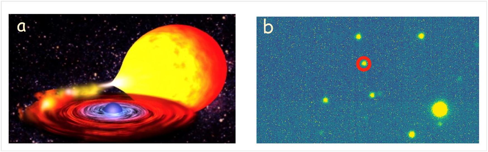
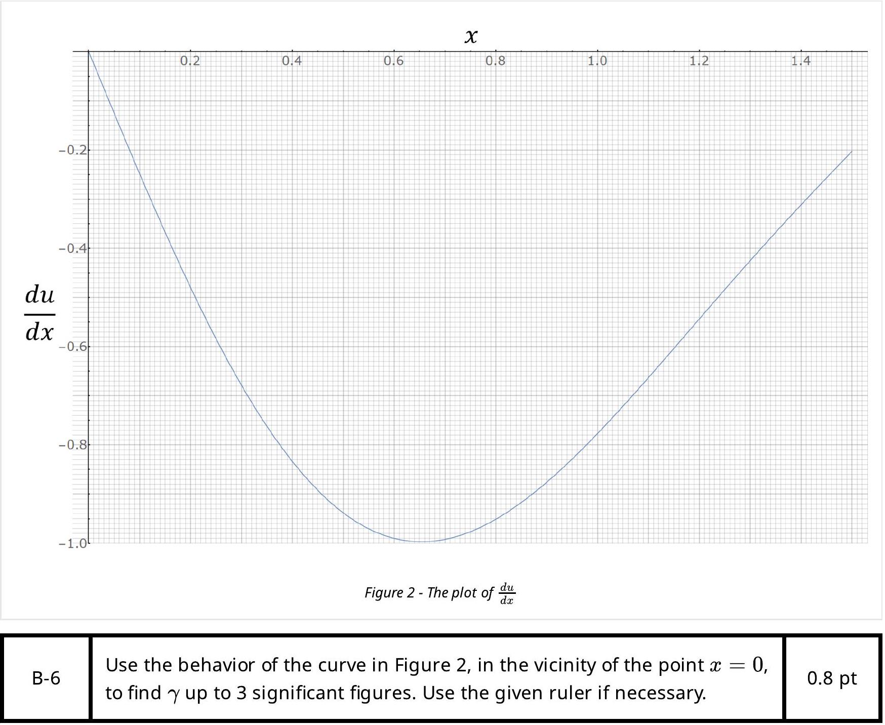

## Black Widow Pulsar

A significant number of the observed stars are binaries. One or both of the stars may be neutron stars rotating with a high angular velocity and emitting electromagnetic waves; such stars are called pulsars. Sometimes a companion star is an expansive mass of gas that gradually falls down onto the neutron star and causes its mass to increase (Figure 1-a). In this way, a neutron star gradually swallows up a portion of the mass of its companion star. For this reason, the neutron star has been compared to a black widow (or redback spider), a female spider which eats its mate after mating. The heating of the gas falling down onto the black widow generates radiation which can be observed. The heaviest neutron stars often are black widows and they serve as natural laboratories for testing fundamental physics. Figure 1-b shows the picture of the companion of the neutron star PSR J2215+5135, taken by the 3.4-meter optical telescope of the Iranian National Observatory. No neutron star can be seen in this image and the observed light is due to its companion.

Figure 1 - (a) The falling gases of the companion star onto the neutron star - (b) The companion of the neutron star PSRJ2215+5135

## A. A Binary System

Consider a simple model in which the black widow and its companion star, are represented by two point masses $M_{1}$ and $M_{2}$ moving on a circular orbit around their center of mass. To investigate the dynamics of this system, consider a rotating coordinate system in which the two bodies are stationary. Take the center of mass to be the origin of the coordinate system. Assume that the two point masses lie on the $x$-axis on both sides of the origin at a distance $a$ from each other, and that $M_{1}$ lies on the negative $x$-axis. At an arbitrary point $(x, y)$ in the plane of motion, the effective potential $\varphi(x, y)$ for a unit test mass is the sum of the gravitational potentials of the two point masses plus the centrifugal potential.
A-1
Write $\varphi(x, y)$ in terms of $M_{1}, M_{2}, G$, and $a$.
1.0 pt

| A-2 | Assuming $M_{1}>M_{2}$, plot the function $\varphi(x, 0)$ qualitatively. | 0.7 pt |
| :--- | :--- | :--- |

Suppose (just for task A-3) $M_{2}=M_{1} / 3$ and assume that $M_{2}$ is surrounded by a rarefied gas of very low density. The mass of this gas is insignificant and we ignore its gravitational effects. If the size of this gas envelope becomes greater than a specific limit, the gas will overflow onto $M_{1}$. Suppose the overflow occurs through $x=x_{0}$ on the $x$-axis.

| A-3 | Find the numerical value of $\frac{x_{0}}{a}$, up to two significant figures. You may use the calculator. | 0.5 pt |
| :--- | :--- | :--- |

Take the rotational period of the stars around their center of mass to be $P$. Assume that mass flows from $M_{2}$ to $M_{1}$ at a very small rate of $d M_{1} / d t=\beta$. This rate is so small that in each period of rotation, the distance between the two stars can be assumed to be constant. However, after a long period of time, the distance between the two stars changes, while the motion remains circular.

| A-4 | Calculate the rate of change of $a$ and $P$ in terms of $\beta, M_{1}, M_{2}, G$, and $a$. | 0.6 pt |
| :--- | :--- | :--- |

The gas separated from $M_{2}$ forms a disk rotating around $M_{1}$ and heats up due to friction (Figure 1-a). As the gas loses energy, it spirals inward toward $M_{1}$ and finally falls onto it. In the steady state, the mass flows at the constant rate of $\beta$, from $M_{2}$ to the disc and from the disc onto $M_{1}$. At the same time, the heated disk emits thermal radiation as a blackbody. This disk forms very close to the neutron star so the gravitational pull of the $M_{2}$ star can be ignored for the analysis of the disk's motion. Also, ignore the heat capacity of the gas.

| A-5 | Determine the temperature of the disc at distance $r$ from the center of the star $M_{1}$ in terms of $\beta, M_{1}, G$, and $\sigma$ (Stefan-Boltzmann constant). | 1.0 pt |
| :--- | :--- | :--- |

In the binary system PSR J2215+5135, the mass of the neutron star is $M_{\mathrm{NS}}=2.27 M_{\odot}$ and the mass of its companion star is $M_{\mathrm{S}}=0.33 M_{\odot}$, where $M_{\odot}=1.98 \times 10^{30} \mathrm{~kg}$ is the mass of the Sun. The rotational period is $P=4.14 \mathrm{hr}$, and the Stefan-Boltzmann constant is $\sigma=5.67 \times 10^{-8} \mathrm{~W} / \mathrm{m}^{2} \mathrm{~K}^{4}$, and the gravitational constant is $G=6.67 \times 10^{-11} \mathrm{~m}^{3} / \mathrm{kgs}^{2}$. Assume that the mass flow rate to the neutron star is $\beta=\dot{M}_{\mathrm{NS}}=9 \times 10^{-10} M_{\odot} \mathrm{yr}^{-1}$.

| A-6 | Calculate the temperature of the disc at the radius $r=\frac{a}{10}$ in kelvins. | 0.5 pt |
| :--- | :--- | :--- |

Assume that after a sudden explosion, the $M_{1}$ star ejects a part of its mass out of the binary system at a very high speed, and its mass becomes $M_{1}{ }^{\prime}$. Take the magnitude of the velocity of $M_{1}{ }^{\prime}$ relative to $M_{2}$ to be $v^{\prime}$ after the explosion.

| A-7 | Determine the maximum value of $v^{\prime}$, in terms of $M_{1}{ }^{\prime}, M_{2}, G$, and $a$, that allows the new binary system to stay bounded. Assuming that the explosion is isotropic, what is the minimum value of $M_{1}{ }^{\prime}$ for the binary system to remain bounded? | 0.7 pt |
| :--- | :--- | :--- |

## B. Analysis of the Stability of a Star

In this part we study the stability of a single star. Consider a star containing a specific kind of matter with the equation of state $p=K \rho^{\gamma}$ where $K$ and $\gamma$ are constants. Let $p(r)$ and $\rho(r)$ be the pressure and density at a distance $r$ from the center of the star, respectively. The pressure and density at the center of the star are $p_{\mathrm{c}}$ and $\rho_{\mathrm{c}}$, respectively. In all tasks of the part B, take all outward vectors to be positive.

| B-1 | Determine the gravitational acceleration $g(r)$ near the center of the star in terms of $r$ and the constants $G$ and $\rho_{\mathrm{c}}$. | 0.2 pt |
| :--- | :--- | :--- |
| B-2 | Derive a (differential) equation for determining $\rho(r)$ at equilibrium, and write it in the following form: $\frac{d}{d r}\left[h_{1}(\rho, r) \frac{d \rho}{d r}\right]+h_{2}(r) \rho=0$. Find the functions $h_{1}$ and $h_{2}$. | 0.6 pt |
| B-3 | Construct a quantity $r_{0}$ of the form $r_{0}=G^{l} p_{\mathrm{c}}{ }^{m} \rho_{\mathrm{c}}{ }^{n}$ with the dimension of length. | 0.4 pt |
| B-4 | Rewrite the (differential) equation of task B-2 in the following form: $\frac{d}{d x}\left[A_{1}(u, x) \frac{d u}{d x}\right]+A_{2}(x) u(x)=0$   where $x=\frac{r}{r_{0}}$ and $u=\frac{\rho}{\rho_{\mathrm{c}}}$. Find the functions $A_{1}(u, x)$ and $A_{2}(x)$. | 0.3 pt |
| B-5 | For $\gamma=2$ one finds $u(x)=\frac{f(x)}{x}$. Determine $f(x)$. | 0.6 pt |

Assume that for a particular star $\frac{d u}{d x}$, as a function of $x$, is given by the curve given in Figure 2.

To analyze the stability of the system, we assume that the star deviates slightly from its equilibrium state: we assume that the spherical shell, which was in equilibrium at radius $r$, now has a radius $\tilde{r}$, similarly the parameters $g, p$, and $\rho$ have changed to $\tilde{g}, \tilde{p}$, and $\tilde{\rho}$ respectively. For convenience, we shall only consider small $r$ 's near the center of the star, for which we can assume that $\tilde{r}=r(1+\varepsilon(t))$, where $\varepsilon(t) \ll 1$.

| B-7 | Find $\tilde{\rho}$ and $\tilde{g}$ in terms of $\rho$ and $g$ to the first order in $\varepsilon$. | 0.9 pt |
| :--- | :--- | :--- |
| B-8 | Using Newton's equation of motion for the spherical layer with the equilibrium radius of $r$ find $\frac{d^{2} \tilde{r}}{d t^{2}}$ in terms of $\tilde{g}, \tilde{\rho}, K, \gamma$, and $\frac{\partial \tilde{\rho}}{\partial \tilde{r}}$ (By $\frac{\partial \tilde{\rho}}{\partial \tilde{r}}$ we mean derivative of $\tilde{\rho}$ with respect to $\tilde{r}$ at constant $t$.) | 0.6 pt |

| B-9 | Obtain $\frac{d^{2} \varepsilon}{d t^{2}}$ in terms of $\varepsilon$ and the constants given in the problem. Find the minimum value of $\gamma$ for a stable equilibrium, and find the oscillation's angular frequency of the star. | 0.6 pt |
| :--- | :--- | :--- |
