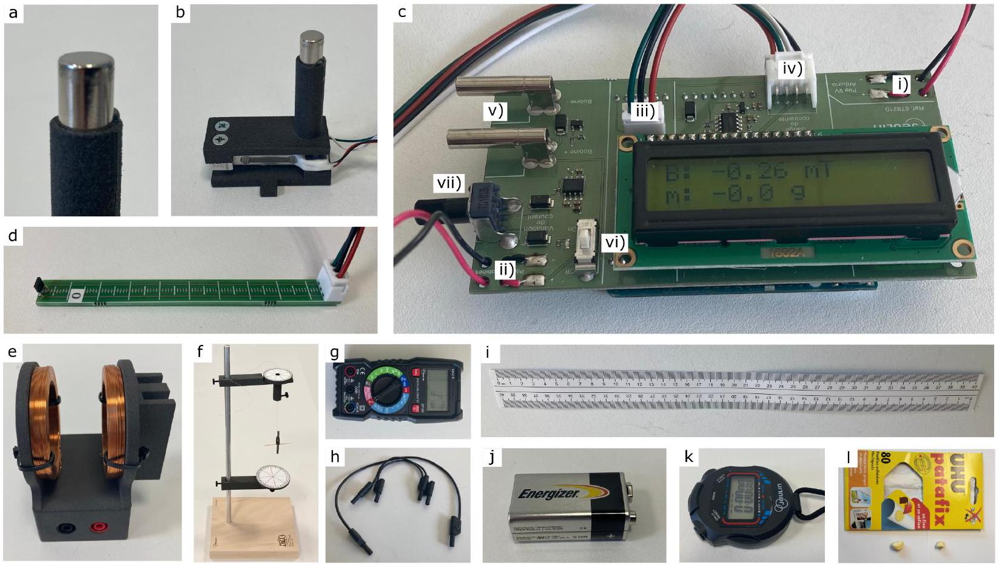
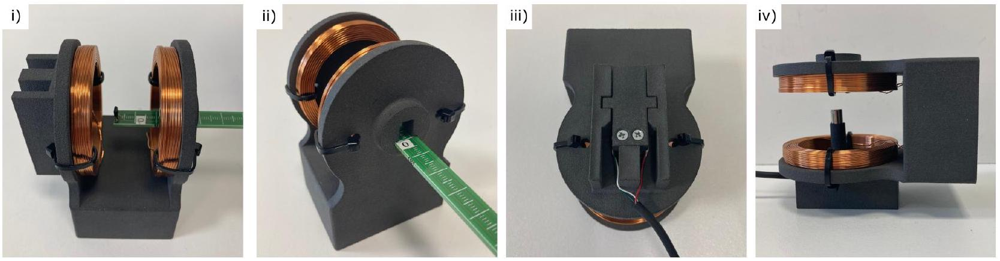
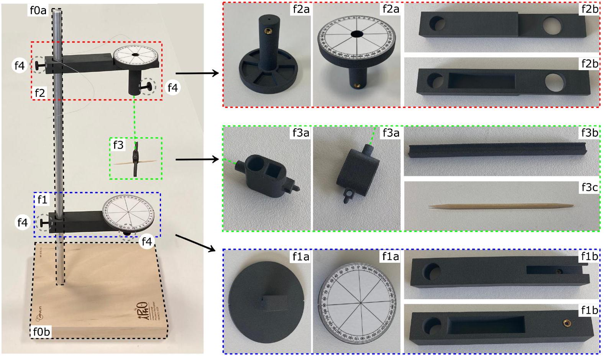

## Earth's magnetic field measurement (10 points)

## Introduction

This problem aims to measure the horizontal component of the Earth's magnetic field. A magnet will first be characterized using a so called Gouy balance, before being used to measure this magnetic field.

In the entire problem, uncertainties are expected to be determined only from the fits and not from the individual experimental points.

Equipment list

Fig. 1. Photographs of all equipment.

The list of equipment is given below and illustrated in Fig. 1. The number of items is indicated between [] when it is greater than one. Students should ask for help if something appears not to be working.

- (a) Magnets [3]. One magnet is attached to the force sensor (b) and should not be removed. Another magnet is inserted into the pod (f) and should not be removed until specified. The last one will be used in A.5. All magnets are supposed identical.
- (b) Force sensor. Connected to the Arduino (c), this sensor measures the force along its axis, noted $m_{\mathrm{f}}$, in grams-force ("g"), which is the force experienced by a 1-gram mass on the earth's surface in the gravity field $\left(g_{0}=9.81 \mathrm{~m} \cdot \mathrm{~s}^{-2}\right)$. One of the magnets (a) is attached to it. Each time it is switched back on, the sensor display is reset to 0, regardless of the situation. This sensor must not be subjected to forces in excess of 200 grams. It needs to be unpacked carefully.
- (c) Arduino with digital display. This element is used to power the coils (e) and to perform force and magnetic field measurements, displayed directly in gram-force ("g") and mT. The battery (j) powering the Arduino must be connected to slot (i), and the battery (j) powering the coils (e) to slot (ii) (pay attention to connection polarity). The force sensor (b) and magnetic field sensor (d) should be connected to slots (iv) and (iii) respectively, and the coil power cables to slots (v). A switch (vi) closes the coil supply circuit (indicated by an LED), whose electric current can be controlled in (vii).

- (d) Magnetic field sensor with ruler. Connected to the Arduino (c), this probe measures the field $B_{z}$ along the direction $\overrightarrow{e_{z}}$ of the ruler, in mT.
- (e) Coils in anti-Helmholtz configuration (wound in opposite directions). These coils must be connected in series with the ammeter (g) and to the Arduino (c) to create a magnetic field.
- (f) Metallic stand on a wooden base, with suspended pod where a magnet (a) is initially inserted, and with angle markers. The detailed assembly of this device is explained below.
- (g) Multimeter. Only used as an ammeter at the 10 A range. If left inactive, the multimeter switches off, and must be switched back on by returning it to the "OFF" position. Do not use the two cables supplied in the multimeter case.
- (h) Electric wires [3].
- (i) 40 cm ruler.
- (j) 9 V batteries [3]. Their capacity is of the order of 300 mA ⋅ h.
- (k) Chronometer.
- (l) Adhesive paste. Can be used for the entire problem.

Fig. 2. Use of sensors inside the anti-Helmholtz coils.

Use of sensors interfaced with the Arduino (Fig. 2)
The magnetic field sensor (d) can slide in the coils (e) as shown in (i), while measuring the field on their axis. The $z=0$ position for the sensor is shown in (ii), and $z$ increases as it moves inside the coils.

The force sensor (b) is inserted into the coils as shown in (iii), before turning the coil as in (iv) so that the transducer is vertical. To do this, be sure to route the electrical wires through the gutters provided.

Installation of equipment (f) (Fig. 3), to be mounted only before starting part B, with a 34 cm wire

- Insert the metal post (f0a) into the wooden plate with plastic feet (f0b) to form the stand (f0).
- The part (f1) is located on the lower part and marks the angle of the pod. Install the arm (f1b) on the metal post by means of a screw (f4), then fix the part (f1a) on it with a second screw (f4).
- The part (f2) is located on the upper part and hold the wire supporting the pod. Install the arm (f2b) on the metal post by means of a screw (f4), then insert the part (f2a) on it.
- To build the pod (f3), insert the inertia bar (f3b) and a toothpick (f3c) into the carrier part (f3a) on which a magnet (a) is already inserted. Insert the wire supporting the pod into the part (f2a), and secure it with a screw (f4). Turning part (f2a) changes the angle at which the wire is attached. The toothpick allows to precisely measure the angular position of the pod.

Fig. 3. Installation of the pod on the metallic stand. Parts (f1a), (f1b), (f2a), (f2b), and (f3a) are shown from two different angles. There are four identical (f4) plastic screws.

## Part A. Gouy balance and magnetic moment

Modeling
We assume that a magnet can be treated as a magnetic dipole of magnetic moment $\vec{m}_{\mathrm{m}}$. The force experienced by such a dipole of magnetic moment $\vec{m}_{\mathrm{m}}=m_{\mathrm{m}} \overrightarrow{e_{z}}$ in a magnetic field $\vec{B}=B(z) \overrightarrow{e_{z}}$ is

$$
\vec{F}(z)=m_{\mathrm{m}} \frac{d B(z)}{d z} \vec{e}_{z} .
$$

When an electric current $i$ flows through the anti-Helmholtz coils, the field $\vec{B}$ along the unit vector $\vec{e}_{z}$ of revolution axis is

$$
\vec{B}(z)=\alpha i\left(z-z_{0}\right) \vec{e}_{z} .
$$

This equation is only valid near the center of the device, denoted by $z=z_{0}$.
Magnetic field in the coils

A. 1 Estimate numerically the typical operating time $\tau$ of one of the batteries used 0.2pt in the experiment, with an electric current of the order of 2A. in the experiment, with an electric current of the order of 2A.

This result must be taken into account when developing the protocols later on, knowing that the coils are only used in part A. Note that a spare battery is available if required.

Insert the magnetic field sensor into the coils, as shown in Fig 2. See also this figure for the identification of the sensor position in the coils.

A. 2 At a fixed electric current $i_{0} \simeq 1.0 \mathrm{~A}$, measure and plot the magnetic field $B_{z}$ as a function of the position $z$ of the sensor on the axis of the coils. Identify the largest region $\left[z_{\text {min }}, z_{\text {max }}\right]$ where the magnetic field is experimentally linear with respect to position.

0.8pt

A. 3 By placing the sensor at two positions $\left(z_{1}, z_{2}\right)$ in this region of linear dependency, draw a curve to verify the electric current dependency of $\vec{B}$ given by equation (2), and determine the value of $\alpha$, with its uncertainty. (2), and determine the value of $\alpha$, with its uncertainty.

Gouy balance
Remove the magnetic field sensor from the coils, and carefully place the force sensor inside, as described in Fig. 2, with particular attention to the placement of electrical wires in the gutters.

A. 4 Perform experimental measurements of the gram-force $m_{\mathrm{f}}$ as a function of current $i$. Draw an appropriate plot to determine the value of the magnetic moment $m_{\mathrm{m}}$ of the magnet, with its uncertainty. ment $m_{\mathrm{m}}$ of the magnet, with its uncertainty.

0.8pt

Alternative measurement of the magnetic moment
In the dipolar approximation, the magnetic field of a magnet of magnetic moment $m_{\mathrm{m}}$ on its revolution axis $z$ is

$$
B_{z}(z)=\frac{\mu_{0} m_{\mathrm{m}}}{2 \pi\left(z-z_{\mathrm{a}}\right)^{3}},
$$

where $z_{\mathrm{a}}$ is not necessarily the geometric center of the magnet, and where $\mu_{0}=4 \pi 10^{-7} \mathrm{H} \cdot \mathrm{m}^{-1}$.

A. 5 Measure the magnetic field $B_{z}$ along the revolution axis of the free magnet, as a function of distance $z$. Draw a curve to verify the model given Eq. (3), showing its experimental deviations. Deduce a new value for $m_{\mathrm{m}}$, with uncertainty.
1.3pt
A. 6 Given the two results obtained in A. 4 and A.5, propose a final experimental value of $m_{\mathrm{m}}$ with its uncertainty. of $m_{\mathrm{m}}$ with its uncertainty.

0.2pt

Part B. Determining the earth's magnetic field
Modeling
We now study the oscillating motion of the magnet in a horizontal plane to estimate the value of the horizontal component $B_{\mathrm{e}}$ of the Earth's magnetic field, see Fig. 3 and the assembly instructions above Fig.3. The pod (f3), containing the magnet, is subjected to two torques around the vertical axis:

- the torque of the wire, modeled as $\Gamma_{\mathrm{f}}=-\frac{C_{\mathrm{f}}}{L}\left(\theta-\theta_{0}\right)$, where $C_{\mathrm{f}}$ is a constant and $L$ the total length between the two attachments of the wire, and $\theta_{0}$ corresponds to the angle for which the wire is not twisted,

- the torque of the Earth's magnetic fields, given by $\Gamma_{\mathrm{e}}=-m_{\mathrm{m}} B_{\mathrm{e}} \sin \left(\theta-\theta_{\mathrm{e}}\right)$, when the angular position of the Earth's magnetic field is given by the angle $\theta_{\mathrm{e}}$.

Denoting $J$ the unknown moment of inertia of the pod and magnet assembly around the vertical axis, the angular momentum theorem gives

$$
J \frac{\mathrm{~d}^{2} \theta}{\mathrm{~d} t^{2}}=\Gamma_{f}+\Gamma_{e}=-\frac{C_{\mathrm{f}}}{L}\left(\theta-\theta_{0}\right)-m_{\mathrm{m}} B_{\mathrm{e}} \sin \left(\theta-\theta_{\mathrm{e}}\right) .
$$

When the $\sin \left(\theta-\theta_{\mathrm{e}}\right) \simeq \theta-\theta_{\mathrm{e}}$ approximation is valid, this leads to an sinusoidal oscillation at a period $T$. For this part, adhesive past (I) is moldable into any shape or size and attachable to other devices.

Caution: To avoid disturbance from external magnetic fields, the magnet must be placed at least 20 cm away from any metal object or magnetic source (including the other magnets).

Experimental set-up and first measurement
For questions B. 1 to B.5, set the length of the wire to $L=34 \mathrm{~cm}$ and make sure that it is not twisted. In this setting, we begin by assuming that the torque from the wire is negligible with respect to the torque from the Earth's magnetic field, a hypothesis to which we will return later.

To align $\theta_{0}$ with $\theta_{\mathrm{e}}$, use piece (f2a) to adjust $\theta_{0}$ so the pod (f3) does not rotate when the magnet is removed. Then reinsert the magnet in the pod, and keep $\theta_{0}$ unchanged until question B.5.

B. 1 Propose an experimental protocol to determine $B_{\mathrm{e}}$. Introduce the different quantities you will measure and their units. Depict these quantities on a detailed schematic, and relate them to those given in the instructions through an equation. For each quantity, specify whether it is fixed (F) or varies (V) throughout the protocol.
B. 2 Using the protocol described above, draw a graph to determine a first value of $B_{\mathrm{e}}$, with its uncertainty.

1.1pt

Evaluation of the torque from the wire

B. 3 Keeping $L=34 \mathrm{~cm}$, study the motion of the pod without the magnet, and determine the value of $C_{\mathrm{f}}$, with experimental uncertainty: perform one period measurement for two system configurations. Specify the equation relating $C_{\mathrm{f}}$ to the measured quantities.
B. 4 Using previous measurements, give the expression and determine numerically the critical length $L_{\mathrm{c}}$ for which the amplitude factors $C_{\mathrm{f}} / L$ and $m_{\mathrm{m}} B_{\mathrm{e}}$ of the $\Gamma_{\mathrm{f}}$ and $\Gamma_{\mathrm{e}}$ torques are equal. In question B.2, what was the ratio $\left(C_{\mathrm{f}} / L\right) /\left(m_{\mathrm{m}} B_{\mathrm{e}}\right)$ ? Choose from the intervals: [0\%, 1 \%[ ; [1 \%, 5 \%[ ; [5 \%, 20 \%[ ; [20 \%, 50 \%[ ; $[50 \%, \infty \%[$.

## Q1-6   English (Official)

B. 5 Still at a fixed length of $L=34 \mathrm{~cm}$, draw an appropriate plot to study how the 1.1pt equilibrium position of the magnet $\theta_{\text {eq }}$ depends on the angle $\theta_{0}$, and determine a second value of $B_{\mathrm{e}}$, with its uncertainty.
B. 6 Vary the length $L$ and repeat the previous study for two other lengths to verify the $L$ dependence of the wire torque. Using a final graph that summarizes all the dependencies, determine a new value for $B_{\mathrm{e}}$, with its uncertainty.
