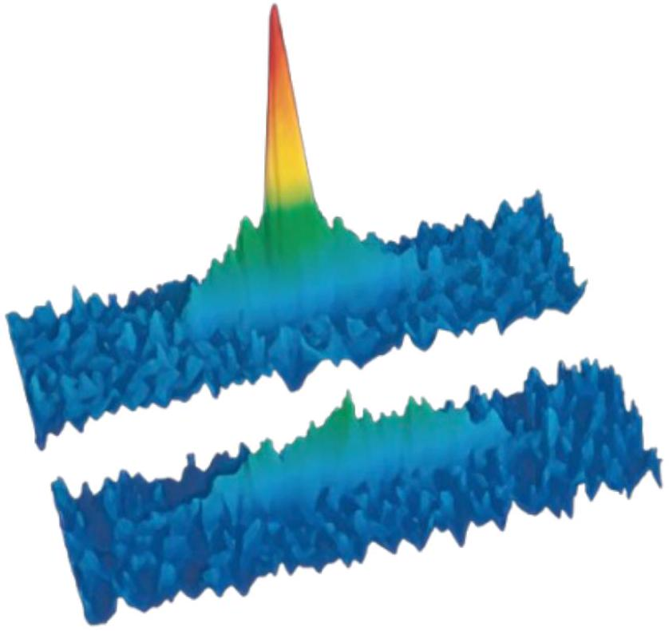
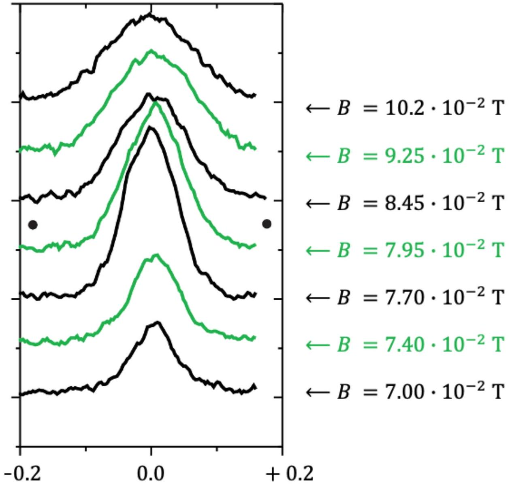

## Strongly correlated Fermi gases (10.0 points)

Despite twenty orders of magnitude of difference in density, it can be shown that laser cooled atoms and nuclear matter in neutron star share the same equation of state characterized by a single numerical parameter called Bertsch's parameter. In this problem we show how precise measurements on ultracold vapours allowed for an accurate determination of this parameter using tabletop experiments.

Fig. 1. Images of a Bose-Einstein condensate of ${ }^{7} \mathrm{Li}$ atoms (top), immersed in a gas of fermionic ${ }^{6} \mathrm{Li}$ atoms (bottom) both confined in the same magnetic trap. The condensate (narrow central peak) comprises $1 \times 10^{4}$ atoms, and the broad pedestal corresponds to the uncondensed atoms. The larger axial extension of the fermion cloud ( $2.5 \times 10^{4}$ atoms) reflects the Fermi pressure resulting from Pauli Principle preventing two fermions from occupying the same state.

## A. Thermodynamics of a non-interacting quantum gas

Consider a quantum particle of mass $m$ confined in a cubic box of size $L$. We consider first that the motion of the particle is restricted along the $x$ axis and we assume that the wave function of the particle can be described in complex notations by a plane wave

$$
\psi(x)=A e^{i k_{x} x}+B e^{-i k_{x} x} .
$$

Here $k_{x}$ is positive and we note $\lambda$ the associated wavelength.
A. 1 Express the kinetic energy $K_{x}$ of the particle as a function of $h, \lambda$ and $m$. 0.5pt

Since the particle cannot leave the box, we assume that $\psi(0)=\psi(L)=0$.
A. 2 Show that $k_{x}=k_{1} n_{x}$, where $n_{x}$ is a strictly positive integer. 0.6pt

We assume that the previous result is valid in all three $x, y$ and $z$ directions.

A. 3 Represent the quantum states in the $\left(k_{x}, k_{y}, k_{z}\right)$ phase space. Express with $L$ the 0.7pt volume $(\Delta k)^{3}$ occupied by each state.

We consider fermionic atoms that, like electrons, obey Pauli's Exclusion Principle, meaning that we can only put two atoms per quantum state. We assume that the states are filled one by one with increasing energy.

Consider a number $N \gg 1$ of atoms. We call $\mathscr{E}_{F}$ (the Fermi energy) the energy of the last occupied state. We also define the so-called Fermi momentum $k_{F}$ by $\mathscr{E}_{F}=\frac{\hbar^{2} k_{F}^{2}}{2 m}$.

A. 4 Represent the states with energy lower than $\mathscr{E}_{F}$ in $\vec{k}$-space. Deduce the expres- 1.4pt sion of $\mathscr{E}_{F}$ with $N$.

We add a small number of atoms $\mathrm{d} N \ll N$ to the system.

A. 5 Express the increase in energy $\mathrm{d} \mathscr{E}$ in the system as a function of $\mathscr{E}_{F}(N)$. Show 0.8 pt that the energy $\mathscr{E}$ is given by
$$
\mathscr{E}(N)=\kappa N \mathscr{E}_{F}(N)
$$
for some number $\kappa$.

We note $P$ the pressure of the gas.

A. 6 Express the energy variation $\mathrm{d} \mathscr{E}$ for a change in volume $\mathrm{d} V$. Deduce the expres- 0.8pt sion of the pressure as a function of density $n=N / L^{3}$.

We now consider the case of interacting atoms. The interactions are described by an attractive interatomic potential $V(\vec{r})$ of typical range $r_{e} \simeq a_{0}$. In the so-called ultra-cold regime, the atomic wavelength is much larger than $r_{e}$. As a consequence, the matter waves cannot resolve the details of the potential and one can show that the effect of the interactions can be encapsulated in the coupling constant

$$
g=\iiint_{\mathbb{R}^{3}} V(\vec{r}) \mathrm{d}^{3} \vec{r} .
$$

Furthermore, we conventionally take $g=\frac{4 \pi \hbar^{2} a}{m}$, which defines $a$.
Using a dimensional argument, one can show that the energy of the interacting cloud can be written as

$$
\mathscr{E}=\kappa N \mathscr{E}_{F}(N) f\left(\frac{1}{n a^{\alpha}}\right),
$$

where $\kappa$ and $\mathscr{E}_{F}$ were introduced in questions A. 4 and A.5, and $f$ depends only on $\frac{1}{n a^{\alpha}}$.
A. 7 Give the value of $\alpha$. 0.4pt

The so-called unitary limit corresponds to a regime where $a=\infty$. We assume that the function $f$ has a finite value in this limit and we define $\xi=f(0)$ the so-called Bertsch parameter.

A. 8 Show that, at the unitary limit, the properties of the interacting cloud are identical to those of a noninteracting system up to a rescaling of Planck's constant $\hbar \rightarrow \xi^{\gamma} \hbar$. Give the value of $\gamma$.

## B. Thermodynamics of a trapped quantum gas

We now consider that the atoms are confined by a single-particle optical potential $U(\vec{r})$. We assume that the cloud can be locally considered as homogeneous and that the results of Part A are still applicable locally. We consider first the case of a non-interacting Fermi gas.

Consider first the case of a one-dimensional potential $U(x)$, with $U(0)=0$. We assume that the cloud is homogeeous in the $(y, z)$ direction and we note $\Sigma$ the area of the cloud in the $(y, z)$ plane. Let's consider the volume of the cloud comprised between $x$ and $x+\mathrm{d} x$.

B. 1 Write the total forces exerted on the atoms and show that the density $n(\vec{r})$ is 1.5pt given by
$$
n(\vec{r})=A\left(\mathscr{E}_{F}(0)-U(\vec{r})\right)^{3 / 2},
$$
where $\mathscr{E}_{F}(0)$ is the Fermi energy at the trap center. Give the expression of $A$.

We assume that this expression holds for a general potential $U(\vec{r})$ depending on the three coordinates $(x, y, z)$. If the the cloud is sufficiently small we can furthermore approximate $U$ by a harmonic potential close to its minimum. We thus take

$$
U(\vec{r})=\frac{m}{2} \sum_{i=x, y, z} \omega_{i}^{2} x_{i}^{2} .
$$

B. 2 Find the equation defining the surface of the cloud. Give the expression of the radius $R_{i}$ of the cloud in the direction $i=x, y, z$ as a function of $\mathscr{E}_{F}(0), m$ and $\omega_{i}$.

0.7pt Using the previous question, one can prove that after a proper spatial rescaling, the system can be mapped onto a gas of fermions trapped in an isotropic harmonic potential of frequency $\bar{\omega}=\left(\omega_{x} \omega_{y} \omega_{z}\right)^{1 / 3}$.

B. 3 Calculate the total atom number as a spatial integral by decomposing the cloud into infinitesimal shells of radius $r$ and thickness $d r$, and show that
$$
\mathscr{E}_{F}(0)=\hbar \bar{\omega}(3 N)^{\mu},
$$
where you will give the value of the exponent $\mu$. Hint: we give
$$
\int_{0}^{1} r^{2}\left(1-r^{2}\right)^{3 / 2} \mathrm{~d} r=\frac{\pi}{32}
$$

It is possible to change the value of $a$ using an external magnetic field $\vec{B}$. In the case of fermionic ${ }^{6} \mathrm{Li}$, the unitary limit is reached for $B=\|\vec{B}\|=8.32 \times 10^{-2} \mathrm{~T}$ and the cloud behaves as a non-interacting gas at high field.

Fig. 2. Density profile of a cloud of $7 \times 10^{4}$ fermionic lithium atoms for various external magnetic fields (figure from Bourdel et al. Phys. Rev. Lett. 93, 050401 (2004)).

B. 4 Express the ratio $\frac{R(a=\infty)}{R(a=0)}$ with $\xi$ and deduce from the data of Fig. 2 an estimate 0.9pt of $\xi$.
