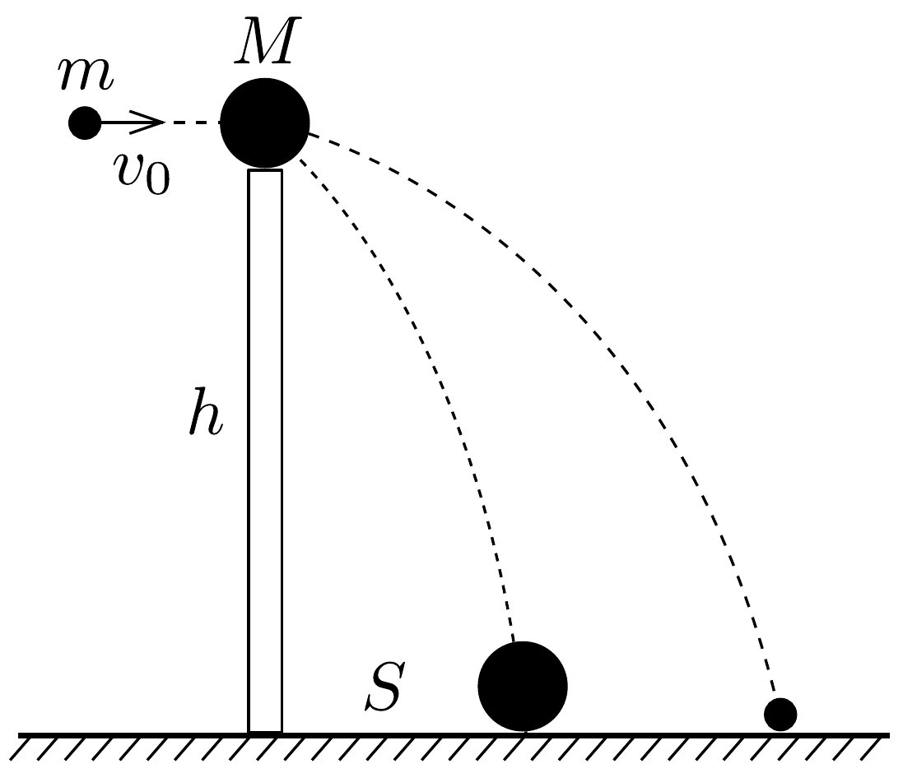

## Feladat 1

Egy $h=5 \mathrm{~m}$ magas, függőleges oszlopon $M=200 \mathrm{~g}$ tömegü golyó áll (1. ábra). Ezt a golyót pontosan a közepén keresztüllőjük egy $m=10$ g tömegú, $v_{0}=500 \mathrm{~m} / \mathrm{s}$ sebességú lövedékkel. A golyó az oszloptól $S=20 \mathrm{~m}$ távolságban esett le. Hol esett le a lövedék? Az átlövés alkalmával a lövedék mozgási energiájának mekkora része vált hővé? A közegellenállást elhanyagolhatjuk.

