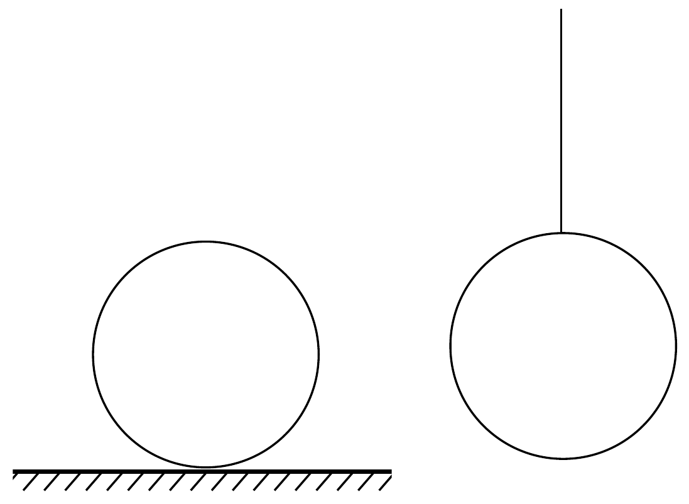

## Feladat 3

Adva van két teljesen egyforma golyó. Közülük az egyik vízszintes síkon fekszik, a másik vékony fonálon van felfüggesztve (3. ábra). Mindegyik golyónak ugyanakkora hőmennyiséget adunk olyan gyorsan, hogy mindenféle hőveszteségtől eltekinthetünk. A két golyó hőmérséklete egyforma lesz-e, vagy nem, és miért?

Pótfeladat ${ }^{1}$. 10 liter térfogatú, zárt tartályban száraz, normál állapotú (0 °C, $10^{5} \mathrm{~Pa}$ ) levegő van. A tartályba 3 gramm vizet bocsátunk be és a tartályt $100^{\circ} \mathrm{C}$ ra melegítjük. Mekkora lesz ezután a nyomás a tartályban?
