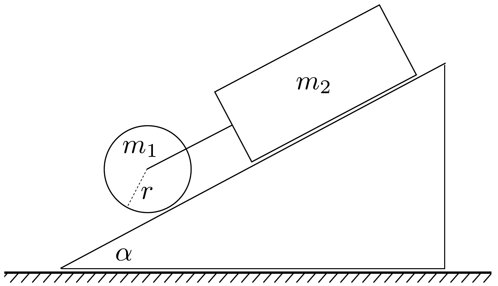

## Feladat 1

A 6. ábrán látható 30°-os hajlásszögú lejtő́n az $m_{1}=8 \mathrm{~kg}$ tömegü, $r=10 \mathrm{~cm}$ átmérőjú, tömör henger tengelyéhez hozzá van kötve fonállal egy $m_{2}=4 \mathrm{~kg}$ tömegú tégla. Mekkora gyorsulással mozognak? A súrlódási együttható a tégla és a lejtő között $\mu=0,2$. A gördülési ellenállás és a csapágy súrlódása elhanyagolható.

