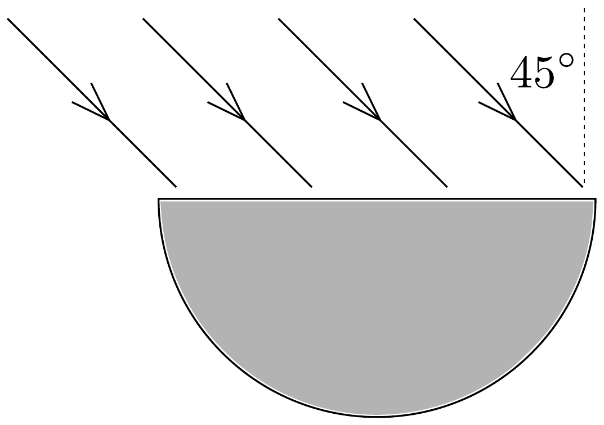

## Feladat 3

$\sqrt{2}$ törésmutatójú üvegből félhenger készült. Az üveg sík felületére 45°-os beesési szögben fénysugarakat bocsátunk (7. ábra). A fénysugarak a tengelyre merőleges metszet síkjában érkeznek. A henger palástjának mely részén lépnek ki fénysugarak?

