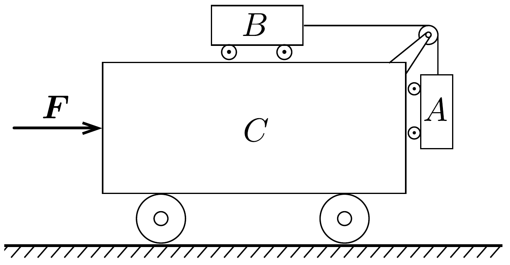

## Feladat 1

A 11. ábrán látható mechanikai rendszer három kocsiból áll, melyek tömege rendre $m_{A}=0,3 \mathrm{~kg}, m_{B}=0,2 \mathrm{~kg}$ és $m_{C}=1,5 \mathrm{~kg}$.

11. ábra.
a) A $C$ kocsira olyan nagy $F$ eró hat vízszintesen, hogy az $A$ és $B$ kocsik $C$ hez viszonyítva nyugalomban maradnak. Határozzuk meg az $A$ és $B$ kocsik közötti fonálban fellépő kötélerőt és az $F$ erót!
b) Tegyük fel, hogy a $C$ kocsi nyugalomban van. Határozzuk meg az $A$ és $B$ kocsi gyorsulását és a közöttük levő fonálban fellépő erőt, ha az $A$ és $B$ kocsikat elengedjük!

A súrlódás, a közegellenállás, a fonál tömege, a csigák és a kocsikerekek tehetetlenségi nyomatéka elhanyagolható.
