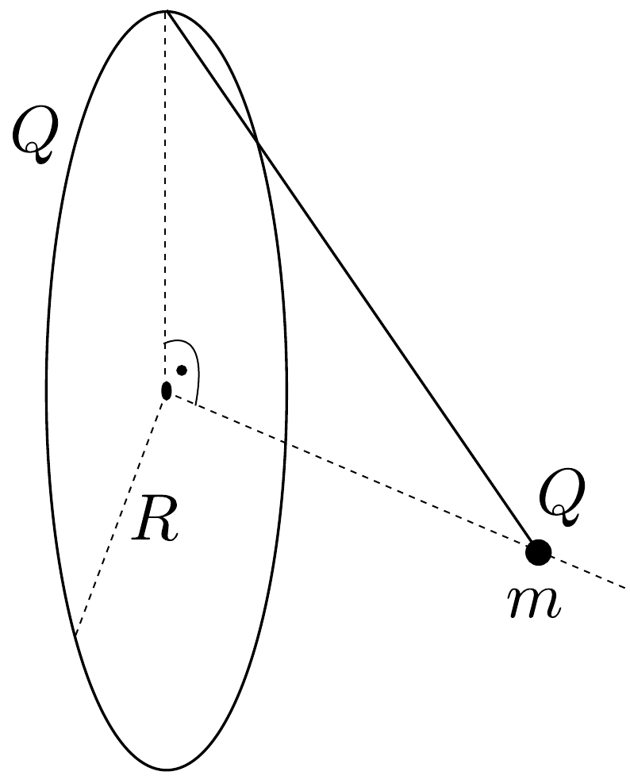

## Feladat 3

A 12. ábrán látható függőleges síkban elhelyezett drótkarika sugara $R=5 \mathrm{~cm}$. A karika legfelsó pontjához erósített szigeteló fonálon $m=1 \mathrm{~g}$ tömegú kis golyó lóg. Az egész karikának és a golyónak $Q=9 \cdot 10^{-8} \mathrm{C}$ egyezó elójelú elektromos töltéseket adunk és azt tapasztaljuk, hogy kitérítés után a golyócska éppen a karika síkjára merőleges szimmetriatengelyén helyezkedik el. Milyen hosszú a fonál?

