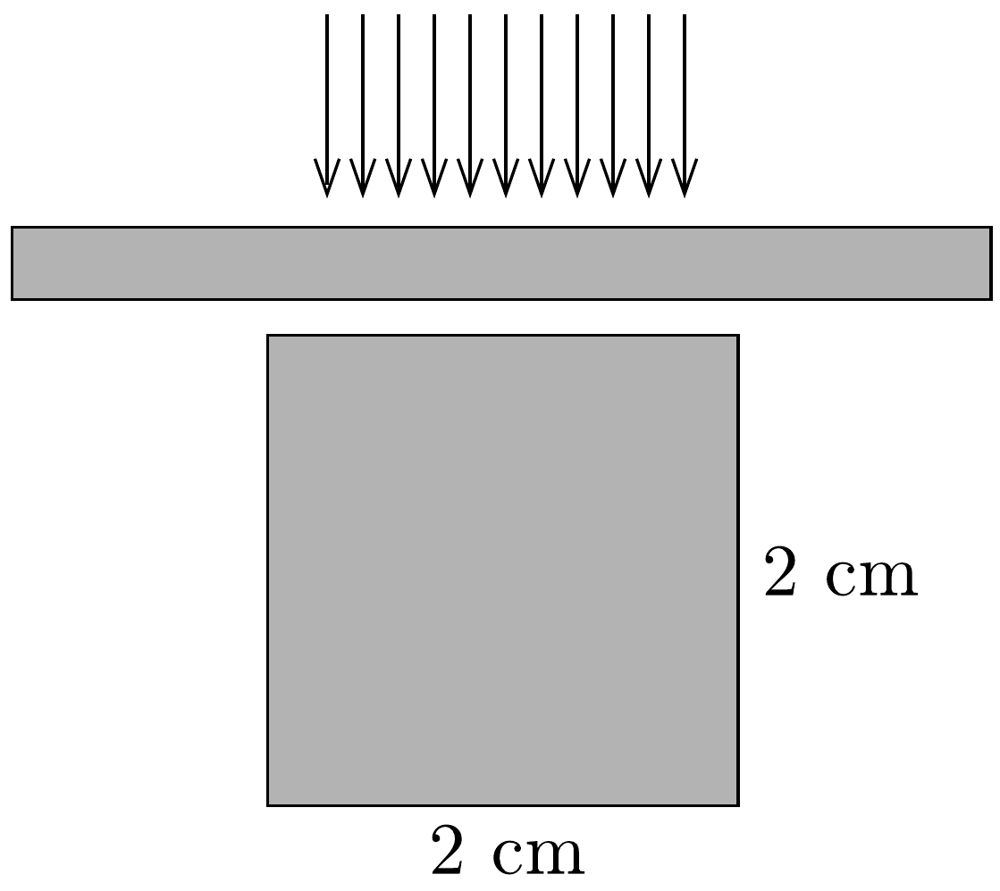

## Feladat 4

Egy 2 cm élhosszúságú üvegkocka fölé üveglemezt helyezünk úgy, hogy a lemez és a kocka között vékony plánparalel levegőréteg maradjon (13. ábra). A lemezre merólegesen 400 nm-től 1150 nm-ig terjedő hullámhosszúságú elektromágneses hullámokat ejtünk, és ezek a levegőréteg mindegyik oldalán visszaverődve interferálnak. Ebben a hullámhossztartományban csak két hullámhosszra teljesül az interferenciamaximum feltétele. Az egyiknél a hullámhossz $\lambda_{1}=$ $=400 \mathrm{~nm}$. Milyen vastag a levegőréteg?

Az üvegkocka $8 \cdot 10^{-6} 1 /{ }^{\circ} \mathrm{C}$ értékú lineáris hốtágulási együtthatója mellett hány fokos melegedés szükséges ahhoz, hogy az üvegkocka alulról hozzáérjen az üveglemezhez, és megszűnjön az interferáló levegőréteg?
