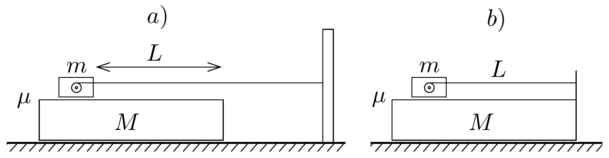

## Feladat 1

Egy $M=1 \mathrm{~kg}$ tömegü deszkán $m=100 \mathrm{~g}$ tömegú szán van, amely a benne levő motorral egy fonalat húz állandó $v_{0}=10 \mathrm{~cm} / \mathrm{s}$ sebességgel. Az asztal és a deszka között nincs súrlódás, a deszka és a szán között a súrlódási együttható $\mu=0,02$. A szerkezetet úgy indítjuk el, hogy a deszkát fogjuk addig, amíg a szán el nem éri a $v_{0}$ sebességet, azután elengedjük. Ebben a pillanatban a szán és a deszka vége közötti távolság $L=50 \mathrm{~cm}$.

A 15. ábrán látható $a$ ) esetben a fonál vége egy távoli cölöphöz, a b) esetben magához a deszka végéhez van erősítve. A két esetben milyen a deszka és a szán mozgásának lefolyása, és mikor éri el a szán a deszka végét?

