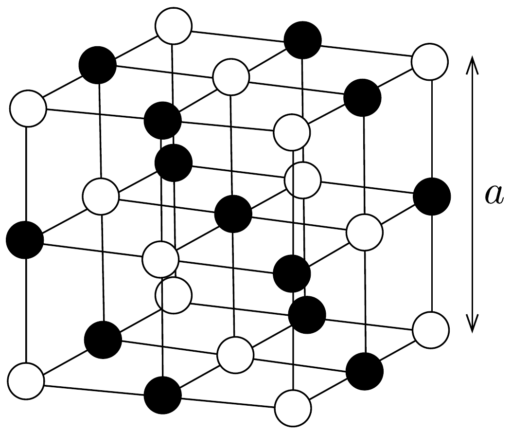

## Feladat 2

A nátrium-klorid kristályrácsát kocka alakú elemi cellák alkotják, amelyek élhosszúsága $a=5,6 \cdot 10^{-8} \mathrm{~cm}$. A lapcentrált rácsot a 16. ábra mutatja. A nátrium atomtömege 23, a klóré 35,5 . A nátrium-klorid súrúsége $2,22 \mathrm{~g} / \mathrm{cm}^{3}$. Számítsuk ki a hidrogénatom tömegét!

