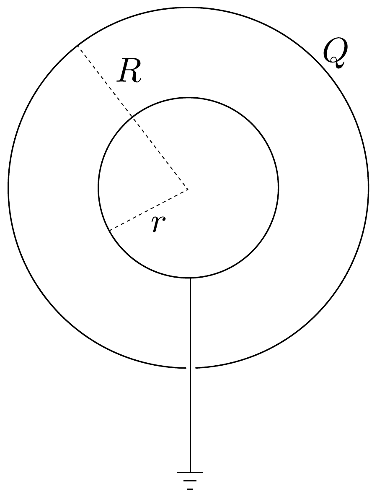

## Feladat 3

$R=20 \mathrm{~cm}$ sugarú, vékony falú fémgömb belsejében koncentrikusan egy $r=10 \mathrm{~cm}$ sugarú fémgolyót helyezünk el. A belsó golyó a külső gömbön
levó nyíláson keresztül egy nagyon hosszú vezetékkel földelve van a 17. ábra szerint. A külső gömbnek $Q=10^{-8} \mathrm{C}$ töltést adunk. Határozzuk meg a külső gömb potenciálját!

