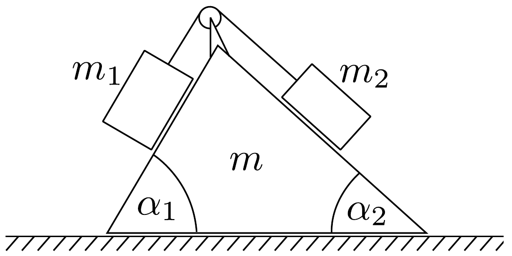

## Feladat 1

Vízszintes síkra helyezett $m$ tömegú ék (kettős lejtő) tetején átvetett fonálon $m_{1}$ és $m_{2}$ tömegek lógnak (19. ábra). A lejtők hajlásszögei $\alpha_{1}$ és $\alpha_{2}$. A súrlódás, a fonál és a csiga tömege elhanyagolható. Kezdetben az egész rendszer nyugalomban van, azután elengedjük.

Mennyi az ék gyorsulása? Mennyi a fonálon lógó testek gyorsulása? Mikor marad az ék nyugalomban?
