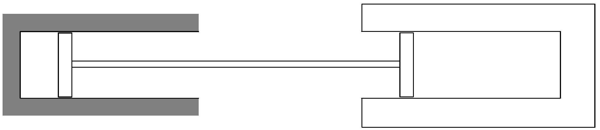

## Feladat 2

A 27. ábra szerinti elrendezésben a bal oldali hengert adiabatikus szigetelőfal, a jobb oldali hengert állandóan 300 K hőmérsékletú tartály veszi körül. A rendszer vákuumban van. A hengerek alapterülete azonos. A dugattyúkat merev rúd kapcsolja össze. A dugattyúk súrlódás nélkül, lassan mozoghatnak (kvázisztatikusan). A jobb oldali hengerben $10^{5} \mathrm{~Pa}$ nyomású héliumgáz, a bal oldali hengerben 3 mol argongáz van, kezdetben $10^{5}$ Pa-nál nagyobb nyomáson. A dugattyúkat elengedve olyan végső egyensúly áll be, amelyben az argon térfogata a kezdeti térfogat 8-szorosa, a hélium súrúsége a kezdeti érték kétszerese és az állandó hőmérsékletú hőtartály 45 kJ hőt vett fel. Határozzuk meg a gázok kezdeti és végső nyomását, térfogatát és hőmérsékletét!

27. ábra.
